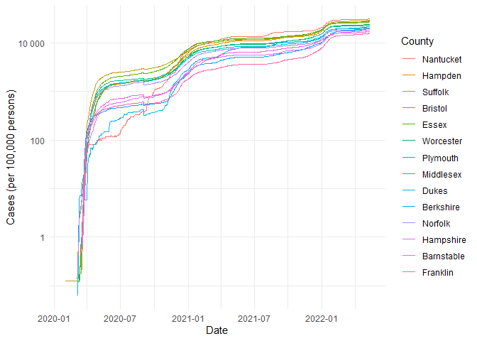
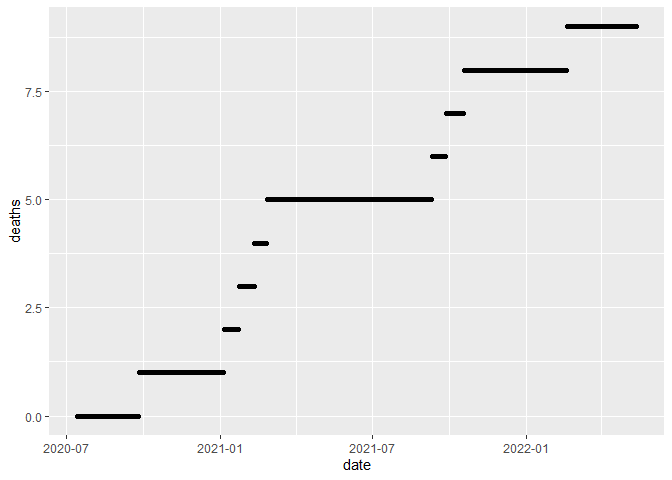
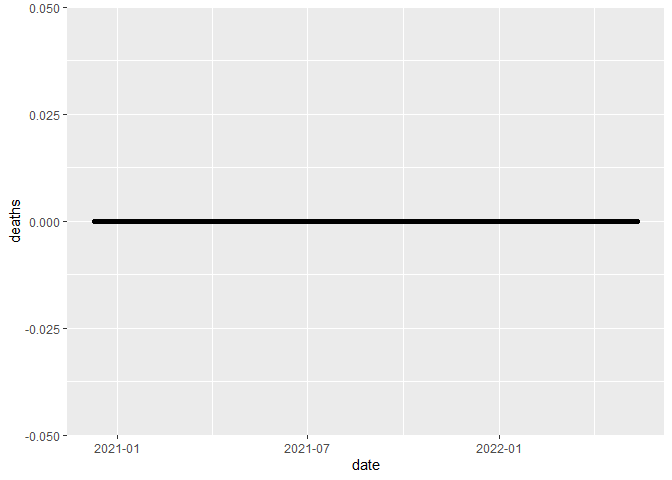

COVID-19
================
Olivia Smith
3/13/2025

- [Grading Rubric](#grading-rubric)
  - [Individual](#individual)
  - [Submission](#submission)
- [The Big Picture](#the-big-picture)
- [Get the Data](#get-the-data)
  - [Navigating the Census Bureau](#navigating-the-census-bureau)
    - [**q1** Load Table `B01003` into the following tibble. Make sure
      the column names are
      `id, Geographic Area Name, Estimate!!Total, Margin of Error!!Total`.](#q1-load-table-b01003-into-the-following-tibble-make-sure-the-column-names-are-id-geographic-area-name-estimatetotal-margin-of-errortotal)
  - [Automated Download of NYT Data](#automated-download-of-nyt-data)
    - [**q2** Visit the NYT GitHub repo and find the URL for the **raw**
      US County-level data. Assign that URL as a string to the variable
      below.](#q2-visit-the-nyt-github-repo-and-find-the-url-for-the-raw-us-county-level-data-assign-that-url-as-a-string-to-the-variable-below)
- [Join the Data](#join-the-data)
  - [**q3** Process the `id` column of `df_pop` to create a `fips`
    column.](#q3-process-the-id-column-of-df_pop-to-create-a-fips-column)
  - [**q4** Join `df_covid` with `df_q3` by the `fips` column. Use the
    proper type of join to preserve *only* the rows in
    `df_covid`.](#q4-join-df_covid-with-df_q3-by-the-fips-column-use-the-proper-type-of-join-to-preserve-only-the-rows-in-df_covid)
- [Analyze](#analyze)
  - [Normalize](#normalize)
    - [**q5** Use the `population` estimates in `df_data` to normalize
      `cases` and `deaths` to produce per 100,000 counts \[3\]. Store
      these values in the columns `cases_per100k` and
      `deaths_per100k`.](#q5-use-the-population-estimates-in-df_data-to-normalize-cases-and-deaths-to-produce-per-100000-counts-3-store-these-values-in-the-columns-cases_per100k-and-deaths_per100k)
  - [Guided EDA](#guided-eda)
    - [**q6** Compute some summaries](#q6-compute-some-summaries)
    - [**q7** Find and compare the top
      10](#q7-find-and-compare-the-top-10)
  - [Self-directed EDA](#self-directed-eda)
    - [**q8** Drive your own ship: You’ve just put together a very rich
      dataset; you now get to explore! Pick your own direction and
      generate at least one punchline figure to document an interesting
      finding. I give a couple tips & ideas
      below:](#q8-drive-your-own-ship-youve-just-put-together-a-very-rich-dataset-you-now-get-to-explore-pick-your-own-direction-and-generate-at-least-one-punchline-figure-to-document-an-interesting-finding-i-give-a-couple-tips--ideas-below)
    - [Ideas](#ideas)
    - [Aside: Some visualization
      tricks](#aside-some-visualization-tricks)
    - [Geographic exceptions](#geographic-exceptions)
- [Notes](#notes)

*Purpose*: In this challenge, you’ll learn how to navigate the U.S.
Census Bureau website, programmatically download data from the internet,
and perform a county-level population-weighted analysis of current
COVID-19 trends. This will give you the base for a very deep
investigation of COVID-19, which we’ll build upon for Project 1.

<!-- include-rubric -->

# Grading Rubric

<!-- -------------------------------------------------- -->

Unlike exercises, **challenges will be graded**. The following rubrics
define how you will be graded, both on an individual and team basis.

## Individual

<!-- ------------------------- -->

| Category | Needs Improvement | Satisfactory |
|----|----|----|
| Effort | Some task **q**’s left unattempted | All task **q**’s attempted |
| Observed | Did not document observations, or observations incorrect | Documented correct observations based on analysis |
| Supported | Some observations not clearly supported by analysis | All observations clearly supported by analysis (table, graph, etc.) |
| Assessed | Observations include claims not supported by the data, or reflect a level of certainty not warranted by the data | Observations are appropriately qualified by the quality & relevance of the data and (in)conclusiveness of the support |
| Specified | Uses the phrase “more data are necessary” without clarification | Any statement that “more data are necessary” specifies which *specific* data are needed to answer what *specific* question |
| Code Styled | Violations of the [style guide](https://style.tidyverse.org/) hinder readability | Code sufficiently close to the [style guide](https://style.tidyverse.org/) |

## Submission

<!-- ------------------------- -->

Make sure to commit both the challenge report (`report.md` file) and
supporting files (`report_files/` folder) when you are done! Then submit
a link to Canvas. **Your Challenge submission is not complete without
all files uploaded to GitHub.**

``` r
library(tidyverse)
```

    ## ── Attaching core tidyverse packages ──────────────────────── tidyverse 2.0.0 ──
    ## ✔ dplyr     1.1.4     ✔ readr     2.1.5
    ## ✔ forcats   1.0.0     ✔ stringr   1.5.1
    ## ✔ ggplot2   3.5.1     ✔ tibble    3.2.1
    ## ✔ lubridate 1.9.4     ✔ tidyr     1.3.1
    ## ✔ purrr     1.0.2     
    ## ── Conflicts ────────────────────────────────────────── tidyverse_conflicts() ──
    ## ✖ dplyr::filter() masks stats::filter()
    ## ✖ dplyr::lag()    masks stats::lag()
    ## ℹ Use the conflicted package (<http://conflicted.r-lib.org/>) to force all conflicts to become errors

*Background*:
[COVID-19](https://en.wikipedia.org/wiki/Coronavirus_disease_2019) is
the disease caused by the virus SARS-CoV-2. In 2020 it became a global
pandemic, leading to huge loss of life and tremendous disruption to
society. The New York Times (as of writing) publishes up-to-date data on
the progression of the pandemic across the United States—we will study
these data in this challenge.

*Optional Readings*: I’ve found this [ProPublica
piece](https://www.propublica.org/article/how-to-understand-covid-19-numbers)
on “How to understand COVID-19 numbers” to be very informative!

# The Big Picture

<!-- -------------------------------------------------- -->

We’re about to go through *a lot* of weird steps, so let’s first fix the
big picture firmly in mind:

We want to study COVID-19 in terms of data: both case counts (number of
infections) and deaths. We’re going to do a county-level analysis in
order to get a high-resolution view of the pandemic. Since US counties
can vary widely in terms of their population, we’ll need population
estimates in order to compute infection rates (think back to the
`Titanic` challenge).

That’s the high-level view; now let’s dig into the details.

# Get the Data

<!-- -------------------------------------------------- -->

1.  County-level population estimates (Census Bureau)
2.  County-level COVID-19 counts (New York Times)

## Navigating the Census Bureau

<!-- ------------------------- -->

**Steps**: Our objective is to find the 2018 American Community
Survey\[1\] (ACS) Total Population estimates, disaggregated by counties.
To check your results, this is Table `B01003`.

1.  Go to [data.census.gov](data.census.gov).
2.  Scroll down and click `View Tables`.
3.  Apply filters to find the ACS **Total Population** estimates,
    disaggregated by counties. I used the filters:

- `Topics > Populations and People > Counts, Estimates, and Projections > Population Total`
- `Geography > County > All counties in United States`

5.  Select the **Total Population** table and click the `Download`
    button to download the data; make sure to select the 2018 5-year
    estimates.
6.  Unzip and move the data to your `challenges/data` folder.

- Note that the data will have a crazy-long filename like
  `ACSDT5Y2018.B01003_data_with_overlays_2020-07-26T094857.csv`. That’s
  because metadata is stored in the filename, such as the year of the
  estimate (`Y2018`) and my access date (`2020-07-26`). **Your filename
  will vary based on when you download the data**, so make sure to copy
  the filename that corresponds to what you downloaded!

### **q1** Load Table `B01003` into the following tibble. Make sure the column names are `id, Geographic Area Name, Estimate!!Total, Margin of Error!!Total`.

*Hint*: You will need to use the `skip` keyword when loading these data!

``` r
## TASK: Load the census bureau data with the following tibble name.
df_pop <- read.csv("ACSDT5Y2018.B01003-Data.csv", skip = 1)
df_pop
```

    ##           Geography                       Geographic.Area.Name Estimate..Total
    ## 1    0500000US01001                    Autauga County, Alabama           55200
    ## 2    0500000US01003                    Baldwin County, Alabama          208107
    ## 3    0500000US01005                    Barbour County, Alabama           25782
    ## 4    0500000US01007                       Bibb County, Alabama           22527
    ## 5    0500000US01009                     Blount County, Alabama           57645
    ## 6    0500000US01011                    Bullock County, Alabama           10352
    ## 7    0500000US01013                     Butler County, Alabama           20025
    ## 8    0500000US01015                    Calhoun County, Alabama          115098
    ## 9    0500000US01017                   Chambers County, Alabama           33826
    ## 10   0500000US01019                   Cherokee County, Alabama           25853
    ## 11   0500000US01021                    Chilton County, Alabama           43930
    ## 12   0500000US01023                    Choctaw County, Alabama           13075
    ## 13   0500000US01025                     Clarke County, Alabama           24387
    ## 14   0500000US01027                       Clay County, Alabama           13378
    ## 15   0500000US01029                   Cleburne County, Alabama           14938
    ## 16   0500000US01031                     Coffee County, Alabama           51288
    ## 17   0500000US01033                    Colbert County, Alabama           54495
    ## 18   0500000US01035                    Conecuh County, Alabama           12514
    ## 19   0500000US01037                      Coosa County, Alabama           10855
    ## 20   0500000US01039                  Covington County, Alabama           37351
    ## 21   0500000US01041                   Crenshaw County, Alabama           13865
    ## 22   0500000US01043                    Cullman County, Alabama           82313
    ## 23   0500000US01045                       Dale County, Alabama           49255
    ## 24   0500000US01047                     Dallas County, Alabama           40029
    ## 25   0500000US01049                     DeKalb County, Alabama           71200
    ## 26   0500000US01051                     Elmore County, Alabama           81212
    ## 27   0500000US01053                   Escambia County, Alabama           37328
    ## 28   0500000US01055                     Etowah County, Alabama          102939
    ## 29   0500000US01057                    Fayette County, Alabama           16585
    ## 30   0500000US01059                   Franklin County, Alabama           31542
    ## 31   0500000US01061                     Geneva County, Alabama           26491
    ## 32   0500000US01063                     Greene County, Alabama            8426
    ## 33   0500000US01065                       Hale County, Alabama           14887
    ## 34   0500000US01067                      Henry County, Alabama           17124
    ## 35   0500000US01069                    Houston County, Alabama          104352
    ## 36   0500000US01071                    Jackson County, Alabama           52094
    ## 37   0500000US01073                  Jefferson County, Alabama          659892
    ## 38   0500000US01075                      Lamar County, Alabama           13933
    ## 39   0500000US01077                 Lauderdale County, Alabama           92585
    ## 40   0500000US01079                   Lawrence County, Alabama           33171
    ## 41   0500000US01081                        Lee County, Alabama          159287
    ## 42   0500000US01083                  Limestone County, Alabama           93052
    ## 43   0500000US01085                    Lowndes County, Alabama           10236
    ## 44   0500000US01087                      Macon County, Alabama           19054
    ## 45   0500000US01089                    Madison County, Alabama          357560
    ## 46   0500000US01091                    Marengo County, Alabama           19538
    ## 47   0500000US01093                     Marion County, Alabama           29965
    ## 48   0500000US01095                   Marshall County, Alabama           95145
    ## 49   0500000US01097                     Mobile County, Alabama          414659
    ## 50   0500000US01099                     Monroe County, Alabama           21512
    ## 51   0500000US01101                 Montgomery County, Alabama          226941
    ## 52   0500000US01103                     Morgan County, Alabama          119122
    ## 53   0500000US01105                      Perry County, Alabama            9486
    ## 54   0500000US01107                    Pickens County, Alabama           20298
    ## 55   0500000US01109                       Pike County, Alabama           33403
    ## 56   0500000US01111                   Randolph County, Alabama           22574
    ## 57   0500000US01113                    Russell County, Alabama           58213
    ## 58   0500000US01115                  St. Clair County, Alabama           87306
    ## 59   0500000US01117                     Shelby County, Alabama          211261
    ## 60   0500000US01119                     Sumter County, Alabama           12985
    ## 61   0500000US01121                  Talladega County, Alabama           80565
    ## 62   0500000US01123                 Tallapoosa County, Alabama           40636
    ## 63   0500000US01125                 Tuscaloosa County, Alabama          206213
    ## 64   0500000US01127                     Walker County, Alabama           64493
    ## 65   0500000US01129                 Washington County, Alabama           16643
    ## 66   0500000US01131                     Wilcox County, Alabama           10809
    ## 67   0500000US01133                    Winston County, Alabama           23875
    ## 68   0500000US02013             Aleutians East Borough, Alaska            3425
    ## 69   0500000US02016         Aleutians West Census Area, Alaska            5750
    ## 70   0500000US02020             Anchorage Municipality, Alaska          296112
    ## 71   0500000US02050                 Bethel Census Area, Alaska           18040
    ## 72   0500000US02060                Bristol Bay Borough, Alaska             890
    ## 73   0500000US02068                     Denali Borough, Alaska            2232
    ## 74   0500000US02070             Dillingham Census Area, Alaska            4975
    ## 75   0500000US02090       Fairbanks North Star Borough, Alaska           99653
    ## 76   0500000US02100                     Haines Borough, Alaska            2518
    ## 77   0500000US02105          Hoonah-Angoon Census Area, Alaska            2132
    ## 78   0500000US02110            Juneau City and Borough, Alaska           32330
    ## 79   0500000US02122            Kenai Peninsula Borough, Alaska           58220
    ## 80   0500000US02130          Ketchikan Gateway Borough, Alaska           13804
    ## 81   0500000US02150              Kodiak Island Borough, Alaska           13649
    ## 82   0500000US02158               Kusilvak Census Area, Alaska            8198
    ## 83   0500000US02164         Lake and Peninsula Borough, Alaska            1375
    ## 84   0500000US02170          Matanuska-Susitna Borough, Alaska          103464
    ## 85   0500000US02180                   Nome Census Area, Alaska            9925
    ## 86   0500000US02185                North Slope Borough, Alaska            9797
    ## 87   0500000US02188           Northwest Arctic Borough, Alaska            7734
    ## 88   0500000US02195                 Petersburg Borough, Alaska            3255
    ## 89   0500000US02198  Prince of Wales-Hyder Census Area, Alaska            6474
    ## 90   0500000US02220             Sitka City and Borough, Alaska            8738
    ## 91   0500000US02230               Skagway Municipality, Alaska            1061
    ## 92   0500000US02240    Southeast Fairbanks Census Area, Alaska            6876
    ## 93   0500000US02261         Valdez-Cordova Census Area, Alaska            9301
    ## 94   0500000US02275          Wrangell City and Borough, Alaska            2484
    ## 95   0500000US02282           Yakutat City and Borough, Alaska             689
    ## 96   0500000US02290          Yukon-Koyukuk Census Area, Alaska            5415
    ## 97   0500000US04001                     Apache County, Arizona           71522
    ## 98   0500000US04003                    Cochise County, Arizona          126279
    ## 99   0500000US04005                   Coconino County, Arizona          140217
    ## 100  0500000US04007                       Gila County, Arizona           53400
    ## 101  0500000US04009                     Graham County, Arizona           37879
    ## 102  0500000US04011                   Greenlee County, Arizona            9504
    ## 103  0500000US04012                     La Paz County, Arizona           20701
    ## 104  0500000US04013                   Maricopa County, Arizona         4253913
    ## 105  0500000US04015                     Mohave County, Arizona          206064
    ## 106  0500000US04017                     Navajo County, Arizona          108705
    ## 107  0500000US04019                       Pima County, Arizona         1019722
    ## 108  0500000US04021                      Pinal County, Arizona          419721
    ## 109  0500000US04023                 Santa Cruz County, Arizona           46584
    ## 110  0500000US04025                    Yavapai County, Arizona          224645
    ## 111  0500000US04027                       Yuma County, Arizona          207829
    ## 112  0500000US05001                  Arkansas County, Arkansas           18124
    ## 113  0500000US05003                    Ashley County, Arkansas           20537
    ## 114  0500000US05005                    Baxter County, Arkansas           41219
    ## 115  0500000US05007                    Benton County, Arkansas          258980
    ## 116  0500000US05009                     Boone County, Arkansas           37288
    ## 117  0500000US05011                   Bradley County, Arkansas           10948
    ## 118  0500000US05013                   Calhoun County, Arkansas            5202
    ## 119  0500000US05015                   Carroll County, Arkansas           27887
    ## 120  0500000US05017                    Chicot County, Arkansas           10826
    ## 121  0500000US05019                     Clark County, Arkansas           22385
    ## 122  0500000US05021                      Clay County, Arkansas           15061
    ## 123  0500000US05023                  Cleburne County, Arkansas           25230
    ## 124  0500000US05025                 Cleveland County, Arkansas            8226
    ## 125  0500000US05027                  Columbia County, Arkansas           23892
    ## 126  0500000US05029                    Conway County, Arkansas           20906
    ## 127  0500000US05031                 Craighead County, Arkansas          105701
    ## 128  0500000US05033                  Crawford County, Arkansas           62472
    ## 129  0500000US05035                Crittenden County, Arkansas           49013
    ## 130  0500000US05037                     Cross County, Arkansas           16998
    ## 131  0500000US05039                    Dallas County, Arkansas            7432
    ## 132  0500000US05041                     Desha County, Arkansas           11887
    ## 133  0500000US05043                      Drew County, Arkansas           18502
    ## 134  0500000US05045                  Faulkner County, Arkansas          122416
    ## 135  0500000US05047                  Franklin County, Arkansas           17780
    ## 136  0500000US05049                    Fulton County, Arkansas           12139
    ## 137  0500000US05051                   Garland County, Arkansas           98296
    ## 138  0500000US05053                     Grant County, Arkansas           18086
    ## 139  0500000US05055                    Greene County, Arkansas           44623
    ## 140  0500000US05057                 Hempstead County, Arkansas           22018
    ## 141  0500000US05059                Hot Spring County, Arkansas           33520
    ## 142  0500000US05061                    Howard County, Arkansas           13389
    ## 143  0500000US05063              Independence County, Arkansas           37264
    ## 144  0500000US05065                     Izard County, Arkansas           13559
    ## 145  0500000US05067                   Jackson County, Arkansas           17225
    ## 146  0500000US05069                 Jefferson County, Arkansas           70424
    ## 147  0500000US05071                   Johnson County, Arkansas           26291
    ## 148  0500000US05073                 Lafayette County, Arkansas            6915
    ## 149  0500000US05075                  Lawrence County, Arkansas           16669
    ## 150  0500000US05077                       Lee County, Arkansas            9398
    ## 151  0500000US05079                   Lincoln County, Arkansas           13695
    ## 152  0500000US05081              Little River County, Arkansas           12417
    ## 153  0500000US05083                     Logan County, Arkansas           21757
    ## 154  0500000US05085                    Lonoke County, Arkansas           72206
    ## 155  0500000US05087                   Madison County, Arkansas           16076
    ## 156  0500000US05089                    Marion County, Arkansas           16438
    ## 157  0500000US05091                    Miller County, Arkansas           43759
    ## 158  0500000US05093               Mississippi County, Arkansas           42831
    ## 159  0500000US05095                    Monroe County, Arkansas            7249
    ## 160  0500000US05097                Montgomery County, Arkansas            8993
    ## 161  0500000US05099                    Nevada County, Arkansas            8440
    ## 162  0500000US05101                    Newton County, Arkansas            7848
    ## 163  0500000US05103                  Ouachita County, Arkansas           24106
    ## 164  0500000US05105                     Perry County, Arkansas           10322
    ## 165  0500000US05107                  Phillips County, Arkansas           19034
    ## 166  0500000US05109                      Pike County, Arkansas           10808
    ## 167  0500000US05111                  Poinsett County, Arkansas           24054
    ## 168  0500000US05113                      Polk County, Arkansas           20163
    ## 169  0500000US05115                      Pope County, Arkansas           63644
    ## 170  0500000US05117                   Prairie County, Arkansas            8244
    ## 171  0500000US05119                   Pulaski County, Arkansas          393463
    ## 172  0500000US05121                  Randolph County, Arkansas           17603
    ## 173  0500000US05123               St. Francis County, Arkansas           26294
    ## 174  0500000US05125                    Saline County, Arkansas          118009
    ## 175  0500000US05127                     Scott County, Arkansas           10442
    ## 176  0500000US05129                    Searcy County, Arkansas            7923
    ## 177  0500000US05131                 Sebastian County, Arkansas          127461
    ## 178  0500000US05133                    Sevier County, Arkansas           17193
    ## 179  0500000US05135                     Sharp County, Arkansas           17043
    ## 180  0500000US05137                     Stone County, Arkansas           12446
    ## 181  0500000US05139                     Union County, Arkansas           39732
    ## 182  0500000US05141                 Van Buren County, Arkansas           16684
    ## 183  0500000US05143                Washington County, Arkansas          228529
    ## 184  0500000US05145                     White County, Arkansas           78804
    ## 185  0500000US05147                  Woodruff County, Arkansas            6660
    ## 186  0500000US05149                      Yell County, Arkansas           21573
    ## 187  0500000US06001                 Alameda County, California         1643700
    ## 188  0500000US06003                  Alpine County, California            1146
    ## 189  0500000US06005                  Amador County, California           37829
    ## 190  0500000US06007                   Butte County, California          227075
    ## 191  0500000US06009               Calaveras County, California           45235
    ## 192  0500000US06011                  Colusa County, California           21464
    ## 193  0500000US06013            Contra Costa County, California         1133247
    ## 194  0500000US06015               Del Norte County, California           27424
    ## 195  0500000US06017               El Dorado County, California          186661
    ## 196  0500000US06019                  Fresno County, California          978130
    ## 197  0500000US06021                   Glenn County, California           27897
    ## 198  0500000US06023                Humboldt County, California          135768
    ## 199  0500000US06025                Imperial County, California          180216
    ## 200  0500000US06027                    Inyo County, California           18085
    ## 201  0500000US06029                    Kern County, California          883053
    ## 202  0500000US06031                   Kings County, California          150075
    ## 203  0500000US06033                    Lake County, California           64148
    ## 204  0500000US06035                  Lassen County, California           31185
    ## 205  0500000US06037             Los Angeles County, California        10098052
    ## 206  0500000US06039                  Madera County, California          155013
    ## 207  0500000US06041                   Marin County, California          260295
    ## 208  0500000US06043                Mariposa County, California           17540
    ## 209  0500000US06045               Mendocino County, California           87422
    ## 210  0500000US06047                  Merced County, California          269075
    ## 211  0500000US06049                   Modoc County, California            8938
    ## 212  0500000US06051                    Mono County, California           14174
    ## 213  0500000US06053                Monterey County, California          433212
    ## 214  0500000US06055                    Napa County, California          140530
    ## 215  0500000US06057                  Nevada County, California           99092
    ## 216  0500000US06059                  Orange County, California         3164182
    ## 217  0500000US06061                  Placer County, California          380077
    ## 218  0500000US06063                  Plumas County, California           18699
    ## 219  0500000US06065               Riverside County, California         2383286
    ## 220  0500000US06067              Sacramento County, California         1510023
    ## 221  0500000US06069              San Benito County, California           59416
    ## 222  0500000US06071          San Bernardino County, California         2135413
    ## 223  0500000US06073               San Diego County, California         3302833
    ## 224  0500000US06075           San Francisco County, California          870044
    ## 225  0500000US06077             San Joaquin County, California          732212
    ## 226  0500000US06079         San Luis Obispo County, California          281455
    ## 227  0500000US06081               San Mateo County, California          765935
    ## 228  0500000US06083           Santa Barbara County, California          443738
    ## 229  0500000US06085             Santa Clara County, California         1922200
    ## 230  0500000US06087              Santa Cruz County, California          273765
    ## 231  0500000US06089                  Shasta County, California          179085
    ## 232  0500000US06091                  Sierra County, California            2930
    ## 233  0500000US06093                Siskiyou County, California           43540
    ## 234  0500000US06095                  Solano County, California          438530
    ## 235  0500000US06097                  Sonoma County, California          501317
    ## 236  0500000US06099              Stanislaus County, California          539301
    ## 237  0500000US06101                  Sutter County, California           95872
    ## 238  0500000US06103                  Tehama County, California           63373
    ## 239  0500000US06105                 Trinity County, California           12862
    ## 240  0500000US06107                  Tulare County, California          460477
    ## 241  0500000US06109                Tuolumne County, California           53932
    ## 242  0500000US06111                 Ventura County, California          848112
    ## 243  0500000US06113                    Yolo County, California          214977
    ## 244  0500000US06115                    Yuba County, California           75493
    ## 245  0500000US08001                     Adams County, Colorado          497115
    ## 246  0500000US08003                   Alamosa County, Colorado           16444
    ## 247  0500000US08005                  Arapahoe County, Colorado          636671
    ## 248  0500000US08007                 Archuleta County, Colorado           12908
    ## 249  0500000US08009                      Baca County, Colorado            3563
    ## 250  0500000US08011                      Bent County, Colorado            5809
    ## 251  0500000US08013                   Boulder County, Colorado          321030
    ## 252  0500000US08014                Broomfield County, Colorado           66120
    ## 253  0500000US08015                   Chaffee County, Colorado           19164
    ## 254  0500000US08017                  Cheyenne County, Colorado            2039
    ## 255  0500000US08019               Clear Creek County, Colorado            9379
    ## 256  0500000US08021                   Conejos County, Colorado            8142
    ## 257  0500000US08023                  Costilla County, Colorado            3687
    ## 258  0500000US08025                   Crowley County, Colorado            5630
    ## 259  0500000US08027                    Custer County, Colorado            4640
    ## 260  0500000US08029                     Delta County, Colorado           30346
    ## 261  0500000US08031                    Denver County, Colorado          693417
    ## 262  0500000US08033                   Dolores County, Colorado            1841
    ## 263  0500000US08035                   Douglas County, Colorado          328614
    ## 264  0500000US08037                     Eagle County, Colorado           54357
    ## 265  0500000US08039                    Elbert County, Colorado           25162
    ## 266  0500000US08041                   El Paso County, Colorado          688153
    ## 267  0500000US08043                   Fremont County, Colorado           47002
    ## 268  0500000US08045                  Garfield County, Colorado           58538
    ## 269  0500000US08047                    Gilpin County, Colorado            5924
    ## 270  0500000US08049                     Grand County, Colorado           15066
    ## 271  0500000US08051                  Gunnison County, Colorado           16537
    ## 272  0500000US08053                  Hinsdale County, Colorado             878
    ## 273  0500000US08055                  Huerfano County, Colorado            6583
    ## 274  0500000US08057                   Jackson County, Colorado            1296
    ## 275  0500000US08059                 Jefferson County, Colorado          570427
    ## 276  0500000US08061                     Kiowa County, Colorado            1449
    ## 277  0500000US08063                Kit Carson County, Colorado            7635
    ## 278  0500000US08065                      Lake County, Colorado            7585
    ## 279  0500000US08067                  La Plata County, Colorado           55101
    ## 280  0500000US08069                   Larimer County, Colorado          338161
    ## 281  0500000US08071                Las Animas County, Colorado           14179
    ## 282  0500000US08073                   Lincoln County, Colorado            5548
    ## 283  0500000US08075                     Logan County, Colorado           21689
    ## 284  0500000US08077                      Mesa County, Colorado          149998
    ## 285  0500000US08079                   Mineral County, Colorado             823
    ## 286  0500000US08081                    Moffat County, Colorado           13060
    ## 287  0500000US08083                 Montezuma County, Colorado           25909
    ## 288  0500000US08085                  Montrose County, Colorado           41268
    ## 289  0500000US08087                    Morgan County, Colorado           28257
    ## 290  0500000US08089                     Otero County, Colorado           18325
    ## 291  0500000US08091                     Ouray County, Colorado            4722
    ## 292  0500000US08093                      Park County, Colorado           17392
    ## 293  0500000US08095                  Phillips County, Colorado            4318
    ## 294  0500000US08097                    Pitkin County, Colorado           17909
    ## 295  0500000US08099                   Prowers County, Colorado           12052
    ## 296  0500000US08101                    Pueblo County, Colorado          164685
    ## 297  0500000US08103                Rio Blanco County, Colorado            6465
    ## 298  0500000US08105                Rio Grande County, Colorado           11351
    ## 299  0500000US08107                     Routt County, Colorado           24874
    ## 300  0500000US08109                  Saguache County, Colorado            6468
    ## 301  0500000US08111                  San Juan County, Colorado             544
    ## 302  0500000US08113                San Miguel County, Colorado            7968
    ## 303  0500000US08115                  Sedgwick County, Colorado            2350
    ## 304  0500000US08117                    Summit County, Colorado           30429
    ## 305  0500000US08119                    Teller County, Colorado           24113
    ## 306  0500000US08121                Washington County, Colorado            4840
    ## 307  0500000US08123                      Weld County, Colorado          295123
    ## 308  0500000US08125                      Yuma County, Colorado           10069
    ## 309  0500000US09001              Fairfield County, Connecticut          944348
    ## 310  0500000US09003               Hartford County, Connecticut          894730
    ## 311  0500000US09005             Litchfield County, Connecticut          183031
    ## 312  0500000US09007              Middlesex County, Connecticut          163368
    ## 313  0500000US09009              New Haven County, Connecticut          859339
    ## 314  0500000US09011             New London County, Connecticut          268881
    ## 315  0500000US09013                Tolland County, Connecticut          151269
    ## 316  0500000US09015                Windham County, Connecticut          116538
    ## 317  0500000US10001                      Kent County, Delaware          174822
    ## 318  0500000US10003                New Castle County, Delaware          555133
    ## 319  0500000US10005                    Sussex County, Delaware          219540
    ## 320  0500000US11001 District of Columbia, District of Columbia          684498
    ## 321  0500000US12001                    Alachua County, Florida          263148
    ## 322  0500000US12003                      Baker County, Florida           27785
    ## 323  0500000US12005                        Bay County, Florida          182482
    ## 324  0500000US12007                   Bradford County, Florida           26979
    ## 325  0500000US12009                    Brevard County, Florida          576808
    ## 326  0500000US12011                    Broward County, Florida         1909151
    ## 327  0500000US12013                    Calhoun County, Florida           14444
    ## 328  0500000US12015                  Charlotte County, Florida          176954
    ## 329  0500000US12017                     Citrus County, Florida          143087
    ## 330  0500000US12019                       Clay County, Florida          207291
    ## 331  0500000US12021                    Collier County, Florida          363922
    ## 332  0500000US12023                   Columbia County, Florida           69105
    ## 333  0500000US12027                     DeSoto County, Florida           36399
    ## 334  0500000US12029                      Dixie County, Florida           16437
    ## 335  0500000US12031                      Duval County, Florida          924229
    ## 336  0500000US12033                   Escambia County, Florida          311522
    ## 337  0500000US12035                    Flagler County, Florida          107139
    ## 338  0500000US12037                   Franklin County, Florida           11736
    ## 339  0500000US12039                    Gadsden County, Florida           46017
    ## 340  0500000US12041                  Gilchrist County, Florida           17615
    ## 341  0500000US12043                     Glades County, Florida           13363
    ## 342  0500000US12045                       Gulf County, Florida           16055
    ## 343  0500000US12047                   Hamilton County, Florida           14269
    ## 344  0500000US12049                     Hardee County, Florida           27228
    ## 345  0500000US12051                     Hendry County, Florida           40127
    ## 346  0500000US12053                   Hernando County, Florida          182696
    ## 347  0500000US12055                  Highlands County, Florida          102101
    ## 348  0500000US12057               Hillsborough County, Florida         1378883
    ## 349  0500000US12059                     Holmes County, Florida           19430
    ## 350  0500000US12061               Indian River County, Florida          150984
    ## 351  0500000US12063                    Jackson County, Florida           48472
    ## 352  0500000US12065                  Jefferson County, Florida           14105
    ## 353  0500000US12067                  Lafayette County, Florida            8744
    ## 354  0500000US12069                       Lake County, Florida          335362
    ## 355  0500000US12071                        Lee County, Florida          718679
    ## 356  0500000US12073                       Leon County, Florida          288102
    ## 357  0500000US12075                       Levy County, Florida           39961
    ## 358  0500000US12077                    Liberty County, Florida            8365
    ## 359  0500000US12079                    Madison County, Florida           18474
    ## 360  0500000US12081                    Manatee County, Florida          373853
    ## 361  0500000US12083                     Marion County, Florida          348371
    ## 362  0500000US12085                     Martin County, Florida          157581
    ## 363  0500000US12086                 Miami-Dade County, Florida         2715516
    ## 364  0500000US12087                     Monroe County, Florida           76325
    ## 365  0500000US12089                     Nassau County, Florida           80578
    ## 366  0500000US12091                   Okaloosa County, Florida          200737
    ## 367  0500000US12093                 Okeechobee County, Florida           40572
    ## 368  0500000US12095                     Orange County, Florida         1321194
    ## 369  0500000US12097                    Osceola County, Florida          338619
    ## 370  0500000US12099                 Palm Beach County, Florida         1446277
    ## 371  0500000US12101                      Pasco County, Florida          510593
    ## 372  0500000US12103                   Pinellas County, Florida          957875
    ## 373  0500000US12105                       Polk County, Florida          668671
    ## 374  0500000US12107                     Putnam County, Florida           72766
    ## 375  0500000US12109                  St. Johns County, Florida          235503
    ## 376  0500000US12111                  St. Lucie County, Florida          305591
    ## 377  0500000US12113                 Santa Rosa County, Florida          170442
    ## 378  0500000US12115                   Sarasota County, Florida          412144
    ## 379  0500000US12117                   Seminole County, Florida          455086
    ## 380  0500000US12119                     Sumter County, Florida          120999
    ## 381  0500000US12121                   Suwannee County, Florida           43924
    ## 382  0500000US12123                     Taylor County, Florida           22098
    ## 383  0500000US12125                      Union County, Florida           15239
    ## 384  0500000US12127                    Volusia County, Florida          527634
    ## 385  0500000US12129                    Wakulla County, Florida           31877
    ## 386  0500000US12131                     Walton County, Florida           65858
    ## 387  0500000US12133                 Washington County, Florida           24566
    ## 388  0500000US13001                    Appling County, Georgia           18454
    ## 389  0500000US13003                   Atkinson County, Georgia            8265
    ## 390  0500000US13005                      Bacon County, Georgia           11228
    ## 391  0500000US13007                      Baker County, Georgia            3189
    ## 392  0500000US13009                    Baldwin County, Georgia           45286
    ## 393  0500000US13011                      Banks County, Georgia           18510
    ## 394  0500000US13013                     Barrow County, Georgia           76887
    ## 395  0500000US13015                     Bartow County, Georgia          103620
    ## 396  0500000US13017                   Ben Hill County, Georgia           17154
    ## 397  0500000US13019                    Berrien County, Georgia           19025
    ## 398  0500000US13021                       Bibb County, Georgia          153490
    ## 399  0500000US13023                   Bleckley County, Georgia           12775
    ## 400  0500000US13025                   Brantley County, Georgia           18561
    ## 401  0500000US13027                     Brooks County, Georgia           15622
    ## 402  0500000US13029                      Bryan County, Georgia           35885
    ## 403  0500000US13031                    Bulloch County, Georgia           74782
    ## 404  0500000US13033                      Burke County, Georgia           22550
    ## 405  0500000US13035                      Butts County, Georgia           23750
    ## 406  0500000US13037                    Calhoun County, Georgia            6428
    ## 407  0500000US13039                     Camden County, Georgia           52714
    ## 408  0500000US13043                    Candler County, Georgia           10827
    ## 409  0500000US13045                    Carroll County, Georgia          116022
    ## 410  0500000US13047                    Catoosa County, Georgia           66299
    ## 411  0500000US13049                   Charlton County, Georgia           12983
    ## 412  0500000US13051                    Chatham County, Georgia          287049
    ## 413  0500000US13053              Chattahoochee County, Georgia           10767
    ## 414  0500000US13055                  Chattooga County, Georgia           24817
    ## 415  0500000US13057                   Cherokee County, Georgia          241910
    ## 416  0500000US13059                     Clarke County, Georgia          124602
    ## 417  0500000US13061                       Clay County, Georgia            3001
    ## 418  0500000US13063                    Clayton County, Georgia          278666
    ## 419  0500000US13065                     Clinch County, Georgia            6743
    ## 420  0500000US13067                       Cobb County, Georgia          745057
    ## 421  0500000US13069                     Coffee County, Georgia           42961
    ## 422  0500000US13071                   Colquitt County, Georgia           45606
    ## 423  0500000US13073                   Columbia County, Georgia          147295
    ## 424  0500000US13075                       Cook County, Georgia           17184
    ## 425  0500000US13077                     Coweta County, Georgia          140516
    ## 426  0500000US13079                   Crawford County, Georgia           12344
    ## 427  0500000US13081                      Crisp County, Georgia           22846
    ## 428  0500000US13083                       Dade County, Georgia           16227
    ## 429  0500000US13085                     Dawson County, Georgia           23861
    ## 430  0500000US13087                    Decatur County, Georgia           26833
    ## 431  0500000US13089                     DeKalb County, Georgia          743187
    ## 432  0500000US13091                      Dodge County, Georgia           20919
    ## 433  0500000US13093                      Dooly County, Georgia           13905
    ## 434  0500000US13095                  Dougherty County, Georgia           91049
    ## 435  0500000US13097                    Douglas County, Georgia          141840
    ## 436  0500000US13099                      Early County, Georgia           10348
    ## 437  0500000US13101                     Echols County, Georgia            3994
    ## 438  0500000US13103                  Effingham County, Georgia           58689
    ## 439  0500000US13105                     Elbert County, Georgia           19212
    ## 440  0500000US13107                    Emanuel County, Georgia           22499
    ## 441  0500000US13109                      Evans County, Georgia           10727
    ## 442  0500000US13111                     Fannin County, Georgia           24925
    ## 443  0500000US13113                    Fayette County, Georgia          111369
    ## 444  0500000US13115                      Floyd County, Georgia           96824
    ## 445  0500000US13117                    Forsyth County, Georgia          219880
    ## 446  0500000US13119                   Franklin County, Georgia           22514
    ## 447  0500000US13121                     Fulton County, Georgia         1021902
    ## 448  0500000US13123                     Gilmer County, Georgia           29922
    ## 449  0500000US13125                   Glascock County, Georgia            3009
    ## 450  0500000US13127                      Glynn County, Georgia           83974
    ## 451  0500000US13129                     Gordon County, Georgia           56790
    ## 452  0500000US13131                      Grady County, Georgia           24926
    ## 453  0500000US13133                     Greene County, Georgia           16976
    ## 454  0500000US13135                   Gwinnett County, Georgia          902298
    ## 455  0500000US13137                  Habersham County, Georgia           44289
    ## 456  0500000US13139                       Hall County, Georgia          195961
    ## 457  0500000US13141                    Hancock County, Georgia            8535
    ## 458  0500000US13143                   Haralson County, Georgia           28956
    ## 459  0500000US13145                     Harris County, Georgia           33590
    ## 460  0500000US13147                       Hart County, Georgia           25631
    ## 461  0500000US13149                      Heard County, Georgia           11677
    ## 462  0500000US13151                      Henry County, Georgia          221307
    ## 463  0500000US13153                    Houston County, Georgia          151682
    ## 464  0500000US13155                      Irwin County, Georgia            9268
    ## 465  0500000US13157                    Jackson County, Georgia           65755
    ## 466  0500000US13159                     Jasper County, Georgia           13784
    ## 467  0500000US13161                 Jeff Davis County, Georgia           14991
    ## 468  0500000US13163                  Jefferson County, Georgia           15772
    ## 469  0500000US13165                    Jenkins County, Georgia            8827
    ## 470  0500000US13167                    Johnson County, Georgia            9730
    ## 471  0500000US13169                      Jones County, Georgia           28548
    ## 472  0500000US13171                      Lamar County, Georgia           18513
    ## 473  0500000US13173                     Lanier County, Georgia           10366
    ## 474  0500000US13175                    Laurens County, Georgia           47418
    ## 475  0500000US13177                        Lee County, Georgia           29348
    ## 476  0500000US13179                    Liberty County, Georgia           62108
    ## 477  0500000US13181                    Lincoln County, Georgia            7799
    ## 478  0500000US13183                       Long County, Georgia           18156
    ## 479  0500000US13185                    Lowndes County, Georgia          114582
    ## 480  0500000US13187                    Lumpkin County, Georgia           31951
    ## 481  0500000US13189                   McDuffie County, Georgia           21498
    ## 482  0500000US13191                   McIntosh County, Georgia           14120
    ## 483  0500000US13193                      Macon County, Georgia           13480
    ## 484  0500000US13195                    Madison County, Georgia           28900
    ## 485  0500000US13197                     Marion County, Georgia            8484
    ## 486  0500000US13199                 Meriwether County, Georgia           21113
    ## 487  0500000US13201                     Miller County, Georgia            5836
    ## 488  0500000US13205                   Mitchell County, Georgia           22432
    ## 489  0500000US13207                     Monroe County, Georgia           27010
    ## 490  0500000US13209                 Montgomery County, Georgia            9036
    ## 491  0500000US13211                     Morgan County, Georgia           18235
    ## 492  0500000US13213                     Murray County, Georgia           39557
    ## 493  0500000US13215                   Muscogee County, Georgia          196670
    ## 494  0500000US13217                     Newton County, Georgia          106497
    ## 495  0500000US13219                     Oconee County, Georgia           37017
    ## 496  0500000US13221                 Oglethorpe County, Georgia           14784
    ## 497  0500000US13223                   Paulding County, Georgia          155840
    ## 498  0500000US13225                      Peach County, Georgia           26966
    ## 499  0500000US13227                    Pickens County, Georgia           30832
    ## 500  0500000US13229                     Pierce County, Georgia           19164
    ## 501  0500000US13231                       Pike County, Georgia           18082
    ## 502  0500000US13233                       Polk County, Georgia           41621
    ## 503  0500000US13235                    Pulaski County, Georgia           11295
    ## 504  0500000US13237                     Putnam County, Georgia           21503
    ## 505  0500000US13239                    Quitman County, Georgia            2276
    ## 506  0500000US13241                      Rabun County, Georgia           16457
    ## 507  0500000US13243                   Randolph County, Georgia            7087
    ## 508  0500000US13245                   Richmond County, Georgia          201463
    ## 509  0500000US13247                   Rockdale County, Georgia           89011
    ## 510  0500000US13249                     Schley County, Georgia            5211
    ## 511  0500000US13251                    Screven County, Georgia           13990
    ## 512  0500000US13253                   Seminole County, Georgia            8437
    ## 513  0500000US13255                   Spalding County, Georgia           64719
    ## 514  0500000US13257                   Stephens County, Georgia           25676
    ## 515  0500000US13259                    Stewart County, Georgia            6042
    ## 516  0500000US13261                     Sumter County, Georgia           30352
    ## 517  0500000US13263                     Talbot County, Georgia            6378
    ## 518  0500000US13265                 Taliaferro County, Georgia            1665
    ## 519  0500000US13267                   Tattnall County, Georgia           25353
    ## 520  0500000US13269                     Taylor County, Georgia            8193
    ## 521  0500000US13271                    Telfair County, Georgia           16115
    ## 522  0500000US13273                    Terrell County, Georgia            8859
    ## 523  0500000US13275                     Thomas County, Georgia           44730
    ## 524  0500000US13277                       Tift County, Georgia           40510
    ## 525  0500000US13279                     Toombs County, Georgia           27048
    ## 526  0500000US13281                      Towns County, Georgia           11417
    ## 527  0500000US13283                   Treutlen County, Georgia            6777
    ## 528  0500000US13285                      Troup County, Georgia           69774
    ## 529  0500000US13287                     Turner County, Georgia            7962
    ## 530  0500000US13289                     Twiggs County, Georgia            8284
    ## 531  0500000US13291                      Union County, Georgia           22775
    ## 532  0500000US13293                      Upson County, Georgia           26216
    ## 533  0500000US13295                     Walker County, Georgia           68824
    ## 534  0500000US13297                     Walton County, Georgia           90132
    ## 535  0500000US13299                       Ware County, Georgia           35599
    ## 536  0500000US13301                     Warren County, Georgia            5346
    ## 537  0500000US13303                 Washington County, Georgia           20461
    ## 538  0500000US13305                      Wayne County, Georgia           29767
    ## 539  0500000US13307                    Webster County, Georgia            2613
    ## 540  0500000US13309                    Wheeler County, Georgia            7939
    ## 541  0500000US13311                      White County, Georgia           28928
    ## 542  0500000US13313                  Whitfield County, Georgia          103849
    ## 543  0500000US13315                     Wilcox County, Georgia            8846
    ## 544  0500000US13317                     Wilkes County, Georgia            9884
    ## 545  0500000US13319                  Wilkinson County, Georgia            9078
    ## 546  0500000US13321                      Worth County, Georgia           20656
    ## 547  0500000US15001                      Hawaii County, Hawaii          197658
    ## 548  0500000US15003                    Honolulu County, Hawaii          987638
    ## 549  0500000US15005                     Kalawao County, Hawaii              75
    ## 550  0500000US15007                       Kauai County, Hawaii           71377
    ## 551  0500000US15009                        Maui County, Hawaii          165281
    ## 552  0500000US16001                          Ada County, Idaho          446052
    ## 553  0500000US16003                        Adams County, Idaho            4019
    ## 554  0500000US16005                      Bannock County, Idaho           85065
    ## 555  0500000US16007                    Bear Lake County, Idaho            5962
    ## 556  0500000US16009                      Benewah County, Idaho            9086
    ## 557  0500000US16011                      Bingham County, Idaho           45551
    ## 558  0500000US16013                       Blaine County, Idaho           21994
    ## 559  0500000US16015                        Boise County, Idaho            7163
    ## 560  0500000US16017                       Bonner County, Idaho           42711
    ## 561  0500000US16019                   Bonneville County, Idaho          112397
    ## 562  0500000US16021                     Boundary County, Idaho           11549
    ## 563  0500000US16023                        Butte County, Idaho            2602
    ## 564  0500000US16025                        Camas County, Idaho             886
    ## 565  0500000US16027                       Canyon County, Idaho          212230
    ## 566  0500000US16029                      Caribou County, Idaho            6918
    ## 567  0500000US16031                       Cassia County, Idaho           23615
    ## 568  0500000US16033                        Clark County, Idaho            1077
    ## 569  0500000US16035                   Clearwater County, Idaho            8640
    ## 570  0500000US16037                       Custer County, Idaho            4141
    ## 571  0500000US16039                       Elmore County, Idaho           26433
    ## 572  0500000US16041                     Franklin County, Idaho           13279
    ## 573  0500000US16043                      Fremont County, Idaho           12965
    ## 574  0500000US16045                          Gem County, Idaho           17052
    ## 575  0500000US16047                      Gooding County, Idaho           15169
    ## 576  0500000US16049                        Idaho County, Idaho           16337
    ## 577  0500000US16051                    Jefferson County, Idaho           27969
    ## 578  0500000US16053                       Jerome County, Idaho           23431
    ## 579  0500000US16055                     Kootenai County, Idaho          153605
    ## 580  0500000US16057                        Latah County, Idaho           39239
    ## 581  0500000US16059                        Lemhi County, Idaho            7798
    ## 582  0500000US16061                        Lewis County, Idaho            3845
    ## 583  0500000US16063                      Lincoln County, Idaho            5321
    ## 584  0500000US16065                      Madison County, Idaho           38705
    ## 585  0500000US16067                     Minidoka County, Idaho           20615
    ## 586  0500000US16069                    Nez Perce County, Idaho           40155
    ## 587  0500000US16071                       Oneida County, Idaho            4326
    ## 588  0500000US16073                       Owyhee County, Idaho           11455
    ## 589  0500000US16075                      Payette County, Idaho           23041
    ## 590  0500000US16077                        Power County, Idaho            7713
    ## 591  0500000US16079                     Shoshone County, Idaho           12526
    ## 592  0500000US16081                        Teton County, Idaho           11080
    ## 593  0500000US16083                   Twin Falls County, Idaho           83666
    ## 594  0500000US16085                       Valley County, Idaho           10401
    ## 595  0500000US16087                   Washington County, Idaho           10025
    ## 596  0500000US17001                     Adams County, Illinois           66427
    ## 597  0500000US17003                 Alexander County, Illinois            6532
    ## 598  0500000US17005                      Bond County, Illinois           16712
    ## 599  0500000US17007                     Boone County, Illinois           53606
    ## 600  0500000US17009                     Brown County, Illinois            6675
    ## 601  0500000US17011                    Bureau County, Illinois           33381
    ## 602  0500000US17013                   Calhoun County, Illinois            4858
    ## 603  0500000US17015                   Carroll County, Illinois           14562
    ## 604  0500000US17017                      Cass County, Illinois           12665
    ## 605  0500000US17019                 Champaign County, Illinois          209448
    ## 606  0500000US17021                 Christian County, Illinois           33231
    ## 607  0500000US17023                     Clark County, Illinois           15836
    ## 608  0500000US17025                      Clay County, Illinois           13338
    ## 609  0500000US17027                   Clinton County, Illinois           37628
    ## 610  0500000US17029                     Coles County, Illinois           51736
    ## 611  0500000US17031                      Cook County, Illinois         5223719
    ## 612  0500000US17033                  Crawford County, Illinois           19088
    ## 613  0500000US17035                Cumberland County, Illinois           10865
    ## 614  0500000US17037                    DeKalb County, Illinois          104200
    ## 615  0500000US17039                   De Witt County, Illinois           16042
    ## 616  0500000US17041                   Douglas County, Illinois           19714
    ## 617  0500000US17043                    DuPage County, Illinois          931743
    ## 618  0500000US17045                     Edgar County, Illinois           17539
    ## 619  0500000US17047                   Edwards County, Illinois            6507
    ## 620  0500000US17049                 Effingham County, Illinois           34174
    ## 621  0500000US17051                   Fayette County, Illinois           21724
    ## 622  0500000US17053                      Ford County, Illinois           13398
    ## 623  0500000US17055                  Franklin County, Illinois           39127
    ## 624  0500000US17057                    Fulton County, Illinois           35418
    ## 625  0500000US17059                  Gallatin County, Illinois            5157
    ## 626  0500000US17061                    Greene County, Illinois           13218
    ## 627  0500000US17063                    Grundy County, Illinois           50509
    ## 628  0500000US17065                  Hamilton County, Illinois            8221
    ## 629  0500000US17067                   Hancock County, Illinois           18112
    ## 630  0500000US17069                    Hardin County, Illinois            4009
    ## 631  0500000US17071                 Henderson County, Illinois            6884
    ## 632  0500000US17073                     Henry County, Illinois           49464
    ## 633  0500000US17075                  Iroquois County, Illinois           28169
    ## 634  0500000US17077                   Jackson County, Illinois           58551
    ## 635  0500000US17079                    Jasper County, Illinois            9598
    ## 636  0500000US17081                 Jefferson County, Illinois           38169
    ## 637  0500000US17083                    Jersey County, Illinois           22069
    ## 638  0500000US17085                Jo Daviess County, Illinois           21834
    ## 639  0500000US17087                   Johnson County, Illinois           12602
    ## 640  0500000US17089                      Kane County, Illinois          530839
    ## 641  0500000US17091                  Kankakee County, Illinois          111061
    ## 642  0500000US17093                   Kendall County, Illinois          124626
    ## 643  0500000US17095                      Knox County, Illinois           50999
    ## 644  0500000US17097                      Lake County, Illinois          703619
    ## 645  0500000US17099                   LaSalle County, Illinois          110401
    ## 646  0500000US17101                  Lawrence County, Illinois           16189
    ## 647  0500000US17103                       Lee County, Illinois           34527
    ## 648  0500000US17105                Livingston County, Illinois           36324
    ## 649  0500000US17107                     Logan County, Illinois           29207
    ## 650  0500000US17109                 McDonough County, Illinois           30875
    ## 651  0500000US17111                   McHenry County, Illinois          307789
    ## 652  0500000US17113                    McLean County, Illinois          173219
    ## 653  0500000US17115                     Macon County, Illinois          106512
    ## 654  0500000US17117                  Macoupin County, Illinois           45719
    ## 655  0500000US17119                   Madison County, Illinois          265670
    ## 656  0500000US17121                    Marion County, Illinois           38084
    ## 657  0500000US17123                  Marshall County, Illinois           11794
    ## 658  0500000US17125                     Mason County, Illinois           13778
    ## 659  0500000US17127                    Massac County, Illinois           14430
    ## 660  0500000US17129                    Menard County, Illinois           12367
    ## 661  0500000US17131                    Mercer County, Illinois           15693
    ## 662  0500000US17133                    Monroe County, Illinois           33936
    ## 663  0500000US17135                Montgomery County, Illinois           29009
    ## 664  0500000US17137                    Morgan County, Illinois           34426
    ## 665  0500000US17139                  Moultrie County, Illinois           14703
    ## 666  0500000US17141                      Ogle County, Illinois           51328
    ## 667  0500000US17143                    Peoria County, Illinois          184463
    ## 668  0500000US17145                     Perry County, Illinois           21384
    ## 669  0500000US17147                     Piatt County, Illinois           16427
    ## 670  0500000US17149                      Pike County, Illinois           15754
    ## 671  0500000US17151                      Pope County, Illinois            4249
    ## 672  0500000US17153                   Pulaski County, Illinois            5611
    ## 673  0500000US17155                    Putnam County, Illinois            5746
    ## 674  0500000US17157                  Randolph County, Illinois           32546
    ## 675  0500000US17159                  Richland County, Illinois           15881
    ## 676  0500000US17161               Rock Island County, Illinois          145275
    ## 677  0500000US17163                 St. Clair County, Illinois          263463
    ## 678  0500000US17165                    Saline County, Illinois           24231
    ## 679  0500000US17167                  Sangamon County, Illinois          197661
    ## 680  0500000US17169                  Schuyler County, Illinois            7064
    ## 681  0500000US17171                     Scott County, Illinois            5047
    ## 682  0500000US17173                    Shelby County, Illinois           21832
    ## 683  0500000US17175                     Stark County, Illinois            5500
    ## 684  0500000US17177                Stephenson County, Illinois           45433
    ## 685  0500000US17179                  Tazewell County, Illinois          133852
    ## 686  0500000US17181                     Union County, Illinois           17127
    ## 687  0500000US17183                 Vermilion County, Illinois           78407
    ## 688  0500000US17185                    Wabash County, Illinois           11573
    ## 689  0500000US17187                    Warren County, Illinois           17338
    ## 690  0500000US17189                Washington County, Illinois           14155
    ## 691  0500000US17191                     Wayne County, Illinois           16487
    ## 692  0500000US17193                     White County, Illinois           14025
    ## 693  0500000US17195                 Whiteside County, Illinois           56396
    ## 694  0500000US17197                      Will County, Illinois          688697
    ## 695  0500000US17199                Williamson County, Illinois           67299
    ## 696  0500000US17201                 Winnebago County, Illinois          286174
    ## 697  0500000US17203                  Woodford County, Illinois           38817
    ## 698  0500000US18001                      Adams County, Indiana           35195
    ## 699  0500000US18003                      Allen County, Indiana          370016
    ## 700  0500000US18005                Bartholomew County, Indiana           81893
    ## 701  0500000US18007                     Benton County, Indiana            8667
    ## 702  0500000US18009                  Blackford County, Indiana           12129
    ## 703  0500000US18011                      Boone County, Indiana           64321
    ## 704  0500000US18013                      Brown County, Indiana           15034
    ## 705  0500000US18015                    Carroll County, Indiana           19994
    ## 706  0500000US18017                       Cass County, Indiana           38084
    ## 707  0500000US18019                      Clark County, Indiana          115702
    ## 708  0500000US18021                       Clay County, Indiana           26268
    ## 709  0500000US18023                    Clinton County, Indiana           32301
    ## 710  0500000US18025                   Crawford County, Indiana           10581
    ## 711  0500000US18027                    Daviess County, Indiana           32937
    ## 712  0500000US18029                   Dearborn County, Indiana           49501
    ## 713  0500000US18031                    Decatur County, Indiana           26552
    ## 714  0500000US18033                     DeKalb County, Indiana           42704
    ## 715  0500000US18035                   Delaware County, Indiana          115616
    ## 716  0500000US18037                     Dubois County, Indiana           42418
    ## 717  0500000US18039                    Elkhart County, Indiana          203604
    ## 718  0500000US18041                    Fayette County, Indiana           23259
    ## 719  0500000US18043                      Floyd County, Indiana           76809
    ## 720  0500000US18045                   Fountain County, Indiana           16486
    ## 721  0500000US18047                   Franklin County, Indiana           22842
    ## 722  0500000US18049                     Fulton County, Indiana           20212
    ## 723  0500000US18051                     Gibson County, Indiana           33596
    ## 724  0500000US18053                      Grant County, Indiana           66944
    ## 725  0500000US18055                     Greene County, Indiana           32295
    ## 726  0500000US18057                   Hamilton County, Indiana          316095
    ## 727  0500000US18059                    Hancock County, Indiana           73830
    ## 728  0500000US18061                   Harrison County, Indiana           39712
    ## 729  0500000US18063                  Hendricks County, Indiana          160940
    ## 730  0500000US18065                      Henry County, Indiana           48483
    ## 731  0500000US18067                     Howard County, Indiana           82387
    ## 732  0500000US18069                 Huntington County, Indiana           36378
    ## 733  0500000US18071                    Jackson County, Indiana           43938
    ## 734  0500000US18073                     Jasper County, Indiana           33449
    ## 735  0500000US18075                        Jay County, Indiana           20993
    ## 736  0500000US18077                  Jefferson County, Indiana           32237
    ## 737  0500000US18079                   Jennings County, Indiana           27727
    ## 738  0500000US18081                    Johnson County, Indiana          151564
    ## 739  0500000US18083                       Knox County, Indiana           37409
    ## 740  0500000US18085                  Kosciusko County, Indiana           78806
    ## 741  0500000US18087                   LaGrange County, Indiana           38942
    ## 742  0500000US18089                       Lake County, Indiana          486849
    ## 743  0500000US18091                    LaPorte County, Indiana          110552
    ## 744  0500000US18093                   Lawrence County, Indiana           45619
    ## 745  0500000US18095                    Madison County, Indiana          129505
    ## 746  0500000US18097                     Marion County, Indiana          944523
    ## 747  0500000US18099                   Marshall County, Indiana           46595
    ## 748  0500000US18101                     Martin County, Indiana           10210
    ## 749  0500000US18103                      Miami County, Indiana           35901
    ## 750  0500000US18105                     Monroe County, Indiana          145403
    ## 751  0500000US18107                 Montgomery County, Indiana           38276
    ## 752  0500000US18109                     Morgan County, Indiana           69727
    ## 753  0500000US18111                     Newton County, Indiana           14018
    ## 754  0500000US18113                      Noble County, Indiana           47451
    ## 755  0500000US18115                       Ohio County, Indiana            5887
    ## 756  0500000US18117                     Orange County, Indiana           19547
    ## 757  0500000US18119                       Owen County, Indiana           20878
    ## 758  0500000US18121                      Parke County, Indiana           16996
    ## 759  0500000US18123                      Perry County, Indiana           19141
    ## 760  0500000US18125                       Pike County, Indiana           12411
    ## 761  0500000US18127                     Porter County, Indiana          168041
    ## 762  0500000US18129                      Posey County, Indiana           25589
    ## 763  0500000US18131                    Pulaski County, Indiana           12660
    ## 764  0500000US18133                     Putnam County, Indiana           37559
    ## 765  0500000US18135                   Randolph County, Indiana           25076
    ## 766  0500000US18137                     Ripley County, Indiana           28425
    ## 767  0500000US18139                       Rush County, Indiana           16704
    ## 768  0500000US18141                 St. Joseph County, Indiana          269240
    ## 769  0500000US18143                      Scott County, Indiana           23743
    ## 770  0500000US18145                     Shelby County, Indiana           44399
    ## 771  0500000US18147                    Spencer County, Indiana           20526
    ## 772  0500000US18149                     Starke County, Indiana           22941
    ## 773  0500000US18151                    Steuben County, Indiana           34474
    ## 774  0500000US18153                   Sullivan County, Indiana           20792
    ## 775  0500000US18155                Switzerland County, Indiana           10628
    ## 776  0500000US18157                 Tippecanoe County, Indiana          189294
    ## 777  0500000US18159                     Tipton County, Indiana           15218
    ## 778  0500000US18161                      Union County, Indiana            7153
    ## 779  0500000US18163                Vanderburgh County, Indiana          181313
    ## 780  0500000US18165                 Vermillion County, Indiana           15560
    ## 781  0500000US18167                       Vigo County, Indiana          107693
    ## 782  0500000US18169                     Wabash County, Indiana           31631
    ## 783  0500000US18171                     Warren County, Indiana            8247
    ## 784  0500000US18173                    Warrick County, Indiana           61928
    ## 785  0500000US18175                 Washington County, Indiana           27827
    ## 786  0500000US18177                      Wayne County, Indiana           66613
    ## 787  0500000US18179                      Wells County, Indiana           27947
    ## 788  0500000US18181                      White County, Indiana           24217
    ## 789  0500000US18183                    Whitley County, Indiana           33649
    ## 790  0500000US19001                         Adair County, Iowa            7124
    ## 791  0500000US19003                         Adams County, Iowa            3726
    ## 792  0500000US19005                     Allamakee County, Iowa           13880
    ## 793  0500000US19007                     Appanoose County, Iowa           12510
    ## 794  0500000US19009                       Audubon County, Iowa            5637
    ## 795  0500000US19011                        Benton County, Iowa           25626
    ## 796  0500000US19013                    Black Hawk County, Iowa          133009
    ## 797  0500000US19015                         Boone County, Iowa           26399
    ## 798  0500000US19017                        Bremer County, Iowa           24782
    ## 799  0500000US19019                      Buchanan County, Iowa           21125
    ## 800  0500000US19021                   Buena Vista County, Iowa           20260
    ## 801  0500000US19023                        Butler County, Iowa           14735
    ## 802  0500000US19025                       Calhoun County, Iowa            9780
    ## 803  0500000US19027                       Carroll County, Iowa           20344
    ## 804  0500000US19029                          Cass County, Iowa           13191
    ## 805  0500000US19031                         Cedar County, Iowa           18445
    ## 806  0500000US19033                   Cerro Gordo County, Iowa           42984
    ## 807  0500000US19035                      Cherokee County, Iowa           11468
    ## 808  0500000US19037                     Chickasaw County, Iowa           12099
    ## 809  0500000US19039                        Clarke County, Iowa            9282
    ## 810  0500000US19041                          Clay County, Iowa           16313
    ## 811  0500000US19043                       Clayton County, Iowa           17672
    ## 812  0500000US19045                       Clinton County, Iowa           47218
    ## 813  0500000US19047                      Crawford County, Iowa           17132
    ## 814  0500000US19049                        Dallas County, Iowa           84002
    ## 815  0500000US19051                         Davis County, Iowa            8885
    ## 816  0500000US19053                       Decatur County, Iowa            8044
    ## 817  0500000US19055                      Delaware County, Iowa           17258
    ## 818  0500000US19057                    Des Moines County, Iowa           39600
    ## 819  0500000US19059                     Dickinson County, Iowa           17056
    ## 820  0500000US19061                       Dubuque County, Iowa           96802
    ## 821  0500000US19063                         Emmet County, Iowa            9551
    ## 822  0500000US19065                       Fayette County, Iowa           19929
    ## 823  0500000US19067                         Floyd County, Iowa           15858
    ## 824  0500000US19069                      Franklin County, Iowa           10245
    ## 825  0500000US19071                       Fremont County, Iowa            6968
    ## 826  0500000US19073                        Greene County, Iowa            9003
    ## 827  0500000US19075                        Grundy County, Iowa           12341
    ## 828  0500000US19077                       Guthrie County, Iowa           10674
    ## 829  0500000US19079                      Hamilton County, Iowa           15110
    ## 830  0500000US19081                       Hancock County, Iowa           10888
    ## 831  0500000US19083                        Hardin County, Iowa           17127
    ## 832  0500000US19085                      Harrison County, Iowa           14143
    ## 833  0500000US19087                         Henry County, Iowa           19926
    ## 834  0500000US19089                        Howard County, Iowa            9264
    ## 835  0500000US19091                      Humboldt County, Iowa            9566
    ## 836  0500000US19093                           Ida County, Iowa            6916
    ## 837  0500000US19095                          Iowa County, Iowa           16207
    ## 838  0500000US19097                       Jackson County, Iowa           19395
    ## 839  0500000US19099                        Jasper County, Iowa           36891
    ## 840  0500000US19101                     Jefferson County, Iowa           18077
    ## 841  0500000US19103                       Johnson County, Iowa          147001
    ## 842  0500000US19105                         Jones County, Iowa           20568
    ## 843  0500000US19107                        Keokuk County, Iowa           10200
    ## 844  0500000US19109                       Kossuth County, Iowa           15075
    ## 845  0500000US19111                           Lee County, Iowa           34541
    ## 846  0500000US19113                          Linn County, Iowa          222121
    ## 847  0500000US19115                        Louisa County, Iowa           11223
    ## 848  0500000US19117                         Lucas County, Iowa            8597
    ## 849  0500000US19119                          Lyon County, Iowa           11769
    ## 850  0500000US19121                       Madison County, Iowa           15890
    ## 851  0500000US19123                       Mahaska County, Iowa           22208
    ## 852  0500000US19125                        Marion County, Iowa           33207
    ## 853  0500000US19127                      Marshall County, Iowa           40271
    ## 854  0500000US19129                         Mills County, Iowa           14957
    ## 855  0500000US19131                      Mitchell County, Iowa           10631
    ## 856  0500000US19133                        Monona County, Iowa            8796
    ## 857  0500000US19135                        Monroe County, Iowa            7863
    ## 858  0500000US19137                    Montgomery County, Iowa           10155
    ## 859  0500000US19139                     Muscatine County, Iowa           42950
    ## 860  0500000US19141                       O'Brien County, Iowa           13911
    ## 861  0500000US19143                       Osceola County, Iowa            6115
    ## 862  0500000US19145                          Page County, Iowa           15363
    ## 863  0500000US19147                     Palo Alto County, Iowa            9055
    ## 864  0500000US19149                      Plymouth County, Iowa           25039
    ## 865  0500000US19151                    Pocahontas County, Iowa            6898
    ## 866  0500000US19153                          Polk County, Iowa          474274
    ## 867  0500000US19155                 Pottawattamie County, Iowa           93503
    ## 868  0500000US19157                     Poweshiek County, Iowa           18605
    ## 869  0500000US19159                      Ringgold County, Iowa            4984
    ## 870  0500000US19161                           Sac County, Iowa            9868
    ## 871  0500000US19163                         Scott County, Iowa          172288
    ## 872  0500000US19165                        Shelby County, Iowa           11694
    ## 873  0500000US19167                         Sioux County, Iowa           34825
    ## 874  0500000US19169                         Story County, Iowa           96922
    ## 875  0500000US19171                          Tama County, Iowa           17136
    ## 876  0500000US19173                        Taylor County, Iowa            6201
    ## 877  0500000US19175                         Union County, Iowa           12453
    ## 878  0500000US19177                     Van Buren County, Iowa            7223
    ## 879  0500000US19179                       Wapello County, Iowa           35315
    ## 880  0500000US19181                        Warren County, Iowa           49361
    ## 881  0500000US19183                    Washington County, Iowa           22143
    ## 882  0500000US19185                         Wayne County, Iowa            6413
    ## 883  0500000US19187                       Webster County, Iowa           36757
    ## 884  0500000US19189                     Winnebago County, Iowa           10571
    ## 885  0500000US19191                    Winneshiek County, Iowa           20401
    ## 886  0500000US19193                      Woodbury County, Iowa          102398
    ## 887  0500000US19195                         Worth County, Iowa            7489
    ## 888  0500000US19197                        Wright County, Iowa           12804
    ## 889  0500000US20001                       Allen County, Kansas           12630
    ## 890  0500000US20003                    Anderson County, Kansas            7852
    ## 891  0500000US20005                    Atchison County, Kansas           16363
    ## 892  0500000US20007                      Barber County, Kansas            4733
    ## 893  0500000US20009                      Barton County, Kansas           26791
    ## 894  0500000US20011                     Bourbon County, Kansas           14702
    ## 895  0500000US20013                       Brown County, Kansas            9664
    ## 896  0500000US20015                      Butler County, Kansas           66468
    ## 897  0500000US20017                       Chase County, Kansas            2645
    ## 898  0500000US20019                  Chautauqua County, Kansas            3367
    ## 899  0500000US20021                    Cherokee County, Kansas           20331
    ## 900  0500000US20023                    Cheyenne County, Kansas            2677
    ## 901  0500000US20025                       Clark County, Kansas            2053
    ## 902  0500000US20027                        Clay County, Kansas            8142
    ## 903  0500000US20029                       Cloud County, Kansas            9060
    ## 904  0500000US20031                      Coffey County, Kansas            8296
    ## 905  0500000US20033                    Comanche County, Kansas            1780
    ## 906  0500000US20035                      Cowley County, Kansas           35591
    ## 907  0500000US20037                    Crawford County, Kansas           39108
    ## 908  0500000US20039                     Decatur County, Kansas            2881
    ## 909  0500000US20041                   Dickinson County, Kansas           19004
    ## 910  0500000US20043                    Doniphan County, Kansas            7736
    ## 911  0500000US20045                     Douglas County, Kansas          119319
    ## 912  0500000US20047                     Edwards County, Kansas            2925
    ## 913  0500000US20049                         Elk County, Kansas            2562
    ## 914  0500000US20051                       Ellis County, Kansas           28878
    ## 915  0500000US20053                   Ellsworth County, Kansas            6293
    ## 916  0500000US20055                      Finney County, Kansas           36957
    ## 917  0500000US20057                        Ford County, Kansas           34484
    ## 918  0500000US20059                    Franklin County, Kansas           25563
    ## 919  0500000US20061                       Geary County, Kansas           34895
    ## 920  0500000US20063                        Gove County, Kansas            2619
    ## 921  0500000US20065                      Graham County, Kansas            2545
    ## 922  0500000US20067                       Grant County, Kansas            7616
    ## 923  0500000US20069                        Gray County, Kansas            6037
    ## 924  0500000US20071                     Greeley County, Kansas            1200
    ## 925  0500000US20073                   Greenwood County, Kansas            6156
    ## 926  0500000US20075                    Hamilton County, Kansas            2616
    ## 927  0500000US20077                      Harper County, Kansas            5673
    ## 928  0500000US20079                      Harvey County, Kansas           34555
    ## 929  0500000US20081                     Haskell County, Kansas            4047
    ## 930  0500000US20083                    Hodgeman County, Kansas            1842
    ## 931  0500000US20085                     Jackson County, Kansas           13318
    ## 932  0500000US20087                   Jefferson County, Kansas           18888
    ## 933  0500000US20089                      Jewell County, Kansas            2916
    ## 934  0500000US20091                     Johnson County, Kansas          585502
    ## 935  0500000US20093                      Kearny County, Kansas            3932
    ## 936  0500000US20095                     Kingman County, Kansas            7470
    ## 937  0500000US20097                       Kiowa County, Kansas            2526
    ## 938  0500000US20099                     Labette County, Kansas           20367
    ## 939  0500000US20101                        Lane County, Kansas            1642
    ## 940  0500000US20103                 Leavenworth County, Kansas           80042
    ## 941  0500000US20105                     Lincoln County, Kansas            3097
    ## 942  0500000US20107                        Linn County, Kansas            9635
    ## 943  0500000US20109                       Logan County, Kansas            2810
    ## 944  0500000US20111                        Lyon County, Kansas           33299
    ## 945  0500000US20113                   McPherson County, Kansas           28630
    ## 946  0500000US20115                      Marion County, Kansas           12032
    ## 947  0500000US20117                    Marshall County, Kansas            9798
    ## 948  0500000US20119                       Meade County, Kansas            4261
    ## 949  0500000US20121                       Miami County, Kansas           33127
    ## 950  0500000US20123                    Mitchell County, Kansas            6222
    ## 951  0500000US20125                  Montgomery County, Kansas           32970
    ## 952  0500000US20127                      Morris County, Kansas            5566
    ## 953  0500000US20129                      Morton County, Kansas            2838
    ## 954  0500000US20131                      Nemaha County, Kansas           10104
    ## 955  0500000US20133                      Neosho County, Kansas           16125
    ## 956  0500000US20135                        Ness County, Kansas            2955
    ## 957  0500000US20137                      Norton County, Kansas            5486
    ## 958  0500000US20139                       Osage County, Kansas           15882
    ## 959  0500000US20141                     Osborne County, Kansas            3603
    ## 960  0500000US20143                      Ottawa County, Kansas            5902
    ## 961  0500000US20145                      Pawnee County, Kansas            6709
    ## 962  0500000US20147                    Phillips County, Kansas            5408
    ## 963  0500000US20149                Pottawatomie County, Kansas           23545
    ## 964  0500000US20151                       Pratt County, Kansas            9582
    ## 965  0500000US20153                     Rawlins County, Kansas            2509
    ## 966  0500000US20155                        Reno County, Kansas           63101
    ## 967  0500000US20157                    Republic County, Kansas            4686
    ## 968  0500000US20159                        Rice County, Kansas            9762
    ## 969  0500000US20161                       Riley County, Kansas           75296
    ## 970  0500000US20163                       Rooks County, Kansas            5118
    ## 971  0500000US20165                        Rush County, Kansas            3102
    ## 972  0500000US20167                     Russell County, Kansas            6977
    ## 973  0500000US20169                      Saline County, Kansas           54977
    ## 974  0500000US20171                       Scott County, Kansas            4949
    ## 975  0500000US20173                    Sedgwick County, Kansas          512064
    ## 976  0500000US20175                      Seward County, Kansas           22692
    ## 977  0500000US20177                     Shawnee County, Kansas          178284
    ## 978  0500000US20179                    Sheridan County, Kansas            2506
    ## 979  0500000US20181                     Sherman County, Kansas            5966
    ## 980  0500000US20183                       Smith County, Kansas            3663
    ## 981  0500000US20185                    Stafford County, Kansas            4214
    ## 982  0500000US20187                     Stanton County, Kansas            2063
    ## 983  0500000US20189                     Stevens County, Kansas            5686
    ## 984  0500000US20191                      Sumner County, Kansas           23208
    ## 985  0500000US20193                      Thomas County, Kansas            7824
    ## 986  0500000US20195                       Trego County, Kansas            2858
    ## 987  0500000US20197                   Wabaunsee County, Kansas            6888
    ## 988  0500000US20199                     Wallace County, Kansas            1575
    ## 989  0500000US20201                  Washington County, Kansas            5525
    ## 990  0500000US20203                     Wichita County, Kansas            2143
    ## 991  0500000US20205                      Wilson County, Kansas            8780
    ## 992  0500000US20207                     Woodson County, Kansas            3170
    ## 993  0500000US20209                   Wyandotte County, Kansas          164345
    ## 994  0500000US21001                     Adair County, Kentucky           19241
    ## 995  0500000US21003                     Allen County, Kentucky           20794
    ## 996  0500000US21005                  Anderson County, Kentucky           22214
    ## 997  0500000US21007                   Ballard County, Kentucky            8090
    ## 998  0500000US21009                    Barren County, Kentucky           43680
    ## 999  0500000US21011                      Bath County, Kentucky           12268
    ## 1000 0500000US21013                      Bell County, Kentucky           27188
    ## 1001 0500000US21015                     Boone County, Kentucky          129095
    ## 1002 0500000US21017                   Bourbon County, Kentucky           20144
    ## 1003 0500000US21019                      Boyd County, Kentucky           48091
    ## 1004 0500000US21021                     Boyle County, Kentucky           29913
    ## 1005 0500000US21023                   Bracken County, Kentucky            8306
    ## 1006 0500000US21025                 Breathitt County, Kentucky           13116
    ## 1007 0500000US21027              Breckinridge County, Kentucky           20080
    ## 1008 0500000US21029                   Bullitt County, Kentucky           79466
    ## 1009 0500000US21031                    Butler County, Kentucky           12745
    ## 1010 0500000US21033                  Caldwell County, Kentucky           12727
    ## 1011 0500000US21035                  Calloway County, Kentucky           38776
    ## 1012 0500000US21037                  Campbell County, Kentucky           92267
    ## 1013 0500000US21039                  Carlisle County, Kentucky            4841
    ## 1014 0500000US21041                   Carroll County, Kentucky           10711
    ## 1015 0500000US21043                    Carter County, Kentucky           27290
    ## 1016 0500000US21045                     Casey County, Kentucky           15796
    ## 1017 0500000US21047                 Christian County, Kentucky           72263
    ## 1018 0500000US21049                     Clark County, Kentucky           35872
    ## 1019 0500000US21051                      Clay County, Kentucky           20621
    ## 1020 0500000US21053                   Clinton County, Kentucky           10211
    ## 1021 0500000US21055                Crittenden County, Kentucky            9083
    ## 1022 0500000US21057                Cumberland County, Kentucky            6713
    ## 1023 0500000US21059                   Daviess County, Kentucky           99937
    ## 1024 0500000US21061                  Edmonson County, Kentucky           12122
    ## 1025 0500000US21063                   Elliott County, Kentucky            7517
    ## 1026 0500000US21065                    Estill County, Kentucky           14313
    ## 1027 0500000US21067                   Fayette County, Kentucky          318734
    ## 1028 0500000US21069                   Fleming County, Kentucky           14479
    ## 1029 0500000US21071                     Floyd County, Kentucky           36926
    ## 1030 0500000US21073                  Franklin County, Kentucky           50296
    ## 1031 0500000US21075                    Fulton County, Kentucky            6210
    ## 1032 0500000US21077                  Gallatin County, Kentucky            8703
    ## 1033 0500000US21079                   Garrard County, Kentucky           17328
    ## 1034 0500000US21081                     Grant County, Kentucky           24915
    ## 1035 0500000US21083                    Graves County, Kentucky           37294
    ## 1036 0500000US21085                   Grayson County, Kentucky           26178
    ## 1037 0500000US21087                     Green County, Kentucky           11023
    ## 1038 0500000US21089                   Greenup County, Kentucky           35765
    ## 1039 0500000US21091                   Hancock County, Kentucky            8719
    ## 1040 0500000US21093                    Hardin County, Kentucky          108095
    ## 1041 0500000US21095                    Harlan County, Kentucky           27134
    ## 1042 0500000US21097                  Harrison County, Kentucky           18668
    ## 1043 0500000US21099                      Hart County, Kentucky           18627
    ## 1044 0500000US21101                 Henderson County, Kentucky           46137
    ## 1045 0500000US21103                     Henry County, Kentucky           15814
    ## 1046 0500000US21105                   Hickman County, Kentucky            4568
    ## 1047 0500000US21107                   Hopkins County, Kentucky           45664
    ## 1048 0500000US21109                   Jackson County, Kentucky           13373
    ## 1049 0500000US21111                 Jefferson County, Kentucky          767154
    ## 1050 0500000US21113                 Jessamine County, Kentucky           52422
    ## 1051 0500000US21115                   Johnson County, Kentucky           22843
    ## 1052 0500000US21117                    Kenton County, Kentucky          164688
    ## 1053 0500000US21119                     Knott County, Kentucky           15513
    ## 1054 0500000US21121                      Knox County, Kentucky           31467
    ## 1055 0500000US21123                     Larue County, Kentucky           14156
    ## 1056 0500000US21125                    Laurel County, Kentucky           60180
    ## 1057 0500000US21127                  Lawrence County, Kentucky           15783
    ## 1058 0500000US21129                       Lee County, Kentucky            6751
    ## 1059 0500000US21131                    Leslie County, Kentucky           10472
    ## 1060 0500000US21133                   Letcher County, Kentucky           22676
    ## 1061 0500000US21135                     Lewis County, Kentucky           13490
    ## 1062 0500000US21137                   Lincoln County, Kentucky           24458
    ## 1063 0500000US21139                Livingston County, Kentucky            9263
    ## 1064 0500000US21141                     Logan County, Kentucky           26849
    ## 1065 0500000US21143                      Lyon County, Kentucky            8186
    ## 1066 0500000US21145                 McCracken County, Kentucky           65284
    ## 1067 0500000US21147                  McCreary County, Kentucky           17635
    ## 1068 0500000US21149                    McLean County, Kentucky            9331
    ## 1069 0500000US21151                   Madison County, Kentucky           89700
    ## 1070 0500000US21153                  Magoffin County, Kentucky           12666
    ## 1071 0500000US21155                    Marion County, Kentucky           19232
    ## 1072 0500000US21157                  Marshall County, Kentucky           31166
    ## 1073 0500000US21159                    Martin County, Kentucky           11919
    ## 1074 0500000US21161                     Mason County, Kentucky           17153
    ## 1075 0500000US21163                     Meade County, Kentucky           28326
    ## 1076 0500000US21165                   Menifee County, Kentucky            6405
    ## 1077 0500000US21167                    Mercer County, Kentucky           21516
    ## 1078 0500000US21169                  Metcalfe County, Kentucky           10004
    ## 1079 0500000US21171                    Monroe County, Kentucky           10634
    ## 1080 0500000US21173                Montgomery County, Kentucky           27759
    ## 1081 0500000US21175                    Morgan County, Kentucky           13285
    ## 1082 0500000US21177                Muhlenberg County, Kentucky           31081
    ## 1083 0500000US21179                    Nelson County, Kentucky           45388
    ## 1084 0500000US21181                  Nicholas County, Kentucky            7100
    ## 1085 0500000US21183                      Ohio County, Kentucky           24071
    ## 1086 0500000US21185                    Oldham County, Kentucky           65374
    ## 1087 0500000US21187                      Owen County, Kentucky           10741
    ## 1088 0500000US21189                    Owsley County, Kentucky            4463
    ## 1089 0500000US21191                 Pendleton County, Kentucky           14520
    ## 1090 0500000US21193                     Perry County, Kentucky           26917
    ## 1091 0500000US21195                      Pike County, Kentucky           60483
    ## 1092 0500000US21197                    Powell County, Kentucky           12321
    ## 1093 0500000US21199                   Pulaski County, Kentucky           64145
    ## 1094 0500000US21201                 Robertson County, Kentucky            2143
    ## 1095 0500000US21203                Rockcastle County, Kentucky           16827
    ## 1096 0500000US21205                     Rowan County, Kentucky           24499
    ## 1097 0500000US21207                   Russell County, Kentucky           17760
    ## 1098 0500000US21209                     Scott County, Kentucky           53517
    ## 1099 0500000US21211                    Shelby County, Kentucky           46786
    ## 1100 0500000US21213                   Simpson County, Kentucky           18063
    ## 1101 0500000US21215                   Spencer County, Kentucky           18246
    ## 1102 0500000US21217                    Taylor County, Kentucky           25500
    ## 1103 0500000US21219                      Todd County, Kentucky           12350
    ## 1104 0500000US21221                     Trigg County, Kentucky           14344
    ## 1105 0500000US21223                   Trimble County, Kentucky            8637
    ## 1106 0500000US21225                     Union County, Kentucky           14802
    ## 1107 0500000US21227                    Warren County, Kentucky          126427
    ## 1108 0500000US21229                Washington County, Kentucky           12019
    ## 1109 0500000US21231                     Wayne County, Kentucky           20609
    ## 1110 0500000US21233                   Webster County, Kentucky           13155
    ## 1111 0500000US21235                   Whitley County, Kentucky           36089
    ## 1112 0500000US21237                     Wolfe County, Kentucky            7223
    ## 1113 0500000US21239                  Woodford County, Kentucky           26097
    ## 1114 0500000US22001                   Acadia Parish, Louisiana           62568
    ## 1115 0500000US22003                    Allen Parish, Louisiana           25661
    ## 1116 0500000US22005                Ascension Parish, Louisiana          121176
    ## 1117 0500000US22007               Assumption Parish, Louisiana           22714
    ## 1118 0500000US22009                Avoyelles Parish, Louisiana           40882
    ## 1119 0500000US22011               Beauregard Parish, Louisiana           36769
    ## 1120 0500000US22013                Bienville Parish, Louisiana           13668
    ## 1121 0500000US22015                  Bossier Parish, Louisiana          126131
    ## 1122 0500000US22017                    Caddo Parish, Louisiana          248361
    ## 1123 0500000US22019                Calcasieu Parish, Louisiana          200182
    ## 1124 0500000US22021                 Caldwell Parish, Louisiana            9996
    ## 1125 0500000US22023                  Cameron Parish, Louisiana            6868
    ## 1126 0500000US22025                Catahoula Parish, Louisiana            9893
    ## 1127 0500000US22027                Claiborne Parish, Louisiana           16153
    ## 1128 0500000US22029                Concordia Parish, Louisiana           20021
    ## 1129 0500000US22031                  De Soto Parish, Louisiana           27216
    ## 1130 0500000US22033         East Baton Rouge Parish, Louisiana          444094
    ## 1131 0500000US22035             East Carroll Parish, Louisiana            7225
    ## 1132 0500000US22037           East Feliciana Parish, Louisiana           19499
    ## 1133 0500000US22039               Evangeline Parish, Louisiana           33636
    ## 1134 0500000US22041                 Franklin Parish, Louisiana           20322
    ## 1135 0500000US22043                    Grant Parish, Louisiana           22348
    ## 1136 0500000US22045                   Iberia Parish, Louisiana           72691
    ## 1137 0500000US22047                Iberville Parish, Louisiana           32956
    ## 1138 0500000US22049                  Jackson Parish, Louisiana           15926
    ## 1139 0500000US22051                Jefferson Parish, Louisiana          435300
    ## 1140 0500000US22053          Jefferson Davis Parish, Louisiana           31467
    ## 1141 0500000US22055                Lafayette Parish, Louisiana          240091
    ## 1142 0500000US22057                Lafourche Parish, Louisiana           98214
    ## 1143 0500000US22059                  LaSalle Parish, Louisiana           14949
    ## 1144 0500000US22061                  Lincoln Parish, Louisiana           47356
    ## 1145 0500000US22063               Livingston Parish, Louisiana          138111
    ## 1146 0500000US22065                  Madison Parish, Louisiana           11472
    ## 1147 0500000US22067                Morehouse Parish, Louisiana           25992
    ## 1148 0500000US22069             Natchitoches Parish, Louisiana           38963
    ## 1149 0500000US22071                  Orleans Parish, Louisiana          389648
    ## 1150 0500000US22073                 Ouachita Parish, Louisiana          156075
    ## 1151 0500000US22075              Plaquemines Parish, Louisiana           23373
    ## 1152 0500000US22077            Pointe Coupee Parish, Louisiana           22158
    ## 1153 0500000US22079                  Rapides Parish, Louisiana          131546
    ## 1154 0500000US22081                Red River Parish, Louisiana            8618
    ## 1155 0500000US22083                 Richland Parish, Louisiana           20474
    ## 1156 0500000US22085                   Sabine Parish, Louisiana           24088
    ## 1157 0500000US22087              St. Bernard Parish, Louisiana           45694
    ## 1158 0500000US22089              St. Charles Parish, Louisiana           52724
    ## 1159 0500000US22091               St. Helena Parish, Louisiana           10411
    ## 1160 0500000US22093                St. James Parish, Louisiana           21357
    ## 1161 0500000US22095     St. John the Baptist Parish, Louisiana           43446
    ## 1162 0500000US22097               St. Landry Parish, Louisiana           83449
    ## 1163 0500000US22099               St. Martin Parish, Louisiana           53752
    ## 1164 0500000US22101                 St. Mary Parish, Louisiana           51734
    ## 1165 0500000US22103              St. Tammany Parish, Louisiana          252093
    ## 1166 0500000US22105               Tangipahoa Parish, Louisiana          130504
    ## 1167 0500000US22107                   Tensas Parish, Louisiana            4666
    ## 1168 0500000US22109               Terrebonne Parish, Louisiana          112587
    ## 1169 0500000US22111                    Union Parish, Louisiana           22475
    ## 1170 0500000US22113                Vermilion Parish, Louisiana           59867
    ## 1171 0500000US22115                   Vernon Parish, Louisiana           51007
    ## 1172 0500000US22117               Washington Parish, Louisiana           46457
    ## 1173 0500000US22119                  Webster Parish, Louisiana           39631
    ## 1174 0500000US22121         West Baton Rouge Parish, Louisiana           25860
    ## 1175 0500000US22123             West Carroll Parish, Louisiana           11180
    ## 1176 0500000US22125           West Feliciana Parish, Louisiana           15377
    ## 1177 0500000US22127                     Winn Parish, Louisiana           14494
    ## 1178 0500000US23001                 Androscoggin County, Maine          107444
    ## 1179 0500000US23003                    Aroostook County, Maine           68269
    ## 1180 0500000US23005                   Cumberland County, Maine          290944
    ## 1181 0500000US23007                     Franklin County, Maine           30019
    ## 1182 0500000US23009                      Hancock County, Maine           54541
    ## 1183 0500000US23011                     Kennebec County, Maine          121545
    ## 1184 0500000US23013                         Knox County, Maine           39823
    ## 1185 0500000US23015                      Lincoln County, Maine           34067
    ## 1186 0500000US23017                       Oxford County, Maine           57325
    ## 1187 0500000US23019                    Penobscot County, Maine          151748
    ## 1188 0500000US23021                  Piscataquis County, Maine           16887
    ## 1189 0500000US23023                    Sagadahoc County, Maine           35277
    ## 1190 0500000US23025                     Somerset County, Maine           50710
    ## 1191 0500000US23027                        Waldo County, Maine           39418
    ## 1192 0500000US23029                   Washington County, Maine           31694
    ## 1193 0500000US23031                         York County, Maine          203102
    ## 1194 0500000US24001                  Allegany County, Maryland           71977
    ## 1195 0500000US24003              Anne Arundel County, Maryland          567696
    ## 1196 0500000US24005                 Baltimore County, Maryland          827625
    ## 1197 0500000US24009                   Calvert County, Maryland           91082
    ## 1198 0500000US24011                  Caroline County, Maryland           32875
    ## 1199 0500000US24013                   Carroll County, Maryland          167522
    ## 1200 0500000US24015                     Cecil County, Maryland          102517
    ## 1201 0500000US24017                   Charles County, Maryland          157671
    ## 1202 0500000US24019                Dorchester County, Maryland           32261
    ## 1203 0500000US24021                 Frederick County, Maryland          248472
    ## 1204 0500000US24023                   Garrett County, Maryland           29376
    ## 1205 0500000US24025                   Harford County, Maryland          251025
    ## 1206 0500000US24027                    Howard County, Maryland          315327
    ## 1207 0500000US24029                      Kent County, Maryland           19593
    ## 1208 0500000US24031                Montgomery County, Maryland         1040133
    ## 1209 0500000US24033           Prince George's County, Maryland          906202
    ## 1210 0500000US24035              Queen Anne's County, Maryland           49355
    ## 1211 0500000US24037                St. Mary's County, Maryland          111531
    ## 1212 0500000US24039                  Somerset County, Maryland           25737
    ## 1213 0500000US24041                    Talbot County, Maryland           37211
    ## 1214 0500000US24043                Washington County, Maryland          149811
    ## 1215 0500000US24045                  Wicomico County, Maryland          102172
    ## 1216 0500000US24047                 Worcester County, Maryland           51564
    ## 1217 0500000US24510                   Baltimore city, Maryland          614700
    ## 1218 0500000US25001           Barnstable County, Massachusetts          213690
    ## 1219 0500000US25003            Berkshire County, Massachusetts          127328
    ## 1220 0500000US25005              Bristol County, Massachusetts          558905
    ## 1221 0500000US25007                Dukes County, Massachusetts           17313
    ## 1222 0500000US25009                Essex County, Massachusetts          781024
    ## 1223 0500000US25011             Franklin County, Massachusetts           70935
    ## 1224 0500000US25013              Hampden County, Massachusetts          469116
    ## 1225 0500000US25015            Hampshire County, Massachusetts          161159
    ## 1226 0500000US25017            Middlesex County, Massachusetts         1595192
    ## 1227 0500000US25019            Nantucket County, Massachusetts           11101
    ## 1228 0500000US25021              Norfolk County, Massachusetts          698249
    ## 1229 0500000US25023             Plymouth County, Massachusetts          512135
    ## 1230 0500000US25025              Suffolk County, Massachusetts          791766
    ## 1231 0500000US25027            Worcester County, Massachusetts          822280
    ## 1232 0500000US26001                    Alcona County, Michigan           10364
    ## 1233 0500000US26003                     Alger County, Michigan            9194
    ## 1234 0500000US26005                   Allegan County, Michigan          115250
    ## 1235 0500000US26007                    Alpena County, Michigan           28612
    ## 1236 0500000US26009                    Antrim County, Michigan           23177
    ## 1237 0500000US26011                    Arenac County, Michigan           15165
    ## 1238 0500000US26013                    Baraga County, Michigan            8507
    ## 1239 0500000US26015                     Barry County, Michigan           60057
    ## 1240 0500000US26017                       Bay County, Michigan          104786
    ## 1241 0500000US26019                    Benzie County, Michigan           17552
    ## 1242 0500000US26021                   Berrien County, Michigan          154807
    ## 1243 0500000US26023                    Branch County, Michigan           43584
    ## 1244 0500000US26025                   Calhoun County, Michigan          134473
    ## 1245 0500000US26027                      Cass County, Michigan           51460
    ## 1246 0500000US26029                Charlevoix County, Michigan           26219
    ## 1247 0500000US26031                 Cheboygan County, Michigan           25458
    ## 1248 0500000US26033                  Chippewa County, Michigan           37834
    ## 1249 0500000US26035                     Clare County, Michigan           30616
    ## 1250 0500000US26037                   Clinton County, Michigan           77896
    ## 1251 0500000US26039                  Crawford County, Michigan           13836
    ## 1252 0500000US26041                     Delta County, Michigan           36190
    ## 1253 0500000US26043                 Dickinson County, Michigan           25570
    ## 1254 0500000US26045                     Eaton County, Michigan          109155
    ## 1255 0500000US26047                     Emmet County, Michigan           33039
    ## 1256 0500000US26049                   Genesee County, Michigan          409361
    ## 1257 0500000US26051                   Gladwin County, Michigan           25289
    ## 1258 0500000US26053                   Gogebic County, Michigan           15414
    ## 1259 0500000US26055            Grand Traverse County, Michigan           91746
    ## 1260 0500000US26057                   Gratiot County, Michigan           41067
    ## 1261 0500000US26059                 Hillsdale County, Michigan           45830
    ## 1262 0500000US26061                  Houghton County, Michigan           36360
    ## 1263 0500000US26063                     Huron County, Michigan           31543
    ## 1264 0500000US26065                    Ingham County, Michigan          289564
    ## 1265 0500000US26067                     Ionia County, Michigan           64176
    ## 1266 0500000US26069                     Iosco County, Michigan           25247
    ## 1267 0500000US26071                      Iron County, Michigan           11212
    ## 1268 0500000US26073                  Isabella County, Michigan           70775
    ## 1269 0500000US26075                   Jackson County, Michigan          158913
    ## 1270 0500000US26077                 Kalamazoo County, Michigan          261573
    ## 1271 0500000US26079                  Kalkaska County, Michigan           17463
    ## 1272 0500000US26081                      Kent County, Michigan          643140
    ## 1273 0500000US26083                  Keweenaw County, Michigan            2130
    ## 1274 0500000US26085                      Lake County, Michigan           11763
    ## 1275 0500000US26087                    Lapeer County, Michigan           88202
    ## 1276 0500000US26089                  Leelanau County, Michigan           21639
    ## 1277 0500000US26091                   Lenawee County, Michigan           98474
    ## 1278 0500000US26093                Livingston County, Michigan          188482
    ## 1279 0500000US26095                      Luce County, Michigan            6364
    ## 1280 0500000US26097                  Mackinac County, Michigan           10817
    ## 1281 0500000US26099                    Macomb County, Michigan          868704
    ## 1282 0500000US26101                  Manistee County, Michigan           24444
    ## 1283 0500000US26103                 Marquette County, Michigan           66939
    ## 1284 0500000US26105                     Mason County, Michigan           28884
    ## 1285 0500000US26107                   Mecosta County, Michigan           43264
    ## 1286 0500000US26109                 Menominee County, Michigan           23234
    ## 1287 0500000US26111                   Midland County, Michigan           83389
    ## 1288 0500000US26113                 Missaukee County, Michigan           15006
    ## 1289 0500000US26115                    Monroe County, Michigan          149699
    ## 1290 0500000US26117                  Montcalm County, Michigan           63209
    ## 1291 0500000US26119               Montmorency County, Michigan            9261
    ## 1292 0500000US26121                  Muskegon County, Michigan          173043
    ## 1293 0500000US26123                   Newaygo County, Michigan           48142
    ## 1294 0500000US26125                   Oakland County, Michigan         1250843
    ## 1295 0500000US26127                    Oceana County, Michigan           26417
    ## 1296 0500000US26129                    Ogemaw County, Michigan           20928
    ## 1297 0500000US26131                 Ontonagon County, Michigan            5968
    ## 1298 0500000US26133                   Osceola County, Michigan           23232
    ## 1299 0500000US26135                    Oscoda County, Michigan            8277
    ## 1300 0500000US26137                    Otsego County, Michigan           24397
    ## 1301 0500000US26139                    Ottawa County, Michigan          284034
    ## 1302 0500000US26141              Presque Isle County, Michigan           12797
    ## 1303 0500000US26143                 Roscommon County, Michigan           23877
    ## 1304 0500000US26145                   Saginaw County, Michigan          192778
    ## 1305 0500000US26147                 St. Clair County, Michigan          159566
    ## 1306 0500000US26149                St. Joseph County, Michigan           60897
    ## 1307 0500000US26151                   Sanilac County, Michigan           41376
    ## 1308 0500000US26153               Schoolcraft County, Michigan            8069
    ## 1309 0500000US26155                Shiawassee County, Michigan           68493
    ## 1310 0500000US26157                   Tuscola County, Michigan           53250
    ## 1311 0500000US26159                 Van Buren County, Michigan           75272
    ## 1312 0500000US26161                 Washtenaw County, Michigan          365961
    ## 1313 0500000US26163                     Wayne County, Michigan         1761382
    ## 1314 0500000US26165                   Wexford County, Michigan           33111
    ## 1315 0500000US27001                   Aitkin County, Minnesota           15834
    ## 1316 0500000US27003                    Anoka County, Minnesota          347431
    ## 1317 0500000US27005                   Becker County, Minnesota           33773
    ## 1318 0500000US27007                 Beltrami County, Minnesota           46117
    ## 1319 0500000US27009                   Benton County, Minnesota           39779
    ## 1320 0500000US27011                Big Stone County, Minnesota            5016
    ## 1321 0500000US27013               Blue Earth County, Minnesota           66322
    ## 1322 0500000US27015                    Brown County, Minnesota           25211
    ## 1323 0500000US27017                  Carlton County, Minnesota           35540
    ## 1324 0500000US27019                   Carver County, Minnesota          100416
    ## 1325 0500000US27021                     Cass County, Minnesota           29022
    ## 1326 0500000US27023                 Chippewa County, Minnesota           12010
    ## 1327 0500000US27025                  Chisago County, Minnesota           54727
    ## 1328 0500000US27027                     Clay County, Minnesota           62801
    ## 1329 0500000US27029               Clearwater County, Minnesota            8812
    ## 1330 0500000US27031                     Cook County, Minnesota            5311
    ## 1331 0500000US27033               Cottonwood County, Minnesota           11372
    ## 1332 0500000US27035                Crow Wing County, Minnesota           63855
    ## 1333 0500000US27037                   Dakota County, Minnesota          418201
    ## 1334 0500000US27039                    Dodge County, Minnesota           20582
    ## 1335 0500000US27041                  Douglas County, Minnesota           37203
    ## 1336 0500000US27043                Faribault County, Minnesota           13896
    ## 1337 0500000US27045                 Fillmore County, Minnesota           20888
    ## 1338 0500000US27047                 Freeborn County, Minnesota           30526
    ## 1339 0500000US27049                  Goodhue County, Minnesota           46217
    ## 1340 0500000US27051                    Grant County, Minnesota            5938
    ## 1341 0500000US27053                 Hennepin County, Minnesota         1235478
    ## 1342 0500000US27055                  Houston County, Minnesota           18663
    ## 1343 0500000US27057                  Hubbard County, Minnesota           20862
    ## 1344 0500000US27059                   Isanti County, Minnesota           38974
    ## 1345 0500000US27061                   Itasca County, Minnesota           45203
    ## 1346 0500000US27063                  Jackson County, Minnesota           10047
    ## 1347 0500000US27065                  Kanabec County, Minnesota           16004
    ## 1348 0500000US27067                Kandiyohi County, Minnesota           42658
    ## 1349 0500000US27069                  Kittson County, Minnesota            4337
    ## 1350 0500000US27071              Koochiching County, Minnesota           12644
    ## 1351 0500000US27073            Lac qui Parle County, Minnesota            6773
    ## 1352 0500000US27075                     Lake County, Minnesota           10569
    ## 1353 0500000US27077        Lake of the Woods County, Minnesota            3809
    ## 1354 0500000US27079                 Le Sueur County, Minnesota           27983
    ## 1355 0500000US27081                  Lincoln County, Minnesota            5707
    ## 1356 0500000US27083                     Lyon County, Minnesota           25839
    ## 1357 0500000US27085                   McLeod County, Minnesota           35825
    ## 1358 0500000US27087                 Mahnomen County, Minnesota            5506
    ## 1359 0500000US27089                 Marshall County, Minnesota            9392
    ## 1360 0500000US27091                   Martin County, Minnesota           19964
    ## 1361 0500000US27093                   Meeker County, Minnesota           23079
    ## 1362 0500000US27095               Mille Lacs County, Minnesota           25728
    ## 1363 0500000US27097                 Morrison County, Minnesota           32949
    ## 1364 0500000US27099                    Mower County, Minnesota           39602
    ## 1365 0500000US27101                   Murray County, Minnesota            8353
    ## 1366 0500000US27103                 Nicollet County, Minnesota           33783
    ## 1367 0500000US27105                   Nobles County, Minnesota           21839
    ## 1368 0500000US27107                   Norman County, Minnesota            6559
    ## 1369 0500000US27109                  Olmsted County, Minnesota          153065
    ## 1370 0500000US27111               Otter Tail County, Minnesota           57992
    ## 1371 0500000US27113               Pennington County, Minnesota           14184
    ## 1372 0500000US27115                     Pine County, Minnesota           29129
    ## 1373 0500000US27117                Pipestone County, Minnesota            9185
    ## 1374 0500000US27119                     Polk County, Minnesota           31591
    ## 1375 0500000US27121                     Pope County, Minnesota           10980
    ## 1376 0500000US27123                   Ramsey County, Minnesota          541493
    ## 1377 0500000US27125                 Red Lake County, Minnesota            4008
    ## 1378 0500000US27127                  Redwood County, Minnesota           15331
    ## 1379 0500000US27129                 Renville County, Minnesota           14721
    ## 1380 0500000US27131                     Rice County, Minnesota           65765
    ## 1381 0500000US27133                     Rock County, Minnesota            9413
    ## 1382 0500000US27135                   Roseau County, Minnesota           15462
    ## 1383 0500000US27137                St. Louis County, Minnesota          200080
    ## 1384 0500000US27139                    Scott County, Minnesota          143372
    ## 1385 0500000US27141                Sherburne County, Minnesota           93231
    ## 1386 0500000US27143                   Sibley County, Minnesota           14912
    ## 1387 0500000US27145                  Stearns County, Minnesota          156819
    ## 1388 0500000US27147                   Steele County, Minnesota           36676
    ## 1389 0500000US27149                  Stevens County, Minnesota            9784
    ## 1390 0500000US27151                    Swift County, Minnesota            9411
    ## 1391 0500000US27153                     Todd County, Minnesota           24440
    ## 1392 0500000US27155                 Traverse County, Minnesota            3337
    ## 1393 0500000US27157                  Wabasha County, Minnesota           21500
    ## 1394 0500000US27159                   Wadena County, Minnesota           13646
    ## 1395 0500000US27161                   Waseca County, Minnesota           18809
    ## 1396 0500000US27163               Washington County, Minnesota          253317
    ## 1397 0500000US27165                 Watonwan County, Minnesota           10973
    ## 1398 0500000US27167                   Wilkin County, Minnesota            6343
    ## 1399 0500000US27169                   Winona County, Minnesota           50847
    ## 1400 0500000US27171                   Wright County, Minnesota          132745
    ## 1401 0500000US27173          Yellow Medicine County, Minnesota            9868
    ## 1402 0500000US28001                  Adams County, Mississippi           31547
    ## 1403 0500000US28003                 Alcorn County, Mississippi           37180
    ## 1404 0500000US28005                  Amite County, Mississippi           12468
    ## 1405 0500000US28007                 Attala County, Mississippi           18581
    ## 1406 0500000US28009                 Benton County, Mississippi            8253
    ## 1407 0500000US28011                Bolivar County, Mississippi           32592
    ## 1408 0500000US28013                Calhoun County, Mississippi           14571
    ## 1409 0500000US28015                Carroll County, Mississippi           10129
    ## 1410 0500000US28017              Chickasaw County, Mississippi           17279
    ## 1411 0500000US28019                Choctaw County, Mississippi            8321
    ## 1412 0500000US28021              Claiborne County, Mississippi            9120
    ## 1413 0500000US28023                 Clarke County, Mississippi           15928
    ## 1414 0500000US28025                   Clay County, Mississippi           19808
    ## 1415 0500000US28027                Coahoma County, Mississippi           23802
    ## 1416 0500000US28029                 Copiah County, Mississippi           28721
    ## 1417 0500000US28031              Covington County, Mississippi           19091
    ## 1418 0500000US28033                 DeSoto County, Mississippi          176132
    ## 1419 0500000US28035                Forrest County, Mississippi           75517
    ## 1420 0500000US28037               Franklin County, Mississippi            7757
    ## 1421 0500000US28039                 George County, Mississippi           23710
    ## 1422 0500000US28041                 Greene County, Mississippi           13714
    ## 1423 0500000US28043                Grenada County, Mississippi           21278
    ## 1424 0500000US28045                Hancock County, Mississippi           46653
    ## 1425 0500000US28047               Harrison County, Mississippi          202626
    ## 1426 0500000US28049                  Hinds County, Mississippi          241774
    ## 1427 0500000US28051                 Holmes County, Mississippi           18075
    ## 1428 0500000US28053              Humphreys County, Mississippi            8539
    ## 1429 0500000US28055              Issaquena County, Mississippi            1328
    ## 1430 0500000US28057               Itawamba County, Mississippi           23480
    ## 1431 0500000US28059                Jackson County, Mississippi          142014
    ## 1432 0500000US28061                 Jasper County, Mississippi           16529
    ## 1433 0500000US28063              Jefferson County, Mississippi            7346
    ## 1434 0500000US28065        Jefferson Davis County, Mississippi           11495
    ## 1435 0500000US28067                  Jones County, Mississippi           68454
    ## 1436 0500000US28069                 Kemper County, Mississippi           10107
    ## 1437 0500000US28071              Lafayette County, Mississippi           53459
    ## 1438 0500000US28073                  Lamar County, Mississippi           61223
    ## 1439 0500000US28075             Lauderdale County, Mississippi           77323
    ## 1440 0500000US28077               Lawrence County, Mississippi           12630
    ## 1441 0500000US28079                  Leake County, Mississippi           22870
    ## 1442 0500000US28081                    Lee County, Mississippi           84915
    ## 1443 0500000US28083                Leflore County, Mississippi           29804
    ## 1444 0500000US28085                Lincoln County, Mississippi           34432
    ## 1445 0500000US28087                Lowndes County, Mississippi           59437
    ## 1446 0500000US28089                Madison County, Mississippi          103498
    ## 1447 0500000US28091                 Marion County, Mississippi           25202
    ## 1448 0500000US28093               Marshall County, Mississippi           35787
    ## 1449 0500000US28095                 Monroe County, Mississippi           35840
    ## 1450 0500000US28097             Montgomery County, Mississippi           10198
    ## 1451 0500000US28099                Neshoba County, Mississippi           29376
    ## 1452 0500000US28101                 Newton County, Mississippi           21524
    ## 1453 0500000US28103                Noxubee County, Mississippi           10828
    ## 1454 0500000US28105              Oktibbeha County, Mississippi           49481
    ## 1455 0500000US28107                 Panola County, Mississippi           34243
    ## 1456 0500000US28109            Pearl River County, Mississippi           55149
    ## 1457 0500000US28111                  Perry County, Mississippi           12028
    ## 1458 0500000US28113                   Pike County, Mississippi           39737
    ## 1459 0500000US28115               Pontotoc County, Mississippi           31315
    ## 1460 0500000US28117               Prentiss County, Mississippi           25360
    ## 1461 0500000US28119                Quitman County, Mississippi            7372
    ## 1462 0500000US28121                 Rankin County, Mississippi          151240
    ## 1463 0500000US28123                  Scott County, Mississippi           28415
    ## 1464 0500000US28125                Sharkey County, Mississippi            4511
    ## 1465 0500000US28127                Simpson County, Mississippi           27073
    ## 1466 0500000US28129                  Smith County, Mississippi           16063
    ## 1467 0500000US28131                  Stone County, Mississippi           18375
    ## 1468 0500000US28133              Sunflower County, Mississippi           26532
    ## 1469 0500000US28135           Tallahatchie County, Mississippi           14361
    ## 1470 0500000US28137                   Tate County, Mississippi           28493
    ## 1471 0500000US28139                 Tippah County, Mississippi           21990
    ## 1472 0500000US28141             Tishomingo County, Mississippi           19478
    ## 1473 0500000US28143                 Tunica County, Mississippi           10170
    ## 1474 0500000US28145                  Union County, Mississippi           28356
    ## 1475 0500000US28147               Walthall County, Mississippi           14601
    ## 1476 0500000US28149                 Warren County, Mississippi           47075
    ## 1477 0500000US28151             Washington County, Mississippi           47086
    ## 1478 0500000US28153                  Wayne County, Mississippi           20422
    ## 1479 0500000US28155                Webster County, Mississippi            9828
    ## 1480 0500000US28157              Wilkinson County, Mississippi            8990
    ## 1481 0500000US28159                Winston County, Mississippi           18358
    ## 1482 0500000US28161              Yalobusha County, Mississippi           12421
    ## 1483 0500000US28163                  Yazoo County, Mississippi           27974
    ## 1484 0500000US29001                     Adair County, Missouri           25325
    ## 1485 0500000US29003                    Andrew County, Missouri           17403
    ## 1486 0500000US29005                  Atchison County, Missouri            5270
    ## 1487 0500000US29007                   Audrain County, Missouri           25735
    ## 1488 0500000US29009                     Barry County, Missouri           35493
    ## 1489 0500000US29011                    Barton County, Missouri           11850
    ## 1490 0500000US29013                     Bates County, Missouri           16374
    ## 1491 0500000US29015                    Benton County, Missouri           18989
    ## 1492 0500000US29017                 Bollinger County, Missouri           12281
    ## 1493 0500000US29019                     Boone County, Missouri          176515
    ## 1494 0500000US29021                  Buchanan County, Missouri           89076
    ## 1495 0500000US29023                    Butler County, Missouri           42733
    ## 1496 0500000US29025                  Caldwell County, Missouri            9049
    ## 1497 0500000US29027                  Callaway County, Missouri           44840
    ## 1498 0500000US29029                    Camden County, Missouri           45096
    ## 1499 0500000US29031            Cape Girardeau County, Missouri           78324
    ## 1500 0500000US29033                   Carroll County, Missouri            8843
    ## 1501 0500000US29035                    Carter County, Missouri            6197
    ## 1502 0500000US29037                      Cass County, Missouri          102678
    ## 1503 0500000US29039                     Cedar County, Missouri           13938
    ## 1504 0500000US29041                  Chariton County, Missouri            7546
    ## 1505 0500000US29043                 Christian County, Missouri           84275
    ## 1506 0500000US29045                     Clark County, Missouri            6800
    ## 1507 0500000US29047                      Clay County, Missouri          239164
    ## 1508 0500000US29049                   Clinton County, Missouri           20475
    ## 1509 0500000US29051                      Cole County, Missouri           76740
    ## 1510 0500000US29053                    Cooper County, Missouri           17622
    ## 1511 0500000US29055                  Crawford County, Missouri           24280
    ## 1512 0500000US29057                      Dade County, Missouri            7590
    ## 1513 0500000US29059                    Dallas County, Missouri           16499
    ## 1514 0500000US29061                   Daviess County, Missouri            8302
    ## 1515 0500000US29063                    DeKalb County, Missouri           12564
    ## 1516 0500000US29065                      Dent County, Missouri           15504
    ## 1517 0500000US29067                   Douglas County, Missouri           13374
    ## 1518 0500000US29069                   Dunklin County, Missouri           30428
    ## 1519 0500000US29071                  Franklin County, Missouri          102781
    ## 1520 0500000US29073                 Gasconade County, Missouri           14746
    ## 1521 0500000US29075                    Gentry County, Missouri            6665
    ## 1522 0500000US29077                    Greene County, Missouri          288429
    ## 1523 0500000US29079                    Grundy County, Missouri           10039
    ## 1524 0500000US29081                  Harrison County, Missouri            8554
    ## 1525 0500000US29083                     Henry County, Missouri           21765
    ## 1526 0500000US29085                   Hickory County, Missouri            9368
    ## 1527 0500000US29087                      Holt County, Missouri            4456
    ## 1528 0500000US29089                    Howard County, Missouri           10113
    ## 1529 0500000US29091                    Howell County, Missouri           40102
    ## 1530 0500000US29093                      Iron County, Missouri           10221
    ## 1531 0500000US29095                   Jackson County, Missouri          692003
    ## 1532 0500000US29097                    Jasper County, Missouri          119238
    ## 1533 0500000US29099                 Jefferson County, Missouri          223302
    ## 1534 0500000US29101                   Johnson County, Missouri           53689
    ## 1535 0500000US29103                      Knox County, Missouri            3951
    ## 1536 0500000US29105                   Laclede County, Missouri           35507
    ## 1537 0500000US29107                 Lafayette County, Missouri           32589
    ## 1538 0500000US29109                  Lawrence County, Missouri           38133
    ## 1539 0500000US29111                     Lewis County, Missouri           10027
    ## 1540 0500000US29113                   Lincoln County, Missouri           55563
    ## 1541 0500000US29115                      Linn County, Missouri           12186
    ## 1542 0500000US29117                Livingston County, Missouri           15076
    ## 1543 0500000US29119                  McDonald County, Missouri           22827
    ## 1544 0500000US29121                     Macon County, Missouri           15254
    ## 1545 0500000US29123                   Madison County, Missouri           12205
    ## 1546 0500000US29125                    Maries County, Missouri            8884
    ## 1547 0500000US29127                    Marion County, Missouri           28672
    ## 1548 0500000US29129                    Mercer County, Missouri            3664
    ## 1549 0500000US29131                    Miller County, Missouri           25049
    ## 1550 0500000US29133               Mississippi County, Missouri           13748
    ## 1551 0500000US29135                  Moniteau County, Missouri           15958
    ## 1552 0500000US29137                    Monroe County, Missouri            8654
    ## 1553 0500000US29139                Montgomery County, Missouri           11545
    ## 1554 0500000US29141                    Morgan County, Missouri           20137
    ## 1555 0500000US29143                New Madrid County, Missouri           17811
    ## 1556 0500000US29145                    Newton County, Missouri           58202
    ## 1557 0500000US29147                   Nodaway County, Missouri           22547
    ## 1558 0500000US29149                    Oregon County, Missouri           10699
    ## 1559 0500000US29151                     Osage County, Missouri           13619
    ## 1560 0500000US29153                     Ozark County, Missouri            9236
    ## 1561 0500000US29155                  Pemiscot County, Missouri           17031
    ## 1562 0500000US29157                     Perry County, Missouri           19146
    ## 1563 0500000US29159                    Pettis County, Missouri           42371
    ## 1564 0500000US29161                    Phelps County, Missouri           44789
    ## 1565 0500000US29163                      Pike County, Missouri           18489
    ## 1566 0500000US29165                    Platte County, Missouri           98824
    ## 1567 0500000US29167                      Polk County, Missouri           31549
    ## 1568 0500000US29169                   Pulaski County, Missouri           52591
    ## 1569 0500000US29171                    Putnam County, Missouri            4815
    ## 1570 0500000US29173                     Ralls County, Missouri           10217
    ## 1571 0500000US29175                  Randolph County, Missouri           24945
    ## 1572 0500000US29177                       Ray County, Missouri           22825
    ## 1573 0500000US29179                  Reynolds County, Missouri            6315
    ## 1574 0500000US29181                    Ripley County, Missouri           13693
    ## 1575 0500000US29183               St. Charles County, Missouri          389985
    ## 1576 0500000US29185                 St. Clair County, Missouri            9383
    ## 1577 0500000US29186            Ste. Genevieve County, Missouri           17871
    ## 1578 0500000US29187              St. Francois County, Missouri           66342
    ## 1579 0500000US29189                 St. Louis County, Missouri          998684
    ## 1580 0500000US29195                    Saline County, Missouri           23102
    ## 1581 0500000US29197                  Schuyler County, Missouri            4502
    ## 1582 0500000US29199                  Scotland County, Missouri            4898
    ## 1583 0500000US29201                     Scott County, Missouri           38729
    ## 1584 0500000US29203                   Shannon County, Missouri            8246
    ## 1585 0500000US29205                    Shelby County, Missouri            6061
    ## 1586 0500000US29207                  Stoddard County, Missouri           29512
    ## 1587 0500000US29209                     Stone County, Missouri           31527
    ## 1588 0500000US29211                  Sullivan County, Missouri            6317
    ## 1589 0500000US29213                     Taney County, Missouri           54720
    ## 1590 0500000US29215                     Texas County, Missouri           25671
    ## 1591 0500000US29217                    Vernon County, Missouri           20691
    ## 1592 0500000US29219                    Warren County, Missouri           33908
    ## 1593 0500000US29221                Washington County, Missouri           24931
    ## 1594 0500000US29223                     Wayne County, Missouri           13308
    ## 1595 0500000US29225                   Webster County, Missouri           38082
    ## 1596 0500000US29227                     Worth County, Missouri            2040
    ## 1597 0500000US29229                    Wright County, Missouri           18293
    ## 1598 0500000US29510                   St. Louis city, Missouri          311273
    ## 1599 0500000US30001                 Beaverhead County, Montana            9393
    ## 1600 0500000US30003                   Big Horn County, Montana           13376
    ## 1601 0500000US30005                     Blaine County, Montana            6727
    ## 1602 0500000US30007                 Broadwater County, Montana            5834
    ## 1603 0500000US30009                     Carbon County, Montana           10546
    ## 1604 0500000US30011                     Carter County, Montana            1318
    ## 1605 0500000US30013                    Cascade County, Montana           81746
    ## 1606 0500000US30015                   Chouteau County, Montana            5789
    ## 1607 0500000US30017                     Custer County, Montana           11845
    ## 1608 0500000US30019                    Daniels County, Montana            1753
    ## 1609 0500000US30021                     Dawson County, Montana            9191
    ## 1610 0500000US30023                 Deer Lodge County, Montana            9100
    ## 1611 0500000US30025                     Fallon County, Montana            2838
    ## 1612 0500000US30027                     Fergus County, Montana           11273
    ## 1613 0500000US30029                   Flathead County, Montana           98082
    ## 1614 0500000US30031                   Gallatin County, Montana          104729
    ## 1615 0500000US30033                   Garfield County, Montana            1141
    ## 1616 0500000US30035                    Glacier County, Montana           13699
    ## 1617 0500000US30037              Golden Valley County, Montana             724
    ## 1618 0500000US30039                    Granite County, Montana            3269
    ## 1619 0500000US30041                       Hill County, Montana           16439
    ## 1620 0500000US30043                  Jefferson County, Montana           11778
    ## 1621 0500000US30045               Judith Basin County, Montana            1951
    ## 1622 0500000US30047                       Lake County, Montana           29774
    ## 1623 0500000US30049            Lewis and Clark County, Montana           67077
    ## 1624 0500000US30051                    Liberty County, Montana            2280
    ## 1625 0500000US30053                    Lincoln County, Montana           19358
    ## 1626 0500000US30055                     McCone County, Montana            1630
    ## 1627 0500000US30057                    Madison County, Montana            8218
    ## 1628 0500000US30059                    Meagher County, Montana            1968
    ## 1629 0500000US30061                    Mineral County, Montana            4211
    ## 1630 0500000US30063                   Missoula County, Montana          115983
    ## 1631 0500000US30065                Musselshell County, Montana            4807
    ## 1632 0500000US30067                       Park County, Montana           16246
    ## 1633 0500000US30069                  Petroleum County, Montana             432
    ## 1634 0500000US30071                   Phillips County, Montana            4124
    ## 1635 0500000US30073                    Pondera County, Montana            6044
    ## 1636 0500000US30075               Powder River County, Montana            1619
    ## 1637 0500000US30077                     Powell County, Montana            6861
    ## 1638 0500000US30079                    Prairie County, Montana            1342
    ## 1639 0500000US30081                    Ravalli County, Montana           41902
    ## 1640 0500000US30083                   Richland County, Montana           11360
    ## 1641 0500000US30085                  Roosevelt County, Montana           11228
    ## 1642 0500000US30087                    Rosebud County, Montana            9250
    ## 1643 0500000US30089                    Sanders County, Montana           11521
    ## 1644 0500000US30091                   Sheridan County, Montana            3574
    ## 1645 0500000US30093                 Silver Bow County, Montana           34814
    ## 1646 0500000US30095                 Stillwater County, Montana            9410
    ## 1647 0500000US30097                Sweet Grass County, Montana            3653
    ## 1648 0500000US30099                      Teton County, Montana            6080
    ## 1649 0500000US30101                      Toole County, Montana            4976
    ## 1650 0500000US30103                   Treasure County, Montana             777
    ## 1651 0500000US30105                     Valley County, Montana            7532
    ## 1652 0500000US30107                  Wheatland County, Montana            2149
    ## 1653 0500000US30109                     Wibaux County, Montana            1175
    ## 1654 0500000US30111                Yellowstone County, Montana          157816
    ## 1655 0500000US31001                     Adams County, Nebraska           31583
    ## 1656 0500000US31003                  Antelope County, Nebraska            6372
    ## 1657 0500000US31005                    Arthur County, Nebraska             418
    ## 1658 0500000US31007                    Banner County, Nebraska             696
    ## 1659 0500000US31009                    Blaine County, Nebraska             480
    ## 1660 0500000US31011                     Boone County, Nebraska            5313
    ## 1661 0500000US31013                 Box Butte County, Nebraska           11089
    ## 1662 0500000US31015                      Boyd County, Nebraska            2042
    ## 1663 0500000US31017                     Brown County, Nebraska            2988
    ## 1664 0500000US31019                   Buffalo County, Nebraska           49030
    ## 1665 0500000US31021                      Burt County, Nebraska            6528
    ## 1666 0500000US31023                    Butler County, Nebraska            8067
    ## 1667 0500000US31025                      Cass County, Nebraska           25702
    ## 1668 0500000US31027                     Cedar County, Nebraska            8523
    ## 1669 0500000US31029                     Chase County, Nebraska            3734
    ## 1670 0500000US31031                    Cherry County, Nebraska            5790
    ## 1671 0500000US31033                  Cheyenne County, Nebraska            9852
    ## 1672 0500000US31035                      Clay County, Nebraska            6232
    ## 1673 0500000US31037                    Colfax County, Nebraska           10760
    ## 1674 0500000US31039                    Cuming County, Nebraska            8991
    ## 1675 0500000US31041                    Custer County, Nebraska           10830
    ## 1676 0500000US31043                    Dakota County, Nebraska           20317
    ## 1677 0500000US31045                     Dawes County, Nebraska            8896
    ## 1678 0500000US31047                    Dawson County, Nebraska           23804
    ## 1679 0500000US31049                     Deuel County, Nebraska            1894
    ## 1680 0500000US31051                     Dixon County, Nebraska            5746
    ## 1681 0500000US31053                     Dodge County, Nebraska           36683
    ## 1682 0500000US31055                   Douglas County, Nebraska          554992
    ## 1683 0500000US31057                     Dundy County, Nebraska            2023
    ## 1684 0500000US31059                  Fillmore County, Nebraska            5574
    ## 1685 0500000US31061                  Franklin County, Nebraska            3006
    ## 1686 0500000US31063                  Frontier County, Nebraska            2609
    ## 1687 0500000US31065                    Furnas County, Nebraska            4786
    ## 1688 0500000US31067                      Gage County, Nebraska           21595
    ## 1689 0500000US31069                    Garden County, Nebraska            1860
    ## 1690 0500000US31071                  Garfield County, Nebraska            1975
    ## 1691 0500000US31073                    Gosper County, Nebraska            2015
    ## 1692 0500000US31075                     Grant County, Nebraska             718
    ## 1693 0500000US31077                   Greeley County, Nebraska            2410
    ## 1694 0500000US31079                      Hall County, Nebraska           61343
    ## 1695 0500000US31081                  Hamilton County, Nebraska            9178
    ## 1696 0500000US31083                    Harlan County, Nebraska            3438
    ## 1697 0500000US31085                     Hayes County, Nebraska             943
    ## 1698 0500000US31087                 Hitchcock County, Nebraska            2843
    ## 1699 0500000US31089                      Holt County, Nebraska           10245
    ## 1700 0500000US31091                    Hooker County, Nebraska             691
    ## 1701 0500000US31093                    Howard County, Nebraska            6405
    ## 1702 0500000US31095                 Jefferson County, Nebraska            7188
    ## 1703 0500000US31097                   Johnson County, Nebraska            5197
    ## 1704 0500000US31099                   Kearney County, Nebraska            6552
    ## 1705 0500000US31101                     Keith County, Nebraska            8099
    ## 1706 0500000US31103                 Keya Paha County, Nebraska             792
    ## 1707 0500000US31105                   Kimball County, Nebraska            3667
    ## 1708 0500000US31107                      Knox County, Nebraska            8460
    ## 1709 0500000US31109                 Lancaster County, Nebraska          310094
    ## 1710 0500000US31111                   Lincoln County, Nebraska           35433
    ## 1711 0500000US31113                     Logan County, Nebraska             886
    ## 1712 0500000US31115                      Loup County, Nebraska             585
    ## 1713 0500000US31117                 McPherson County, Nebraska             454
    ## 1714 0500000US31119                   Madison County, Nebraska           35164
    ## 1715 0500000US31121                   Merrick County, Nebraska            7803
    ## 1716 0500000US31123                   Morrill County, Nebraska            4841
    ## 1717 0500000US31125                     Nance County, Nebraska            3554
    ## 1718 0500000US31127                    Nemaha County, Nebraska            7004
    ## 1719 0500000US31129                  Nuckolls County, Nebraska            4275
    ## 1720 0500000US31131                      Otoe County, Nebraska           15896
    ## 1721 0500000US31133                    Pawnee County, Nebraska            2676
    ## 1722 0500000US31135                   Perkins County, Nebraska            2907
    ## 1723 0500000US31137                    Phelps County, Nebraska            9120
    ## 1724 0500000US31139                    Pierce County, Nebraska            7157
    ## 1725 0500000US31141                    Platte County, Nebraska           33063
    ## 1726 0500000US31143                      Polk County, Nebraska            5255
    ## 1727 0500000US31145                Red Willow County, Nebraska           10806
    ## 1728 0500000US31147                Richardson County, Nebraska            8009
    ## 1729 0500000US31149                      Rock County, Nebraska            1350
    ## 1730 0500000US31151                    Saline County, Nebraska           14288
    ## 1731 0500000US31153                     Sarpy County, Nebraska          178351
    ## 1732 0500000US31155                  Saunders County, Nebraska           21024
    ## 1733 0500000US31157              Scotts Bluff County, Nebraska           36255
    ## 1734 0500000US31159                    Seward County, Nebraska           17127
    ## 1735 0500000US31161                  Sheridan County, Nebraska            5234
    ## 1736 0500000US31163                   Sherman County, Nebraska            3042
    ## 1737 0500000US31165                     Sioux County, Nebraska            1266
    ## 1738 0500000US31167                   Stanton County, Nebraska            5992
    ## 1739 0500000US31169                    Thayer County, Nebraska            5098
    ## 1740 0500000US31171                    Thomas County, Nebraska             645
    ## 1741 0500000US31173                  Thurston County, Nebraska            7140
    ## 1742 0500000US31175                    Valley County, Nebraska            4224
    ## 1743 0500000US31177                Washington County, Nebraska           20219
    ## 1744 0500000US31179                     Wayne County, Nebraska            9367
    ## 1745 0500000US31181                   Webster County, Nebraska            3571
    ## 1746 0500000US31183                   Wheeler County, Nebraska             822
    ## 1747 0500000US31185                      York County, Nebraska           13799
    ## 1748 0500000US32001                   Churchill County, Nevada           24010
    ## 1749 0500000US32003                       Clark County, Nevada         2141574
    ## 1750 0500000US32005                     Douglas County, Nevada           47828
    ## 1751 0500000US32007                        Elko County, Nevada           52252
    ## 1752 0500000US32009                   Esmeralda County, Nevada             981
    ## 1753 0500000US32011                      Eureka County, Nevada            1830
    ## 1754 0500000US32013                    Humboldt County, Nevada           16904
    ## 1755 0500000US32015                      Lander County, Nevada            5746
    ## 1756 0500000US32017                     Lincoln County, Nevada            5174
    ## 1757 0500000US32019                        Lyon County, Nevada           53155
    ## 1758 0500000US32021                     Mineral County, Nevada            4448
    ## 1759 0500000US32023                         Nye County, Nevada           43705
    ## 1760 0500000US32027                    Pershing County, Nevada            6611
    ## 1761 0500000US32029                      Storey County, Nevada            3941
    ## 1762 0500000US32031                      Washoe County, Nevada          450486
    ## 1763 0500000US32033                  White Pine County, Nevada            9737
    ## 1764 0500000US32510                        Carson City, Nevada           54467
    ## 1765 0500000US33001              Belknap County, New Hampshire           60640
    ## 1766 0500000US33003              Carroll County, New Hampshire           47840
    ## 1767 0500000US33005             Cheshire County, New Hampshire           76263
    ## 1768 0500000US33007                 Coos County, New Hampshire           32038
    ## 1769 0500000US33009              Grafton County, New Hampshire           89811
    ## 1770 0500000US33011         Hillsborough County, New Hampshire          411087
    ## 1771 0500000US33013            Merrimack County, New Hampshire          149452
    ## 1772 0500000US33015           Rockingham County, New Hampshire          305129
    ## 1773 0500000US33017            Strafford County, New Hampshire          128237
    ## 1774 0500000US33019             Sullivan County, New Hampshire           43125
    ## 1775 0500000US34001                Atlantic County, New Jersey          268539
    ## 1776 0500000US34003                  Bergen County, New Jersey          929999
    ## 1777 0500000US34005              Burlington County, New Jersey          446367
    ## 1778 0500000US34007                  Camden County, New Jersey          507367
    ## 1779 0500000US34009                Cape May County, New Jersey           93705
    ## 1780 0500000US34011              Cumberland County, New Jersey          153400
    ## 1781 0500000US34013                   Essex County, New Jersey          793555
    ## 1782 0500000US34015              Gloucester County, New Jersey          290852
    ## 1783 0500000US34017                  Hudson County, New Jersey          668631
    ## 1784 0500000US34019               Hunterdon County, New Jersey          125051
    ## 1785 0500000US34021                  Mercer County, New Jersey          368762
    ## 1786 0500000US34023               Middlesex County, New Jersey          826698
    ## 1787 0500000US34025                Monmouth County, New Jersey          623387
    ## 1788 0500000US34027                  Morris County, New Jersey          494383
    ## 1789 0500000US34029                   Ocean County, New Jersey          591939
    ## 1790 0500000US34031                 Passaic County, New Jersey          504041
    ## 1791 0500000US34033                   Salem County, New Jersey           63336
    ## 1792 0500000US34035                Somerset County, New Jersey          330176
    ## 1793 0500000US34037                  Sussex County, New Jersey          142298
    ## 1794 0500000US34039                   Union County, New Jersey          553066
    ## 1795 0500000US34041                  Warren County, New Jersey          106293
    ## 1796 0500000US35001              Bernalillo County, New Mexico          677692
    ## 1797 0500000US35003                  Catron County, New Mexico            3539
    ## 1798 0500000US35005                  Chaves County, New Mexico           65459
    ## 1799 0500000US35006                  Cibola County, New Mexico           26978
    ## 1800 0500000US35007                  Colfax County, New Mexico           12353
    ## 1801 0500000US35009                   Curry County, New Mexico           50199
    ## 1802 0500000US35011                 De Baca County, New Mexico            2060
    ## 1803 0500000US35013                Doña Ana County, New Mexico          215338
    ## 1804 0500000US35015                    Eddy County, New Mexico           57437
    ## 1805 0500000US35017                   Grant County, New Mexico           28061
    ## 1806 0500000US35019               Guadalupe County, New Mexico            4382
    ## 1807 0500000US35021                 Harding County, New Mexico             459
    ## 1808 0500000US35023                 Hidalgo County, New Mexico            4371
    ## 1809 0500000US35025                     Lea County, New Mexico           70126
    ## 1810 0500000US35027                 Lincoln County, New Mexico           19482
    ## 1811 0500000US35028              Los Alamos County, New Mexico           18356
    ## 1812 0500000US35029                    Luna County, New Mexico           24264
    ## 1813 0500000US35031                McKinley County, New Mexico           72849
    ## 1814 0500000US35033                    Mora County, New Mexico            4563
    ## 1815 0500000US35035                   Otero County, New Mexico           65745
    ## 1816 0500000US35037                    Quay County, New Mexico            8373
    ## 1817 0500000US35039              Rio Arriba County, New Mexico           39307
    ## 1818 0500000US35041               Roosevelt County, New Mexico           19117
    ## 1819 0500000US35043                Sandoval County, New Mexico          140769
    ## 1820 0500000US35045                San Juan County, New Mexico          127455
    ## 1821 0500000US35047              San Miguel County, New Mexico           28034
    ## 1822 0500000US35049                Santa Fe County, New Mexico          148917
    ## 1823 0500000US35051                  Sierra County, New Mexico           11135
    ## 1824 0500000US35053                 Socorro County, New Mexico           17000
    ## 1825 0500000US35055                    Taos County, New Mexico           32888
    ## 1826 0500000US35057                Torrance County, New Mexico           15595
    ## 1827 0500000US35059                   Union County, New Mexico            4175
    ## 1828 0500000US35061                Valencia County, New Mexico           75956
    ## 1829 0500000US36001                    Albany County, New York          307426
    ## 1830 0500000US36003                  Allegany County, New York           47025
    ## 1831 0500000US36005                     Bronx County, New York         1437872
    ## 1832 0500000US36007                    Broome County, New York          194402
    ## 1833 0500000US36009               Cattaraugus County, New York           77686
    ## 1834 0500000US36011                    Cayuga County, New York           77868
    ## 1835 0500000US36013                Chautauqua County, New York          129656
    ## 1836 0500000US36015                   Chemung County, New York           85740
    ## 1837 0500000US36017                  Chenango County, New York           48348
    ## 1838 0500000US36019                   Clinton County, New York           80794
    ## 1839 0500000US36021                  Columbia County, New York           60919
    ## 1840 0500000US36023                  Cortland County, New York           48123
    ## 1841 0500000US36025                  Delaware County, New York           45502
    ## 1842 0500000US36027                  Dutchess County, New York          293894
    ## 1843 0500000US36029                      Erie County, New York          919866
    ## 1844 0500000US36031                     Essex County, New York           37751
    ## 1845 0500000US36033                  Franklin County, New York           50692
    ## 1846 0500000US36035                    Fulton County, New York           53743
    ## 1847 0500000US36037                   Genesee County, New York           58112
    ## 1848 0500000US36039                    Greene County, New York           47617
    ## 1849 0500000US36041                  Hamilton County, New York            4575
    ## 1850 0500000US36043                  Herkimer County, New York           62505
    ## 1851 0500000US36045                 Jefferson County, New York          114448
    ## 1852 0500000US36047                     Kings County, New York         2600747
    ## 1853 0500000US36049                     Lewis County, New York           26719
    ## 1854 0500000US36051                Livingston County, New York           63907
    ## 1855 0500000US36053                   Madison County, New York           71359
    ## 1856 0500000US36055                    Monroe County, New York          744248
    ## 1857 0500000US36057                Montgomery County, New York           49426
    ## 1858 0500000US36059                    Nassau County, New York         1356564
    ## 1859 0500000US36061                  New York County, New York         1632480
    ## 1860 0500000US36063                   Niagara County, New York          211704
    ## 1861 0500000US36065                    Oneida County, New York          230782
    ## 1862 0500000US36067                  Onondaga County, New York          464242
    ## 1863 0500000US36069                   Ontario County, New York          109472
    ## 1864 0500000US36071                    Orange County, New York          378227
    ## 1865 0500000US36073                   Orleans County, New York           41175
    ## 1866 0500000US36075                    Oswego County, New York          119104
    ## 1867 0500000US36077                    Otsego County, New York           60244
    ## 1868 0500000US36079                    Putnam County, New York           99070
    ## 1869 0500000US36081                    Queens County, New York         2298513
    ## 1870 0500000US36083                Rensselaer County, New York          159431
    ## 1871 0500000US36085                  Richmond County, New York          474101
    ## 1872 0500000US36087                  Rockland County, New York          323686
    ## 1873 0500000US36089              St. Lawrence County, New York          109558
    ## 1874 0500000US36091                  Saratoga County, New York          227377
    ## 1875 0500000US36093               Schenectady County, New York          154883
    ## 1876 0500000US36095                 Schoharie County, New York           31364
    ## 1877 0500000US36097                  Schuyler County, New York           17992
    ## 1878 0500000US36099                    Seneca County, New York           34612
    ## 1879 0500000US36101                   Steuben County, New York           96927
    ## 1880 0500000US36103                   Suffolk County, New York         1487901
    ## 1881 0500000US36105                  Sullivan County, New York           75211
    ## 1882 0500000US36107                     Tioga County, New York           49045
    ## 1883 0500000US36109                  Tompkins County, New York          102962
    ## 1884 0500000US36111                    Ulster County, New York          179303
    ## 1885 0500000US36113                    Warren County, New York           64480
    ## 1886 0500000US36115                Washington County, New York           61828
    ## 1887 0500000US36117                     Wayne County, New York           90856
    ## 1888 0500000US36119               Westchester County, New York          968815
    ## 1889 0500000US36121                   Wyoming County, New York           40565
    ## 1890 0500000US36123                     Yates County, New York           25009
    ## 1891 0500000US37001            Alamance County, North Carolina          160576
    ## 1892 0500000US37003           Alexander County, North Carolina           37119
    ## 1893 0500000US37005           Alleghany County, North Carolina           10973
    ## 1894 0500000US37007               Anson County, North Carolina           25306
    ## 1895 0500000US37009                Ashe County, North Carolina           26786
    ## 1896 0500000US37011               Avery County, North Carolina           17501
    ## 1897 0500000US37013            Beaufort County, North Carolina           47243
    ## 1898 0500000US37015              Bertie County, North Carolina           19644
    ## 1899 0500000US37017              Bladen County, North Carolina           33778
    ## 1900 0500000US37019           Brunswick County, North Carolina          126860
    ## 1901 0500000US37021            Buncombe County, North Carolina          254474
    ## 1902 0500000US37023               Burke County, North Carolina           89712
    ## 1903 0500000US37025            Cabarrus County, North Carolina          201448
    ## 1904 0500000US37027            Caldwell County, North Carolina           81779
    ## 1905 0500000US37029              Camden County, North Carolina           10447
    ## 1906 0500000US37031            Carteret County, North Carolina           68920
    ## 1907 0500000US37033             Caswell County, North Carolina           22746
    ## 1908 0500000US37035             Catawba County, North Carolina          156729
    ## 1909 0500000US37037             Chatham County, North Carolina           69791
    ## 1910 0500000US37039            Cherokee County, North Carolina           27668
    ## 1911 0500000US37041              Chowan County, North Carolina           14205
    ## 1912 0500000US37043                Clay County, North Carolina           10813
    ## 1913 0500000US37045           Cleveland County, North Carolina           97159
    ## 1914 0500000US37047            Columbus County, North Carolina           56293
    ## 1915 0500000US37049              Craven County, North Carolina          103082
    ## 1916 0500000US37051          Cumberland County, North Carolina          332106
    ## 1917 0500000US37053           Currituck County, North Carolina           25796
    ## 1918 0500000US37055                Dare County, North Carolina           35741
    ## 1919 0500000US37057            Davidson County, North Carolina          164664
    ## 1920 0500000US37059               Davie County, North Carolina           41991
    ## 1921 0500000US37061              Duplin County, North Carolina           59062
    ## 1922 0500000US37063              Durham County, North Carolina          306457
    ## 1923 0500000US37065           Edgecombe County, North Carolina           53332
    ## 1924 0500000US37067             Forsyth County, North Carolina          371573
    ## 1925 0500000US37069            Franklin County, North Carolina           64902
    ## 1926 0500000US37071              Gaston County, North Carolina          216585
    ## 1927 0500000US37073               Gates County, North Carolina           11563
    ## 1928 0500000US37075              Graham County, North Carolina            8557
    ## 1929 0500000US37077           Granville County, North Carolina           58874
    ## 1930 0500000US37079              Greene County, North Carolina           21008
    ## 1931 0500000US37081            Guilford County, North Carolina          523582
    ## 1932 0500000US37083             Halifax County, North Carolina           51737
    ## 1933 0500000US37085             Harnett County, North Carolina          130361
    ## 1934 0500000US37087             Haywood County, North Carolina           60433
    ## 1935 0500000US37089           Henderson County, North Carolina          113625
    ## 1936 0500000US37091            Hertford County, North Carolina           24153
    ## 1937 0500000US37093                Hoke County, North Carolina           53239
    ## 1938 0500000US37095                Hyde County, North Carolina            5393
    ## 1939 0500000US37097             Iredell County, North Carolina          172525
    ## 1940 0500000US37099             Jackson County, North Carolina           42256
    ## 1941 0500000US37101            Johnston County, North Carolina          191172
    ## 1942 0500000US37103               Jones County, North Carolina            9695
    ## 1943 0500000US37105                 Lee County, North Carolina           60125
    ## 1944 0500000US37107              Lenoir County, North Carolina           57227
    ## 1945 0500000US37109             Lincoln County, North Carolina           81441
    ## 1946 0500000US37111            McDowell County, North Carolina           45109
    ## 1947 0500000US37113               Macon County, North Carolina           34410
    ## 1948 0500000US37115             Madison County, North Carolina           21405
    ## 1949 0500000US37117              Martin County, North Carolina           23054
    ## 1950 0500000US37119         Mecklenburg County, North Carolina         1054314
    ## 1951 0500000US37121            Mitchell County, North Carolina           15040
    ## 1952 0500000US37123          Montgomery County, North Carolina           27338
    ## 1953 0500000US37125               Moore County, North Carolina           95629
    ## 1954 0500000US37127                Nash County, North Carolina           94003
    ## 1955 0500000US37129         New Hanover County, North Carolina          224231
    ## 1956 0500000US37131         Northampton County, North Carolina           20186
    ## 1957 0500000US37133              Onslow County, North Carolina          193912
    ## 1958 0500000US37135              Orange County, North Carolina          142938
    ## 1959 0500000US37137             Pamlico County, North Carolina           12742
    ## 1960 0500000US37139          Pasquotank County, North Carolina           39479
    ## 1961 0500000US37141              Pender County, North Carolina           59020
    ## 1962 0500000US37143          Perquimans County, North Carolina           13459
    ## 1963 0500000US37145              Person County, North Carolina           39305
    ## 1964 0500000US37147                Pitt County, North Carolina          177372
    ## 1965 0500000US37149                Polk County, North Carolina           20458
    ## 1966 0500000US37151            Randolph County, North Carolina          142958
    ## 1967 0500000US37153            Richmond County, North Carolina           45189
    ## 1968 0500000US37155             Robeson County, North Carolina          133442
    ## 1969 0500000US37157          Rockingham County, North Carolina           91270
    ## 1970 0500000US37159               Rowan County, North Carolina          139605
    ## 1971 0500000US37161          Rutherford County, North Carolina           66532
    ## 1972 0500000US37163             Sampson County, North Carolina           63561
    ## 1973 0500000US37165            Scotland County, North Carolina           35262
    ## 1974 0500000US37167              Stanly County, North Carolina           61114
    ## 1975 0500000US37169              Stokes County, North Carolina           45905
    ## 1976 0500000US37171               Surry County, North Carolina           72099
    ## 1977 0500000US37173               Swain County, North Carolina           14254
    ## 1978 0500000US37175        Transylvania County, North Carolina           33513
    ## 1979 0500000US37177             Tyrrell County, North Carolina            4119
    ## 1980 0500000US37179               Union County, North Carolina          226694
    ## 1981 0500000US37181               Vance County, North Carolina           44482
    ## 1982 0500000US37183                Wake County, North Carolina         1046558
    ## 1983 0500000US37185              Warren County, North Carolina           20033
    ## 1984 0500000US37187          Washington County, North Carolina           12156
    ## 1985 0500000US37189             Watauga County, North Carolina           54117
    ## 1986 0500000US37191               Wayne County, North Carolina          124002
    ## 1987 0500000US37193              Wilkes County, North Carolina           68460
    ## 1988 0500000US37195              Wilson County, North Carolina           81336
    ## 1989 0500000US37197              Yadkin County, North Carolina           37665
    ## 1990 0500000US37199              Yancey County, North Carolina           17667
    ## 1991 0500000US38001                 Adams County, North Dakota            2351
    ## 1992 0500000US38003                Barnes County, North Dakota           10836
    ## 1993 0500000US38005                Benson County, North Dakota            6886
    ## 1994 0500000US38007              Billings County, North Dakota             946
    ## 1995 0500000US38009             Bottineau County, North Dakota            6589
    ## 1996 0500000US38011                Bowman County, North Dakota            3195
    ## 1997 0500000US38013                 Burke County, North Dakota            2213
    ## 1998 0500000US38015              Burleigh County, North Dakota           93737
    ## 1999 0500000US38017                  Cass County, North Dakota          174202
    ## 2000 0500000US38019              Cavalier County, North Dakota            3824
    ## 2001 0500000US38021                Dickey County, North Dakota            4970
    ## 2002 0500000US38023                Divide County, North Dakota            2369
    ## 2003 0500000US38025                  Dunn County, North Dakota            4387
    ## 2004 0500000US38027                  Eddy County, North Dakota            2313
    ## 2005 0500000US38029                Emmons County, North Dakota            3352
    ## 2006 0500000US38031                Foster County, North Dakota            3290
    ## 2007 0500000US38033         Golden Valley County, North Dakota            1882
    ## 2008 0500000US38035           Grand Forks County, North Dakota           70400
    ## 2009 0500000US38037                 Grant County, North Dakota            2380
    ## 2010 0500000US38039                Griggs County, North Dakota            2266
    ## 2011 0500000US38041             Hettinger County, North Dakota            2576
    ## 2012 0500000US38043                Kidder County, North Dakota            2460
    ## 2013 0500000US38045               LaMoure County, North Dakota            4100
    ## 2014 0500000US38047                 Logan County, North Dakota            1927
    ## 2015 0500000US38049               McHenry County, North Dakota            5927
    ## 2016 0500000US38051              McIntosh County, North Dakota            2654
    ## 2017 0500000US38053              McKenzie County, North Dakota           12536
    ## 2018 0500000US38055                McLean County, North Dakota            9608
    ## 2019 0500000US38057                Mercer County, North Dakota            8570
    ## 2020 0500000US38059                Morton County, North Dakota           30544
    ## 2021 0500000US38061             Mountrail County, North Dakota           10152
    ## 2022 0500000US38063                Nelson County, North Dakota            2920
    ## 2023 0500000US38065                Oliver County, North Dakota            1837
    ## 2024 0500000US38067               Pembina County, North Dakota            7016
    ## 2025 0500000US38069                Pierce County, North Dakota            4210
    ## 2026 0500000US38071                Ramsey County, North Dakota           11557
    ## 2027 0500000US38073                Ransom County, North Dakota            5361
    ## 2028 0500000US38075              Renville County, North Dakota            2495
    ## 2029 0500000US38077              Richland County, North Dakota           16288
    ## 2030 0500000US38079               Rolette County, North Dakota           14603
    ## 2031 0500000US38081               Sargent County, North Dakota            3883
    ## 2032 0500000US38083              Sheridan County, North Dakota            1405
    ## 2033 0500000US38085                 Sioux County, North Dakota            4413
    ## 2034 0500000US38087                 Slope County, North Dakota             704
    ## 2035 0500000US38089                 Stark County, North Dakota           30876
    ## 2036 0500000US38091                Steele County, North Dakota            1910
    ## 2037 0500000US38093              Stutsman County, North Dakota           21064
    ## 2038 0500000US38095                Towner County, North Dakota            2246
    ## 2039 0500000US38097                Traill County, North Dakota            8019
    ## 2040 0500000US38099                 Walsh County, North Dakota           10802
    ## 2041 0500000US38101                  Ward County, North Dakota           69034
    ## 2042 0500000US38103                 Wells County, North Dakota            4055
    ## 2043 0500000US38105              Williams County, North Dakota           34061
    ## 2044 0500000US39001                         Adams County, Ohio           27878
    ## 2045 0500000US39003                         Allen County, Ohio          103642
    ## 2046 0500000US39005                       Ashland County, Ohio           53477
    ## 2047 0500000US39007                     Ashtabula County, Ohio           98136
    ## 2048 0500000US39009                        Athens County, Ohio           65936
    ## 2049 0500000US39011                      Auglaize County, Ohio           45784
    ## 2050 0500000US39013                       Belmont County, Ohio           68472
    ## 2051 0500000US39015                         Brown County, Ohio           43679
    ## 2052 0500000US39017                        Butler County, Ohio          378294
    ## 2053 0500000US39019                       Carroll County, Ohio           27578
    ## 2054 0500000US39021                     Champaign County, Ohio           38864
    ## 2055 0500000US39023                         Clark County, Ohio          135198
    ## 2056 0500000US39025                      Clermont County, Ohio          203216
    ## 2057 0500000US39027                       Clinton County, Ohio           41896
    ## 2058 0500000US39029                    Columbiana County, Ohio          104003
    ## 2059 0500000US39031                     Coshocton County, Ohio           36574
    ## 2060 0500000US39033                      Crawford County, Ohio           42021
    ## 2061 0500000US39035                      Cuyahoga County, Ohio         1253783
    ## 2062 0500000US39037                         Darke County, Ohio           51734
    ## 2063 0500000US39039                      Defiance County, Ohio           38279
    ## 2064 0500000US39041                      Delaware County, Ohio          197008
    ## 2065 0500000US39043                          Erie County, Ohio           75136
    ## 2066 0500000US39045                     Fairfield County, Ohio          152910
    ## 2067 0500000US39047                       Fayette County, Ohio           28645
    ## 2068 0500000US39049                      Franklin County, Ohio         1275333
    ## 2069 0500000US39051                        Fulton County, Ohio           42305
    ## 2070 0500000US39053                        Gallia County, Ohio           30195
    ## 2071 0500000US39055                        Geauga County, Ohio           93961
    ## 2072 0500000US39057                        Greene County, Ohio          165811
    ## 2073 0500000US39059                      Guernsey County, Ohio           39274
    ## 2074 0500000US39061                      Hamilton County, Ohio          812037
    ## 2075 0500000US39063                       Hancock County, Ohio           75690
    ## 2076 0500000US39065                        Hardin County, Ohio           31542
    ## 2077 0500000US39067                      Harrison County, Ohio           15307
    ## 2078 0500000US39069                         Henry County, Ohio           27316
    ## 2079 0500000US39071                      Highland County, Ohio           43007
    ## 2080 0500000US39073                       Hocking County, Ohio           28495
    ## 2081 0500000US39075                        Holmes County, Ohio           43859
    ## 2082 0500000US39077                         Huron County, Ohio           58457
    ## 2083 0500000US39079                       Jackson County, Ohio           32524
    ## 2084 0500000US39081                     Jefferson County, Ohio           66886
    ## 2085 0500000US39083                          Knox County, Ohio           61215
    ## 2086 0500000US39085                          Lake County, Ohio          230052
    ## 2087 0500000US39087                      Lawrence County, Ohio           60622
    ## 2088 0500000US39089                       Licking County, Ohio          172293
    ## 2089 0500000US39091                         Logan County, Ohio           45307
    ## 2090 0500000US39093                        Lorain County, Ohio          306713
    ## 2091 0500000US39095                         Lucas County, Ohio          432379
    ## 2092 0500000US39097                       Madison County, Ohio           43988
    ## 2093 0500000US39099                      Mahoning County, Ohio          231064
    ## 2094 0500000US39101                        Marion County, Ohio           65344
    ## 2095 0500000US39103                        Medina County, Ohio          177257
    ## 2096 0500000US39105                         Meigs County, Ohio           23160
    ## 2097 0500000US39107                        Mercer County, Ohio           40806
    ## 2098 0500000US39109                         Miami County, Ohio          104800
    ## 2099 0500000US39111                        Monroe County, Ohio           14090
    ## 2100 0500000US39113                    Montgomery County, Ohio          532034
    ## 2101 0500000US39115                        Morgan County, Ohio           14702
    ## 2102 0500000US39117                        Morrow County, Ohio           34976
    ## 2103 0500000US39119                     Muskingum County, Ohio           86076
    ## 2104 0500000US39121                         Noble County, Ohio           14443
    ## 2105 0500000US39123                        Ottawa County, Ohio           40709
    ## 2106 0500000US39125                      Paulding County, Ohio           18872
    ## 2107 0500000US39127                         Perry County, Ohio           35985
    ## 2108 0500000US39129                      Pickaway County, Ohio           57420
    ## 2109 0500000US39131                          Pike County, Ohio           28214
    ## 2110 0500000US39133                       Portage County, Ohio          162644
    ## 2111 0500000US39135                        Preble County, Ohio           41207
    ## 2112 0500000US39137                        Putnam County, Ohio           33969
    ## 2113 0500000US39139                      Richland County, Ohio          121324
    ## 2114 0500000US39141                          Ross County, Ohio           77051
    ## 2115 0500000US39143                      Sandusky County, Ohio           59299
    ## 2116 0500000US39145                        Scioto County, Ohio           76377
    ## 2117 0500000US39147                        Seneca County, Ohio           55475
    ## 2118 0500000US39149                        Shelby County, Ohio           48797
    ## 2119 0500000US39151                         Stark County, Ohio          373475
    ## 2120 0500000US39153                        Summit County, Ohio          541810
    ## 2121 0500000US39155                      Trumbull County, Ohio          201794
    ## 2122 0500000US39157                    Tuscarawas County, Ohio           92526
    ## 2123 0500000US39159                         Union County, Ohio           55654
    ## 2124 0500000US39161                      Van Wert County, Ohio           28281
    ## 2125 0500000US39163                        Vinton County, Ohio           13111
    ## 2126 0500000US39165                        Warren County, Ohio          226564
    ## 2127 0500000US39167                    Washington County, Ohio           60671
    ## 2128 0500000US39169                         Wayne County, Ohio          116208
    ## 2129 0500000US39171                      Williams County, Ohio           36936
    ## 2130 0500000US39173                          Wood County, Ohio          129936
    ## 2131 0500000US39175                       Wyandot County, Ohio           22107
    ## 2132 0500000US40001                     Adair County, Oklahoma           22113
    ## 2133 0500000US40003                   Alfalfa County, Oklahoma            5857
    ## 2134 0500000US40005                     Atoka County, Oklahoma           13874
    ## 2135 0500000US40007                    Beaver County, Oklahoma            5415
    ## 2136 0500000US40009                   Beckham County, Oklahoma           22621
    ## 2137 0500000US40011                    Blaine County, Oklahoma            9634
    ## 2138 0500000US40013                     Bryan County, Oklahoma           45759
    ## 2139 0500000US40015                     Caddo County, Oklahoma           29342
    ## 2140 0500000US40017                  Canadian County, Oklahoma          136710
    ## 2141 0500000US40019                    Carter County, Oklahoma           48406
    ## 2142 0500000US40021                  Cherokee County, Oklahoma           48599
    ## 2143 0500000US40023                   Choctaw County, Oklahoma           14886
    ## 2144 0500000US40025                  Cimarron County, Oklahoma            2189
    ## 2145 0500000US40027                 Cleveland County, Oklahoma          276733
    ## 2146 0500000US40029                      Coal County, Oklahoma            5618
    ## 2147 0500000US40031                  Comanche County, Oklahoma          122561
    ## 2148 0500000US40033                    Cotton County, Oklahoma            5929
    ## 2149 0500000US40035                     Craig County, Oklahoma           14493
    ## 2150 0500000US40037                     Creek County, Oklahoma           71160
    ## 2151 0500000US40039                    Custer County, Oklahoma           29209
    ## 2152 0500000US40041                  Delaware County, Oklahoma           42112
    ## 2153 0500000US40043                     Dewey County, Oklahoma            4918
    ## 2154 0500000US40045                     Ellis County, Oklahoma            4072
    ## 2155 0500000US40047                  Garfield County, Oklahoma           62190
    ## 2156 0500000US40049                    Garvin County, Oklahoma           27823
    ## 2157 0500000US40051                     Grady County, Oklahoma           54733
    ## 2158 0500000US40053                     Grant County, Oklahoma            4418
    ## 2159 0500000US40055                     Greer County, Oklahoma            5943
    ## 2160 0500000US40057                    Harmon County, Oklahoma            2721
    ## 2161 0500000US40059                    Harper County, Oklahoma            3847
    ## 2162 0500000US40061                   Haskell County, Oklahoma           12704
    ## 2163 0500000US40063                    Hughes County, Oklahoma           13460
    ## 2164 0500000US40065                   Jackson County, Oklahoma           25384
    ## 2165 0500000US40067                 Jefferson County, Oklahoma            6223
    ## 2166 0500000US40069                  Johnston County, Oklahoma           11041
    ## 2167 0500000US40071                       Kay County, Oklahoma           44880
    ## 2168 0500000US40073                Kingfisher County, Oklahoma           15618
    ## 2169 0500000US40075                     Kiowa County, Oklahoma            9001
    ## 2170 0500000US40077                   Latimer County, Oklahoma           10495
    ## 2171 0500000US40079                  Le Flore County, Oklahoma           49909
    ## 2172 0500000US40081                   Lincoln County, Oklahoma           34854
    ## 2173 0500000US40083                     Logan County, Oklahoma           46044
    ## 2174 0500000US40085                      Love County, Oklahoma            9933
    ## 2175 0500000US40087                   McClain County, Oklahoma           38634
    ## 2176 0500000US40089                 McCurtain County, Oklahoma           32966
    ## 2177 0500000US40091                  McIntosh County, Oklahoma           19819
    ## 2178 0500000US40093                     Major County, Oklahoma            7718
    ## 2179 0500000US40095                  Marshall County, Oklahoma           16376
    ## 2180 0500000US40097                     Mayes County, Oklahoma           40980
    ## 2181 0500000US40099                    Murray County, Oklahoma           13875
    ## 2182 0500000US40101                  Muskogee County, Oklahoma           69084
    ## 2183 0500000US40103                     Noble County, Oklahoma           11411
    ## 2184 0500000US40105                    Nowata County, Oklahoma           10383
    ## 2185 0500000US40107                  Okfuskee County, Oklahoma           12115
    ## 2186 0500000US40109                  Oklahoma County, Oklahoma          782051
    ## 2187 0500000US40111                  Okmulgee County, Oklahoma           38889
    ## 2188 0500000US40113                     Osage County, Oklahoma           47311
    ## 2189 0500000US40115                    Ottawa County, Oklahoma           31566
    ## 2190 0500000US40117                    Pawnee County, Oklahoma           16428
    ## 2191 0500000US40119                     Payne County, Oklahoma           81512
    ## 2192 0500000US40121                 Pittsburg County, Oklahoma           44382
    ## 2193 0500000US40123                  Pontotoc County, Oklahoma           38358
    ## 2194 0500000US40125              Pottawatomie County, Oklahoma           72000
    ## 2195 0500000US40127                Pushmataha County, Oklahoma           11119
    ## 2196 0500000US40129               Roger Mills County, Oklahoma            3708
    ## 2197 0500000US40131                    Rogers County, Oklahoma           90814
    ## 2198 0500000US40133                  Seminole County, Oklahoma           25071
    ## 2199 0500000US40135                  Sequoyah County, Oklahoma           41359
    ## 2200 0500000US40137                  Stephens County, Oklahoma           43983
    ## 2201 0500000US40139                     Texas County, Oklahoma           21121
    ## 2202 0500000US40141                   Tillman County, Oklahoma            7515
    ## 2203 0500000US40143                     Tulsa County, Oklahoma          642781
    ## 2204 0500000US40145                   Wagoner County, Oklahoma           77850
    ## 2205 0500000US40147                Washington County, Oklahoma           52001
    ## 2206 0500000US40149                   Washita County, Oklahoma           11432
    ## 2207 0500000US40151                     Woods County, Oklahoma            9127
    ## 2208 0500000US40153                  Woodward County, Oklahoma           20967
    ## 2209 0500000US41001                       Baker County, Oregon           15984
    ## 2210 0500000US41003                      Benton County, Oregon           89780
    ## 2211 0500000US41005                   Clackamas County, Oregon          405788
    ## 2212 0500000US41007                     Clatsop County, Oregon           38562
    ## 2213 0500000US41009                    Columbia County, Oregon           50851
    ## 2214 0500000US41011                        Coos County, Oregon           63308
    ## 2215 0500000US41013                       Crook County, Oregon           22337
    ## 2216 0500000US41015                       Curry County, Oregon           22507
    ## 2217 0500000US41017                   Deschutes County, Oregon          180640
    ## 2218 0500000US41019                     Douglas County, Oregon          108323
    ## 2219 0500000US41021                     Gilliam County, Oregon            1907
    ## 2220 0500000US41023                       Grant County, Oregon            7183
    ## 2221 0500000US41025                      Harney County, Oregon            7228
    ## 2222 0500000US41027                  Hood River County, Oregon           23131
    ## 2223 0500000US41029                     Jackson County, Oregon          214267
    ## 2224 0500000US41031                   Jefferson County, Oregon           23143
    ## 2225 0500000US41033                   Josephine County, Oregon           85481
    ## 2226 0500000US41035                     Klamath County, Oregon           66310
    ## 2227 0500000US41037                        Lake County, Oregon            7843
    ## 2228 0500000US41039                        Lane County, Oregon          368882
    ## 2229 0500000US41041                     Lincoln County, Oregon           47881
    ## 2230 0500000US41043                        Linn County, Oregon          122870
    ## 2231 0500000US41045                     Malheur County, Oregon           30431
    ## 2232 0500000US41047                      Marion County, Oregon          335553
    ## 2233 0500000US41049                      Morrow County, Oregon           11215
    ## 2234 0500000US41051                   Multnomah County, Oregon          798647
    ## 2235 0500000US41053                        Polk County, Oregon           81427
    ## 2236 0500000US41055                     Sherman County, Oregon            1605
    ## 2237 0500000US41057                   Tillamook County, Oregon           26076
    ## 2238 0500000US41059                    Umatilla County, Oregon           76898
    ## 2239 0500000US41061                       Union County, Oregon           26028
    ## 2240 0500000US41063                     Wallowa County, Oregon            6924
    ## 2241 0500000US41065                       Wasco County, Oregon           25866
    ## 2242 0500000US41067                  Washington County, Oregon          581821
    ## 2243 0500000US41069                     Wheeler County, Oregon            1426
    ## 2244 0500000US41071                     Yamhill County, Oregon          103820
    ## 2245 0500000US42001                 Adams County, Pennsylvania          102023
    ## 2246 0500000US42003             Allegheny County, Pennsylvania         1225561
    ## 2247 0500000US42005             Armstrong County, Pennsylvania           66331
    ## 2248 0500000US42007                Beaver County, Pennsylvania          166896
    ## 2249 0500000US42009               Bedford County, Pennsylvania           48611
    ## 2250 0500000US42011                 Berks County, Pennsylvania          416642
    ## 2251 0500000US42013                 Blair County, Pennsylvania          123842
    ## 2252 0500000US42015              Bradford County, Pennsylvania           61304
    ## 2253 0500000US42017                 Bucks County, Pennsylvania          626370
    ## 2254 0500000US42019                Butler County, Pennsylvania          186566
    ## 2255 0500000US42021               Cambria County, Pennsylvania          134550
    ## 2256 0500000US42023               Cameron County, Pennsylvania            4686
    ## 2257 0500000US42025                Carbon County, Pennsylvania           63931
    ## 2258 0500000US42027                Centre County, Pennsylvania          161443
    ## 2259 0500000US42029               Chester County, Pennsylvania          517156
    ## 2260 0500000US42031               Clarion County, Pennsylvania           38827
    ## 2261 0500000US42033            Clearfield County, Pennsylvania           80216
    ## 2262 0500000US42035               Clinton County, Pennsylvania           39074
    ## 2263 0500000US42037              Columbia County, Pennsylvania           66220
    ## 2264 0500000US42039              Crawford County, Pennsylvania           86164
    ## 2265 0500000US42041            Cumberland County, Pennsylvania          247433
    ## 2266 0500000US42043               Dauphin County, Pennsylvania          274515
    ## 2267 0500000US42045              Delaware County, Pennsylvania          563527
    ## 2268 0500000US42047                   Elk County, Pennsylvania           30608
    ## 2269 0500000US42049                  Erie County, Pennsylvania          275972
    ## 2270 0500000US42051               Fayette County, Pennsylvania          132289
    ## 2271 0500000US42053                Forest County, Pennsylvania            7351
    ## 2272 0500000US42055              Franklin County, Pennsylvania          153751
    ## 2273 0500000US42057                Fulton County, Pennsylvania           14506
    ## 2274 0500000US42059                Greene County, Pennsylvania           37144
    ## 2275 0500000US42061            Huntingdon County, Pennsylvania           45421
    ## 2276 0500000US42063               Indiana County, Pennsylvania           85755
    ## 2277 0500000US42065             Jefferson County, Pennsylvania           44084
    ## 2278 0500000US42067               Juniata County, Pennsylvania           24562
    ## 2279 0500000US42069            Lackawanna County, Pennsylvania          211454
    ## 2280 0500000US42071             Lancaster County, Pennsylvania          538347
    ## 2281 0500000US42073              Lawrence County, Pennsylvania           87382
    ## 2282 0500000US42075               Lebanon County, Pennsylvania          138674
    ## 2283 0500000US42077                Lehigh County, Pennsylvania          362613
    ## 2284 0500000US42079               Luzerne County, Pennsylvania          317884
    ## 2285 0500000US42081              Lycoming County, Pennsylvania          114859
    ## 2286 0500000US42083                McKean County, Pennsylvania           41806
    ## 2287 0500000US42085                Mercer County, Pennsylvania          112630
    ## 2288 0500000US42087               Mifflin County, Pennsylvania           46362
    ## 2289 0500000US42089                Monroe County, Pennsylvania          167586
    ## 2290 0500000US42091            Montgomery County, Pennsylvania          821301
    ## 2291 0500000US42093               Montour County, Pennsylvania           18294
    ## 2292 0500000US42095           Northampton County, Pennsylvania          301778
    ## 2293 0500000US42097        Northumberland County, Pennsylvania           92325
    ## 2294 0500000US42099                 Perry County, Pennsylvania           45924
    ## 2295 0500000US42101          Philadelphia County, Pennsylvania         1575522
    ## 2296 0500000US42103                  Pike County, Pennsylvania           55498
    ## 2297 0500000US42105                Potter County, Pennsylvania           16937
    ## 2298 0500000US42107            Schuylkill County, Pennsylvania          143555
    ## 2299 0500000US42109                Snyder County, Pennsylvania           40466
    ## 2300 0500000US42111              Somerset County, Pennsylvania           74949
    ## 2301 0500000US42113              Sullivan County, Pennsylvania            6177
    ## 2302 0500000US42115           Susquehanna County, Pennsylvania           41340
    ## 2303 0500000US42117                 Tioga County, Pennsylvania           41226
    ## 2304 0500000US42119                 Union County, Pennsylvania           45114
    ## 2305 0500000US42121               Venango County, Pennsylvania           52376
    ## 2306 0500000US42123                Warren County, Pennsylvania           40035
    ## 2307 0500000US42125            Washington County, Pennsylvania          207547
    ## 2308 0500000US42127                 Wayne County, Pennsylvania           51536
    ## 2309 0500000US42129          Westmoreland County, Pennsylvania          354751
    ## 2310 0500000US42131               Wyoming County, Pennsylvania           27588
    ## 2311 0500000US42133                  York County, Pennsylvania          444014
    ## 2312 0500000US44001               Bristol County, Rhode Island           48900
    ## 2313 0500000US44003                  Kent County, Rhode Island          163861
    ## 2314 0500000US44005               Newport County, Rhode Island           83075
    ## 2315 0500000US44007            Providence County, Rhode Island          634533
    ## 2316 0500000US44009            Washington County, Rhode Island          126242
    ## 2317 0500000US45001           Abbeville County, South Carolina           24657
    ## 2318 0500000US45003               Aiken County, South Carolina          166926
    ## 2319 0500000US45005           Allendale County, South Carolina            9214
    ## 2320 0500000US45007            Anderson County, South Carolina          195995
    ## 2321 0500000US45009             Bamberg County, South Carolina           14600
    ## 2322 0500000US45011            Barnwell County, South Carolina           21577
    ## 2323 0500000US45013            Beaufort County, South Carolina          182658
    ## 2324 0500000US45015            Berkeley County, South Carolina          209065
    ## 2325 0500000US45017             Calhoun County, South Carolina           14713
    ## 2326 0500000US45019          Charleston County, South Carolina          394708
    ## 2327 0500000US45021            Cherokee County, South Carolina           56711
    ## 2328 0500000US45023             Chester County, South Carolina           32326
    ## 2329 0500000US45025        Chesterfield County, South Carolina           46024
    ## 2330 0500000US45027           Clarendon County, South Carolina           34017
    ## 2331 0500000US45029            Colleton County, South Carolina           37568
    ## 2332 0500000US45031          Darlington County, South Carolina           67253
    ## 2333 0500000US45033              Dillon County, South Carolina           30871
    ## 2334 0500000US45035          Dorchester County, South Carolina          155474
    ## 2335 0500000US45037           Edgefield County, South Carolina           26769
    ## 2336 0500000US45039           Fairfield County, South Carolina           22712
    ## 2337 0500000US45041            Florence County, South Carolina          138561
    ## 2338 0500000US45043          Georgetown County, South Carolina           61605
    ## 2339 0500000US45045          Greenville County, South Carolina          498402
    ## 2340 0500000US45047           Greenwood County, South Carolina           70264
    ## 2341 0500000US45049             Hampton County, South Carolina           19807
    ## 2342 0500000US45051               Horry County, South Carolina          320915
    ## 2343 0500000US45053              Jasper County, South Carolina           27900
    ## 2344 0500000US45055             Kershaw County, South Carolina           64361
    ## 2345 0500000US45057           Lancaster County, South Carolina           89546
    ## 2346 0500000US45059             Laurens County, South Carolina           66710
    ## 2347 0500000US45061                 Lee County, South Carolina           17606
    ## 2348 0500000US45063           Lexington County, South Carolina          286316
    ## 2349 0500000US45065           McCormick County, South Carolina            9606
    ## 2350 0500000US45067              Marion County, South Carolina           31562
    ## 2351 0500000US45069            Marlboro County, South Carolina           27131
    ## 2352 0500000US45071            Newberry County, South Carolina           38068
    ## 2353 0500000US45073              Oconee County, South Carolina           76696
    ## 2354 0500000US45075          Orangeburg County, South Carolina           88454
    ## 2355 0500000US45077             Pickens County, South Carolina          122746
    ## 2356 0500000US45079            Richland County, South Carolina          408263
    ## 2357 0500000US45081              Saluda County, South Carolina           20299
    ## 2358 0500000US45083         Spartanburg County, South Carolina          302195
    ## 2359 0500000US45085              Sumter County, South Carolina          106995
    ## 2360 0500000US45087               Union County, South Carolina           27644
    ## 2361 0500000US45089        Williamsburg County, South Carolina           31794
    ## 2362 0500000US45091                York County, South Carolina          258641
    ## 2363 0500000US46003                Aurora County, South Dakota            2759
    ## 2364 0500000US46005                Beadle County, South Dakota           18374
    ## 2365 0500000US46007               Bennett County, South Dakota            3437
    ## 2366 0500000US46009             Bon Homme County, South Dakota            6969
    ## 2367 0500000US46011             Brookings County, South Dakota           34239
    ## 2368 0500000US46013                 Brown County, South Dakota           38840
    ## 2369 0500000US46015                 Brule County, South Dakota            5256
    ## 2370 0500000US46017               Buffalo County, South Dakota            2053
    ## 2371 0500000US46019                 Butte County, South Dakota           10177
    ## 2372 0500000US46021              Campbell County, South Dakota            1435
    ## 2373 0500000US46023           Charles Mix County, South Dakota            9344
    ## 2374 0500000US46025                 Clark County, South Dakota            3673
    ## 2375 0500000US46027                  Clay County, South Dakota           13925
    ## 2376 0500000US46029             Codington County, South Dakota           27993
    ## 2377 0500000US46031                Corson County, South Dakota            4168
    ## 2378 0500000US46033                Custer County, South Dakota            8573
    ## 2379 0500000US46035               Davison County, South Dakota           19901
    ## 2380 0500000US46037                   Day County, South Dakota            5506
    ## 2381 0500000US46039                 Deuel County, South Dakota            4306
    ## 2382 0500000US46041                 Dewey County, South Dakota            5779
    ## 2383 0500000US46043               Douglas County, South Dakota            2930
    ## 2384 0500000US46045               Edmunds County, South Dakota            3940
    ## 2385 0500000US46047            Fall River County, South Dakota            6774
    ## 2386 0500000US46049                 Faulk County, South Dakota            2322
    ## 2387 0500000US46051                 Grant County, South Dakota            7217
    ## 2388 0500000US46053               Gregory County, South Dakota            4201
    ## 2389 0500000US46055                Haakon County, South Dakota            2082
    ## 2390 0500000US46057                Hamlin County, South Dakota            6000
    ## 2391 0500000US46059                  Hand County, South Dakota            3301
    ## 2392 0500000US46061                Hanson County, South Dakota            3397
    ## 2393 0500000US46063               Harding County, South Dakota            1311
    ## 2394 0500000US46065                Hughes County, South Dakota           17617
    ## 2395 0500000US46067            Hutchinson County, South Dakota            7315
    ## 2396 0500000US46069                  Hyde County, South Dakota            1331
    ## 2397 0500000US46071               Jackson County, South Dakota            3287
    ## 2398 0500000US46073               Jerauld County, South Dakota            2029
    ## 2399 0500000US46075                 Jones County, South Dakota             735
    ## 2400 0500000US46077             Kingsbury County, South Dakota            4967
    ## 2401 0500000US46079                  Lake County, South Dakota           12574
    ## 2402 0500000US46081              Lawrence County, South Dakota           25234
    ## 2403 0500000US46083               Lincoln County, South Dakota           54914
    ## 2404 0500000US46085                 Lyman County, South Dakota            3869
    ## 2405 0500000US46087                McCook County, South Dakota            5511
    ## 2406 0500000US46089             McPherson County, South Dakota            2364
    ## 2407 0500000US46091              Marshall County, South Dakota            4895
    ## 2408 0500000US46093                 Meade County, South Dakota           27424
    ## 2409 0500000US46095              Mellette County, South Dakota            2055
    ## 2410 0500000US46097                 Miner County, South Dakota            2229
    ## 2411 0500000US46099             Minnehaha County, South Dakota          186749
    ## 2412 0500000US46101                 Moody County, South Dakota            6506
    ## 2413 0500000US46102         Oglala Lakota County, South Dakota           14335
    ## 2414 0500000US46103            Pennington County, South Dakota          109294
    ## 2415 0500000US46105               Perkins County, South Dakota            2907
    ## 2416 0500000US46107                Potter County, South Dakota            2326
    ## 2417 0500000US46109               Roberts County, South Dakota           10285
    ## 2418 0500000US46111               Sanborn County, South Dakota            2388
    ## 2419 0500000US46115                 Spink County, South Dakota            6543
    ## 2420 0500000US46117               Stanley County, South Dakota            2997
    ## 2421 0500000US46119                 Sully County, South Dakota            1331
    ## 2422 0500000US46121                  Todd County, South Dakota           10146
    ## 2423 0500000US46123                 Tripp County, South Dakota            5468
    ## 2424 0500000US46125                Turner County, South Dakota            8264
    ## 2425 0500000US46127                 Union County, South Dakota           15177
    ## 2426 0500000US46129              Walworth County, South Dakota            5510
    ## 2427 0500000US46135               Yankton County, South Dakota           22717
    ## 2428 0500000US46137               Ziebach County, South Dakota            2814
    ## 2429 0500000US47001                 Anderson County, Tennessee           75775
    ## 2430 0500000US47003                  Bedford County, Tennessee           47558
    ## 2431 0500000US47005                   Benton County, Tennessee           16112
    ## 2432 0500000US47007                  Bledsoe County, Tennessee           14602
    ## 2433 0500000US47009                   Blount County, Tennessee          128443
    ## 2434 0500000US47011                  Bradley County, Tennessee          104557
    ## 2435 0500000US47013                 Campbell County, Tennessee           39687
    ## 2436 0500000US47015                   Cannon County, Tennessee           13976
    ## 2437 0500000US47017                  Carroll County, Tennessee           28018
    ## 2438 0500000US47019                   Carter County, Tennessee           56391
    ## 2439 0500000US47021                 Cheatham County, Tennessee           39929
    ## 2440 0500000US47023                  Chester County, Tennessee           17150
    ## 2441 0500000US47025                Claiborne County, Tennessee           31613
    ## 2442 0500000US47027                     Clay County, Tennessee            7686
    ## 2443 0500000US47029                    Cocke County, Tennessee           35336
    ## 2444 0500000US47031                   Coffee County, Tennessee           54531
    ## 2445 0500000US47033                 Crockett County, Tennessee           14499
    ## 2446 0500000US47035               Cumberland County, Tennessee           58634
    ## 2447 0500000US47037                 Davidson County, Tennessee          684017
    ## 2448 0500000US47039                  Decatur County, Tennessee           11683
    ## 2449 0500000US47041                   DeKalb County, Tennessee           19601
    ## 2450 0500000US47043                  Dickson County, Tennessee           51988
    ## 2451 0500000US47045                     Dyer County, Tennessee           37576
    ## 2452 0500000US47047                  Fayette County, Tennessee           39692
    ## 2453 0500000US47049                 Fentress County, Tennessee           17994
    ## 2454 0500000US47051                 Franklin County, Tennessee           41512
    ## 2455 0500000US47053                   Gibson County, Tennessee           49175
    ## 2456 0500000US47055                    Giles County, Tennessee           29167
    ## 2457 0500000US47057                 Grainger County, Tennessee           23013
    ## 2458 0500000US47059                   Greene County, Tennessee           68669
    ## 2459 0500000US47061                   Grundy County, Tennessee           13331
    ## 2460 0500000US47063                  Hamblen County, Tennessee           63740
    ## 2461 0500000US47065                 Hamilton County, Tennessee          357546
    ## 2462 0500000US47067                  Hancock County, Tennessee            6585
    ## 2463 0500000US47069                 Hardeman County, Tennessee           25562
    ## 2464 0500000US47071                   Hardin County, Tennessee           25771
    ## 2465 0500000US47073                  Hawkins County, Tennessee           56402
    ## 2466 0500000US47075                  Haywood County, Tennessee           17779
    ## 2467 0500000US47077                Henderson County, Tennessee           27859
    ## 2468 0500000US47079                    Henry County, Tennessee           32279
    ## 2469 0500000US47081                  Hickman County, Tennessee           24678
    ## 2470 0500000US47083                  Houston County, Tennessee            8176
    ## 2471 0500000US47085                Humphreys County, Tennessee           18318
    ## 2472 0500000US47087                  Jackson County, Tennessee           11615
    ## 2473 0500000US47089                Jefferson County, Tennessee           53247
    ## 2474 0500000US47091                  Johnson County, Tennessee           17789
    ## 2475 0500000US47093                     Knox County, Tennessee          456185
    ## 2476 0500000US47095                     Lake County, Tennessee            7526
    ## 2477 0500000US47097               Lauderdale County, Tennessee           26297
    ## 2478 0500000US47099                 Lawrence County, Tennessee           42937
    ## 2479 0500000US47101                    Lewis County, Tennessee           11956
    ## 2480 0500000US47103                  Lincoln County, Tennessee           33711
    ## 2481 0500000US47105                   Loudon County, Tennessee           51610
    ## 2482 0500000US47107                   McMinn County, Tennessee           52773
    ## 2483 0500000US47109                  McNairy County, Tennessee           25903
    ## 2484 0500000US47111                    Macon County, Tennessee           23487
    ## 2485 0500000US47113                  Madison County, Tennessee           97682
    ## 2486 0500000US47115                   Marion County, Tennessee           28417
    ## 2487 0500000US47117                 Marshall County, Tennessee           32269
    ## 2488 0500000US47119                    Maury County, Tennessee           89776
    ## 2489 0500000US47121                    Meigs County, Tennessee           11962
    ## 2490 0500000US47123                   Monroe County, Tennessee           45876
    ## 2491 0500000US47125               Montgomery County, Tennessee          196387
    ## 2492 0500000US47127                    Moore County, Tennessee            6322
    ## 2493 0500000US47129                   Morgan County, Tennessee           21596
    ## 2494 0500000US47131                    Obion County, Tennessee           30520
    ## 2495 0500000US47133                  Overton County, Tennessee           22004
    ## 2496 0500000US47135                    Perry County, Tennessee            7912
    ## 2497 0500000US47137                  Pickett County, Tennessee            5088
    ## 2498 0500000US47139                     Polk County, Tennessee           16782
    ## 2499 0500000US47141                   Putnam County, Tennessee           76440
    ## 2500 0500000US47143                     Rhea County, Tennessee           32628
    ## 2501 0500000US47145                    Roane County, Tennessee           52897
    ## 2502 0500000US47147                Robertson County, Tennessee           69344
    ## 2503 0500000US47149               Rutherford County, Tennessee          307128
    ## 2504 0500000US47151                    Scott County, Tennessee           21954
    ## 2505 0500000US47153               Sequatchie County, Tennessee           14730
    ## 2506 0500000US47155                   Sevier County, Tennessee           96287
    ## 2507 0500000US47157                   Shelby County, Tennessee          937005
    ## 2508 0500000US47159                    Smith County, Tennessee           19458
    ## 2509 0500000US47161                  Stewart County, Tennessee           13301
    ## 2510 0500000US47163                 Sullivan County, Tennessee          156734
    ## 2511 0500000US47165                   Sumner County, Tennessee          179473
    ## 2512 0500000US47167                   Tipton County, Tennessee           61446
    ## 2513 0500000US47169                Trousdale County, Tennessee            9573
    ## 2514 0500000US47171                   Unicoi County, Tennessee           17780
    ## 2515 0500000US47173                    Union County, Tennessee           19293
    ## 2516 0500000US47175                Van Buren County, Tennessee            5704
    ## 2517 0500000US47177                   Warren County, Tennessee           40454
    ## 2518 0500000US47179               Washington County, Tennessee          127055
    ## 2519 0500000US47181                    Wayne County, Tennessee           16649
    ## 2520 0500000US47183                  Weakley County, Tennessee           33626
    ## 2521 0500000US47185                    White County, Tennessee           26580
    ## 2522 0500000US47187               Williamson County, Tennessee          218648
    ## 2523 0500000US47189                   Wilson County, Tennessee          132663
    ## 2524 0500000US48001                     Anderson County, Texas           57863
    ## 2525 0500000US48003                      Andrews County, Texas           17818
    ## 2526 0500000US48005                     Angelina County, Texas           87607
    ## 2527 0500000US48007                      Aransas County, Texas           24763
    ## 2528 0500000US48009                       Archer County, Texas            8789
    ## 2529 0500000US48011                    Armstrong County, Texas            1916
    ## 2530 0500000US48013                     Atascosa County, Texas           48828
    ## 2531 0500000US48015                       Austin County, Texas           29565
    ## 2532 0500000US48017                       Bailey County, Texas            7092
    ## 2533 0500000US48019                      Bandera County, Texas           21763
    ## 2534 0500000US48021                      Bastrop County, Texas           82577
    ## 2535 0500000US48023                       Baylor County, Texas            3591
    ## 2536 0500000US48025                          Bee County, Texas           32691
    ## 2537 0500000US48027                         Bell County, Texas          342236
    ## 2538 0500000US48029                        Bexar County, Texas         1925865
    ## 2539 0500000US48031                       Blanco County, Texas           11279
    ## 2540 0500000US48033                       Borden County, Texas             665
    ## 2541 0500000US48035                       Bosque County, Texas           18122
    ## 2542 0500000US48037                        Bowie County, Texas           93858
    ## 2543 0500000US48039                     Brazoria County, Texas          353999
    ## 2544 0500000US48041                       Brazos County, Texas          219193
    ## 2545 0500000US48043                     Brewster County, Texas            9216
    ## 2546 0500000US48045                      Briscoe County, Texas            1546
    ## 2547 0500000US48047                       Brooks County, Texas            7180
    ## 2548 0500000US48049                        Brown County, Texas           37834
    ## 2549 0500000US48051                     Burleson County, Texas           17863
    ## 2550 0500000US48053                       Burnet County, Texas           45750
    ## 2551 0500000US48055                     Caldwell County, Texas           41401
    ## 2552 0500000US48057                      Calhoun County, Texas           21807
    ## 2553 0500000US48059                     Callahan County, Texas           13770
    ## 2554 0500000US48061                      Cameron County, Texas          421750
    ## 2555 0500000US48063                         Camp County, Texas           12813
    ## 2556 0500000US48065                       Carson County, Texas            6032
    ## 2557 0500000US48067                         Cass County, Texas           30087
    ## 2558 0500000US48069                       Castro County, Texas            7787
    ## 2559 0500000US48071                     Chambers County, Texas           40292
    ## 2560 0500000US48073                     Cherokee County, Texas           51903
    ## 2561 0500000US48075                    Childress County, Texas            7226
    ## 2562 0500000US48077                         Clay County, Texas           10387
    ## 2563 0500000US48079                      Cochran County, Texas            2904
    ## 2564 0500000US48081                         Coke County, Texas            3275
    ## 2565 0500000US48083                      Coleman County, Texas            8391
    ## 2566 0500000US48085                       Collin County, Texas          944350
    ## 2567 0500000US48087                Collingsworth County, Texas            2996
    ## 2568 0500000US48089                     Colorado County, Texas           21022
    ## 2569 0500000US48091                        Comal County, Texas          135097
    ## 2570 0500000US48093                     Comanche County, Texas           13495
    ## 2571 0500000US48095                       Concho County, Texas            4233
    ## 2572 0500000US48097                        Cooke County, Texas           39571
    ## 2573 0500000US48099                      Coryell County, Texas           75389
    ## 2574 0500000US48101                       Cottle County, Texas            1623
    ## 2575 0500000US48103                        Crane County, Texas            4839
    ## 2576 0500000US48105                     Crockett County, Texas            3633
    ## 2577 0500000US48107                       Crosby County, Texas            5861
    ## 2578 0500000US48109                    Culberson County, Texas            2241
    ## 2579 0500000US48111                       Dallam County, Texas            7243
    ## 2580 0500000US48113                       Dallas County, Texas         2586552
    ## 2581 0500000US48115                       Dawson County, Texas           12964
    ## 2582 0500000US48117                   Deaf Smith County, Texas           18899
    ## 2583 0500000US48119                        Delta County, Texas            5215
    ## 2584 0500000US48121                       Denton County, Texas          807047
    ## 2585 0500000US48123                       DeWitt County, Texas           20435
    ## 2586 0500000US48125                      Dickens County, Texas            2216
    ## 2587 0500000US48127                       Dimmit County, Texas           10663
    ## 2588 0500000US48129                       Donley County, Texas            3387
    ## 2589 0500000US48131                        Duval County, Texas           11355
    ## 2590 0500000US48133                     Eastland County, Texas           18270
    ## 2591 0500000US48135                        Ector County, Texas          158342
    ## 2592 0500000US48137                      Edwards County, Texas            2055
    ## 2593 0500000US48139                        Ellis County, Texas          168838
    ## 2594 0500000US48141                      El Paso County, Texas          837654
    ## 2595 0500000US48143                        Erath County, Texas           41482
    ## 2596 0500000US48145                        Falls County, Texas           17299
    ## 2597 0500000US48147                       Fannin County, Texas           34175
    ## 2598 0500000US48149                      Fayette County, Texas           25066
    ## 2599 0500000US48151                       Fisher County, Texas            3883
    ## 2600 0500000US48153                        Floyd County, Texas            5872
    ## 2601 0500000US48155                        Foard County, Texas            1408
    ## 2602 0500000US48157                    Fort Bend County, Texas          739342
    ## 2603 0500000US48159                     Franklin County, Texas           10679
    ## 2604 0500000US48161                    Freestone County, Texas           19709
    ## 2605 0500000US48163                         Frio County, Texas           19394
    ## 2606 0500000US48165                       Gaines County, Texas           20321
    ## 2607 0500000US48167                    Galveston County, Texas          327089
    ## 2608 0500000US48169                        Garza County, Texas            6288
    ## 2609 0500000US48171                    Gillespie County, Texas           26208
    ## 2610 0500000US48173                    Glasscock County, Texas            1430
    ## 2611 0500000US48175                       Goliad County, Texas            7531
    ## 2612 0500000US48177                     Gonzales County, Texas           20667
    ## 2613 0500000US48179                         Gray County, Texas           22685
    ## 2614 0500000US48181                      Grayson County, Texas          128560
    ## 2615 0500000US48183                        Gregg County, Texas          123494
    ## 2616 0500000US48185                       Grimes County, Texas           27630
    ## 2617 0500000US48187                    Guadalupe County, Texas          155137
    ## 2618 0500000US48189                         Hale County, Texas           34113
    ## 2619 0500000US48191                         Hall County, Texas            3074
    ## 2620 0500000US48193                     Hamilton County, Texas            8269
    ## 2621 0500000US48195                     Hansford County, Texas            5547
    ## 2622 0500000US48197                     Hardeman County, Texas            3952
    ## 2623 0500000US48199                       Hardin County, Texas           56379
    ## 2624 0500000US48201                       Harris County, Texas         4602523
    ## 2625 0500000US48203                     Harrison County, Texas           66645
    ## 2626 0500000US48205                      Hartley County, Texas            5767
    ## 2627 0500000US48207                      Haskell County, Texas            5809
    ## 2628 0500000US48209                         Hays County, Texas          204150
    ## 2629 0500000US48211                     Hemphill County, Texas            4061
    ## 2630 0500000US48213                    Henderson County, Texas           80460
    ## 2631 0500000US48215                      Hidalgo County, Texas          849389
    ## 2632 0500000US48217                         Hill County, Texas           35399
    ## 2633 0500000US48219                      Hockley County, Texas           23162
    ## 2634 0500000US48221                         Hood County, Texas           56901
    ## 2635 0500000US48223                      Hopkins County, Texas           36240
    ## 2636 0500000US48225                      Houston County, Texas           22955
    ## 2637 0500000US48227                       Howard County, Texas           36667
    ## 2638 0500000US48229                     Hudspeth County, Texas            4098
    ## 2639 0500000US48231                         Hunt County, Texas           92152
    ## 2640 0500000US48233                   Hutchinson County, Texas           21571
    ## 2641 0500000US48235                        Irion County, Texas            1524
    ## 2642 0500000US48237                         Jack County, Texas            8842
    ## 2643 0500000US48239                      Jackson County, Texas           14820
    ## 2644 0500000US48241                       Jasper County, Texas           35504
    ## 2645 0500000US48243                   Jeff Davis County, Texas            2234
    ## 2646 0500000US48245                    Jefferson County, Texas          255210
    ## 2647 0500000US48247                     Jim Hogg County, Texas            5282
    ## 2648 0500000US48249                    Jim Wells County, Texas           41192
    ## 2649 0500000US48251                      Johnson County, Texas          163475
    ## 2650 0500000US48253                        Jones County, Texas           19891
    ## 2651 0500000US48255                       Karnes County, Texas           15387
    ## 2652 0500000US48257                      Kaufman County, Texas          118910
    ## 2653 0500000US48259                      Kendall County, Texas           41982
    ## 2654 0500000US48261                       Kenedy County, Texas             595
    ## 2655 0500000US48263                         Kent County, Texas             749
    ## 2656 0500000US48265                         Kerr County, Texas           51365
    ## 2657 0500000US48267                       Kimble County, Texas            4408
    ## 2658 0500000US48269                         King County, Texas             228
    ## 2659 0500000US48271                       Kinney County, Texas            3675
    ## 2660 0500000US48273                      Kleberg County, Texas           31425
    ## 2661 0500000US48275                         Knox County, Texas            3733
    ## 2662 0500000US48277                        Lamar County, Texas           49532
    ## 2663 0500000US48279                         Lamb County, Texas           13262
    ## 2664 0500000US48281                     Lampasas County, Texas           20640
    ## 2665 0500000US48283                     La Salle County, Texas            7409
    ## 2666 0500000US48285                       Lavaca County, Texas           19941
    ## 2667 0500000US48287                          Lee County, Texas           16952
    ## 2668 0500000US48289                         Leon County, Texas           17098
    ## 2669 0500000US48291                      Liberty County, Texas           81862
    ## 2670 0500000US48293                    Limestone County, Texas           23515
    ## 2671 0500000US48295                     Lipscomb County, Texas            3469
    ## 2672 0500000US48297                     Live Oak County, Texas           12123
    ## 2673 0500000US48299                        Llano County, Texas           20640
    ## 2674 0500000US48301                       Loving County, Texas             102
    ## 2675 0500000US48303                      Lubbock County, Texas          301454
    ## 2676 0500000US48305                         Lynn County, Texas            5808
    ## 2677 0500000US48307                    McCulloch County, Texas            8098
    ## 2678 0500000US48309                     McLennan County, Texas          248429
    ## 2679 0500000US48311                     McMullen County, Texas             662
    ## 2680 0500000US48313                      Madison County, Texas           14128
    ## 2681 0500000US48315                       Marion County, Texas           10083
    ## 2682 0500000US48317                       Martin County, Texas            5614
    ## 2683 0500000US48319                        Mason County, Texas            4161
    ## 2684 0500000US48321                    Matagorda County, Texas           36743
    ## 2685 0500000US48323                     Maverick County, Texas           57970
    ## 2686 0500000US48325                       Medina County, Texas           49334
    ## 2687 0500000US48327                       Menard County, Texas            2123
    ## 2688 0500000US48329                      Midland County, Texas          164194
    ## 2689 0500000US48331                        Milam County, Texas           24664
    ## 2690 0500000US48333                        Mills County, Texas            4902
    ## 2691 0500000US48335                     Mitchell County, Texas            8558
    ## 2692 0500000US48337                     Montague County, Texas           19409
    ## 2693 0500000US48339                   Montgomery County, Texas          554445
    ## 2694 0500000US48341                        Moore County, Texas           21801
    ## 2695 0500000US48343                       Morris County, Texas           12424
    ## 2696 0500000US48345                       Motley County, Texas            1156
    ## 2697 0500000US48347                  Nacogdoches County, Texas           65558
    ## 2698 0500000US48349                      Navarro County, Texas           48583
    ## 2699 0500000US48351                       Newton County, Texas           14057
    ## 2700 0500000US48353                        Nolan County, Texas           14966
    ## 2701 0500000US48355                       Nueces County, Texas          360486
    ## 2702 0500000US48357                    Ochiltree County, Texas           10348
    ## 2703 0500000US48359                       Oldham County, Texas            2090
    ## 2704 0500000US48361                       Orange County, Texas           84047
    ## 2705 0500000US48363                   Palo Pinto County, Texas           28317
    ## 2706 0500000US48365                       Panola County, Texas           23440
    ## 2707 0500000US48367                       Parker County, Texas          129802
    ## 2708 0500000US48369                       Parmer County, Texas            9852
    ## 2709 0500000US48371                        Pecos County, Texas           15797
    ## 2710 0500000US48373                         Polk County, Texas           47837
    ## 2711 0500000US48375                       Potter County, Texas          120899
    ## 2712 0500000US48377                     Presidio County, Texas            7123
    ## 2713 0500000US48379                        Rains County, Texas           11473
    ## 2714 0500000US48381                      Randall County, Texas          132475
    ## 2715 0500000US48383                       Reagan County, Texas            3752
    ## 2716 0500000US48385                         Real County, Texas            3389
    ## 2717 0500000US48387                    Red River County, Texas           12275
    ## 2718 0500000US48389                       Reeves County, Texas           15125
    ## 2719 0500000US48391                      Refugio County, Texas            7236
    ## 2720 0500000US48393                      Roberts County, Texas             885
    ## 2721 0500000US48395                    Robertson County, Texas           16890
    ## 2722 0500000US48397                     Rockwall County, Texas           93642
    ## 2723 0500000US48399                      Runnels County, Texas           10310
    ## 2724 0500000US48401                         Rusk County, Texas           53595
    ## 2725 0500000US48403                       Sabine County, Texas           10458
    ## 2726 0500000US48405                San Augustine County, Texas            8327
    ## 2727 0500000US48407                  San Jacinto County, Texas           27819
    ## 2728 0500000US48409                 San Patricio County, Texas           67046
    ## 2729 0500000US48411                     San Saba County, Texas            5962
    ## 2730 0500000US48413                   Schleicher County, Texas            3061
    ## 2731 0500000US48415                       Scurry County, Texas           17239
    ## 2732 0500000US48417                  Shackelford County, Texas            3311
    ## 2733 0500000US48419                       Shelby County, Texas           25478
    ## 2734 0500000US48421                      Sherman County, Texas            3058
    ## 2735 0500000US48423                        Smith County, Texas          225015
    ## 2736 0500000US48425                    Somervell County, Texas            8743
    ## 2737 0500000US48427                        Starr County, Texas           63894
    ## 2738 0500000US48429                     Stephens County, Texas            9372
    ## 2739 0500000US48431                     Sterling County, Texas            1141
    ## 2740 0500000US48433                    Stonewall County, Texas            1385
    ## 2741 0500000US48435                       Sutton County, Texas            3865
    ## 2742 0500000US48437                      Swisher County, Texas            7484
    ## 2743 0500000US48439                      Tarrant County, Texas         2019977
    ## 2744 0500000US48441                       Taylor County, Texas          136348
    ## 2745 0500000US48443                      Terrell County, Texas             862
    ## 2746 0500000US48445                        Terry County, Texas           12615
    ## 2747 0500000US48447                 Throckmorton County, Texas            1567
    ## 2748 0500000US48449                        Titus County, Texas           32730
    ## 2749 0500000US48451                    Tom Green County, Texas          117466
    ## 2750 0500000US48453                       Travis County, Texas         1203166
    ## 2751 0500000US48455                      Trinity County, Texas           14569
    ## 2752 0500000US48457                        Tyler County, Texas           21496
    ## 2753 0500000US48459                       Upshur County, Texas           40769
    ## 2754 0500000US48461                        Upton County, Texas            3634
    ## 2755 0500000US48463                       Uvalde County, Texas           27009
    ## 2756 0500000US48465                    Val Verde County, Texas           49027
    ## 2757 0500000US48467                    Van Zandt County, Texas           54368
    ## 2758 0500000US48469                     Victoria County, Texas           91970
    ## 2759 0500000US48471                       Walker County, Texas           71539
    ## 2760 0500000US48473                       Waller County, Texas           49987
    ## 2761 0500000US48475                         Ward County, Texas           11586
    ## 2762 0500000US48477                   Washington County, Texas           34796
    ## 2763 0500000US48479                         Webb County, Texas          272053
    ## 2764 0500000US48481                      Wharton County, Texas           41551
    ## 2765 0500000US48483                      Wheeler County, Texas            5482
    ## 2766 0500000US48485                      Wichita County, Texas          131818
    ## 2767 0500000US48487                    Wilbarger County, Texas           12906
    ## 2768 0500000US48489                      Willacy County, Texas           21754
    ## 2769 0500000US48491                   Williamson County, Texas          527057
    ## 2770 0500000US48493                       Wilson County, Texas           48198
    ## 2771 0500000US48495                      Winkler County, Texas            7802
    ## 2772 0500000US48497                         Wise County, Texas           64639
    ## 2773 0500000US48499                         Wood County, Texas           43815
    ## 2774 0500000US48501                       Yoakum County, Texas            8571
    ## 2775 0500000US48503                        Young County, Texas           18114
    ## 2776 0500000US48505                       Zapata County, Texas           14369
    ## 2777 0500000US48507                       Zavala County, Texas           12131
    ## 2778 0500000US49001                        Beaver County, Utah            6443
    ## 2779 0500000US49003                     Box Elder County, Utah           53001
    ## 2780 0500000US49005                         Cache County, Utah          122336
    ## 2781 0500000US49007                        Carbon County, Utah           20356
    ## 2782 0500000US49009                       Daggett County, Utah             612
    ## 2783 0500000US49011                         Davis County, Utah          340621
    ## 2784 0500000US49013                      Duchesne County, Utah           20219
    ## 2785 0500000US49015                         Emery County, Utah           10248
    ## 2786 0500000US49017                      Garfield County, Utah            5017
    ## 2787 0500000US49019                         Grand County, Utah            9616
    ## 2788 0500000US49021                          Iron County, Utah           49691
    ## 2789 0500000US49023                          Juab County, Utah           10948
    ## 2790 0500000US49025                          Kane County, Utah            7350
    ## 2791 0500000US49027                       Millard County, Utah           12733
    ## 2792 0500000US49029                        Morgan County, Utah           11391
    ## 2793 0500000US49031                         Piute County, Utah            1904
    ## 2794 0500000US49033                          Rich County, Utah            2350
    ## 2795 0500000US49035                     Salt Lake County, Utah         1120805
    ## 2796 0500000US49037                      San Juan County, Utah           15281
    ## 2797 0500000US49039                       Sanpete County, Utah           29366
    ## 2798 0500000US49041                        Sevier County, Utah           21118
    ## 2799 0500000US49043                        Summit County, Utah           40511
    ## 2800 0500000US49045                        Tooele County, Utah           65185
    ## 2801 0500000US49047                        Uintah County, Utah           36323
    ## 2802 0500000US49049                          Utah County, Utah          590440
    ## 2803 0500000US49051                       Wasatch County, Utah           30523
    ## 2804 0500000US49053                    Washington County, Utah          160537
    ## 2805 0500000US49055                         Wayne County, Utah            2694
    ## 2806 0500000US49057                         Weber County, Utah          247731
    ## 2807 0500000US50001                    Addison County, Vermont           36939
    ## 2808 0500000US50003                 Bennington County, Vermont           35920
    ## 2809 0500000US50005                  Caledonia County, Vermont           30425
    ## 2810 0500000US50007                 Chittenden County, Vermont          162052
    ## 2811 0500000US50009                      Essex County, Vermont            6208
    ## 2812 0500000US50011                   Franklin County, Vermont           49025
    ## 2813 0500000US50013                 Grand Isle County, Vermont            6965
    ## 2814 0500000US50015                   Lamoille County, Vermont           25268
    ## 2815 0500000US50017                     Orange County, Vermont           28937
    ## 2816 0500000US50019                    Orleans County, Vermont           26911
    ## 2817 0500000US50021                    Rutland County, Vermont           59273
    ## 2818 0500000US50023                 Washington County, Vermont           58477
    ## 2819 0500000US50025                    Windham County, Vermont           43150
    ## 2820 0500000US50027                    Windsor County, Vermont           55427
    ## 2821 0500000US51001                  Accomack County, Virginia           32742
    ## 2822 0500000US51003                 Albemarle County, Virginia          106355
    ## 2823 0500000US51005                 Alleghany County, Virginia           15286
    ## 2824 0500000US51007                    Amelia County, Virginia           12854
    ## 2825 0500000US51009                   Amherst County, Virginia           31882
    ## 2826 0500000US51011                Appomattox County, Virginia           15577
    ## 2827 0500000US51013                 Arlington County, Virginia          231803
    ## 2828 0500000US51015                   Augusta County, Virginia           74701
    ## 2829 0500000US51017                      Bath County, Virginia            4393
    ## 2830 0500000US51019                   Bedford County, Virginia           77908
    ## 2831 0500000US51021                     Bland County, Virginia            6447
    ## 2832 0500000US51023                 Botetourt County, Virginia           33222
    ## 2833 0500000US51025                 Brunswick County, Virginia           16665
    ## 2834 0500000US51027                  Buchanan County, Virginia           22138
    ## 2835 0500000US51029                Buckingham County, Virginia           17004
    ## 2836 0500000US51031                  Campbell County, Virginia           55170
    ## 2837 0500000US51033                  Caroline County, Virginia           30184
    ## 2838 0500000US51035                   Carroll County, Virginia           29738
    ## 2839 0500000US51036              Charles City County, Virginia            6995
    ## 2840 0500000US51037                 Charlotte County, Virginia           12095
    ## 2841 0500000US51041              Chesterfield County, Virginia          339447
    ## 2842 0500000US51043                    Clarke County, Virginia           14365
    ## 2843 0500000US51045                     Craig County, Virginia            5113
    ## 2844 0500000US51047                  Culpeper County, Virginia           50450
    ## 2845 0500000US51049                Cumberland County, Virginia            9786
    ## 2846 0500000US51051                 Dickenson County, Virginia           14960
    ## 2847 0500000US51053                 Dinwiddie County, Virginia           28308
    ## 2848 0500000US51057                     Essex County, Virginia           11036
    ## 2849 0500000US51059                   Fairfax County, Virginia         1143529
    ## 2850 0500000US51061                  Fauquier County, Virginia           69115
    ## 2851 0500000US51063                     Floyd County, Virginia           15666
    ## 2852 0500000US51065                  Fluvanna County, Virginia           26282
    ## 2853 0500000US51067                  Franklin County, Virginia           56233
    ## 2854 0500000US51069                 Frederick County, Virginia           85153
    ## 2855 0500000US51071                     Giles County, Virginia           16814
    ## 2856 0500000US51073                Gloucester County, Virginia           37161
    ## 2857 0500000US51075                 Goochland County, Virginia           22482
    ## 2858 0500000US51077                   Grayson County, Virginia           15811
    ## 2859 0500000US51079                    Greene County, Virginia           19410
    ## 2860 0500000US51081               Greensville County, Virginia           11659
    ## 2861 0500000US51083                   Halifax County, Virginia           34779
    ## 2862 0500000US51085                   Hanover County, Virginia          104449
    ## 2863 0500000US51087                   Henrico County, Virginia          325642
    ## 2864 0500000US51089                     Henry County, Virginia           51588
    ## 2865 0500000US51091                  Highland County, Virginia            2214
    ## 2866 0500000US51093             Isle of Wight County, Virginia           36372
    ## 2867 0500000US51095                James City County, Virginia           74153
    ## 2868 0500000US51097            King and Queen County, Virginia            7052
    ## 2869 0500000US51099               King George County, Virginia           25890
    ## 2870 0500000US51101              King William County, Virginia           16497
    ## 2871 0500000US51103                 Lancaster County, Virginia           10804
    ## 2872 0500000US51105                       Lee County, Virginia           24134
    ## 2873 0500000US51107                   Loudoun County, Virginia          385143
    ## 2874 0500000US51109                    Louisa County, Virginia           35380
    ## 2875 0500000US51111                 Lunenburg County, Virginia           12278
    ## 2876 0500000US51113                   Madison County, Virginia           13139
    ## 2877 0500000US51115                   Mathews County, Virginia            8796
    ## 2878 0500000US51117               Mecklenburg County, Virginia           30847
    ## 2879 0500000US51119                 Middlesex County, Virginia           10700
    ## 2880 0500000US51121                Montgomery County, Virginia           97997
    ## 2881 0500000US51125                    Nelson County, Virginia           14812
    ## 2882 0500000US51127                  New Kent County, Virginia           21103
    ## 2883 0500000US51131               Northampton County, Virginia           11957
    ## 2884 0500000US51133            Northumberland County, Virginia           12223
    ## 2885 0500000US51135                  Nottoway County, Virginia           15500
    ## 2886 0500000US51137                    Orange County, Virginia           35612
    ## 2887 0500000US51139                      Page County, Virginia           23749
    ## 2888 0500000US51141                   Patrick County, Virginia           17859
    ## 2889 0500000US51143              Pittsylvania County, Virginia           61676
    ## 2890 0500000US51145                  Powhatan County, Virginia           28574
    ## 2891 0500000US51147             Prince Edward County, Virginia           22956
    ## 2892 0500000US51149             Prince George County, Virginia           37894
    ## 2893 0500000US51153            Prince William County, Virginia          456749
    ## 2894 0500000US51155                   Pulaski County, Virginia           34234
    ## 2895 0500000US51157              Rappahannock County, Virginia            7332
    ## 2896 0500000US51159                  Richmond County, Virginia            8878
    ## 2897 0500000US51161                   Roanoke County, Virginia           93583
    ## 2898 0500000US51163                Rockbridge County, Virginia           22509
    ## 2899 0500000US51165                Rockingham County, Virginia           79444
    ## 2900 0500000US51167                   Russell County, Virginia           27408
    ## 2901 0500000US51169                     Scott County, Virginia           22009
    ## 2902 0500000US51171                Shenandoah County, Virginia           43045
    ## 2903 0500000US51173                     Smyth County, Virginia           31059
    ## 2904 0500000US51175               Southampton County, Virginia           17939
    ## 2905 0500000US51177              Spotsylvania County, Virginia          131412
    ## 2906 0500000US51179                  Stafford County, Virginia          144012
    ## 2907 0500000US51181                     Surry County, Virginia            6600
    ## 2908 0500000US51183                    Sussex County, Virginia           11486
    ## 2909 0500000US51185                  Tazewell County, Virginia           42080
    ## 2910 0500000US51187                    Warren County, Virginia           39449
    ## 2911 0500000US51191                Washington County, Virginia           54406
    ## 2912 0500000US51193              Westmoreland County, Virginia           17638
    ## 2913 0500000US51195                      Wise County, Virginia           39025
    ## 2914 0500000US51197                     Wythe County, Virginia           28940
    ## 2915 0500000US51199                      York County, Virginia           67587
    ## 2916 0500000US51510                  Alexandria city, Virginia          156505
    ## 2917 0500000US51520                     Bristol city, Virginia           16843
    ## 2918 0500000US51530                 Buena Vista city, Virginia            6399
    ## 2919 0500000US51540             Charlottesville city, Virginia           47042
    ## 2920 0500000US51550                  Chesapeake city, Virginia          237820
    ## 2921 0500000US51570            Colonial Heights city, Virginia           17593
    ## 2922 0500000US51580                   Covington city, Virginia            5582
    ## 2923 0500000US51590                    Danville city, Virginia           41512
    ## 2924 0500000US51595                     Emporia city, Virginia            5381
    ## 2925 0500000US51600                     Fairfax city, Virginia           23865
    ## 2926 0500000US51610                Falls Church city, Virginia           14067
    ## 2927 0500000US51620                    Franklin city, Virginia            8211
    ## 2928 0500000US51630              Fredericksburg city, Virginia           28469
    ## 2929 0500000US51640                       Galax city, Virginia            6638
    ## 2930 0500000US51650                     Hampton city, Virginia          135583
    ## 2931 0500000US51660                Harrisonburg city, Virginia           53391
    ## 2932 0500000US51670                    Hopewell city, Virginia           22408
    ## 2933 0500000US51678                   Lexington city, Virginia            7110
    ## 2934 0500000US51680                   Lynchburg city, Virginia           80131
    ## 2935 0500000US51683                    Manassas city, Virginia           41457
    ## 2936 0500000US51685               Manassas Park city, Virginia           16423
    ## 2937 0500000US51690                Martinsville city, Virginia           13101
    ## 2938 0500000US51700                Newport News city, Virginia          180145
    ## 2939 0500000US51710                     Norfolk city, Virginia          245592
    ## 2940 0500000US51720                      Norton city, Virginia            3990
    ## 2941 0500000US51730                  Petersburg city, Virginia           31827
    ## 2942 0500000US51735                    Poquoson city, Virginia           12039
    ## 2943 0500000US51740                  Portsmouth city, Virginia           95311
    ## 2944 0500000US51750                     Radford city, Virginia           17630
    ## 2945 0500000US51760                    Richmond city, Virginia          223787
    ## 2946 0500000US51770                     Roanoke city, Virginia           99621
    ## 2947 0500000US51775                       Salem city, Virginia           25519
    ## 2948 0500000US51790                    Staunton city, Virginia           24452
    ## 2949 0500000US51800                     Suffolk city, Virginia           89160
    ## 2950 0500000US51810              Virginia Beach city, Virginia          450135
    ## 2951 0500000US51820                  Waynesboro city, Virginia           21926
    ## 2952 0500000US51830                Williamsburg city, Virginia           14788
    ## 2953 0500000US51840                  Winchester city, Virginia           27789
    ## 2954 0500000US53001                   Adams County, Washington           19452
    ## 2955 0500000US53003                  Asotin County, Washington           22337
    ## 2956 0500000US53005                  Benton County, Washington          194168
    ## 2957 0500000US53007                  Chelan County, Washington           75757
    ## 2958 0500000US53009                 Clallam County, Washington           74487
    ## 2959 0500000US53011                   Clark County, Washington          465384
    ## 2960 0500000US53013                Columbia County, Washington            4001
    ## 2961 0500000US53015                 Cowlitz County, Washington          105112
    ## 2962 0500000US53017                 Douglas County, Washington           41371
    ## 2963 0500000US53019                   Ferry County, Washington            7576
    ## 2964 0500000US53021                Franklin County, Washington           90660
    ## 2965 0500000US53023                Garfield County, Washington            2224
    ## 2966 0500000US53025                   Grant County, Washington           94860
    ## 2967 0500000US53027            Grays Harbor County, Washington           71967
    ## 2968 0500000US53029                  Island County, Washington           81636
    ## 2969 0500000US53031               Jefferson County, Washington           30856
    ## 2970 0500000US53033                    King County, Washington         2163257
    ## 2971 0500000US53035                  Kitsap County, Washington          262475
    ## 2972 0500000US53037                Kittitas County, Washington           44825
    ## 2973 0500000US53039               Klickitat County, Washington           21396
    ## 2974 0500000US53041                   Lewis County, Washington           76947
    ## 2975 0500000US53043                 Lincoln County, Washington           10435
    ## 2976 0500000US53045                   Mason County, Washington           62627
    ## 2977 0500000US53047                Okanogan County, Washington           41638
    ## 2978 0500000US53049                 Pacific County, Washington           21281
    ## 2979 0500000US53051            Pend Oreille County, Washington           13219
    ## 2980 0500000US53053                  Pierce County, Washington          859840
    ## 2981 0500000US53055                San Juan County, Washington           16473
    ## 2982 0500000US53057                  Skagit County, Washington          123907
    ## 2983 0500000US53059                Skamania County, Washington           11620
    ## 2984 0500000US53061               Snohomish County, Washington          786620
    ## 2985 0500000US53063                 Spokane County, Washington          497875
    ## 2986 0500000US53065                 Stevens County, Washington           44214
    ## 2987 0500000US53067                Thurston County, Washington          274684
    ## 2988 0500000US53069               Wahkiakum County, Washington            4189
    ## 2989 0500000US53071             Walla Walla County, Washington           60236
    ## 2990 0500000US53073                 Whatcom County, Washington          216812
    ## 2991 0500000US53075                 Whitman County, Washington           48593
    ## 2992 0500000US53077                  Yakima County, Washington          249325
    ## 2993 0500000US54001              Barbour County, West Virginia           16730
    ## 2994 0500000US54003             Berkeley County, West Virginia          113495
    ## 2995 0500000US54005                Boone County, West Virginia           22817
    ## 2996 0500000US54007              Braxton County, West Virginia           14282
    ## 2997 0500000US54009               Brooke County, West Virginia           22772
    ## 2998 0500000US54011               Cabell County, West Virginia           95318
    ## 2999 0500000US54013              Calhoun County, West Virginia            7396
    ## 3000 0500000US54015                 Clay County, West Virginia            8785
    ## 3001 0500000US54017            Doddridge County, West Virginia            8536
    ## 3002 0500000US54019              Fayette County, West Virginia           44126
    ## 3003 0500000US54021               Gilmer County, West Virginia            8205
    ## 3004 0500000US54023                Grant County, West Virginia           11641
    ## 3005 0500000US54025           Greenbrier County, West Virginia           35347
    ## 3006 0500000US54027            Hampshire County, West Virginia           23363
    ## 3007 0500000US54029              Hancock County, West Virginia           29680
    ## 3008 0500000US54031                Hardy County, West Virginia           13842
    ## 3009 0500000US54033             Harrison County, West Virginia           68209
    ## 3010 0500000US54035              Jackson County, West Virginia           29018
    ## 3011 0500000US54037            Jefferson County, West Virginia           56179
    ## 3012 0500000US54039              Kanawha County, West Virginia          185710
    ## 3013 0500000US54041                Lewis County, West Virginia           16276
    ## 3014 0500000US54043              Lincoln County, West Virginia           21078
    ## 3015 0500000US54045                Logan County, West Virginia           33801
    ## 3016 0500000US54047             McDowell County, West Virginia           19217
    ## 3017 0500000US54049               Marion County, West Virginia           56497
    ## 3018 0500000US54051             Marshall County, West Virginia           31645
    ## 3019 0500000US54053                Mason County, West Virginia           26939
    ## 3020 0500000US54055               Mercer County, West Virginia           60486
    ## 3021 0500000US54057              Mineral County, West Virginia           27278
    ## 3022 0500000US54059                Mingo County, West Virginia           24741
    ## 3023 0500000US54061           Monongalia County, West Virginia          105252
    ## 3024 0500000US54063               Monroe County, West Virginia           13467
    ## 3025 0500000US54065               Morgan County, West Virginia           17624
    ## 3026 0500000US54067             Nicholas County, West Virginia           25324
    ## 3027 0500000US54069                 Ohio County, West Virginia           42547
    ## 3028 0500000US54071            Pendleton County, West Virginia            7056
    ## 3029 0500000US54073            Pleasants County, West Virginia            7507
    ## 3030 0500000US54075           Pocahontas County, West Virginia            8531
    ## 3031 0500000US54077              Preston County, West Virginia           33837
    ## 3032 0500000US54079               Putnam County, West Virginia           56652
    ## 3033 0500000US54081              Raleigh County, West Virginia           76232
    ## 3034 0500000US54083             Randolph County, West Virginia           29065
    ## 3035 0500000US54085              Ritchie County, West Virginia            9932
    ## 3036 0500000US54087                Roane County, West Virginia           14205
    ## 3037 0500000US54089              Summers County, West Virginia           13018
    ## 3038 0500000US54091               Taylor County, West Virginia           16951
    ## 3039 0500000US54093               Tucker County, West Virginia            7027
    ## 3040 0500000US54095                Tyler County, West Virginia            8909
    ## 3041 0500000US54097               Upshur County, West Virginia           24605
    ## 3042 0500000US54099                Wayne County, West Virginia           40708
    ## 3043 0500000US54101              Webster County, West Virginia            8518
    ## 3044 0500000US54103               Wetzel County, West Virginia           15614
    ## 3045 0500000US54105                 Wirt County, West Virginia            5797
    ## 3046 0500000US54107                 Wood County, West Virginia           85556
    ## 3047 0500000US54109              Wyoming County, West Virginia           21711
    ## 3048 0500000US55001                    Adams County, Wisconsin           20073
    ## 3049 0500000US55003                  Ashland County, Wisconsin           15712
    ## 3050 0500000US55005                   Barron County, Wisconsin           45252
    ## 3051 0500000US55007                 Bayfield County, Wisconsin           14992
    ## 3052 0500000US55009                    Brown County, Wisconsin          259786
    ## 3053 0500000US55011                  Buffalo County, Wisconsin           13167
    ## 3054 0500000US55013                  Burnett County, Wisconsin           15258
    ## 3055 0500000US55015                  Calumet County, Wisconsin           49807
    ## 3056 0500000US55017                 Chippewa County, Wisconsin           63635
    ## 3057 0500000US55019                    Clark County, Wisconsin           34491
    ## 3058 0500000US55021                 Columbia County, Wisconsin           56954
    ## 3059 0500000US55023                 Crawford County, Wisconsin           16288
    ## 3060 0500000US55025                     Dane County, Wisconsin          529843
    ## 3061 0500000US55027                    Dodge County, Wisconsin           87776
    ## 3062 0500000US55029                     Door County, Wisconsin           27439
    ## 3063 0500000US55031                  Douglas County, Wisconsin           43402
    ## 3064 0500000US55033                     Dunn County, Wisconsin           44498
    ## 3065 0500000US55035               Eau Claire County, Wisconsin          102991
    ## 3066 0500000US55037                 Florence County, Wisconsin            4337
    ## 3067 0500000US55039              Fond du Lac County, Wisconsin          102315
    ## 3068 0500000US55041                   Forest County, Wisconsin            9018
    ## 3069 0500000US55043                    Grant County, Wisconsin           51828
    ## 3070 0500000US55045                    Green County, Wisconsin           36864
    ## 3071 0500000US55047               Green Lake County, Wisconsin           18757
    ## 3072 0500000US55049                     Iowa County, Wisconsin           23620
    ## 3073 0500000US55051                     Iron County, Wisconsin            5715
    ## 3074 0500000US55053                  Jackson County, Wisconsin           20506
    ## 3075 0500000US55055                Jefferson County, Wisconsin           84652
    ## 3076 0500000US55057                   Juneau County, Wisconsin           26419
    ## 3077 0500000US55059                  Kenosha County, Wisconsin          168330
    ## 3078 0500000US55061                 Kewaunee County, Wisconsin           20360
    ## 3079 0500000US55063                La Crosse County, Wisconsin          117850
    ## 3080 0500000US55065                Lafayette County, Wisconsin           16735
    ## 3081 0500000US55067                 Langlade County, Wisconsin           19164
    ## 3082 0500000US55069                  Lincoln County, Wisconsin           27848
    ## 3083 0500000US55071                Manitowoc County, Wisconsin           79407
    ## 3084 0500000US55073                 Marathon County, Wisconsin          135264
    ## 3085 0500000US55075                Marinette County, Wisconsin           40537
    ## 3086 0500000US55077                Marquette County, Wisconsin           15207
    ## 3087 0500000US55078                Menominee County, Wisconsin            4579
    ## 3088 0500000US55079                Milwaukee County, Wisconsin          954209
    ## 3089 0500000US55081                   Monroe County, Wisconsin           45502
    ## 3090 0500000US55083                   Oconto County, Wisconsin           37556
    ## 3091 0500000US55085                   Oneida County, Wisconsin           35345
    ## 3092 0500000US55087                Outagamie County, Wisconsin          184754
    ## 3093 0500000US55089                  Ozaukee County, Wisconsin           88284
    ## 3094 0500000US55091                    Pepin County, Wisconsin            7262
    ## 3095 0500000US55093                   Pierce County, Wisconsin           41603
    ## 3096 0500000US55095                     Polk County, Wisconsin           43349
    ## 3097 0500000US55097                  Portage County, Wisconsin           70599
    ## 3098 0500000US55099                    Price County, Wisconsin           13490
    ## 3099 0500000US55101                   Racine County, Wisconsin          195398
    ## 3100 0500000US55103                 Richland County, Wisconsin           17539
    ## 3101 0500000US55105                     Rock County, Wisconsin          161769
    ## 3102 0500000US55107                     Rusk County, Wisconsin           14183
    ## 3103 0500000US55109                St. Croix County, Wisconsin           87917
    ## 3104 0500000US55111                     Sauk County, Wisconsin           63596
    ## 3105 0500000US55113                   Sawyer County, Wisconsin           16370
    ## 3106 0500000US55115                  Shawano County, Wisconsin           41009
    ## 3107 0500000US55117                Sheboygan County, Wisconsin          115205
    ## 3108 0500000US55119                   Taylor County, Wisconsin           20356
    ## 3109 0500000US55121              Trempealeau County, Wisconsin           29438
    ## 3110 0500000US55123                   Vernon County, Wisconsin           30516
    ## 3111 0500000US55125                    Vilas County, Wisconsin           21593
    ## 3112 0500000US55127                 Walworth County, Wisconsin          103013
    ## 3113 0500000US55129                 Washburn County, Wisconsin           15689
    ## 3114 0500000US55131               Washington County, Wisconsin          134535
    ## 3115 0500000US55133                 Waukesha County, Wisconsin          398879
    ## 3116 0500000US55135                  Waupaca County, Wisconsin           51444
    ## 3117 0500000US55137                 Waushara County, Wisconsin           24116
    ## 3118 0500000US55139                Winnebago County, Wisconsin          169926
    ## 3119 0500000US55141                     Wood County, Wisconsin           73274
    ## 3120 0500000US56001                     Albany County, Wyoming           38102
    ## 3121 0500000US56003                   Big Horn County, Wyoming           11901
    ## 3122 0500000US56005                   Campbell County, Wyoming           47708
    ## 3123 0500000US56007                     Carbon County, Wyoming           15477
    ## 3124 0500000US56009                   Converse County, Wyoming           13997
    ## 3125 0500000US56011                      Crook County, Wyoming            7410
    ## 3126 0500000US56013                    Fremont County, Wyoming           40076
    ## 3127 0500000US56015                     Goshen County, Wyoming           13438
    ## 3128 0500000US56017                Hot Springs County, Wyoming            4680
    ## 3129 0500000US56019                    Johnson County, Wyoming            8515
    ## 3130 0500000US56021                    Laramie County, Wyoming           97692
    ## 3131 0500000US56023                    Lincoln County, Wyoming           19011
    ## 3132 0500000US56025                    Natrona County, Wyoming           80610
    ## 3133 0500000US56027                   Niobrara County, Wyoming            2448
    ## 3134 0500000US56029                       Park County, Wyoming           29121
    ## 3135 0500000US56031                     Platte County, Wyoming            8673
    ## 3136 0500000US56033                   Sheridan County, Wyoming           30012
    ## 3137 0500000US56035                   Sublette County, Wyoming            9951
    ## 3138 0500000US56037                 Sweetwater County, Wyoming           44117
    ## 3139 0500000US56039                      Teton County, Wyoming           23059
    ## 3140 0500000US56041                      Uinta County, Wyoming           20609
    ## 3141 0500000US56043                   Washakie County, Wyoming            8129
    ## 3142 0500000US56045                     Weston County, Wyoming            7100
    ## 3143 0500000US72001            Adjuntas Municipio, Puerto Rico           18181
    ## 3144 0500000US72003              Aguada Municipio, Puerto Rico           38643
    ## 3145 0500000US72005           Aguadilla Municipio, Puerto Rico           54166
    ## 3146 0500000US72007        Aguas Buenas Municipio, Puerto Rico           26275
    ## 3147 0500000US72009            Aibonito Municipio, Puerto Rico           23457
    ## 3148 0500000US72011              Añasco Municipio, Puerto Rico           27368
    ## 3149 0500000US72013             Arecibo Municipio, Puerto Rico           87242
    ## 3150 0500000US72015              Arroyo Municipio, Puerto Rico           18111
    ## 3151 0500000US72017         Barceloneta Municipio, Puerto Rico           24299
    ## 3152 0500000US72019        Barranquitas Municipio, Puerto Rico           28755
    ## 3153 0500000US72021             Bayamón Municipio, Puerto Rico          182955
    ## 3154 0500000US72023           Cabo Rojo Municipio, Puerto Rico           49005
    ## 3155 0500000US72025              Caguas Municipio, Puerto Rico          131363
    ## 3156 0500000US72027               Camuy Municipio, Puerto Rico           32222
    ## 3157 0500000US72029           Canóvanas Municipio, Puerto Rico           46108
    ## 3158 0500000US72031            Carolina Municipio, Puerto Rico          157453
    ## 3159 0500000US72033              Cataño Municipio, Puerto Rico           24888
    ## 3160 0500000US72035               Cayey Municipio, Puerto Rico           44530
    ## 3161 0500000US72037               Ceiba Municipio, Puerto Rico           11853
    ## 3162 0500000US72039              Ciales Municipio, Puerto Rico           16912
    ## 3163 0500000US72041               Cidra Municipio, Puerto Rico           40343
    ## 3164 0500000US72043               Coamo Municipio, Puerto Rico           39265
    ## 3165 0500000US72045             Comerío Municipio, Puerto Rico           19539
    ## 3166 0500000US72047             Corozal Municipio, Puerto Rico           34165
    ## 3167 0500000US72049             Culebra Municipio, Puerto Rico            1314
    ## 3168 0500000US72051              Dorado Municipio, Puerto Rico           37208
    ## 3169 0500000US72053             Fajardo Municipio, Puerto Rico           32001
    ## 3170 0500000US72054             Florida Municipio, Puerto Rico           11910
    ## 3171 0500000US72055             Guánica Municipio, Puerto Rico           16783
    ## 3172 0500000US72057             Guayama Municipio, Puerto Rico           41706
    ## 3173 0500000US72059          Guayanilla Municipio, Puerto Rico           19008
    ## 3174 0500000US72061            Guaynabo Municipio, Puerto Rico           88663
    ## 3175 0500000US72063              Gurabo Municipio, Puerto Rico           46894
    ## 3176 0500000US72065             Hatillo Municipio, Puerto Rico           40390
    ## 3177 0500000US72067         Hormigueros Municipio, Puerto Rico           16180
    ## 3178 0500000US72069             Humacao Municipio, Puerto Rico           53466
    ## 3179 0500000US72071             Isabela Municipio, Puerto Rico           42420
    ## 3180 0500000US72073              Jayuya Municipio, Puerto Rico           14906
    ## 3181 0500000US72075          Juana Díaz Municipio, Puerto Rico           46960
    ## 3182 0500000US72077              Juncos Municipio, Puerto Rico           39128
    ## 3183 0500000US72079               Lajas Municipio, Puerto Rico           23315
    ## 3184 0500000US72081               Lares Municipio, Puerto Rico           26451
    ## 3185 0500000US72083          Las Marías Municipio, Puerto Rico            8599
    ## 3186 0500000US72085         Las Piedras Municipio, Puerto Rico           37768
    ## 3187 0500000US72087               Loíza Municipio, Puerto Rico           26463
    ## 3188 0500000US72089            Luquillo Municipio, Puerto Rico           18547
    ## 3189 0500000US72091              Manatí Municipio, Puerto Rico           39692
    ## 3190 0500000US72093             Maricao Municipio, Puerto Rico            6202
    ## 3191 0500000US72095             Maunabo Municipio, Puerto Rico           11023
    ## 3192 0500000US72097            Mayagüez Municipio, Puerto Rico           77255
    ## 3193 0500000US72099                Moca Municipio, Puerto Rico           36872
    ## 3194 0500000US72101             Morovis Municipio, Puerto Rico           31320
    ## 3195 0500000US72103             Naguabo Municipio, Puerto Rico           26266
    ## 3196 0500000US72105           Naranjito Municipio, Puerto Rico           28557
    ## 3197 0500000US72107            Orocovis Municipio, Puerto Rico           21407
    ## 3198 0500000US72109            Patillas Municipio, Puerto Rico           17334
    ## 3199 0500000US72111            Peñuelas Municipio, Puerto Rico           20984
    ## 3200 0500000US72113               Ponce Municipio, Puerto Rico          143926
    ## 3201 0500000US72115        Quebradillas Municipio, Puerto Rico           24036
    ## 3202 0500000US72117              Rincón Municipio, Puerto Rico           14269
    ## 3203 0500000US72119          Río Grande Municipio, Puerto Rico           50550
    ## 3204 0500000US72121       Sabana Grande Municipio, Puerto Rico           23054
    ## 3205 0500000US72123             Salinas Municipio, Puerto Rico           28633
    ## 3206 0500000US72125          San Germán Municipio, Puerto Rico           32114
    ## 3207 0500000US72127            San Juan Municipio, Puerto Rico          344606
    ## 3208 0500000US72129         San Lorenzo Municipio, Puerto Rico           37873
    ## 3209 0500000US72131       San Sebastián Municipio, Puerto Rico           37964
    ## 3210 0500000US72133        Santa Isabel Municipio, Puerto Rico           22066
    ## 3211 0500000US72135            Toa Alta Municipio, Puerto Rico           73405
    ## 3212 0500000US72137            Toa Baja Municipio, Puerto Rico           79726
    ## 3213 0500000US72139       Trujillo Alto Municipio, Puerto Rico           67780
    ## 3214 0500000US72141              Utuado Municipio, Puerto Rico           29402
    ## 3215 0500000US72143           Vega Alta Municipio, Puerto Rico           37724
    ## 3216 0500000US72145           Vega Baja Municipio, Puerto Rico           53371
    ## 3217 0500000US72147             Vieques Municipio, Puerto Rico            8771
    ## 3218 0500000US72149            Villalba Municipio, Puerto Rico           22993
    ## 3219 0500000US72151             Yabucoa Municipio, Puerto Rico           34149
    ## 3220 0500000US72153               Yauco Municipio, Puerto Rico           36439
    ##      Margin.of.Error..Total
    ## 1                     *****
    ## 2                     *****
    ## 3                     *****
    ## 4                     *****
    ## 5                     *****
    ## 6                     *****
    ## 7                     *****
    ## 8                     *****
    ## 9                     *****
    ## 10                    *****
    ## 11                    *****
    ## 12                    *****
    ## 13                    *****
    ## 14                    *****
    ## 15                    *****
    ## 16                    *****
    ## 17                    *****
    ## 18                    *****
    ## 19                    *****
    ## 20                    *****
    ## 21                    *****
    ## 22                    *****
    ## 23                    *****
    ## 24                    *****
    ## 25                    *****
    ## 26                    *****
    ## 27                    *****
    ## 28                    *****
    ## 29                    *****
    ## 30                    *****
    ## 31                    *****
    ## 32                    *****
    ## 33                    *****
    ## 34                    *****
    ## 35                    *****
    ## 36                    *****
    ## 37                    *****
    ## 38                    *****
    ## 39                    *****
    ## 40                    *****
    ## 41                    *****
    ## 42                    *****
    ## 43                    *****
    ## 44                    *****
    ## 45                    *****
    ## 46                    *****
    ## 47                    *****
    ## 48                    *****
    ## 49                    *****
    ## 50                    *****
    ## 51                    *****
    ## 52                    *****
    ## 53                    *****
    ## 54                    *****
    ## 55                    *****
    ## 56                    *****
    ## 57                    *****
    ## 58                    *****
    ## 59                    *****
    ## 60                    *****
    ## 61                    *****
    ## 62                    *****
    ## 63                    *****
    ## 64                    *****
    ## 65                    *****
    ## 66                    *****
    ## 67                    *****
    ## 68                    *****
    ## 69                    *****
    ## 70                    *****
    ## 71                    *****
    ## 72                       89
    ## 73                      380
    ## 74                    *****
    ## 75                    *****
    ## 76                    *****
    ## 77                    *****
    ## 78                    *****
    ## 79                    *****
    ## 80                    *****
    ## 81                    *****
    ## 82                    *****
    ## 83                      380
    ## 84                    *****
    ## 85                    *****
    ## 86                    *****
    ## 87                    *****
    ## 88                    *****
    ## 89                    *****
    ## 90                    *****
    ## 91                      123
    ## 92                    *****
    ## 93                    *****
    ## 94                    *****
    ## 95                       79
    ## 96                    *****
    ## 97                    *****
    ## 98                    *****
    ## 99                    *****
    ## 100                   *****
    ## 101                   *****
    ## 102                   *****
    ## 103                   *****
    ## 104                   *****
    ## 105                   *****
    ## 106                   *****
    ## 107                   *****
    ## 108                   *****
    ## 109                   *****
    ## 110                   *****
    ## 111                   *****
    ## 112                   *****
    ## 113                   *****
    ## 114                   *****
    ## 115                   *****
    ## 116                   *****
    ## 117                   *****
    ## 118                   *****
    ## 119                   *****
    ## 120                   *****
    ## 121                   *****
    ## 122                   *****
    ## 123                   *****
    ## 124                   *****
    ## 125                   *****
    ## 126                   *****
    ## 127                   *****
    ## 128                   *****
    ## 129                   *****
    ## 130                   *****
    ## 131                   *****
    ## 132                   *****
    ## 133                   *****
    ## 134                   *****
    ## 135                   *****
    ## 136                   *****
    ## 137                   *****
    ## 138                   *****
    ## 139                   *****
    ## 140                   *****
    ## 141                   *****
    ## 142                   *****
    ## 143                   *****
    ## 144                   *****
    ## 145                   *****
    ## 146                   *****
    ## 147                   *****
    ## 148                   *****
    ## 149                   *****
    ## 150                   *****
    ## 151                   *****
    ## 152                   *****
    ## 153                   *****
    ## 154                   *****
    ## 155                   *****
    ## 156                   *****
    ## 157                   *****
    ## 158                   *****
    ## 159                   *****
    ## 160                   *****
    ## 161                   *****
    ## 162                   *****
    ## 163                   *****
    ## 164                   *****
    ## 165                   *****
    ## 166                   *****
    ## 167                   *****
    ## 168                   *****
    ## 169                   *****
    ## 170                   *****
    ## 171                   *****
    ## 172                   *****
    ## 173                   *****
    ## 174                   *****
    ## 175                   *****
    ## 176                   *****
    ## 177                   *****
    ## 178                   *****
    ## 179                   *****
    ## 180                   *****
    ## 181                   *****
    ## 182                   *****
    ## 183                   *****
    ## 184                   *****
    ## 185                   *****
    ## 186                   *****
    ## 187                   *****
    ## 188                     161
    ## 189                   *****
    ## 190                   *****
    ## 191                   *****
    ## 192                   *****
    ## 193                   *****
    ## 194                   *****
    ## 195                   *****
    ## 196                   *****
    ## 197                   *****
    ## 198                   *****
    ## 199                   *****
    ## 200                   *****
    ## 201                   *****
    ## 202                   *****
    ## 203                   *****
    ## 204                   *****
    ## 205                   *****
    ## 206                   *****
    ## 207                   *****
    ## 208                   *****
    ## 209                   *****
    ## 210                   *****
    ## 211                   *****
    ## 212                   *****
    ## 213                   *****
    ## 214                   *****
    ## 215                   *****
    ## 216                   *****
    ## 217                   *****
    ## 218                   *****
    ## 219                   *****
    ## 220                   *****
    ## 221                   *****
    ## 222                   *****
    ## 223                   *****
    ## 224                   *****
    ## 225                   *****
    ## 226                   *****
    ## 227                   *****
    ## 228                   *****
    ## 229                   *****
    ## 230                   *****
    ## 231                   *****
    ## 232                     161
    ## 233                   *****
    ## 234                   *****
    ## 235                   *****
    ## 236                   *****
    ## 237                   *****
    ## 238                   *****
    ## 239                   *****
    ## 240                   *****
    ## 241                   *****
    ## 242                   *****
    ## 243                   *****
    ## 244                   *****
    ## 245                   *****
    ## 246                   *****
    ## 247                   *****
    ## 248                   *****
    ## 249                   *****
    ## 250                   *****
    ## 251                   *****
    ## 252                   *****
    ## 253                   *****
    ## 254                     170
    ## 255                   *****
    ## 256                   *****
    ## 257                   *****
    ## 258                   *****
    ## 259                   *****
    ## 260                   *****
    ## 261                   *****
    ## 262                     170
    ## 263                   *****
    ## 264                   *****
    ## 265                   *****
    ## 266                   *****
    ## 267                   *****
    ## 268                   *****
    ## 269                   *****
    ## 270                   *****
    ## 271                   *****
    ## 272                     108
    ## 273                   *****
    ## 274                     118
    ## 275                   *****
    ## 276                     118
    ## 277                   *****
    ## 278                   *****
    ## 279                   *****
    ## 280                   *****
    ## 281                   *****
    ## 282                   *****
    ## 283                   *****
    ## 284                   *****
    ## 285                     113
    ## 286                   *****
    ## 287                   *****
    ## 288                   *****
    ## 289                   *****
    ## 290                   *****
    ## 291                   *****
    ## 292                   *****
    ## 293                   *****
    ## 294                   *****
    ## 295                   *****
    ## 296                   *****
    ## 297                   *****
    ## 298                   *****
    ## 299                   *****
    ## 300                   *****
    ## 301                      97
    ## 302                   *****
    ## 303                   *****
    ## 304                   *****
    ## 305                   *****
    ## 306                   *****
    ## 307                   *****
    ## 308                   *****
    ## 309                   *****
    ## 310                   *****
    ## 311                   *****
    ## 312                   *****
    ## 313                   *****
    ## 314                   *****
    ## 315                   *****
    ## 316                   *****
    ## 317                   *****
    ## 318                   *****
    ## 319                   *****
    ## 320                   *****
    ## 321                   *****
    ## 322                   *****
    ## 323                   *****
    ## 324                   *****
    ## 325                   *****
    ## 326                   *****
    ## 327                   *****
    ## 328                   *****
    ## 329                   *****
    ## 330                   *****
    ## 331                   *****
    ## 332                   *****
    ## 333                   *****
    ## 334                   *****
    ## 335                   *****
    ## 336                   *****
    ## 337                   *****
    ## 338                   *****
    ## 339                   *****
    ## 340                   *****
    ## 341                   *****
    ## 342                   *****
    ## 343                   *****
    ## 344                   *****
    ## 345                   *****
    ## 346                   *****
    ## 347                   *****
    ## 348                   *****
    ## 349                   *****
    ## 350                   *****
    ## 351                   *****
    ## 352                   *****
    ## 353                   *****
    ## 354                   *****
    ## 355                   *****
    ## 356                   *****
    ## 357                   *****
    ## 358                   *****
    ## 359                   *****
    ## 360                   *****
    ## 361                   *****
    ## 362                   *****
    ## 363                   *****
    ## 364                   *****
    ## 365                   *****
    ## 366                   *****
    ## 367                   *****
    ## 368                   *****
    ## 369                   *****
    ## 370                   *****
    ## 371                   *****
    ## 372                   *****
    ## 373                   *****
    ## 374                   *****
    ## 375                   *****
    ## 376                   *****
    ## 377                   *****
    ## 378                   *****
    ## 379                   *****
    ## 380                   *****
    ## 381                   *****
    ## 382                   *****
    ## 383                   *****
    ## 384                   *****
    ## 385                   *****
    ## 386                   *****
    ## 387                   *****
    ## 388                   *****
    ## 389                   *****
    ## 390                   *****
    ## 391                   *****
    ## 392                   *****
    ## 393                   *****
    ## 394                   *****
    ## 395                   *****
    ## 396                   *****
    ## 397                   *****
    ## 398                   *****
    ## 399                   *****
    ## 400                   *****
    ## 401                   *****
    ## 402                   *****
    ## 403                   *****
    ## 404                   *****
    ## 405                   *****
    ## 406                   *****
    ## 407                   *****
    ## 408                   *****
    ## 409                   *****
    ## 410                   *****
    ## 411                   *****
    ## 412                   *****
    ## 413                   *****
    ## 414                   *****
    ## 415                   *****
    ## 416                   *****
    ## 417                   *****
    ## 418                   *****
    ## 419                   *****
    ## 420                   *****
    ## 421                   *****
    ## 422                   *****
    ## 423                   *****
    ## 424                   *****
    ## 425                   *****
    ## 426                   *****
    ## 427                   *****
    ## 428                   *****
    ## 429                   *****
    ## 430                   *****
    ## 431                   *****
    ## 432                   *****
    ## 433                   *****
    ## 434                   *****
    ## 435                   *****
    ## 436                   *****
    ## 437                   *****
    ## 438                   *****
    ## 439                   *****
    ## 440                   *****
    ## 441                   *****
    ## 442                   *****
    ## 443                   *****
    ## 444                   *****
    ## 445                   *****
    ## 446                   *****
    ## 447                   *****
    ## 448                   *****
    ## 449                   *****
    ## 450                   *****
    ## 451                   *****
    ## 452                   *****
    ## 453                   *****
    ## 454                   *****
    ## 455                   *****
    ## 456                   *****
    ## 457                   *****
    ## 458                   *****
    ## 459                   *****
    ## 460                   *****
    ## 461                   *****
    ## 462                   *****
    ## 463                   *****
    ## 464                   *****
    ## 465                   *****
    ## 466                   *****
    ## 467                   *****
    ## 468                   *****
    ## 469                   *****
    ## 470                   *****
    ## 471                   *****
    ## 472                   *****
    ## 473                   *****
    ## 474                   *****
    ## 475                   *****
    ## 476                   *****
    ## 477                   *****
    ## 478                   *****
    ## 479                   *****
    ## 480                   *****
    ## 481                   *****
    ## 482                   *****
    ## 483                   *****
    ## 484                   *****
    ## 485                   *****
    ## 486                   *****
    ## 487                   *****
    ## 488                   *****
    ## 489                   *****
    ## 490                   *****
    ## 491                   *****
    ## 492                   *****
    ## 493                   *****
    ## 494                   *****
    ## 495                   *****
    ## 496                   *****
    ## 497                   *****
    ## 498                   *****
    ## 499                   *****
    ## 500                   *****
    ## 501                   *****
    ## 502                   *****
    ## 503                   *****
    ## 504                   *****
    ## 505                     152
    ## 506                   *****
    ## 507                   *****
    ## 508                   *****
    ## 509                   *****
    ## 510                   *****
    ## 511                   *****
    ## 512                   *****
    ## 513                   *****
    ## 514                   *****
    ## 515                   *****
    ## 516                   *****
    ## 517                   *****
    ## 518                     152
    ## 519                   *****
    ## 520                   *****
    ## 521                   *****
    ## 522                   *****
    ## 523                   *****
    ## 524                   *****
    ## 525                   *****
    ## 526                   *****
    ## 527                   *****
    ## 528                   *****
    ## 529                   *****
    ## 530                   *****
    ## 531                   *****
    ## 532                   *****
    ## 533                   *****
    ## 534                   *****
    ## 535                   *****
    ## 536                   *****
    ## 537                   *****
    ## 538                   *****
    ## 539                   *****
    ## 540                   *****
    ## 541                   *****
    ## 542                   *****
    ## 543                   *****
    ## 544                   *****
    ## 545                   *****
    ## 546                   *****
    ## 547                   *****
    ## 548                   *****
    ## 549                      16
    ## 550                   *****
    ## 551                      16
    ## 552                   *****
    ## 553                   *****
    ## 554                   *****
    ## 555                   *****
    ## 556                   *****
    ## 557                   *****
    ## 558                   *****
    ## 559                   *****
    ## 560                   *****
    ## 561                   *****
    ## 562                   *****
    ## 563                   *****
    ## 564                     105
    ## 565                   *****
    ## 566                   *****
    ## 567                   *****
    ## 568                     105
    ## 569                   *****
    ## 570                   *****
    ## 571                   *****
    ## 572                   *****
    ## 573                   *****
    ## 574                   *****
    ## 575                   *****
    ## 576                   *****
    ## 577                   *****
    ## 578                   *****
    ## 579                   *****
    ## 580                   *****
    ## 581                   *****
    ## 582                   *****
    ## 583                   *****
    ## 584                   *****
    ## 585                   *****
    ## 586                   *****
    ## 587                   *****
    ## 588                   *****
    ## 589                   *****
    ## 590                   *****
    ## 591                   *****
    ## 592                   *****
    ## 593                   *****
    ## 594                   *****
    ## 595                   *****
    ## 596                   *****
    ## 597                   *****
    ## 598                   *****
    ## 599                   *****
    ## 600                   *****
    ## 601                   *****
    ## 602                   *****
    ## 603                   *****
    ## 604                   *****
    ## 605                   *****
    ## 606                   *****
    ## 607                   *****
    ## 608                   *****
    ## 609                   *****
    ## 610                   *****
    ## 611                   *****
    ## 612                   *****
    ## 613                   *****
    ## 614                   *****
    ## 615                   *****
    ## 616                   *****
    ## 617                   *****
    ## 618                   *****
    ## 619                   *****
    ## 620                   *****
    ## 621                   *****
    ## 622                   *****
    ## 623                   *****
    ## 624                   *****
    ## 625                   *****
    ## 626                   *****
    ## 627                   *****
    ## 628                   *****
    ## 629                   *****
    ## 630                   *****
    ## 631                   *****
    ## 632                   *****
    ## 633                   *****
    ## 634                   *****
    ## 635                   *****
    ## 636                   *****
    ## 637                   *****
    ## 638                   *****
    ## 639                   *****
    ## 640                   *****
    ## 641                   *****
    ## 642                   *****
    ## 643                   *****
    ## 644                   *****
    ## 645                   *****
    ## 646                   *****
    ## 647                   *****
    ## 648                   *****
    ## 649                   *****
    ## 650                   *****
    ## 651                   *****
    ## 652                   *****
    ## 653                   *****
    ## 654                   *****
    ## 655                   *****
    ## 656                   *****
    ## 657                   *****
    ## 658                   *****
    ## 659                   *****
    ## 660                   *****
    ## 661                   *****
    ## 662                   *****
    ## 663                   *****
    ## 664                   *****
    ## 665                   *****
    ## 666                   *****
    ## 667                   *****
    ## 668                   *****
    ## 669                   *****
    ## 670                   *****
    ## 671                   *****
    ## 672                   *****
    ## 673                   *****
    ## 674                   *****
    ## 675                   *****
    ## 676                   *****
    ## 677                   *****
    ## 678                   *****
    ## 679                   *****
    ## 680                   *****
    ## 681                   *****
    ## 682                   *****
    ## 683                   *****
    ## 684                   *****
    ## 685                   *****
    ## 686                   *****
    ## 687                   *****
    ## 688                   *****
    ## 689                   *****
    ## 690                   *****
    ## 691                   *****
    ## 692                   *****
    ## 693                   *****
    ## 694                   *****
    ## 695                   *****
    ## 696                   *****
    ## 697                   *****
    ## 698                   *****
    ## 699                   *****
    ## 700                   *****
    ## 701                   *****
    ## 702                   *****
    ## 703                   *****
    ## 704                   *****
    ## 705                   *****
    ## 706                   *****
    ## 707                   *****
    ## 708                   *****
    ## 709                   *****
    ## 710                   *****
    ## 711                   *****
    ## 712                   *****
    ## 713                   *****
    ## 714                   *****
    ## 715                   *****
    ## 716                   *****
    ## 717                   *****
    ## 718                   *****
    ## 719                   *****
    ## 720                   *****
    ## 721                   *****
    ## 722                   *****
    ## 723                   *****
    ## 724                   *****
    ## 725                   *****
    ## 726                   *****
    ## 727                   *****
    ## 728                   *****
    ## 729                   *****
    ## 730                   *****
    ## 731                   *****
    ## 732                   *****
    ## 733                   *****
    ## 734                   *****
    ## 735                   *****
    ## 736                   *****
    ## 737                   *****
    ## 738                   *****
    ## 739                   *****
    ## 740                   *****
    ## 741                   *****
    ## 742                   *****
    ## 743                   *****
    ## 744                   *****
    ## 745                   *****
    ## 746                   *****
    ## 747                   *****
    ## 748                   *****
    ## 749                   *****
    ## 750                   *****
    ## 751                   *****
    ## 752                   *****
    ## 753                   *****
    ## 754                   *****
    ## 755                   *****
    ## 756                   *****
    ## 757                   *****
    ## 758                   *****
    ## 759                   *****
    ## 760                   *****
    ## 761                   *****
    ## 762                   *****
    ## 763                   *****
    ## 764                   *****
    ## 765                   *****
    ## 766                   *****
    ## 767                   *****
    ## 768                   *****
    ## 769                   *****
    ## 770                   *****
    ## 771                   *****
    ## 772                   *****
    ## 773                   *****
    ## 774                   *****
    ## 775                   *****
    ## 776                   *****
    ## 777                   *****
    ## 778                   *****
    ## 779                   *****
    ## 780                   *****
    ## 781                   *****
    ## 782                   *****
    ## 783                   *****
    ## 784                   *****
    ## 785                   *****
    ## 786                   *****
    ## 787                   *****
    ## 788                   *****
    ## 789                   *****
    ## 790                   *****
    ## 791                   *****
    ## 792                   *****
    ## 793                   *****
    ## 794                   *****
    ## 795                   *****
    ## 796                   *****
    ## 797                   *****
    ## 798                   *****
    ## 799                   *****
    ## 800                   *****
    ## 801                   *****
    ## 802                   *****
    ## 803                   *****
    ## 804                   *****
    ## 805                   *****
    ## 806                   *****
    ## 807                   *****
    ## 808                   *****
    ## 809                   *****
    ## 810                   *****
    ## 811                   *****
    ## 812                   *****
    ## 813                   *****
    ## 814                   *****
    ## 815                   *****
    ## 816                   *****
    ## 817                   *****
    ## 818                   *****
    ## 819                   *****
    ## 820                   *****
    ## 821                   *****
    ## 822                   *****
    ## 823                   *****
    ## 824                   *****
    ## 825                   *****
    ## 826                   *****
    ## 827                   *****
    ## 828                   *****
    ## 829                   *****
    ## 830                   *****
    ## 831                   *****
    ## 832                   *****
    ## 833                   *****
    ## 834                   *****
    ## 835                   *****
    ## 836                   *****
    ## 837                   *****
    ## 838                   *****
    ## 839                   *****
    ## 840                   *****
    ## 841                   *****
    ## 842                   *****
    ## 843                   *****
    ## 844                   *****
    ## 845                   *****
    ## 846                   *****
    ## 847                   *****
    ## 848                   *****
    ## 849                   *****
    ## 850                   *****
    ## 851                   *****
    ## 852                   *****
    ## 853                   *****
    ## 854                   *****
    ## 855                   *****
    ## 856                   *****
    ## 857                   *****
    ## 858                   *****
    ## 859                   *****
    ## 860                   *****
    ## 861                   *****
    ## 862                   *****
    ## 863                   *****
    ## 864                   *****
    ## 865                   *****
    ## 866                   *****
    ## 867                   *****
    ## 868                   *****
    ## 869                   *****
    ## 870                   *****
    ## 871                   *****
    ## 872                   *****
    ## 873                   *****
    ## 874                   *****
    ## 875                   *****
    ## 876                   *****
    ## 877                   *****
    ## 878                   *****
    ## 879                   *****
    ## 880                   *****
    ## 881                   *****
    ## 882                   *****
    ## 883                   *****
    ## 884                   *****
    ## 885                   *****
    ## 886                   *****
    ## 887                   *****
    ## 888                   *****
    ## 889                   *****
    ## 890                   *****
    ## 891                   *****
    ## 892                     149
    ## 893                   *****
    ## 894                   *****
    ## 895                   *****
    ## 896                   *****
    ## 897                   *****
    ## 898                   *****
    ## 899                   *****
    ## 900                   *****
    ## 901                   *****
    ## 902                   *****
    ## 903                   *****
    ## 904                   *****
    ## 905                     149
    ## 906                   *****
    ## 907                   *****
    ## 908                   *****
    ## 909                   *****
    ## 910                   *****
    ## 911                   *****
    ## 912                   *****
    ## 913                   *****
    ## 914                   *****
    ## 915                   *****
    ## 916                   *****
    ## 917                   *****
    ## 918                   *****
    ## 919                   *****
    ## 920                     114
    ## 921                   *****
    ## 922                   *****
    ## 923                   *****
    ## 924                     112
    ## 925                   *****
    ## 926                   *****
    ## 927                   *****
    ## 928                   *****
    ## 929                   *****
    ## 930                     132
    ## 931                   *****
    ## 932                   *****
    ## 933                   *****
    ## 934                   *****
    ## 935                   *****
    ## 936                   *****
    ## 937                   *****
    ## 938                   *****
    ## 939                     114
    ## 940                   *****
    ## 941                   *****
    ## 942                   *****
    ## 943                   *****
    ## 944                   *****
    ## 945                   *****
    ## 946                   *****
    ## 947                   *****
    ## 948                   *****
    ## 949                   *****
    ## 950                   *****
    ## 951                   *****
    ## 952                   *****
    ## 953                   *****
    ## 954                   *****
    ## 955                   *****
    ## 956                   *****
    ## 957                   *****
    ## 958                   *****
    ## 959                   *****
    ## 960                   *****
    ## 961                   *****
    ## 962                   *****
    ## 963                   *****
    ## 964                   *****
    ## 965                   *****
    ## 966                   *****
    ## 967                   *****
    ## 968                   *****
    ## 969                   *****
    ## 970                   *****
    ## 971                     132
    ## 972                   *****
    ## 973                   *****
    ## 974                   *****
    ## 975                   *****
    ## 976                   *****
    ## 977                   *****
    ## 978                   *****
    ## 979                   *****
    ## 980                   *****
    ## 981                   *****
    ## 982                   *****
    ## 983                   *****
    ## 984                   *****
    ## 985                   *****
    ## 986                   *****
    ## 987                   *****
    ## 988                     112
    ## 989                   *****
    ## 990                   *****
    ## 991                   *****
    ## 992                   *****
    ## 993                   *****
    ## 994                   *****
    ## 995                   *****
    ## 996                   *****
    ## 997                   *****
    ## 998                   *****
    ## 999                   *****
    ## 1000                  *****
    ## 1001                  *****
    ## 1002                  *****
    ## 1003                  *****
    ## 1004                  *****
    ## 1005                  *****
    ## 1006                  *****
    ## 1007                  *****
    ## 1008                  *****
    ## 1009                  *****
    ## 1010                  *****
    ## 1011                  *****
    ## 1012                  *****
    ## 1013                  *****
    ## 1014                  *****
    ## 1015                  *****
    ## 1016                  *****
    ## 1017                  *****
    ## 1018                  *****
    ## 1019                  *****
    ## 1020                  *****
    ## 1021                  *****
    ## 1022                  *****
    ## 1023                  *****
    ## 1024                  *****
    ## 1025                  *****
    ## 1026                  *****
    ## 1027                  *****
    ## 1028                  *****
    ## 1029                  *****
    ## 1030                  *****
    ## 1031                  *****
    ## 1032                  *****
    ## 1033                  *****
    ## 1034                  *****
    ## 1035                  *****
    ## 1036                  *****
    ## 1037                  *****
    ## 1038                  *****
    ## 1039                  *****
    ## 1040                  *****
    ## 1041                  *****
    ## 1042                  *****
    ## 1043                  *****
    ## 1044                  *****
    ## 1045                  *****
    ## 1046                  *****
    ## 1047                  *****
    ## 1048                  *****
    ## 1049                  *****
    ## 1050                  *****
    ## 1051                  *****
    ## 1052                  *****
    ## 1053                  *****
    ## 1054                  *****
    ## 1055                  *****
    ## 1056                  *****
    ## 1057                  *****
    ## 1058                  *****
    ## 1059                  *****
    ## 1060                  *****
    ## 1061                  *****
    ## 1062                  *****
    ## 1063                  *****
    ## 1064                  *****
    ## 1065                  *****
    ## 1066                  *****
    ## 1067                  *****
    ## 1068                  *****
    ## 1069                  *****
    ## 1070                  *****
    ## 1071                  *****
    ## 1072                  *****
    ## 1073                  *****
    ## 1074                  *****
    ## 1075                  *****
    ## 1076                  *****
    ## 1077                  *****
    ## 1078                  *****
    ## 1079                  *****
    ## 1080                  *****
    ## 1081                  *****
    ## 1082                  *****
    ## 1083                  *****
    ## 1084                  *****
    ## 1085                  *****
    ## 1086                  *****
    ## 1087                  *****
    ## 1088                  *****
    ## 1089                  *****
    ## 1090                  *****
    ## 1091                  *****
    ## 1092                  *****
    ## 1093                  *****
    ## 1094                  *****
    ## 1095                  *****
    ## 1096                  *****
    ## 1097                  *****
    ## 1098                  *****
    ## 1099                  *****
    ## 1100                  *****
    ## 1101                  *****
    ## 1102                  *****
    ## 1103                  *****
    ## 1104                  *****
    ## 1105                  *****
    ## 1106                  *****
    ## 1107                  *****
    ## 1108                  *****
    ## 1109                  *****
    ## 1110                  *****
    ## 1111                  *****
    ## 1112                  *****
    ## 1113                  *****
    ## 1114                  *****
    ## 1115                  *****
    ## 1116                  *****
    ## 1117                  *****
    ## 1118                  *****
    ## 1119                  *****
    ## 1120                  *****
    ## 1121                  *****
    ## 1122                  *****
    ## 1123                  *****
    ## 1124                  *****
    ## 1125                  *****
    ## 1126                  *****
    ## 1127                  *****
    ## 1128                  *****
    ## 1129                  *****
    ## 1130                  *****
    ## 1131                  *****
    ## 1132                  *****
    ## 1133                  *****
    ## 1134                  *****
    ## 1135                  *****
    ## 1136                  *****
    ## 1137                  *****
    ## 1138                  *****
    ## 1139                  *****
    ## 1140                  *****
    ## 1141                  *****
    ## 1142                  *****
    ## 1143                  *****
    ## 1144                  *****
    ## 1145                  *****
    ## 1146                  *****
    ## 1147                  *****
    ## 1148                  *****
    ## 1149                  *****
    ## 1150                  *****
    ## 1151                  *****
    ## 1152                  *****
    ## 1153                  *****
    ## 1154                  *****
    ## 1155                  *****
    ## 1156                  *****
    ## 1157                  *****
    ## 1158                  *****
    ## 1159                  *****
    ## 1160                  *****
    ## 1161                  *****
    ## 1162                  *****
    ## 1163                  *****
    ## 1164                  *****
    ## 1165                  *****
    ## 1166                  *****
    ## 1167                  *****
    ## 1168                  *****
    ## 1169                  *****
    ## 1170                  *****
    ## 1171                  *****
    ## 1172                  *****
    ## 1173                  *****
    ## 1174                  *****
    ## 1175                  *****
    ## 1176                  *****
    ## 1177                  *****
    ## 1178                  *****
    ## 1179                  *****
    ## 1180                  *****
    ## 1181                  *****
    ## 1182                  *****
    ## 1183                  *****
    ## 1184                  *****
    ## 1185                  *****
    ## 1186                  *****
    ## 1187                  *****
    ## 1188                  *****
    ## 1189                  *****
    ## 1190                  *****
    ## 1191                  *****
    ## 1192                  *****
    ## 1193                  *****
    ## 1194                  *****
    ## 1195                  *****
    ## 1196                  *****
    ## 1197                  *****
    ## 1198                  *****
    ## 1199                  *****
    ## 1200                  *****
    ## 1201                  *****
    ## 1202                  *****
    ## 1203                  *****
    ## 1204                  *****
    ## 1205                  *****
    ## 1206                  *****
    ## 1207                  *****
    ## 1208                  *****
    ## 1209                  *****
    ## 1210                  *****
    ## 1211                  *****
    ## 1212                  *****
    ## 1213                  *****
    ## 1214                  *****
    ## 1215                  *****
    ## 1216                  *****
    ## 1217                  *****
    ## 1218                  *****
    ## 1219                  *****
    ## 1220                  *****
    ## 1221                  *****
    ## 1222                  *****
    ## 1223                  *****
    ## 1224                  *****
    ## 1225                  *****
    ## 1226                  *****
    ## 1227                  *****
    ## 1228                  *****
    ## 1229                  *****
    ## 1230                  *****
    ## 1231                  *****
    ## 1232                  *****
    ## 1233                  *****
    ## 1234                  *****
    ## 1235                  *****
    ## 1236                  *****
    ## 1237                  *****
    ## 1238                  *****
    ## 1239                  *****
    ## 1240                  *****
    ## 1241                  *****
    ## 1242                  *****
    ## 1243                  *****
    ## 1244                  *****
    ## 1245                  *****
    ## 1246                  *****
    ## 1247                  *****
    ## 1248                  *****
    ## 1249                  *****
    ## 1250                  *****
    ## 1251                  *****
    ## 1252                  *****
    ## 1253                  *****
    ## 1254                  *****
    ## 1255                  *****
    ## 1256                  *****
    ## 1257                  *****
    ## 1258                  *****
    ## 1259                  *****
    ## 1260                  *****
    ## 1261                  *****
    ## 1262                  *****
    ## 1263                  *****
    ## 1264                  *****
    ## 1265                  *****
    ## 1266                  *****
    ## 1267                  *****
    ## 1268                  *****
    ## 1269                  *****
    ## 1270                  *****
    ## 1271                  *****
    ## 1272                  *****
    ## 1273                  *****
    ## 1274                  *****
    ## 1275                  *****
    ## 1276                  *****
    ## 1277                  *****
    ## 1278                  *****
    ## 1279                  *****
    ## 1280                  *****
    ## 1281                  *****
    ## 1282                  *****
    ## 1283                  *****
    ## 1284                  *****
    ## 1285                  *****
    ## 1286                  *****
    ## 1287                  *****
    ## 1288                  *****
    ## 1289                  *****
    ## 1290                  *****
    ## 1291                  *****
    ## 1292                  *****
    ## 1293                  *****
    ## 1294                  *****
    ## 1295                  *****
    ## 1296                  *****
    ## 1297                  *****
    ## 1298                  *****
    ## 1299                  *****
    ## 1300                  *****
    ## 1301                  *****
    ## 1302                  *****
    ## 1303                  *****
    ## 1304                  *****
    ## 1305                  *****
    ## 1306                  *****
    ## 1307                  *****
    ## 1308                  *****
    ## 1309                  *****
    ## 1310                  *****
    ## 1311                  *****
    ## 1312                  *****
    ## 1313                  *****
    ## 1314                  *****
    ## 1315                  *****
    ## 1316                  *****
    ## 1317                  *****
    ## 1318                  *****
    ## 1319                  *****
    ## 1320                  *****
    ## 1321                  *****
    ## 1322                  *****
    ## 1323                  *****
    ## 1324                  *****
    ## 1325                  *****
    ## 1326                  *****
    ## 1327                  *****
    ## 1328                  *****
    ## 1329                  *****
    ## 1330                  *****
    ## 1331                  *****
    ## 1332                  *****
    ## 1333                  *****
    ## 1334                  *****
    ## 1335                  *****
    ## 1336                  *****
    ## 1337                  *****
    ## 1338                  *****
    ## 1339                  *****
    ## 1340                  *****
    ## 1341                  *****
    ## 1342                  *****
    ## 1343                  *****
    ## 1344                  *****
    ## 1345                  *****
    ## 1346                  *****
    ## 1347                  *****
    ## 1348                  *****
    ## 1349                  *****
    ## 1350                  *****
    ## 1351                  *****
    ## 1352                  *****
    ## 1353                  *****
    ## 1354                  *****
    ## 1355                  *****
    ## 1356                  *****
    ## 1357                  *****
    ## 1358                  *****
    ## 1359                  *****
    ## 1360                  *****
    ## 1361                  *****
    ## 1362                  *****
    ## 1363                  *****
    ## 1364                  *****
    ## 1365                  *****
    ## 1366                  *****
    ## 1367                  *****
    ## 1368                  *****
    ## 1369                  *****
    ## 1370                  *****
    ## 1371                  *****
    ## 1372                  *****
    ## 1373                  *****
    ## 1374                  *****
    ## 1375                  *****
    ## 1376                  *****
    ## 1377                  *****
    ## 1378                  *****
    ## 1379                  *****
    ## 1380                  *****
    ## 1381                  *****
    ## 1382                  *****
    ## 1383                  *****
    ## 1384                  *****
    ## 1385                  *****
    ## 1386                  *****
    ## 1387                  *****
    ## 1388                  *****
    ## 1389                  *****
    ## 1390                  *****
    ## 1391                  *****
    ## 1392                  *****
    ## 1393                  *****
    ## 1394                  *****
    ## 1395                  *****
    ## 1396                  *****
    ## 1397                  *****
    ## 1398                  *****
    ## 1399                  *****
    ## 1400                  *****
    ## 1401                  *****
    ## 1402                  *****
    ## 1403                  *****
    ## 1404                  *****
    ## 1405                  *****
    ## 1406                  *****
    ## 1407                  *****
    ## 1408                  *****
    ## 1409                  *****
    ## 1410                  *****
    ## 1411                  *****
    ## 1412                  *****
    ## 1413                  *****
    ## 1414                  *****
    ## 1415                  *****
    ## 1416                  *****
    ## 1417                  *****
    ## 1418                  *****
    ## 1419                  *****
    ## 1420                  *****
    ## 1421                  *****
    ## 1422                  *****
    ## 1423                  *****
    ## 1424                  *****
    ## 1425                  *****
    ## 1426                  *****
    ## 1427                  *****
    ## 1428                  *****
    ## 1429                    195
    ## 1430                  *****
    ## 1431                  *****
    ## 1432                  *****
    ## 1433                  *****
    ## 1434                  *****
    ## 1435                  *****
    ## 1436                  *****
    ## 1437                  *****
    ## 1438                  *****
    ## 1439                  *****
    ## 1440                  *****
    ## 1441                  *****
    ## 1442                  *****
    ## 1443                  *****
    ## 1444                  *****
    ## 1445                  *****
    ## 1446                  *****
    ## 1447                  *****
    ## 1448                  *****
    ## 1449                  *****
    ## 1450                  *****
    ## 1451                  *****
    ## 1452                  *****
    ## 1453                  *****
    ## 1454                  *****
    ## 1455                  *****
    ## 1456                  *****
    ## 1457                  *****
    ## 1458                  *****
    ## 1459                  *****
    ## 1460                  *****
    ## 1461                  *****
    ## 1462                  *****
    ## 1463                  *****
    ## 1464                    195
    ## 1465                  *****
    ## 1466                  *****
    ## 1467                  *****
    ## 1468                  *****
    ## 1469                  *****
    ## 1470                  *****
    ## 1471                  *****
    ## 1472                  *****
    ## 1473                  *****
    ## 1474                  *****
    ## 1475                  *****
    ## 1476                  *****
    ## 1477                  *****
    ## 1478                  *****
    ## 1479                  *****
    ## 1480                  *****
    ## 1481                  *****
    ## 1482                  *****
    ## 1483                  *****
    ## 1484                  *****
    ## 1485                  *****
    ## 1486                  *****
    ## 1487                  *****
    ## 1488                  *****
    ## 1489                  *****
    ## 1490                  *****
    ## 1491                  *****
    ## 1492                  *****
    ## 1493                  *****
    ## 1494                  *****
    ## 1495                  *****
    ## 1496                  *****
    ## 1497                  *****
    ## 1498                  *****
    ## 1499                  *****
    ## 1500                  *****
    ## 1501                  *****
    ## 1502                  *****
    ## 1503                  *****
    ## 1504                  *****
    ## 1505                  *****
    ## 1506                  *****
    ## 1507                  *****
    ## 1508                  *****
    ## 1509                  *****
    ## 1510                  *****
    ## 1511                  *****
    ## 1512                  *****
    ## 1513                  *****
    ## 1514                  *****
    ## 1515                  *****
    ## 1516                  *****
    ## 1517                  *****
    ## 1518                  *****
    ## 1519                  *****
    ## 1520                  *****
    ## 1521                  *****
    ## 1522                  *****
    ## 1523                  *****
    ## 1524                  *****
    ## 1525                  *****
    ## 1526                  *****
    ## 1527                  *****
    ## 1528                  *****
    ## 1529                  *****
    ## 1530                  *****
    ## 1531                  *****
    ## 1532                  *****
    ## 1533                  *****
    ## 1534                  *****
    ## 1535                  *****
    ## 1536                  *****
    ## 1537                  *****
    ## 1538                  *****
    ## 1539                  *****
    ## 1540                  *****
    ## 1541                  *****
    ## 1542                  *****
    ## 1543                  *****
    ## 1544                  *****
    ## 1545                  *****
    ## 1546                  *****
    ## 1547                  *****
    ## 1548                  *****
    ## 1549                  *****
    ## 1550                  *****
    ## 1551                  *****
    ## 1552                  *****
    ## 1553                  *****
    ## 1554                  *****
    ## 1555                  *****
    ## 1556                  *****
    ## 1557                  *****
    ## 1558                  *****
    ## 1559                  *****
    ## 1560                  *****
    ## 1561                  *****
    ## 1562                  *****
    ## 1563                  *****
    ## 1564                  *****
    ## 1565                  *****
    ## 1566                  *****
    ## 1567                  *****
    ## 1568                  *****
    ## 1569                  *****
    ## 1570                  *****
    ## 1571                  *****
    ## 1572                  *****
    ## 1573                  *****
    ## 1574                  *****
    ## 1575                  *****
    ## 1576                  *****
    ## 1577                  *****
    ## 1578                  *****
    ## 1579                  *****
    ## 1580                  *****
    ## 1581                  *****
    ## 1582                  *****
    ## 1583                  *****
    ## 1584                  *****
    ## 1585                  *****
    ## 1586                  *****
    ## 1587                  *****
    ## 1588                  *****
    ## 1589                  *****
    ## 1590                  *****
    ## 1591                  *****
    ## 1592                  *****
    ## 1593                  *****
    ## 1594                  *****
    ## 1595                  *****
    ## 1596                  *****
    ## 1597                  *****
    ## 1598                  *****
    ## 1599                  *****
    ## 1600                  *****
    ## 1601                  *****
    ## 1602                  *****
    ## 1603                  *****
    ## 1604                    110
    ## 1605                  *****
    ## 1606                  *****
    ## 1607                  *****
    ## 1608                    157
    ## 1609                  *****
    ## 1610                  *****
    ## 1611                    157
    ## 1612                  *****
    ## 1613                  *****
    ## 1614                  *****
    ## 1615                    114
    ## 1616                  *****
    ## 1617                    100
    ## 1618                  *****
    ## 1619                  *****
    ## 1620                  *****
    ## 1621                  *****
    ## 1622                  *****
    ## 1623                  *****
    ## 1624                    201
    ## 1625                  *****
    ## 1626                    118
    ## 1627                  *****
    ## 1628                    201
    ## 1629                  *****
    ## 1630                  *****
    ## 1631                    108
    ## 1632                  *****
    ## 1633                     57
    ## 1634                  *****
    ## 1635                  *****
    ## 1636                    110
    ## 1637                  *****
    ## 1638                    116
    ## 1639                  *****
    ## 1640                  *****
    ## 1641                  *****
    ## 1642                  *****
    ## 1643                  *****
    ## 1644                    157
    ## 1645                  *****
    ## 1646                  *****
    ## 1647                  *****
    ## 1648                  *****
    ## 1649                  *****
    ## 1650                     88
    ## 1651                  *****
    ## 1652                  *****
    ## 1653                    145
    ## 1654                  *****
    ## 1655                  *****
    ## 1656                  *****
    ## 1657                     46
    ## 1658                     72
    ## 1659                     55
    ## 1660                  *****
    ## 1661                  *****
    ## 1662                     90
    ## 1663                    104
    ## 1664                  *****
    ## 1665                  *****
    ## 1666                  *****
    ## 1667                  *****
    ## 1668                  *****
    ## 1669                    214
    ## 1670                  *****
    ## 1671                  *****
    ## 1672                  *****
    ## 1673                  *****
    ## 1674                  *****
    ## 1675                  *****
    ## 1676                  *****
    ## 1677                  *****
    ## 1678                  *****
    ## 1679                    120
    ## 1680                  *****
    ## 1681                  *****
    ## 1682                  *****
    ## 1683                    214
    ## 1684                  *****
    ## 1685                  *****
    ## 1686                     74
    ## 1687                  *****
    ## 1688                  *****
    ## 1689                    117
    ## 1690                    102
    ## 1691                  *****
    ## 1692                     63
    ## 1693                  *****
    ## 1694                  *****
    ## 1695                  *****
    ## 1696                  *****
    ## 1697                     74
    ## 1698                  *****
    ## 1699                  *****
    ## 1700                     82
    ## 1701                  *****
    ## 1702                  *****
    ## 1703                  *****
    ## 1704                  *****
    ## 1705                  *****
    ## 1706                    104
    ## 1707                  *****
    ## 1708                  *****
    ## 1709                  *****
    ## 1710                  *****
    ## 1711                     75
    ## 1712                     61
    ## 1713                     89
    ## 1714                  *****
    ## 1715                  *****
    ## 1716                  *****
    ## 1717                  *****
    ## 1718                  *****
    ## 1719                  *****
    ## 1720                  *****
    ## 1721                  *****
    ## 1722                  *****
    ## 1723                  *****
    ## 1724                  *****
    ## 1725                  *****
    ## 1726                  *****
    ## 1727                  *****
    ## 1728                  *****
    ## 1729                     90
    ## 1730                  *****
    ## 1731                  *****
    ## 1732                  *****
    ## 1733                  *****
    ## 1734                  *****
    ## 1735                  *****
    ## 1736                  *****
    ## 1737                     72
    ## 1738                  *****
    ## 1739                  *****
    ## 1740                     72
    ## 1741                  *****
    ## 1742                     61
    ## 1743                  *****
    ## 1744                  *****
    ## 1745                  *****
    ## 1746                    102
    ## 1747                  *****
    ## 1748                  *****
    ## 1749                  *****
    ## 1750                  *****
    ## 1751                  *****
    ## 1752                    167
    ## 1753                    167
    ## 1754                  *****
    ## 1755                  *****
    ## 1756                  *****
    ## 1757                  *****
    ## 1758                  *****
    ## 1759                  *****
    ## 1760                  *****
    ## 1761                  *****
    ## 1762                  *****
    ## 1763                  *****
    ## 1764                  *****
    ## 1765                  *****
    ## 1766                  *****
    ## 1767                  *****
    ## 1768                  *****
    ## 1769                  *****
    ## 1770                  *****
    ## 1771                  *****
    ## 1772                  *****
    ## 1773                  *****
    ## 1774                  *****
    ## 1775                  *****
    ## 1776                  *****
    ## 1777                  *****
    ## 1778                  *****
    ## 1779                  *****
    ## 1780                  *****
    ## 1781                  *****
    ## 1782                  *****
    ## 1783                  *****
    ## 1784                  *****
    ## 1785                  *****
    ## 1786                  *****
    ## 1787                  *****
    ## 1788                  *****
    ## 1789                  *****
    ## 1790                  *****
    ## 1791                  *****
    ## 1792                  *****
    ## 1793                  *****
    ## 1794                  *****
    ## 1795                  *****
    ## 1796                  *****
    ## 1797                  *****
    ## 1798                  *****
    ## 1799                  *****
    ## 1800                  *****
    ## 1801                  *****
    ## 1802                     69
    ## 1803                  *****
    ## 1804                  *****
    ## 1805                  *****
    ## 1806                  *****
    ## 1807                     69
    ## 1808                  *****
    ## 1809                  *****
    ## 1810                  *****
    ## 1811                  *****
    ## 1812                  *****
    ## 1813                  *****
    ## 1814                  *****
    ## 1815                  *****
    ## 1816                  *****
    ## 1817                  *****
    ## 1818                  *****
    ## 1819                  *****
    ## 1820                  *****
    ## 1821                  *****
    ## 1822                  *****
    ## 1823                  *****
    ## 1824                  *****
    ## 1825                  *****
    ## 1826                  *****
    ## 1827                  *****
    ## 1828                  *****
    ## 1829                  *****
    ## 1830                  *****
    ## 1831                  *****
    ## 1832                  *****
    ## 1833                  *****
    ## 1834                  *****
    ## 1835                  *****
    ## 1836                  *****
    ## 1837                  *****
    ## 1838                  *****
    ## 1839                  *****
    ## 1840                  *****
    ## 1841                  *****
    ## 1842                  *****
    ## 1843                  *****
    ## 1844                  *****
    ## 1845                  *****
    ## 1846                  *****
    ## 1847                  *****
    ## 1848                  *****
    ## 1849                  *****
    ## 1850                  *****
    ## 1851                  *****
    ## 1852                  *****
    ## 1853                  *****
    ## 1854                  *****
    ## 1855                  *****
    ## 1856                  *****
    ## 1857                  *****
    ## 1858                  *****
    ## 1859                  *****
    ## 1860                  *****
    ## 1861                  *****
    ## 1862                  *****
    ## 1863                  *****
    ## 1864                  *****
    ## 1865                  *****
    ## 1866                  *****
    ## 1867                  *****
    ## 1868                  *****
    ## 1869                  *****
    ## 1870                  *****
    ## 1871                  *****
    ## 1872                  *****
    ## 1873                  *****
    ## 1874                  *****
    ## 1875                  *****
    ## 1876                  *****
    ## 1877                  *****
    ## 1878                  *****
    ## 1879                  *****
    ## 1880                  *****
    ## 1881                  *****
    ## 1882                  *****
    ## 1883                  *****
    ## 1884                  *****
    ## 1885                  *****
    ## 1886                  *****
    ## 1887                  *****
    ## 1888                  *****
    ## 1889                  *****
    ## 1890                  *****
    ## 1891                  *****
    ## 1892                  *****
    ## 1893                  *****
    ## 1894                  *****
    ## 1895                  *****
    ## 1896                  *****
    ## 1897                  *****
    ## 1898                  *****
    ## 1899                  *****
    ## 1900                  *****
    ## 1901                  *****
    ## 1902                  *****
    ## 1903                  *****
    ## 1904                  *****
    ## 1905                  *****
    ## 1906                  *****
    ## 1907                  *****
    ## 1908                  *****
    ## 1909                  *****
    ## 1910                  *****
    ## 1911                  *****
    ## 1912                  *****
    ## 1913                  *****
    ## 1914                  *****
    ## 1915                  *****
    ## 1916                  *****
    ## 1917                  *****
    ## 1918                  *****
    ## 1919                  *****
    ## 1920                  *****
    ## 1921                  *****
    ## 1922                  *****
    ## 1923                  *****
    ## 1924                  *****
    ## 1925                  *****
    ## 1926                  *****
    ## 1927                  *****
    ## 1928                  *****
    ## 1929                  *****
    ## 1930                  *****
    ## 1931                  *****
    ## 1932                  *****
    ## 1933                  *****
    ## 1934                  *****
    ## 1935                  *****
    ## 1936                  *****
    ## 1937                  *****
    ## 1938                  *****
    ## 1939                  *****
    ## 1940                  *****
    ## 1941                  *****
    ## 1942                  *****
    ## 1943                  *****
    ## 1944                  *****
    ## 1945                  *****
    ## 1946                  *****
    ## 1947                  *****
    ## 1948                  *****
    ## 1949                  *****
    ## 1950                  *****
    ## 1951                  *****
    ## 1952                  *****
    ## 1953                  *****
    ## 1954                  *****
    ## 1955                  *****
    ## 1956                  *****
    ## 1957                  *****
    ## 1958                  *****
    ## 1959                  *****
    ## 1960                  *****
    ## 1961                  *****
    ## 1962                  *****
    ## 1963                  *****
    ## 1964                  *****
    ## 1965                  *****
    ## 1966                  *****
    ## 1967                  *****
    ## 1968                  *****
    ## 1969                  *****
    ## 1970                  *****
    ## 1971                  *****
    ## 1972                  *****
    ## 1973                  *****
    ## 1974                  *****
    ## 1975                  *****
    ## 1976                  *****
    ## 1977                  *****
    ## 1978                  *****
    ## 1979                  *****
    ## 1980                  *****
    ## 1981                  *****
    ## 1982                  *****
    ## 1983                  *****
    ## 1984                  *****
    ## 1985                  *****
    ## 1986                  *****
    ## 1987                  *****
    ## 1988                  *****
    ## 1989                  *****
    ## 1990                  *****
    ## 1991                  *****
    ## 1992                  *****
    ## 1993                  *****
    ## 1994                     90
    ## 1995                  *****
    ## 1996                  *****
    ## 1997                  *****
    ## 1998                  *****
    ## 1999                  *****
    ## 2000                  *****
    ## 2001                  *****
    ## 2002                  *****
    ## 2003                  *****
    ## 2004                  *****
    ## 2005                  *****
    ## 2006                  *****
    ## 2007                    100
    ## 2008                  *****
    ## 2009                  *****
    ## 2010                  *****
    ## 2011                  *****
    ## 2012                  *****
    ## 2013                  *****
    ## 2014                  *****
    ## 2015                  *****
    ## 2016                  *****
    ## 2017                  *****
    ## 2018                  *****
    ## 2019                  *****
    ## 2020                  *****
    ## 2021                  *****
    ## 2022                  *****
    ## 2023                     92
    ## 2024                  *****
    ## 2025                  *****
    ## 2026                  *****
    ## 2027                  *****
    ## 2028                  *****
    ## 2029                  *****
    ## 2030                  *****
    ## 2031                  *****
    ## 2032                     92
    ## 2033                  *****
    ## 2034                     70
    ## 2035                  *****
    ## 2036                  *****
    ## 2037                  *****
    ## 2038                  *****
    ## 2039                  *****
    ## 2040                  *****
    ## 2041                  *****
    ## 2042                  *****
    ## 2043                  *****
    ## 2044                  *****
    ## 2045                  *****
    ## 2046                  *****
    ## 2047                  *****
    ## 2048                  *****
    ## 2049                  *****
    ## 2050                  *****
    ## 2051                  *****
    ## 2052                  *****
    ## 2053                  *****
    ## 2054                  *****
    ## 2055                  *****
    ## 2056                  *****
    ## 2057                  *****
    ## 2058                  *****
    ## 2059                  *****
    ## 2060                  *****
    ## 2061                  *****
    ## 2062                  *****
    ## 2063                  *****
    ## 2064                  *****
    ## 2065                  *****
    ## 2066                  *****
    ## 2067                  *****
    ## 2068                  *****
    ## 2069                  *****
    ## 2070                  *****
    ## 2071                  *****
    ## 2072                  *****
    ## 2073                  *****
    ## 2074                  *****
    ## 2075                  *****
    ## 2076                  *****
    ## 2077                  *****
    ## 2078                  *****
    ## 2079                  *****
    ## 2080                  *****
    ## 2081                  *****
    ## 2082                  *****
    ## 2083                  *****
    ## 2084                  *****
    ## 2085                  *****
    ## 2086                  *****
    ## 2087                  *****
    ## 2088                  *****
    ## 2089                  *****
    ## 2090                  *****
    ## 2091                  *****
    ## 2092                  *****
    ## 2093                  *****
    ## 2094                  *****
    ## 2095                  *****
    ## 2096                  *****
    ## 2097                  *****
    ## 2098                  *****
    ## 2099                  *****
    ## 2100                  *****
    ## 2101                  *****
    ## 2102                  *****
    ## 2103                  *****
    ## 2104                  *****
    ## 2105                  *****
    ## 2106                  *****
    ## 2107                  *****
    ## 2108                  *****
    ## 2109                  *****
    ## 2110                  *****
    ## 2111                  *****
    ## 2112                  *****
    ## 2113                  *****
    ## 2114                  *****
    ## 2115                  *****
    ## 2116                  *****
    ## 2117                  *****
    ## 2118                  *****
    ## 2119                  *****
    ## 2120                  *****
    ## 2121                  *****
    ## 2122                  *****
    ## 2123                  *****
    ## 2124                  *****
    ## 2125                  *****
    ## 2126                  *****
    ## 2127                  *****
    ## 2128                  *****
    ## 2129                  *****
    ## 2130                  *****
    ## 2131                  *****
    ## 2132                  *****
    ## 2133                  *****
    ## 2134                  *****
    ## 2135                  *****
    ## 2136                  *****
    ## 2137                  *****
    ## 2138                  *****
    ## 2139                  *****
    ## 2140                  *****
    ## 2141                  *****
    ## 2142                  *****
    ## 2143                  *****
    ## 2144                  *****
    ## 2145                  *****
    ## 2146                  *****
    ## 2147                  *****
    ## 2148                  *****
    ## 2149                  *****
    ## 2150                  *****
    ## 2151                  *****
    ## 2152                  *****
    ## 2153                  *****
    ## 2154                  *****
    ## 2155                  *****
    ## 2156                  *****
    ## 2157                  *****
    ## 2158                  *****
    ## 2159                  *****
    ## 2160                  *****
    ## 2161                  *****
    ## 2162                  *****
    ## 2163                  *****
    ## 2164                  *****
    ## 2165                  *****
    ## 2166                  *****
    ## 2167                  *****
    ## 2168                  *****
    ## 2169                  *****
    ## 2170                  *****
    ## 2171                  *****
    ## 2172                  *****
    ## 2173                  *****
    ## 2174                  *****
    ## 2175                  *****
    ## 2176                  *****
    ## 2177                  *****
    ## 2178                  *****
    ## 2179                  *****
    ## 2180                  *****
    ## 2181                  *****
    ## 2182                  *****
    ## 2183                  *****
    ## 2184                  *****
    ## 2185                  *****
    ## 2186                  *****
    ## 2187                  *****
    ## 2188                  *****
    ## 2189                  *****
    ## 2190                  *****
    ## 2191                  *****
    ## 2192                  *****
    ## 2193                  *****
    ## 2194                  *****
    ## 2195                  *****
    ## 2196                  *****
    ## 2197                  *****
    ## 2198                  *****
    ## 2199                  *****
    ## 2200                  *****
    ## 2201                  *****
    ## 2202                  *****
    ## 2203                  *****
    ## 2204                  *****
    ## 2205                  *****
    ## 2206                  *****
    ## 2207                  *****
    ## 2208                  *****
    ## 2209                  *****
    ## 2210                  *****
    ## 2211                  *****
    ## 2212                  *****
    ## 2213                  *****
    ## 2214                  *****
    ## 2215                  *****
    ## 2216                  *****
    ## 2217                  *****
    ## 2218                  *****
    ## 2219                    144
    ## 2220                  *****
    ## 2221                  *****
    ## 2222                  *****
    ## 2223                  *****
    ## 2224                  *****
    ## 2225                  *****
    ## 2226                  *****
    ## 2227                  *****
    ## 2228                  *****
    ## 2229                  *****
    ## 2230                  *****
    ## 2231                  *****
    ## 2232                  *****
    ## 2233                  *****
    ## 2234                  *****
    ## 2235                  *****
    ## 2236                    106
    ## 2237                  *****
    ## 2238                  *****
    ## 2239                  *****
    ## 2240                  *****
    ## 2241                  *****
    ## 2242                  *****
    ## 2243                    124
    ## 2244                  *****
    ## 2245                  *****
    ## 2246                  *****
    ## 2247                  *****
    ## 2248                  *****
    ## 2249                  *****
    ## 2250                  *****
    ## 2251                  *****
    ## 2252                  *****
    ## 2253                  *****
    ## 2254                  *****
    ## 2255                  *****
    ## 2256                  *****
    ## 2257                  *****
    ## 2258                  *****
    ## 2259                  *****
    ## 2260                  *****
    ## 2261                  *****
    ## 2262                  *****
    ## 2263                  *****
    ## 2264                  *****
    ## 2265                  *****
    ## 2266                  *****
    ## 2267                  *****
    ## 2268                  *****
    ## 2269                  *****
    ## 2270                  *****
    ## 2271                  *****
    ## 2272                  *****
    ## 2273                  *****
    ## 2274                  *****
    ## 2275                  *****
    ## 2276                  *****
    ## 2277                  *****
    ## 2278                  *****
    ## 2279                  *****
    ## 2280                  *****
    ## 2281                  *****
    ## 2282                  *****
    ## 2283                  *****
    ## 2284                  *****
    ## 2285                  *****
    ## 2286                  *****
    ## 2287                  *****
    ## 2288                  *****
    ## 2289                  *****
    ## 2290                  *****
    ## 2291                  *****
    ## 2292                  *****
    ## 2293                  *****
    ## 2294                  *****
    ## 2295                  *****
    ## 2296                  *****
    ## 2297                  *****
    ## 2298                  *****
    ## 2299                  *****
    ## 2300                  *****
    ## 2301                  *****
    ## 2302                  *****
    ## 2303                  *****
    ## 2304                  *****
    ## 2305                  *****
    ## 2306                  *****
    ## 2307                  *****
    ## 2308                  *****
    ## 2309                  *****
    ## 2310                  *****
    ## 2311                  *****
    ## 2312                  *****
    ## 2313                  *****
    ## 2314                  *****
    ## 2315                  *****
    ## 2316                  *****
    ## 2317                  *****
    ## 2318                  *****
    ## 2319                  *****
    ## 2320                  *****
    ## 2321                  *****
    ## 2322                  *****
    ## 2323                  *****
    ## 2324                  *****
    ## 2325                  *****
    ## 2326                  *****
    ## 2327                  *****
    ## 2328                  *****
    ## 2329                  *****
    ## 2330                  *****
    ## 2331                  *****
    ## 2332                  *****
    ## 2333                  *****
    ## 2334                  *****
    ## 2335                  *****
    ## 2336                  *****
    ## 2337                  *****
    ## 2338                  *****
    ## 2339                  *****
    ## 2340                  *****
    ## 2341                  *****
    ## 2342                  *****
    ## 2343                  *****
    ## 2344                  *****
    ## 2345                  *****
    ## 2346                  *****
    ## 2347                  *****
    ## 2348                  *****
    ## 2349                  *****
    ## 2350                  *****
    ## 2351                  *****
    ## 2352                  *****
    ## 2353                  *****
    ## 2354                  *****
    ## 2355                  *****
    ## 2356                  *****
    ## 2357                  *****
    ## 2358                  *****
    ## 2359                  *****
    ## 2360                  *****
    ## 2361                  *****
    ## 2362                  *****
    ## 2363                  *****
    ## 2364                  *****
    ## 2365                  *****
    ## 2366                  *****
    ## 2367                  *****
    ## 2368                  *****
    ## 2369                  *****
    ## 2370                  *****
    ## 2371                  *****
    ## 2372                    168
    ## 2373                  *****
    ## 2374                  *****
    ## 2375                  *****
    ## 2376                  *****
    ## 2377                  *****
    ## 2378                  *****
    ## 2379                  *****
    ## 2380                  *****
    ## 2381                  *****
    ## 2382                  *****
    ## 2383                  *****
    ## 2384                  *****
    ## 2385                  *****
    ## 2386                  *****
    ## 2387                  *****
    ## 2388                  *****
    ## 2389                     96
    ## 2390                  *****
    ## 2391                    112
    ## 2392                  *****
    ## 2393                     95
    ## 2394                  *****
    ## 2395                  *****
    ## 2396                    112
    ## 2397                  *****
    ## 2398                  *****
    ## 2399                     96
    ## 2400                  *****
    ## 2401                  *****
    ## 2402                  *****
    ## 2403                  *****
    ## 2404                  *****
    ## 2405                  *****
    ## 2406                    168
    ## 2407                  *****
    ## 2408                  *****
    ## 2409                  *****
    ## 2410                  *****
    ## 2411                  *****
    ## 2412                  *****
    ## 2413                  *****
    ## 2414                  *****
    ## 2415                     95
    ## 2416                    104
    ## 2417                  *****
    ## 2418                  *****
    ## 2419                  *****
    ## 2420                  *****
    ## 2421                    104
    ## 2422                  *****
    ## 2423                  *****
    ## 2424                  *****
    ## 2425                  *****
    ## 2426                  *****
    ## 2427                  *****
    ## 2428                  *****
    ## 2429                  *****
    ## 2430                  *****
    ## 2431                  *****
    ## 2432                  *****
    ## 2433                  *****
    ## 2434                  *****
    ## 2435                  *****
    ## 2436                  *****
    ## 2437                  *****
    ## 2438                  *****
    ## 2439                  *****
    ## 2440                  *****
    ## 2441                  *****
    ## 2442                  *****
    ## 2443                  *****
    ## 2444                  *****
    ## 2445                  *****
    ## 2446                  *****
    ## 2447                  *****
    ## 2448                  *****
    ## 2449                  *****
    ## 2450                  *****
    ## 2451                  *****
    ## 2452                  *****
    ## 2453                  *****
    ## 2454                  *****
    ## 2455                  *****
    ## 2456                  *****
    ## 2457                  *****
    ## 2458                  *****
    ## 2459                  *****
    ## 2460                  *****
    ## 2461                  *****
    ## 2462                  *****
    ## 2463                  *****
    ## 2464                  *****
    ## 2465                  *****
    ## 2466                  *****
    ## 2467                  *****
    ## 2468                  *****
    ## 2469                  *****
    ## 2470                  *****
    ## 2471                  *****
    ## 2472                  *****
    ## 2473                  *****
    ## 2474                  *****
    ## 2475                  *****
    ## 2476                  *****
    ## 2477                  *****
    ## 2478                  *****
    ## 2479                  *****
    ## 2480                  *****
    ## 2481                  *****
    ## 2482                  *****
    ## 2483                  *****
    ## 2484                  *****
    ## 2485                  *****
    ## 2486                  *****
    ## 2487                  *****
    ## 2488                  *****
    ## 2489                  *****
    ## 2490                  *****
    ## 2491                  *****
    ## 2492                  *****
    ## 2493                  *****
    ## 2494                  *****
    ## 2495                  *****
    ## 2496                  *****
    ## 2497                  *****
    ## 2498                  *****
    ## 2499                  *****
    ## 2500                  *****
    ## 2501                  *****
    ## 2502                  *****
    ## 2503                  *****
    ## 2504                  *****
    ## 2505                  *****
    ## 2506                  *****
    ## 2507                  *****
    ## 2508                  *****
    ## 2509                  *****
    ## 2510                  *****
    ## 2511                  *****
    ## 2512                  *****
    ## 2513                  *****
    ## 2514                  *****
    ## 2515                  *****
    ## 2516                  *****
    ## 2517                  *****
    ## 2518                  *****
    ## 2519                  *****
    ## 2520                  *****
    ## 2521                  *****
    ## 2522                  *****
    ## 2523                  *****
    ## 2524                  *****
    ## 2525                  *****
    ## 2526                  *****
    ## 2527                  *****
    ## 2528                  *****
    ## 2529                    125
    ## 2530                  *****
    ## 2531                  *****
    ## 2532                  *****
    ## 2533                  *****
    ## 2534                  *****
    ## 2535                  *****
    ## 2536                  *****
    ## 2537                  *****
    ## 2538                  *****
    ## 2539                  *****
    ## 2540                    119
    ## 2541                  *****
    ## 2542                  *****
    ## 2543                  *****
    ## 2544                  *****
    ## 2545                  *****
    ## 2546                    128
    ## 2547                  *****
    ## 2548                  *****
    ## 2549                  *****
    ## 2550                  *****
    ## 2551                  *****
    ## 2552                  *****
    ## 2553                  *****
    ## 2554                  *****
    ## 2555                  *****
    ## 2556                  *****
    ## 2557                  *****
    ## 2558                  *****
    ## 2559                  *****
    ## 2560                  *****
    ## 2561                  *****
    ## 2562                  *****
    ## 2563                  *****
    ## 2564                  *****
    ## 2565                  *****
    ## 2566                  *****
    ## 2567                  *****
    ## 2568                  *****
    ## 2569                  *****
    ## 2570                  *****
    ## 2571                  *****
    ## 2572                  *****
    ## 2573                  *****
    ## 2574                    188
    ## 2575                  *****
    ## 2576                    186
    ## 2577                  *****
    ## 2578                  *****
    ## 2579                  *****
    ## 2580                  *****
    ## 2581                  *****
    ## 2582                  *****
    ## 2583                  *****
    ## 2584                  *****
    ## 2585                  *****
    ## 2586                  *****
    ## 2587                  *****
    ## 2588                  *****
    ## 2589                  *****
    ## 2590                  *****
    ## 2591                  *****
    ## 2592                    193
    ## 2593                  *****
    ## 2594                  *****
    ## 2595                  *****
    ## 2596                  *****
    ## 2597                  *****
    ## 2598                  *****
    ## 2599                  *****
    ## 2600                  *****
    ## 2601                    137
    ## 2602                  *****
    ## 2603                  *****
    ## 2604                  *****
    ## 2605                  *****
    ## 2606                  *****
    ## 2607                  *****
    ## 2608                    188
    ## 2609                  *****
    ## 2610                    146
    ## 2611                  *****
    ## 2612                  *****
    ## 2613                  *****
    ## 2614                  *****
    ## 2615                  *****
    ## 2616                  *****
    ## 2617                  *****
    ## 2618                  *****
    ## 2619                  *****
    ## 2620                  *****
    ## 2621                  *****
    ## 2622                  *****
    ## 2623                  *****
    ## 2624                  *****
    ## 2625                  *****
    ## 2626                  *****
    ## 2627                  *****
    ## 2628                  *****
    ## 2629                  *****
    ## 2630                  *****
    ## 2631                  *****
    ## 2632                  *****
    ## 2633                  *****
    ## 2634                  *****
    ## 2635                  *****
    ## 2636                  *****
    ## 2637                  *****
    ## 2638                  *****
    ## 2639                  *****
    ## 2640                  *****
    ## 2641                    153
    ## 2642                  *****
    ## 2643                  *****
    ## 2644                  *****
    ## 2645                  *****
    ## 2646                  *****
    ## 2647                  *****
    ## 2648                  *****
    ## 2649                  *****
    ## 2650                  *****
    ## 2651                  *****
    ## 2652                  *****
    ## 2653                  *****
    ## 2654                    181
    ## 2655                    118
    ## 2656                  *****
    ## 2657                  *****
    ## 2658                     69
    ## 2659                  *****
    ## 2660                  *****
    ## 2661                  *****
    ## 2662                  *****
    ## 2663                  *****
    ## 2664                  *****
    ## 2665                    181
    ## 2666                  *****
    ## 2667                  *****
    ## 2668                  *****
    ## 2669                  *****
    ## 2670                  *****
    ## 2671                  *****
    ## 2672                  *****
    ## 2673                  *****
    ## 2674                     47
    ## 2675                  *****
    ## 2676                  *****
    ## 2677                  *****
    ## 2678                  *****
    ## 2679                    193
    ## 2680                  *****
    ## 2681                  *****
    ## 2682                  *****
    ## 2683                  *****
    ## 2684                  *****
    ## 2685                  *****
    ## 2686                  *****
    ## 2687                  *****
    ## 2688                  *****
    ## 2689                  *****
    ## 2690                  *****
    ## 2691                  *****
    ## 2692                  *****
    ## 2693                  *****
    ## 2694                  *****
    ## 2695                  *****
    ## 2696                    128
    ## 2697                  *****
    ## 2698                  *****
    ## 2699                  *****
    ## 2700                  *****
    ## 2701                  *****
    ## 2702                  *****
    ## 2703                  *****
    ## 2704                  *****
    ## 2705                  *****
    ## 2706                  *****
    ## 2707                  *****
    ## 2708                  *****
    ## 2709                  *****
    ## 2710                  *****
    ## 2711                  *****
    ## 2712                  *****
    ## 2713                  *****
    ## 2714                  *****
    ## 2715                  *****
    ## 2716                  *****
    ## 2717                  *****
    ## 2718                  *****
    ## 2719                  *****
    ## 2720                    125
    ## 2721                  *****
    ## 2722                  *****
    ## 2723                  *****
    ## 2724                  *****
    ## 2725                  *****
    ## 2726                  *****
    ## 2727                  *****
    ## 2728                  *****
    ## 2729                  *****
    ## 2730                  *****
    ## 2731                  *****
    ## 2732                  *****
    ## 2733                  *****
    ## 2734                  *****
    ## 2735                  *****
    ## 2736                  *****
    ## 2737                  *****
    ## 2738                  *****
    ## 2739                    137
    ## 2740                    118
    ## 2741                  *****
    ## 2742                  *****
    ## 2743                  *****
    ## 2744                  *****
    ## 2745                    187
    ## 2746                  *****
    ## 2747                    153
    ## 2748                  *****
    ## 2749                  *****
    ## 2750                  *****
    ## 2751                  *****
    ## 2752                  *****
    ## 2753                  *****
    ## 2754                  *****
    ## 2755                  *****
    ## 2756                  *****
    ## 2757                  *****
    ## 2758                  *****
    ## 2759                  *****
    ## 2760                  *****
    ## 2761                  *****
    ## 2762                  *****
    ## 2763                  *****
    ## 2764                  *****
    ## 2765                  *****
    ## 2766                  *****
    ## 2767                  *****
    ## 2768                  *****
    ## 2769                  *****
    ## 2770                  *****
    ## 2771                  *****
    ## 2772                  *****
    ## 2773                  *****
    ## 2774                  *****
    ## 2775                  *****
    ## 2776                  *****
    ## 2777                  *****
    ## 2778                  *****
    ## 2779                  *****
    ## 2780                  *****
    ## 2781                  *****
    ## 2782                    168
    ## 2783                  *****
    ## 2784                  *****
    ## 2785                  *****
    ## 2786                  *****
    ## 2787                  *****
    ## 2788                  *****
    ## 2789                  *****
    ## 2790                  *****
    ## 2791                  *****
    ## 2792                  *****
    ## 2793                    168
    ## 2794                  *****
    ## 2795                  *****
    ## 2796                  *****
    ## 2797                  *****
    ## 2798                  *****
    ## 2799                  *****
    ## 2800                  *****
    ## 2801                  *****
    ## 2802                  *****
    ## 2803                  *****
    ## 2804                  *****
    ## 2805                  *****
    ## 2806                  *****
    ## 2807                  *****
    ## 2808                  *****
    ## 2809                  *****
    ## 2810                  *****
    ## 2811                  *****
    ## 2812                  *****
    ## 2813                  *****
    ## 2814                  *****
    ## 2815                  *****
    ## 2816                  *****
    ## 2817                  *****
    ## 2818                  *****
    ## 2819                  *****
    ## 2820                  *****
    ## 2821                  *****
    ## 2822                  *****
    ## 2823                  *****
    ## 2824                  *****
    ## 2825                  *****
    ## 2826                  *****
    ## 2827                  *****
    ## 2828                  *****
    ## 2829                  *****
    ## 2830                  *****
    ## 2831                  *****
    ## 2832                  *****
    ## 2833                  *****
    ## 2834                  *****
    ## 2835                  *****
    ## 2836                  *****
    ## 2837                  *****
    ## 2838                  *****
    ## 2839                  *****
    ## 2840                  *****
    ## 2841                  *****
    ## 2842                  *****
    ## 2843                  *****
    ## 2844                  *****
    ## 2845                  *****
    ## 2846                  *****
    ## 2847                  *****
    ## 2848                  *****
    ## 2849                  *****
    ## 2850                  *****
    ## 2851                  *****
    ## 2852                  *****
    ## 2853                  *****
    ## 2854                  *****
    ## 2855                  *****
    ## 2856                  *****
    ## 2857                  *****
    ## 2858                  *****
    ## 2859                  *****
    ## 2860                  *****
    ## 2861                  *****
    ## 2862                  *****
    ## 2863                  *****
    ## 2864                  *****
    ## 2865                  *****
    ## 2866                  *****
    ## 2867                  *****
    ## 2868                  *****
    ## 2869                  *****
    ## 2870                  *****
    ## 2871                  *****
    ## 2872                  *****
    ## 2873                  *****
    ## 2874                  *****
    ## 2875                  *****
    ## 2876                  *****
    ## 2877                  *****
    ## 2878                  *****
    ## 2879                  *****
    ## 2880                  *****
    ## 2881                  *****
    ## 2882                  *****
    ## 2883                  *****
    ## 2884                  *****
    ## 2885                  *****
    ## 2886                  *****
    ## 2887                  *****
    ## 2888                  *****
    ## 2889                  *****
    ## 2890                  *****
    ## 2891                  *****
    ## 2892                  *****
    ## 2893                  *****
    ## 2894                  *****
    ## 2895                  *****
    ## 2896                  *****
    ## 2897                  *****
    ## 2898                  *****
    ## 2899                  *****
    ## 2900                  *****
    ## 2901                  *****
    ## 2902                  *****
    ## 2903                  *****
    ## 2904                  *****
    ## 2905                  *****
    ## 2906                  *****
    ## 2907                  *****
    ## 2908                  *****
    ## 2909                  *****
    ## 2910                  *****
    ## 2911                  *****
    ## 2912                  *****
    ## 2913                  *****
    ## 2914                  *****
    ## 2915                  *****
    ## 2916                  *****
    ## 2917                  *****
    ## 2918                  *****
    ## 2919                  *****
    ## 2920                  *****
    ## 2921                  *****
    ## 2922                  *****
    ## 2923                  *****
    ## 2924                  *****
    ## 2925                  *****
    ## 2926                  *****
    ## 2927                  *****
    ## 2928                  *****
    ## 2929                  *****
    ## 2930                  *****
    ## 2931                  *****
    ## 2932                  *****
    ## 2933                  *****
    ## 2934                  *****
    ## 2935                  *****
    ## 2936                  *****
    ## 2937                  *****
    ## 2938                  *****
    ## 2939                  *****
    ## 2940                  *****
    ## 2941                  *****
    ## 2942                  *****
    ## 2943                  *****
    ## 2944                  *****
    ## 2945                  *****
    ## 2946                  *****
    ## 2947                  *****
    ## 2948                  *****
    ## 2949                  *****
    ## 2950                  *****
    ## 2951                  *****
    ## 2952                  *****
    ## 2953                  *****
    ## 2954                  *****
    ## 2955                  *****
    ## 2956                  *****
    ## 2957                  *****
    ## 2958                  *****
    ## 2959                  *****
    ## 2960                  *****
    ## 2961                  *****
    ## 2962                  *****
    ## 2963                  *****
    ## 2964                  *****
    ## 2965                  *****
    ## 2966                  *****
    ## 2967                  *****
    ## 2968                  *****
    ## 2969                  *****
    ## 2970                  *****
    ## 2971                  *****
    ## 2972                  *****
    ## 2973                  *****
    ## 2974                  *****
    ## 2975                  *****
    ## 2976                  *****
    ## 2977                  *****
    ## 2978                  *****
    ## 2979                  *****
    ## 2980                  *****
    ## 2981                  *****
    ## 2982                  *****
    ## 2983                  *****
    ## 2984                  *****
    ## 2985                  *****
    ## 2986                  *****
    ## 2987                  *****
    ## 2988                  *****
    ## 2989                  *****
    ## 2990                  *****
    ## 2991                  *****
    ## 2992                  *****
    ## 2993                  *****
    ## 2994                  *****
    ## 2995                  *****
    ## 2996                  *****
    ## 2997                  *****
    ## 2998                  *****
    ## 2999                  *****
    ## 3000                  *****
    ## 3001                  *****
    ## 3002                  *****
    ## 3003                  *****
    ## 3004                  *****
    ## 3005                  *****
    ## 3006                  *****
    ## 3007                  *****
    ## 3008                  *****
    ## 3009                  *****
    ## 3010                  *****
    ## 3011                  *****
    ## 3012                  *****
    ## 3013                  *****
    ## 3014                  *****
    ## 3015                  *****
    ## 3016                  *****
    ## 3017                  *****
    ## 3018                  *****
    ## 3019                  *****
    ## 3020                  *****
    ## 3021                  *****
    ## 3022                  *****
    ## 3023                  *****
    ## 3024                  *****
    ## 3025                  *****
    ## 3026                  *****
    ## 3027                  *****
    ## 3028                  *****
    ## 3029                  *****
    ## 3030                  *****
    ## 3031                  *****
    ## 3032                  *****
    ## 3033                  *****
    ## 3034                  *****
    ## 3035                  *****
    ## 3036                  *****
    ## 3037                  *****
    ## 3038                  *****
    ## 3039                  *****
    ## 3040                  *****
    ## 3041                  *****
    ## 3042                  *****
    ## 3043                  *****
    ## 3044                  *****
    ## 3045                  *****
    ## 3046                  *****
    ## 3047                  *****
    ## 3048                  *****
    ## 3049                  *****
    ## 3050                  *****
    ## 3051                  *****
    ## 3052                  *****
    ## 3053                  *****
    ## 3054                  *****
    ## 3055                  *****
    ## 3056                  *****
    ## 3057                  *****
    ## 3058                  *****
    ## 3059                  *****
    ## 3060                  *****
    ## 3061                  *****
    ## 3062                  *****
    ## 3063                  *****
    ## 3064                  *****
    ## 3065                  *****
    ## 3066                  *****
    ## 3067                  *****
    ## 3068                  *****
    ## 3069                  *****
    ## 3070                  *****
    ## 3071                  *****
    ## 3072                  *****
    ## 3073                  *****
    ## 3074                  *****
    ## 3075                  *****
    ## 3076                  *****
    ## 3077                  *****
    ## 3078                  *****
    ## 3079                  *****
    ## 3080                  *****
    ## 3081                  *****
    ## 3082                  *****
    ## 3083                  *****
    ## 3084                  *****
    ## 3085                  *****
    ## 3086                  *****
    ## 3087                  *****
    ## 3088                  *****
    ## 3089                  *****
    ## 3090                  *****
    ## 3091                  *****
    ## 3092                  *****
    ## 3093                  *****
    ## 3094                  *****
    ## 3095                  *****
    ## 3096                  *****
    ## 3097                  *****
    ## 3098                  *****
    ## 3099                  *****
    ## 3100                  *****
    ## 3101                  *****
    ## 3102                  *****
    ## 3103                  *****
    ## 3104                  *****
    ## 3105                  *****
    ## 3106                  *****
    ## 3107                  *****
    ## 3108                  *****
    ## 3109                  *****
    ## 3110                  *****
    ## 3111                  *****
    ## 3112                  *****
    ## 3113                  *****
    ## 3114                  *****
    ## 3115                  *****
    ## 3116                  *****
    ## 3117                  *****
    ## 3118                  *****
    ## 3119                  *****
    ## 3120                  *****
    ## 3121                  *****
    ## 3122                  *****
    ## 3123                  *****
    ## 3124                  *****
    ## 3125                  *****
    ## 3126                  *****
    ## 3127                  *****
    ## 3128                  *****
    ## 3129                  *****
    ## 3130                  *****
    ## 3131                  *****
    ## 3132                  *****
    ## 3133                  *****
    ## 3134                  *****
    ## 3135                  *****
    ## 3136                  *****
    ## 3137                  *****
    ## 3138                  *****
    ## 3139                  *****
    ## 3140                  *****
    ## 3141                  *****
    ## 3142                  *****
    ## 3143                  *****
    ## 3144                  *****
    ## 3145                  *****
    ## 3146                  *****
    ## 3147                  *****
    ## 3148                  *****
    ## 3149                  *****
    ## 3150                  *****
    ## 3151                  *****
    ## 3152                  *****
    ## 3153                  *****
    ## 3154                  *****
    ## 3155                  *****
    ## 3156                  *****
    ## 3157                  *****
    ## 3158                  *****
    ## 3159                  *****
    ## 3160                  *****
    ## 3161                  *****
    ## 3162                  *****
    ## 3163                  *****
    ## 3164                  *****
    ## 3165                  *****
    ## 3166                  *****
    ## 3167                    218
    ## 3168                  *****
    ## 3169                  *****
    ## 3170                  *****
    ## 3171                  *****
    ## 3172                  *****
    ## 3173                  *****
    ## 3174                  *****
    ## 3175                  *****
    ## 3176                  *****
    ## 3177                  *****
    ## 3178                  *****
    ## 3179                  *****
    ## 3180                  *****
    ## 3181                  *****
    ## 3182                  *****
    ## 3183                  *****
    ## 3184                  *****
    ## 3185                  *****
    ## 3186                  *****
    ## 3187                  *****
    ## 3188                  *****
    ## 3189                  *****
    ## 3190                    218
    ## 3191                  *****
    ## 3192                  *****
    ## 3193                  *****
    ## 3194                  *****
    ## 3195                  *****
    ## 3196                  *****
    ## 3197                  *****
    ## 3198                  *****
    ## 3199                  *****
    ## 3200                  *****
    ## 3201                  *****
    ## 3202                  *****
    ## 3203                  *****
    ## 3204                  *****
    ## 3205                  *****
    ## 3206                  *****
    ## 3207                  *****
    ## 3208                  *****
    ## 3209                  *****
    ## 3210                  *****
    ## 3211                  *****
    ## 3212                  *****
    ## 3213                  *****
    ## 3214                  *****
    ## 3215                  *****
    ## 3216                  *****
    ## 3217                  *****
    ## 3218                  *****
    ## 3219                  *****
    ## 3220                  *****

*Note*: You can find information on 1-year, 3-year, and 5-year estimates
[here](https://www.census.gov/programs-surveys/acs/guidance/estimates.html).
The punchline is that 5-year estimates are more reliable but less
current.

## Automated Download of NYT Data

<!-- ------------------------- -->

ACS 5-year estimates don’t change all that often, but the COVID-19 data
are changing rapidly. To that end, it would be nice to be able to
*programmatically* download the most recent data for analysis; that way
we can update our analysis whenever we want simply by re-running our
notebook. This next problem will have you set up such a pipeline.

The New York Times is publishing up-to-date data on COVID-19 on
[GitHub](https://github.com/nytimes/covid-19-data).

### **q2** Visit the NYT [GitHub](https://github.com/nytimes/covid-19-data) repo and find the URL for the **raw** US County-level data. Assign that URL as a string to the variable below.

``` r
## TASK: Find the URL for the NYT covid-19 county-level data
url_counties <- "https://raw.githubusercontent.com/nytimes/covid-19-data/refs/heads/master/us-counties.csv"
```

Once you have the url, the following code will download a local copy of
the data, then load the data into R.

``` r
## NOTE: No need to change this; just execute
## Set the filename of the data to download
filename_nyt <- "./data/nyt_counties.csv"

## Download the data locally
curl::curl_download(
        url_counties,
        destfile = filename_nyt
      )

## Loads the downloaded csv
df_covid <- read_csv(filename_nyt)
```

    ## Rows: 2502832 Columns: 6
    ## ── Column specification ────────────────────────────────────────────────────────
    ## Delimiter: ","
    ## chr  (3): county, state, fips
    ## dbl  (2): cases, deaths
    ## date (1): date
    ## 
    ## ℹ Use `spec()` to retrieve the full column specification for this data.
    ## ℹ Specify the column types or set `show_col_types = FALSE` to quiet this message.

You can now re-run the chunk above (or the entire notebook) to pull the
most recent version of the data. Thus you can periodically re-run this
notebook to check in on the pandemic as it evolves.

*Note*: You should feel free to copy-paste the code above for your own
future projects!

# Join the Data

<!-- -------------------------------------------------- -->

To get a sense of our task, let’s take a glimpse at our two data
sources.

``` r
## NOTE: No need to change this; just execute
df_pop %>% glimpse
```

    ## Rows: 3,220
    ## Columns: 4
    ## $ Geography              <chr> "0500000US01001", "0500000US01003", "0500000US0…
    ## $ Geographic.Area.Name   <chr> "Autauga County, Alabama", "Baldwin County, Ala…
    ## $ Estimate..Total        <int> 55200, 208107, 25782, 22527, 57645, 10352, 2002…
    ## $ Margin.of.Error..Total <chr> "*****", "*****", "*****", "*****", "*****", "*…

``` r
df_covid %>% glimpse
```

    ## Rows: 2,502,832
    ## Columns: 6
    ## $ date   <date> 2020-01-21, 2020-01-22, 2020-01-23, 2020-01-24, 2020-01-24, 20…
    ## $ county <chr> "Snohomish", "Snohomish", "Snohomish", "Cook", "Snohomish", "Or…
    ## $ state  <chr> "Washington", "Washington", "Washington", "Illinois", "Washingt…
    ## $ fips   <chr> "53061", "53061", "53061", "17031", "53061", "06059", "17031", …
    ## $ cases  <dbl> 1, 1, 1, 1, 1, 1, 1, 1, 1, 1, 1, 1, 1, 1, 1, 1, 1, 1, 1, 1, 1, …
    ## $ deaths <dbl> 0, 0, 0, 0, 0, 0, 0, 0, 0, 0, 0, 0, 0, 0, 0, 0, 0, 0, 0, 0, 0, …

To join these datasets, we’ll need to use [FIPS county
codes](https://en.wikipedia.org/wiki/FIPS_county_code).\[2\] The last
`5` digits of the `id` column in `df_pop` is the FIPS county code, while
the NYT data `df_covid` already contains the `fips`.

### **q3** Process the `id` column of `df_pop` to create a `fips` column.

``` r
## TASK: Create a `fips` column by extracting the county code
df_q3 <- df_pop %>% 
  mutate(fips = str_extract(Geography, pattern = "\\d{5}$"))
df_q3
```

    ##           Geography                       Geographic.Area.Name Estimate..Total
    ## 1    0500000US01001                    Autauga County, Alabama           55200
    ## 2    0500000US01003                    Baldwin County, Alabama          208107
    ## 3    0500000US01005                    Barbour County, Alabama           25782
    ## 4    0500000US01007                       Bibb County, Alabama           22527
    ## 5    0500000US01009                     Blount County, Alabama           57645
    ## 6    0500000US01011                    Bullock County, Alabama           10352
    ## 7    0500000US01013                     Butler County, Alabama           20025
    ## 8    0500000US01015                    Calhoun County, Alabama          115098
    ## 9    0500000US01017                   Chambers County, Alabama           33826
    ## 10   0500000US01019                   Cherokee County, Alabama           25853
    ## 11   0500000US01021                    Chilton County, Alabama           43930
    ## 12   0500000US01023                    Choctaw County, Alabama           13075
    ## 13   0500000US01025                     Clarke County, Alabama           24387
    ## 14   0500000US01027                       Clay County, Alabama           13378
    ## 15   0500000US01029                   Cleburne County, Alabama           14938
    ## 16   0500000US01031                     Coffee County, Alabama           51288
    ## 17   0500000US01033                    Colbert County, Alabama           54495
    ## 18   0500000US01035                    Conecuh County, Alabama           12514
    ## 19   0500000US01037                      Coosa County, Alabama           10855
    ## 20   0500000US01039                  Covington County, Alabama           37351
    ## 21   0500000US01041                   Crenshaw County, Alabama           13865
    ## 22   0500000US01043                    Cullman County, Alabama           82313
    ## 23   0500000US01045                       Dale County, Alabama           49255
    ## 24   0500000US01047                     Dallas County, Alabama           40029
    ## 25   0500000US01049                     DeKalb County, Alabama           71200
    ## 26   0500000US01051                     Elmore County, Alabama           81212
    ## 27   0500000US01053                   Escambia County, Alabama           37328
    ## 28   0500000US01055                     Etowah County, Alabama          102939
    ## 29   0500000US01057                    Fayette County, Alabama           16585
    ## 30   0500000US01059                   Franklin County, Alabama           31542
    ## 31   0500000US01061                     Geneva County, Alabama           26491
    ## 32   0500000US01063                     Greene County, Alabama            8426
    ## 33   0500000US01065                       Hale County, Alabama           14887
    ## 34   0500000US01067                      Henry County, Alabama           17124
    ## 35   0500000US01069                    Houston County, Alabama          104352
    ## 36   0500000US01071                    Jackson County, Alabama           52094
    ## 37   0500000US01073                  Jefferson County, Alabama          659892
    ## 38   0500000US01075                      Lamar County, Alabama           13933
    ## 39   0500000US01077                 Lauderdale County, Alabama           92585
    ## 40   0500000US01079                   Lawrence County, Alabama           33171
    ## 41   0500000US01081                        Lee County, Alabama          159287
    ## 42   0500000US01083                  Limestone County, Alabama           93052
    ## 43   0500000US01085                    Lowndes County, Alabama           10236
    ## 44   0500000US01087                      Macon County, Alabama           19054
    ## 45   0500000US01089                    Madison County, Alabama          357560
    ## 46   0500000US01091                    Marengo County, Alabama           19538
    ## 47   0500000US01093                     Marion County, Alabama           29965
    ## 48   0500000US01095                   Marshall County, Alabama           95145
    ## 49   0500000US01097                     Mobile County, Alabama          414659
    ## 50   0500000US01099                     Monroe County, Alabama           21512
    ## 51   0500000US01101                 Montgomery County, Alabama          226941
    ## 52   0500000US01103                     Morgan County, Alabama          119122
    ## 53   0500000US01105                      Perry County, Alabama            9486
    ## 54   0500000US01107                    Pickens County, Alabama           20298
    ## 55   0500000US01109                       Pike County, Alabama           33403
    ## 56   0500000US01111                   Randolph County, Alabama           22574
    ## 57   0500000US01113                    Russell County, Alabama           58213
    ## 58   0500000US01115                  St. Clair County, Alabama           87306
    ## 59   0500000US01117                     Shelby County, Alabama          211261
    ## 60   0500000US01119                     Sumter County, Alabama           12985
    ## 61   0500000US01121                  Talladega County, Alabama           80565
    ## 62   0500000US01123                 Tallapoosa County, Alabama           40636
    ## 63   0500000US01125                 Tuscaloosa County, Alabama          206213
    ## 64   0500000US01127                     Walker County, Alabama           64493
    ## 65   0500000US01129                 Washington County, Alabama           16643
    ## 66   0500000US01131                     Wilcox County, Alabama           10809
    ## 67   0500000US01133                    Winston County, Alabama           23875
    ## 68   0500000US02013             Aleutians East Borough, Alaska            3425
    ## 69   0500000US02016         Aleutians West Census Area, Alaska            5750
    ## 70   0500000US02020             Anchorage Municipality, Alaska          296112
    ## 71   0500000US02050                 Bethel Census Area, Alaska           18040
    ## 72   0500000US02060                Bristol Bay Borough, Alaska             890
    ## 73   0500000US02068                     Denali Borough, Alaska            2232
    ## 74   0500000US02070             Dillingham Census Area, Alaska            4975
    ## 75   0500000US02090       Fairbanks North Star Borough, Alaska           99653
    ## 76   0500000US02100                     Haines Borough, Alaska            2518
    ## 77   0500000US02105          Hoonah-Angoon Census Area, Alaska            2132
    ## 78   0500000US02110            Juneau City and Borough, Alaska           32330
    ## 79   0500000US02122            Kenai Peninsula Borough, Alaska           58220
    ## 80   0500000US02130          Ketchikan Gateway Borough, Alaska           13804
    ## 81   0500000US02150              Kodiak Island Borough, Alaska           13649
    ## 82   0500000US02158               Kusilvak Census Area, Alaska            8198
    ## 83   0500000US02164         Lake and Peninsula Borough, Alaska            1375
    ## 84   0500000US02170          Matanuska-Susitna Borough, Alaska          103464
    ## 85   0500000US02180                   Nome Census Area, Alaska            9925
    ## 86   0500000US02185                North Slope Borough, Alaska            9797
    ## 87   0500000US02188           Northwest Arctic Borough, Alaska            7734
    ## 88   0500000US02195                 Petersburg Borough, Alaska            3255
    ## 89   0500000US02198  Prince of Wales-Hyder Census Area, Alaska            6474
    ## 90   0500000US02220             Sitka City and Borough, Alaska            8738
    ## 91   0500000US02230               Skagway Municipality, Alaska            1061
    ## 92   0500000US02240    Southeast Fairbanks Census Area, Alaska            6876
    ## 93   0500000US02261         Valdez-Cordova Census Area, Alaska            9301
    ## 94   0500000US02275          Wrangell City and Borough, Alaska            2484
    ## 95   0500000US02282           Yakutat City and Borough, Alaska             689
    ## 96   0500000US02290          Yukon-Koyukuk Census Area, Alaska            5415
    ## 97   0500000US04001                     Apache County, Arizona           71522
    ## 98   0500000US04003                    Cochise County, Arizona          126279
    ## 99   0500000US04005                   Coconino County, Arizona          140217
    ## 100  0500000US04007                       Gila County, Arizona           53400
    ## 101  0500000US04009                     Graham County, Arizona           37879
    ## 102  0500000US04011                   Greenlee County, Arizona            9504
    ## 103  0500000US04012                     La Paz County, Arizona           20701
    ## 104  0500000US04013                   Maricopa County, Arizona         4253913
    ## 105  0500000US04015                     Mohave County, Arizona          206064
    ## 106  0500000US04017                     Navajo County, Arizona          108705
    ## 107  0500000US04019                       Pima County, Arizona         1019722
    ## 108  0500000US04021                      Pinal County, Arizona          419721
    ## 109  0500000US04023                 Santa Cruz County, Arizona           46584
    ## 110  0500000US04025                    Yavapai County, Arizona          224645
    ## 111  0500000US04027                       Yuma County, Arizona          207829
    ## 112  0500000US05001                  Arkansas County, Arkansas           18124
    ## 113  0500000US05003                    Ashley County, Arkansas           20537
    ## 114  0500000US05005                    Baxter County, Arkansas           41219
    ## 115  0500000US05007                    Benton County, Arkansas          258980
    ## 116  0500000US05009                     Boone County, Arkansas           37288
    ## 117  0500000US05011                   Bradley County, Arkansas           10948
    ## 118  0500000US05013                   Calhoun County, Arkansas            5202
    ## 119  0500000US05015                   Carroll County, Arkansas           27887
    ## 120  0500000US05017                    Chicot County, Arkansas           10826
    ## 121  0500000US05019                     Clark County, Arkansas           22385
    ## 122  0500000US05021                      Clay County, Arkansas           15061
    ## 123  0500000US05023                  Cleburne County, Arkansas           25230
    ## 124  0500000US05025                 Cleveland County, Arkansas            8226
    ## 125  0500000US05027                  Columbia County, Arkansas           23892
    ## 126  0500000US05029                    Conway County, Arkansas           20906
    ## 127  0500000US05031                 Craighead County, Arkansas          105701
    ## 128  0500000US05033                  Crawford County, Arkansas           62472
    ## 129  0500000US05035                Crittenden County, Arkansas           49013
    ## 130  0500000US05037                     Cross County, Arkansas           16998
    ## 131  0500000US05039                    Dallas County, Arkansas            7432
    ## 132  0500000US05041                     Desha County, Arkansas           11887
    ## 133  0500000US05043                      Drew County, Arkansas           18502
    ## 134  0500000US05045                  Faulkner County, Arkansas          122416
    ## 135  0500000US05047                  Franklin County, Arkansas           17780
    ## 136  0500000US05049                    Fulton County, Arkansas           12139
    ## 137  0500000US05051                   Garland County, Arkansas           98296
    ## 138  0500000US05053                     Grant County, Arkansas           18086
    ## 139  0500000US05055                    Greene County, Arkansas           44623
    ## 140  0500000US05057                 Hempstead County, Arkansas           22018
    ## 141  0500000US05059                Hot Spring County, Arkansas           33520
    ## 142  0500000US05061                    Howard County, Arkansas           13389
    ## 143  0500000US05063              Independence County, Arkansas           37264
    ## 144  0500000US05065                     Izard County, Arkansas           13559
    ## 145  0500000US05067                   Jackson County, Arkansas           17225
    ## 146  0500000US05069                 Jefferson County, Arkansas           70424
    ## 147  0500000US05071                   Johnson County, Arkansas           26291
    ## 148  0500000US05073                 Lafayette County, Arkansas            6915
    ## 149  0500000US05075                  Lawrence County, Arkansas           16669
    ## 150  0500000US05077                       Lee County, Arkansas            9398
    ## 151  0500000US05079                   Lincoln County, Arkansas           13695
    ## 152  0500000US05081              Little River County, Arkansas           12417
    ## 153  0500000US05083                     Logan County, Arkansas           21757
    ## 154  0500000US05085                    Lonoke County, Arkansas           72206
    ## 155  0500000US05087                   Madison County, Arkansas           16076
    ## 156  0500000US05089                    Marion County, Arkansas           16438
    ## 157  0500000US05091                    Miller County, Arkansas           43759
    ## 158  0500000US05093               Mississippi County, Arkansas           42831
    ## 159  0500000US05095                    Monroe County, Arkansas            7249
    ## 160  0500000US05097                Montgomery County, Arkansas            8993
    ## 161  0500000US05099                    Nevada County, Arkansas            8440
    ## 162  0500000US05101                    Newton County, Arkansas            7848
    ## 163  0500000US05103                  Ouachita County, Arkansas           24106
    ## 164  0500000US05105                     Perry County, Arkansas           10322
    ## 165  0500000US05107                  Phillips County, Arkansas           19034
    ## 166  0500000US05109                      Pike County, Arkansas           10808
    ## 167  0500000US05111                  Poinsett County, Arkansas           24054
    ## 168  0500000US05113                      Polk County, Arkansas           20163
    ## 169  0500000US05115                      Pope County, Arkansas           63644
    ## 170  0500000US05117                   Prairie County, Arkansas            8244
    ## 171  0500000US05119                   Pulaski County, Arkansas          393463
    ## 172  0500000US05121                  Randolph County, Arkansas           17603
    ## 173  0500000US05123               St. Francis County, Arkansas           26294
    ## 174  0500000US05125                    Saline County, Arkansas          118009
    ## 175  0500000US05127                     Scott County, Arkansas           10442
    ## 176  0500000US05129                    Searcy County, Arkansas            7923
    ## 177  0500000US05131                 Sebastian County, Arkansas          127461
    ## 178  0500000US05133                    Sevier County, Arkansas           17193
    ## 179  0500000US05135                     Sharp County, Arkansas           17043
    ## 180  0500000US05137                     Stone County, Arkansas           12446
    ## 181  0500000US05139                     Union County, Arkansas           39732
    ## 182  0500000US05141                 Van Buren County, Arkansas           16684
    ## 183  0500000US05143                Washington County, Arkansas          228529
    ## 184  0500000US05145                     White County, Arkansas           78804
    ## 185  0500000US05147                  Woodruff County, Arkansas            6660
    ## 186  0500000US05149                      Yell County, Arkansas           21573
    ## 187  0500000US06001                 Alameda County, California         1643700
    ## 188  0500000US06003                  Alpine County, California            1146
    ## 189  0500000US06005                  Amador County, California           37829
    ## 190  0500000US06007                   Butte County, California          227075
    ## 191  0500000US06009               Calaveras County, California           45235
    ## 192  0500000US06011                  Colusa County, California           21464
    ## 193  0500000US06013            Contra Costa County, California         1133247
    ## 194  0500000US06015               Del Norte County, California           27424
    ## 195  0500000US06017               El Dorado County, California          186661
    ## 196  0500000US06019                  Fresno County, California          978130
    ## 197  0500000US06021                   Glenn County, California           27897
    ## 198  0500000US06023                Humboldt County, California          135768
    ## 199  0500000US06025                Imperial County, California          180216
    ## 200  0500000US06027                    Inyo County, California           18085
    ## 201  0500000US06029                    Kern County, California          883053
    ## 202  0500000US06031                   Kings County, California          150075
    ## 203  0500000US06033                    Lake County, California           64148
    ## 204  0500000US06035                  Lassen County, California           31185
    ## 205  0500000US06037             Los Angeles County, California        10098052
    ## 206  0500000US06039                  Madera County, California          155013
    ## 207  0500000US06041                   Marin County, California          260295
    ## 208  0500000US06043                Mariposa County, California           17540
    ## 209  0500000US06045               Mendocino County, California           87422
    ## 210  0500000US06047                  Merced County, California          269075
    ## 211  0500000US06049                   Modoc County, California            8938
    ## 212  0500000US06051                    Mono County, California           14174
    ## 213  0500000US06053                Monterey County, California          433212
    ## 214  0500000US06055                    Napa County, California          140530
    ## 215  0500000US06057                  Nevada County, California           99092
    ## 216  0500000US06059                  Orange County, California         3164182
    ## 217  0500000US06061                  Placer County, California          380077
    ## 218  0500000US06063                  Plumas County, California           18699
    ## 219  0500000US06065               Riverside County, California         2383286
    ## 220  0500000US06067              Sacramento County, California         1510023
    ## 221  0500000US06069              San Benito County, California           59416
    ## 222  0500000US06071          San Bernardino County, California         2135413
    ## 223  0500000US06073               San Diego County, California         3302833
    ## 224  0500000US06075           San Francisco County, California          870044
    ## 225  0500000US06077             San Joaquin County, California          732212
    ## 226  0500000US06079         San Luis Obispo County, California          281455
    ## 227  0500000US06081               San Mateo County, California          765935
    ## 228  0500000US06083           Santa Barbara County, California          443738
    ## 229  0500000US06085             Santa Clara County, California         1922200
    ## 230  0500000US06087              Santa Cruz County, California          273765
    ## 231  0500000US06089                  Shasta County, California          179085
    ## 232  0500000US06091                  Sierra County, California            2930
    ## 233  0500000US06093                Siskiyou County, California           43540
    ## 234  0500000US06095                  Solano County, California          438530
    ## 235  0500000US06097                  Sonoma County, California          501317
    ## 236  0500000US06099              Stanislaus County, California          539301
    ## 237  0500000US06101                  Sutter County, California           95872
    ## 238  0500000US06103                  Tehama County, California           63373
    ## 239  0500000US06105                 Trinity County, California           12862
    ## 240  0500000US06107                  Tulare County, California          460477
    ## 241  0500000US06109                Tuolumne County, California           53932
    ## 242  0500000US06111                 Ventura County, California          848112
    ## 243  0500000US06113                    Yolo County, California          214977
    ## 244  0500000US06115                    Yuba County, California           75493
    ## 245  0500000US08001                     Adams County, Colorado          497115
    ## 246  0500000US08003                   Alamosa County, Colorado           16444
    ## 247  0500000US08005                  Arapahoe County, Colorado          636671
    ## 248  0500000US08007                 Archuleta County, Colorado           12908
    ## 249  0500000US08009                      Baca County, Colorado            3563
    ## 250  0500000US08011                      Bent County, Colorado            5809
    ## 251  0500000US08013                   Boulder County, Colorado          321030
    ## 252  0500000US08014                Broomfield County, Colorado           66120
    ## 253  0500000US08015                   Chaffee County, Colorado           19164
    ## 254  0500000US08017                  Cheyenne County, Colorado            2039
    ## 255  0500000US08019               Clear Creek County, Colorado            9379
    ## 256  0500000US08021                   Conejos County, Colorado            8142
    ## 257  0500000US08023                  Costilla County, Colorado            3687
    ## 258  0500000US08025                   Crowley County, Colorado            5630
    ## 259  0500000US08027                    Custer County, Colorado            4640
    ## 260  0500000US08029                     Delta County, Colorado           30346
    ## 261  0500000US08031                    Denver County, Colorado          693417
    ## 262  0500000US08033                   Dolores County, Colorado            1841
    ## 263  0500000US08035                   Douglas County, Colorado          328614
    ## 264  0500000US08037                     Eagle County, Colorado           54357
    ## 265  0500000US08039                    Elbert County, Colorado           25162
    ## 266  0500000US08041                   El Paso County, Colorado          688153
    ## 267  0500000US08043                   Fremont County, Colorado           47002
    ## 268  0500000US08045                  Garfield County, Colorado           58538
    ## 269  0500000US08047                    Gilpin County, Colorado            5924
    ## 270  0500000US08049                     Grand County, Colorado           15066
    ## 271  0500000US08051                  Gunnison County, Colorado           16537
    ## 272  0500000US08053                  Hinsdale County, Colorado             878
    ## 273  0500000US08055                  Huerfano County, Colorado            6583
    ## 274  0500000US08057                   Jackson County, Colorado            1296
    ## 275  0500000US08059                 Jefferson County, Colorado          570427
    ## 276  0500000US08061                     Kiowa County, Colorado            1449
    ## 277  0500000US08063                Kit Carson County, Colorado            7635
    ## 278  0500000US08065                      Lake County, Colorado            7585
    ## 279  0500000US08067                  La Plata County, Colorado           55101
    ## 280  0500000US08069                   Larimer County, Colorado          338161
    ## 281  0500000US08071                Las Animas County, Colorado           14179
    ## 282  0500000US08073                   Lincoln County, Colorado            5548
    ## 283  0500000US08075                     Logan County, Colorado           21689
    ## 284  0500000US08077                      Mesa County, Colorado          149998
    ## 285  0500000US08079                   Mineral County, Colorado             823
    ## 286  0500000US08081                    Moffat County, Colorado           13060
    ## 287  0500000US08083                 Montezuma County, Colorado           25909
    ## 288  0500000US08085                  Montrose County, Colorado           41268
    ## 289  0500000US08087                    Morgan County, Colorado           28257
    ## 290  0500000US08089                     Otero County, Colorado           18325
    ## 291  0500000US08091                     Ouray County, Colorado            4722
    ## 292  0500000US08093                      Park County, Colorado           17392
    ## 293  0500000US08095                  Phillips County, Colorado            4318
    ## 294  0500000US08097                    Pitkin County, Colorado           17909
    ## 295  0500000US08099                   Prowers County, Colorado           12052
    ## 296  0500000US08101                    Pueblo County, Colorado          164685
    ## 297  0500000US08103                Rio Blanco County, Colorado            6465
    ## 298  0500000US08105                Rio Grande County, Colorado           11351
    ## 299  0500000US08107                     Routt County, Colorado           24874
    ## 300  0500000US08109                  Saguache County, Colorado            6468
    ## 301  0500000US08111                  San Juan County, Colorado             544
    ## 302  0500000US08113                San Miguel County, Colorado            7968
    ## 303  0500000US08115                  Sedgwick County, Colorado            2350
    ## 304  0500000US08117                    Summit County, Colorado           30429
    ## 305  0500000US08119                    Teller County, Colorado           24113
    ## 306  0500000US08121                Washington County, Colorado            4840
    ## 307  0500000US08123                      Weld County, Colorado          295123
    ## 308  0500000US08125                      Yuma County, Colorado           10069
    ## 309  0500000US09001              Fairfield County, Connecticut          944348
    ## 310  0500000US09003               Hartford County, Connecticut          894730
    ## 311  0500000US09005             Litchfield County, Connecticut          183031
    ## 312  0500000US09007              Middlesex County, Connecticut          163368
    ## 313  0500000US09009              New Haven County, Connecticut          859339
    ## 314  0500000US09011             New London County, Connecticut          268881
    ## 315  0500000US09013                Tolland County, Connecticut          151269
    ## 316  0500000US09015                Windham County, Connecticut          116538
    ## 317  0500000US10001                      Kent County, Delaware          174822
    ## 318  0500000US10003                New Castle County, Delaware          555133
    ## 319  0500000US10005                    Sussex County, Delaware          219540
    ## 320  0500000US11001 District of Columbia, District of Columbia          684498
    ## 321  0500000US12001                    Alachua County, Florida          263148
    ## 322  0500000US12003                      Baker County, Florida           27785
    ## 323  0500000US12005                        Bay County, Florida          182482
    ## 324  0500000US12007                   Bradford County, Florida           26979
    ## 325  0500000US12009                    Brevard County, Florida          576808
    ## 326  0500000US12011                    Broward County, Florida         1909151
    ## 327  0500000US12013                    Calhoun County, Florida           14444
    ## 328  0500000US12015                  Charlotte County, Florida          176954
    ## 329  0500000US12017                     Citrus County, Florida          143087
    ## 330  0500000US12019                       Clay County, Florida          207291
    ## 331  0500000US12021                    Collier County, Florida          363922
    ## 332  0500000US12023                   Columbia County, Florida           69105
    ## 333  0500000US12027                     DeSoto County, Florida           36399
    ## 334  0500000US12029                      Dixie County, Florida           16437
    ## 335  0500000US12031                      Duval County, Florida          924229
    ## 336  0500000US12033                   Escambia County, Florida          311522
    ## 337  0500000US12035                    Flagler County, Florida          107139
    ## 338  0500000US12037                   Franklin County, Florida           11736
    ## 339  0500000US12039                    Gadsden County, Florida           46017
    ## 340  0500000US12041                  Gilchrist County, Florida           17615
    ## 341  0500000US12043                     Glades County, Florida           13363
    ## 342  0500000US12045                       Gulf County, Florida           16055
    ## 343  0500000US12047                   Hamilton County, Florida           14269
    ## 344  0500000US12049                     Hardee County, Florida           27228
    ## 345  0500000US12051                     Hendry County, Florida           40127
    ## 346  0500000US12053                   Hernando County, Florida          182696
    ## 347  0500000US12055                  Highlands County, Florida          102101
    ## 348  0500000US12057               Hillsborough County, Florida         1378883
    ## 349  0500000US12059                     Holmes County, Florida           19430
    ## 350  0500000US12061               Indian River County, Florida          150984
    ## 351  0500000US12063                    Jackson County, Florida           48472
    ## 352  0500000US12065                  Jefferson County, Florida           14105
    ## 353  0500000US12067                  Lafayette County, Florida            8744
    ## 354  0500000US12069                       Lake County, Florida          335362
    ## 355  0500000US12071                        Lee County, Florida          718679
    ## 356  0500000US12073                       Leon County, Florida          288102
    ## 357  0500000US12075                       Levy County, Florida           39961
    ## 358  0500000US12077                    Liberty County, Florida            8365
    ## 359  0500000US12079                    Madison County, Florida           18474
    ## 360  0500000US12081                    Manatee County, Florida          373853
    ## 361  0500000US12083                     Marion County, Florida          348371
    ## 362  0500000US12085                     Martin County, Florida          157581
    ## 363  0500000US12086                 Miami-Dade County, Florida         2715516
    ## 364  0500000US12087                     Monroe County, Florida           76325
    ## 365  0500000US12089                     Nassau County, Florida           80578
    ## 366  0500000US12091                   Okaloosa County, Florida          200737
    ## 367  0500000US12093                 Okeechobee County, Florida           40572
    ## 368  0500000US12095                     Orange County, Florida         1321194
    ## 369  0500000US12097                    Osceola County, Florida          338619
    ## 370  0500000US12099                 Palm Beach County, Florida         1446277
    ## 371  0500000US12101                      Pasco County, Florida          510593
    ## 372  0500000US12103                   Pinellas County, Florida          957875
    ## 373  0500000US12105                       Polk County, Florida          668671
    ## 374  0500000US12107                     Putnam County, Florida           72766
    ## 375  0500000US12109                  St. Johns County, Florida          235503
    ## 376  0500000US12111                  St. Lucie County, Florida          305591
    ## 377  0500000US12113                 Santa Rosa County, Florida          170442
    ## 378  0500000US12115                   Sarasota County, Florida          412144
    ## 379  0500000US12117                   Seminole County, Florida          455086
    ## 380  0500000US12119                     Sumter County, Florida          120999
    ## 381  0500000US12121                   Suwannee County, Florida           43924
    ## 382  0500000US12123                     Taylor County, Florida           22098
    ## 383  0500000US12125                      Union County, Florida           15239
    ## 384  0500000US12127                    Volusia County, Florida          527634
    ## 385  0500000US12129                    Wakulla County, Florida           31877
    ## 386  0500000US12131                     Walton County, Florida           65858
    ## 387  0500000US12133                 Washington County, Florida           24566
    ## 388  0500000US13001                    Appling County, Georgia           18454
    ## 389  0500000US13003                   Atkinson County, Georgia            8265
    ## 390  0500000US13005                      Bacon County, Georgia           11228
    ## 391  0500000US13007                      Baker County, Georgia            3189
    ## 392  0500000US13009                    Baldwin County, Georgia           45286
    ## 393  0500000US13011                      Banks County, Georgia           18510
    ## 394  0500000US13013                     Barrow County, Georgia           76887
    ## 395  0500000US13015                     Bartow County, Georgia          103620
    ## 396  0500000US13017                   Ben Hill County, Georgia           17154
    ## 397  0500000US13019                    Berrien County, Georgia           19025
    ## 398  0500000US13021                       Bibb County, Georgia          153490
    ## 399  0500000US13023                   Bleckley County, Georgia           12775
    ## 400  0500000US13025                   Brantley County, Georgia           18561
    ## 401  0500000US13027                     Brooks County, Georgia           15622
    ## 402  0500000US13029                      Bryan County, Georgia           35885
    ## 403  0500000US13031                    Bulloch County, Georgia           74782
    ## 404  0500000US13033                      Burke County, Georgia           22550
    ## 405  0500000US13035                      Butts County, Georgia           23750
    ## 406  0500000US13037                    Calhoun County, Georgia            6428
    ## 407  0500000US13039                     Camden County, Georgia           52714
    ## 408  0500000US13043                    Candler County, Georgia           10827
    ## 409  0500000US13045                    Carroll County, Georgia          116022
    ## 410  0500000US13047                    Catoosa County, Georgia           66299
    ## 411  0500000US13049                   Charlton County, Georgia           12983
    ## 412  0500000US13051                    Chatham County, Georgia          287049
    ## 413  0500000US13053              Chattahoochee County, Georgia           10767
    ## 414  0500000US13055                  Chattooga County, Georgia           24817
    ## 415  0500000US13057                   Cherokee County, Georgia          241910
    ## 416  0500000US13059                     Clarke County, Georgia          124602
    ## 417  0500000US13061                       Clay County, Georgia            3001
    ## 418  0500000US13063                    Clayton County, Georgia          278666
    ## 419  0500000US13065                     Clinch County, Georgia            6743
    ## 420  0500000US13067                       Cobb County, Georgia          745057
    ## 421  0500000US13069                     Coffee County, Georgia           42961
    ## 422  0500000US13071                   Colquitt County, Georgia           45606
    ## 423  0500000US13073                   Columbia County, Georgia          147295
    ## 424  0500000US13075                       Cook County, Georgia           17184
    ## 425  0500000US13077                     Coweta County, Georgia          140516
    ## 426  0500000US13079                   Crawford County, Georgia           12344
    ## 427  0500000US13081                      Crisp County, Georgia           22846
    ## 428  0500000US13083                       Dade County, Georgia           16227
    ## 429  0500000US13085                     Dawson County, Georgia           23861
    ## 430  0500000US13087                    Decatur County, Georgia           26833
    ## 431  0500000US13089                     DeKalb County, Georgia          743187
    ## 432  0500000US13091                      Dodge County, Georgia           20919
    ## 433  0500000US13093                      Dooly County, Georgia           13905
    ## 434  0500000US13095                  Dougherty County, Georgia           91049
    ## 435  0500000US13097                    Douglas County, Georgia          141840
    ## 436  0500000US13099                      Early County, Georgia           10348
    ## 437  0500000US13101                     Echols County, Georgia            3994
    ## 438  0500000US13103                  Effingham County, Georgia           58689
    ## 439  0500000US13105                     Elbert County, Georgia           19212
    ## 440  0500000US13107                    Emanuel County, Georgia           22499
    ## 441  0500000US13109                      Evans County, Georgia           10727
    ## 442  0500000US13111                     Fannin County, Georgia           24925
    ## 443  0500000US13113                    Fayette County, Georgia          111369
    ## 444  0500000US13115                      Floyd County, Georgia           96824
    ## 445  0500000US13117                    Forsyth County, Georgia          219880
    ## 446  0500000US13119                   Franklin County, Georgia           22514
    ## 447  0500000US13121                     Fulton County, Georgia         1021902
    ## 448  0500000US13123                     Gilmer County, Georgia           29922
    ## 449  0500000US13125                   Glascock County, Georgia            3009
    ## 450  0500000US13127                      Glynn County, Georgia           83974
    ## 451  0500000US13129                     Gordon County, Georgia           56790
    ## 452  0500000US13131                      Grady County, Georgia           24926
    ## 453  0500000US13133                     Greene County, Georgia           16976
    ## 454  0500000US13135                   Gwinnett County, Georgia          902298
    ## 455  0500000US13137                  Habersham County, Georgia           44289
    ## 456  0500000US13139                       Hall County, Georgia          195961
    ## 457  0500000US13141                    Hancock County, Georgia            8535
    ## 458  0500000US13143                   Haralson County, Georgia           28956
    ## 459  0500000US13145                     Harris County, Georgia           33590
    ## 460  0500000US13147                       Hart County, Georgia           25631
    ## 461  0500000US13149                      Heard County, Georgia           11677
    ## 462  0500000US13151                      Henry County, Georgia          221307
    ## 463  0500000US13153                    Houston County, Georgia          151682
    ## 464  0500000US13155                      Irwin County, Georgia            9268
    ## 465  0500000US13157                    Jackson County, Georgia           65755
    ## 466  0500000US13159                     Jasper County, Georgia           13784
    ## 467  0500000US13161                 Jeff Davis County, Georgia           14991
    ## 468  0500000US13163                  Jefferson County, Georgia           15772
    ## 469  0500000US13165                    Jenkins County, Georgia            8827
    ## 470  0500000US13167                    Johnson County, Georgia            9730
    ## 471  0500000US13169                      Jones County, Georgia           28548
    ## 472  0500000US13171                      Lamar County, Georgia           18513
    ## 473  0500000US13173                     Lanier County, Georgia           10366
    ## 474  0500000US13175                    Laurens County, Georgia           47418
    ## 475  0500000US13177                        Lee County, Georgia           29348
    ## 476  0500000US13179                    Liberty County, Georgia           62108
    ## 477  0500000US13181                    Lincoln County, Georgia            7799
    ## 478  0500000US13183                       Long County, Georgia           18156
    ## 479  0500000US13185                    Lowndes County, Georgia          114582
    ## 480  0500000US13187                    Lumpkin County, Georgia           31951
    ## 481  0500000US13189                   McDuffie County, Georgia           21498
    ## 482  0500000US13191                   McIntosh County, Georgia           14120
    ## 483  0500000US13193                      Macon County, Georgia           13480
    ## 484  0500000US13195                    Madison County, Georgia           28900
    ## 485  0500000US13197                     Marion County, Georgia            8484
    ## 486  0500000US13199                 Meriwether County, Georgia           21113
    ## 487  0500000US13201                     Miller County, Georgia            5836
    ## 488  0500000US13205                   Mitchell County, Georgia           22432
    ## 489  0500000US13207                     Monroe County, Georgia           27010
    ## 490  0500000US13209                 Montgomery County, Georgia            9036
    ## 491  0500000US13211                     Morgan County, Georgia           18235
    ## 492  0500000US13213                     Murray County, Georgia           39557
    ## 493  0500000US13215                   Muscogee County, Georgia          196670
    ## 494  0500000US13217                     Newton County, Georgia          106497
    ## 495  0500000US13219                     Oconee County, Georgia           37017
    ## 496  0500000US13221                 Oglethorpe County, Georgia           14784
    ## 497  0500000US13223                   Paulding County, Georgia          155840
    ## 498  0500000US13225                      Peach County, Georgia           26966
    ## 499  0500000US13227                    Pickens County, Georgia           30832
    ## 500  0500000US13229                     Pierce County, Georgia           19164
    ## 501  0500000US13231                       Pike County, Georgia           18082
    ## 502  0500000US13233                       Polk County, Georgia           41621
    ## 503  0500000US13235                    Pulaski County, Georgia           11295
    ## 504  0500000US13237                     Putnam County, Georgia           21503
    ## 505  0500000US13239                    Quitman County, Georgia            2276
    ## 506  0500000US13241                      Rabun County, Georgia           16457
    ## 507  0500000US13243                   Randolph County, Georgia            7087
    ## 508  0500000US13245                   Richmond County, Georgia          201463
    ## 509  0500000US13247                   Rockdale County, Georgia           89011
    ## 510  0500000US13249                     Schley County, Georgia            5211
    ## 511  0500000US13251                    Screven County, Georgia           13990
    ## 512  0500000US13253                   Seminole County, Georgia            8437
    ## 513  0500000US13255                   Spalding County, Georgia           64719
    ## 514  0500000US13257                   Stephens County, Georgia           25676
    ## 515  0500000US13259                    Stewart County, Georgia            6042
    ## 516  0500000US13261                     Sumter County, Georgia           30352
    ## 517  0500000US13263                     Talbot County, Georgia            6378
    ## 518  0500000US13265                 Taliaferro County, Georgia            1665
    ## 519  0500000US13267                   Tattnall County, Georgia           25353
    ## 520  0500000US13269                     Taylor County, Georgia            8193
    ## 521  0500000US13271                    Telfair County, Georgia           16115
    ## 522  0500000US13273                    Terrell County, Georgia            8859
    ## 523  0500000US13275                     Thomas County, Georgia           44730
    ## 524  0500000US13277                       Tift County, Georgia           40510
    ## 525  0500000US13279                     Toombs County, Georgia           27048
    ## 526  0500000US13281                      Towns County, Georgia           11417
    ## 527  0500000US13283                   Treutlen County, Georgia            6777
    ## 528  0500000US13285                      Troup County, Georgia           69774
    ## 529  0500000US13287                     Turner County, Georgia            7962
    ## 530  0500000US13289                     Twiggs County, Georgia            8284
    ## 531  0500000US13291                      Union County, Georgia           22775
    ## 532  0500000US13293                      Upson County, Georgia           26216
    ## 533  0500000US13295                     Walker County, Georgia           68824
    ## 534  0500000US13297                     Walton County, Georgia           90132
    ## 535  0500000US13299                       Ware County, Georgia           35599
    ## 536  0500000US13301                     Warren County, Georgia            5346
    ## 537  0500000US13303                 Washington County, Georgia           20461
    ## 538  0500000US13305                      Wayne County, Georgia           29767
    ## 539  0500000US13307                    Webster County, Georgia            2613
    ## 540  0500000US13309                    Wheeler County, Georgia            7939
    ## 541  0500000US13311                      White County, Georgia           28928
    ## 542  0500000US13313                  Whitfield County, Georgia          103849
    ## 543  0500000US13315                     Wilcox County, Georgia            8846
    ## 544  0500000US13317                     Wilkes County, Georgia            9884
    ## 545  0500000US13319                  Wilkinson County, Georgia            9078
    ## 546  0500000US13321                      Worth County, Georgia           20656
    ## 547  0500000US15001                      Hawaii County, Hawaii          197658
    ## 548  0500000US15003                    Honolulu County, Hawaii          987638
    ## 549  0500000US15005                     Kalawao County, Hawaii              75
    ## 550  0500000US15007                       Kauai County, Hawaii           71377
    ## 551  0500000US15009                        Maui County, Hawaii          165281
    ## 552  0500000US16001                          Ada County, Idaho          446052
    ## 553  0500000US16003                        Adams County, Idaho            4019
    ## 554  0500000US16005                      Bannock County, Idaho           85065
    ## 555  0500000US16007                    Bear Lake County, Idaho            5962
    ## 556  0500000US16009                      Benewah County, Idaho            9086
    ## 557  0500000US16011                      Bingham County, Idaho           45551
    ## 558  0500000US16013                       Blaine County, Idaho           21994
    ## 559  0500000US16015                        Boise County, Idaho            7163
    ## 560  0500000US16017                       Bonner County, Idaho           42711
    ## 561  0500000US16019                   Bonneville County, Idaho          112397
    ## 562  0500000US16021                     Boundary County, Idaho           11549
    ## 563  0500000US16023                        Butte County, Idaho            2602
    ## 564  0500000US16025                        Camas County, Idaho             886
    ## 565  0500000US16027                       Canyon County, Idaho          212230
    ## 566  0500000US16029                      Caribou County, Idaho            6918
    ## 567  0500000US16031                       Cassia County, Idaho           23615
    ## 568  0500000US16033                        Clark County, Idaho            1077
    ## 569  0500000US16035                   Clearwater County, Idaho            8640
    ## 570  0500000US16037                       Custer County, Idaho            4141
    ## 571  0500000US16039                       Elmore County, Idaho           26433
    ## 572  0500000US16041                     Franklin County, Idaho           13279
    ## 573  0500000US16043                      Fremont County, Idaho           12965
    ## 574  0500000US16045                          Gem County, Idaho           17052
    ## 575  0500000US16047                      Gooding County, Idaho           15169
    ## 576  0500000US16049                        Idaho County, Idaho           16337
    ## 577  0500000US16051                    Jefferson County, Idaho           27969
    ## 578  0500000US16053                       Jerome County, Idaho           23431
    ## 579  0500000US16055                     Kootenai County, Idaho          153605
    ## 580  0500000US16057                        Latah County, Idaho           39239
    ## 581  0500000US16059                        Lemhi County, Idaho            7798
    ## 582  0500000US16061                        Lewis County, Idaho            3845
    ## 583  0500000US16063                      Lincoln County, Idaho            5321
    ## 584  0500000US16065                      Madison County, Idaho           38705
    ## 585  0500000US16067                     Minidoka County, Idaho           20615
    ## 586  0500000US16069                    Nez Perce County, Idaho           40155
    ## 587  0500000US16071                       Oneida County, Idaho            4326
    ## 588  0500000US16073                       Owyhee County, Idaho           11455
    ## 589  0500000US16075                      Payette County, Idaho           23041
    ## 590  0500000US16077                        Power County, Idaho            7713
    ## 591  0500000US16079                     Shoshone County, Idaho           12526
    ## 592  0500000US16081                        Teton County, Idaho           11080
    ## 593  0500000US16083                   Twin Falls County, Idaho           83666
    ## 594  0500000US16085                       Valley County, Idaho           10401
    ## 595  0500000US16087                   Washington County, Idaho           10025
    ## 596  0500000US17001                     Adams County, Illinois           66427
    ## 597  0500000US17003                 Alexander County, Illinois            6532
    ## 598  0500000US17005                      Bond County, Illinois           16712
    ## 599  0500000US17007                     Boone County, Illinois           53606
    ## 600  0500000US17009                     Brown County, Illinois            6675
    ## 601  0500000US17011                    Bureau County, Illinois           33381
    ## 602  0500000US17013                   Calhoun County, Illinois            4858
    ## 603  0500000US17015                   Carroll County, Illinois           14562
    ## 604  0500000US17017                      Cass County, Illinois           12665
    ## 605  0500000US17019                 Champaign County, Illinois          209448
    ## 606  0500000US17021                 Christian County, Illinois           33231
    ## 607  0500000US17023                     Clark County, Illinois           15836
    ## 608  0500000US17025                      Clay County, Illinois           13338
    ## 609  0500000US17027                   Clinton County, Illinois           37628
    ## 610  0500000US17029                     Coles County, Illinois           51736
    ## 611  0500000US17031                      Cook County, Illinois         5223719
    ## 612  0500000US17033                  Crawford County, Illinois           19088
    ## 613  0500000US17035                Cumberland County, Illinois           10865
    ## 614  0500000US17037                    DeKalb County, Illinois          104200
    ## 615  0500000US17039                   De Witt County, Illinois           16042
    ## 616  0500000US17041                   Douglas County, Illinois           19714
    ## 617  0500000US17043                    DuPage County, Illinois          931743
    ## 618  0500000US17045                     Edgar County, Illinois           17539
    ## 619  0500000US17047                   Edwards County, Illinois            6507
    ## 620  0500000US17049                 Effingham County, Illinois           34174
    ## 621  0500000US17051                   Fayette County, Illinois           21724
    ## 622  0500000US17053                      Ford County, Illinois           13398
    ## 623  0500000US17055                  Franklin County, Illinois           39127
    ## 624  0500000US17057                    Fulton County, Illinois           35418
    ## 625  0500000US17059                  Gallatin County, Illinois            5157
    ## 626  0500000US17061                    Greene County, Illinois           13218
    ## 627  0500000US17063                    Grundy County, Illinois           50509
    ## 628  0500000US17065                  Hamilton County, Illinois            8221
    ## 629  0500000US17067                   Hancock County, Illinois           18112
    ## 630  0500000US17069                    Hardin County, Illinois            4009
    ## 631  0500000US17071                 Henderson County, Illinois            6884
    ## 632  0500000US17073                     Henry County, Illinois           49464
    ## 633  0500000US17075                  Iroquois County, Illinois           28169
    ## 634  0500000US17077                   Jackson County, Illinois           58551
    ## 635  0500000US17079                    Jasper County, Illinois            9598
    ## 636  0500000US17081                 Jefferson County, Illinois           38169
    ## 637  0500000US17083                    Jersey County, Illinois           22069
    ## 638  0500000US17085                Jo Daviess County, Illinois           21834
    ## 639  0500000US17087                   Johnson County, Illinois           12602
    ## 640  0500000US17089                      Kane County, Illinois          530839
    ## 641  0500000US17091                  Kankakee County, Illinois          111061
    ## 642  0500000US17093                   Kendall County, Illinois          124626
    ## 643  0500000US17095                      Knox County, Illinois           50999
    ## 644  0500000US17097                      Lake County, Illinois          703619
    ## 645  0500000US17099                   LaSalle County, Illinois          110401
    ## 646  0500000US17101                  Lawrence County, Illinois           16189
    ## 647  0500000US17103                       Lee County, Illinois           34527
    ## 648  0500000US17105                Livingston County, Illinois           36324
    ## 649  0500000US17107                     Logan County, Illinois           29207
    ## 650  0500000US17109                 McDonough County, Illinois           30875
    ## 651  0500000US17111                   McHenry County, Illinois          307789
    ## 652  0500000US17113                    McLean County, Illinois          173219
    ## 653  0500000US17115                     Macon County, Illinois          106512
    ## 654  0500000US17117                  Macoupin County, Illinois           45719
    ## 655  0500000US17119                   Madison County, Illinois          265670
    ## 656  0500000US17121                    Marion County, Illinois           38084
    ## 657  0500000US17123                  Marshall County, Illinois           11794
    ## 658  0500000US17125                     Mason County, Illinois           13778
    ## 659  0500000US17127                    Massac County, Illinois           14430
    ## 660  0500000US17129                    Menard County, Illinois           12367
    ## 661  0500000US17131                    Mercer County, Illinois           15693
    ## 662  0500000US17133                    Monroe County, Illinois           33936
    ## 663  0500000US17135                Montgomery County, Illinois           29009
    ## 664  0500000US17137                    Morgan County, Illinois           34426
    ## 665  0500000US17139                  Moultrie County, Illinois           14703
    ## 666  0500000US17141                      Ogle County, Illinois           51328
    ## 667  0500000US17143                    Peoria County, Illinois          184463
    ## 668  0500000US17145                     Perry County, Illinois           21384
    ## 669  0500000US17147                     Piatt County, Illinois           16427
    ## 670  0500000US17149                      Pike County, Illinois           15754
    ## 671  0500000US17151                      Pope County, Illinois            4249
    ## 672  0500000US17153                   Pulaski County, Illinois            5611
    ## 673  0500000US17155                    Putnam County, Illinois            5746
    ## 674  0500000US17157                  Randolph County, Illinois           32546
    ## 675  0500000US17159                  Richland County, Illinois           15881
    ## 676  0500000US17161               Rock Island County, Illinois          145275
    ## 677  0500000US17163                 St. Clair County, Illinois          263463
    ## 678  0500000US17165                    Saline County, Illinois           24231
    ## 679  0500000US17167                  Sangamon County, Illinois          197661
    ## 680  0500000US17169                  Schuyler County, Illinois            7064
    ## 681  0500000US17171                     Scott County, Illinois            5047
    ## 682  0500000US17173                    Shelby County, Illinois           21832
    ## 683  0500000US17175                     Stark County, Illinois            5500
    ## 684  0500000US17177                Stephenson County, Illinois           45433
    ## 685  0500000US17179                  Tazewell County, Illinois          133852
    ## 686  0500000US17181                     Union County, Illinois           17127
    ## 687  0500000US17183                 Vermilion County, Illinois           78407
    ## 688  0500000US17185                    Wabash County, Illinois           11573
    ## 689  0500000US17187                    Warren County, Illinois           17338
    ## 690  0500000US17189                Washington County, Illinois           14155
    ## 691  0500000US17191                     Wayne County, Illinois           16487
    ## 692  0500000US17193                     White County, Illinois           14025
    ## 693  0500000US17195                 Whiteside County, Illinois           56396
    ## 694  0500000US17197                      Will County, Illinois          688697
    ## 695  0500000US17199                Williamson County, Illinois           67299
    ## 696  0500000US17201                 Winnebago County, Illinois          286174
    ## 697  0500000US17203                  Woodford County, Illinois           38817
    ## 698  0500000US18001                      Adams County, Indiana           35195
    ## 699  0500000US18003                      Allen County, Indiana          370016
    ## 700  0500000US18005                Bartholomew County, Indiana           81893
    ## 701  0500000US18007                     Benton County, Indiana            8667
    ## 702  0500000US18009                  Blackford County, Indiana           12129
    ## 703  0500000US18011                      Boone County, Indiana           64321
    ## 704  0500000US18013                      Brown County, Indiana           15034
    ## 705  0500000US18015                    Carroll County, Indiana           19994
    ## 706  0500000US18017                       Cass County, Indiana           38084
    ## 707  0500000US18019                      Clark County, Indiana          115702
    ## 708  0500000US18021                       Clay County, Indiana           26268
    ## 709  0500000US18023                    Clinton County, Indiana           32301
    ## 710  0500000US18025                   Crawford County, Indiana           10581
    ## 711  0500000US18027                    Daviess County, Indiana           32937
    ## 712  0500000US18029                   Dearborn County, Indiana           49501
    ## 713  0500000US18031                    Decatur County, Indiana           26552
    ## 714  0500000US18033                     DeKalb County, Indiana           42704
    ## 715  0500000US18035                   Delaware County, Indiana          115616
    ## 716  0500000US18037                     Dubois County, Indiana           42418
    ## 717  0500000US18039                    Elkhart County, Indiana          203604
    ## 718  0500000US18041                    Fayette County, Indiana           23259
    ## 719  0500000US18043                      Floyd County, Indiana           76809
    ## 720  0500000US18045                   Fountain County, Indiana           16486
    ## 721  0500000US18047                   Franklin County, Indiana           22842
    ## 722  0500000US18049                     Fulton County, Indiana           20212
    ## 723  0500000US18051                     Gibson County, Indiana           33596
    ## 724  0500000US18053                      Grant County, Indiana           66944
    ## 725  0500000US18055                     Greene County, Indiana           32295
    ## 726  0500000US18057                   Hamilton County, Indiana          316095
    ## 727  0500000US18059                    Hancock County, Indiana           73830
    ## 728  0500000US18061                   Harrison County, Indiana           39712
    ## 729  0500000US18063                  Hendricks County, Indiana          160940
    ## 730  0500000US18065                      Henry County, Indiana           48483
    ## 731  0500000US18067                     Howard County, Indiana           82387
    ## 732  0500000US18069                 Huntington County, Indiana           36378
    ## 733  0500000US18071                    Jackson County, Indiana           43938
    ## 734  0500000US18073                     Jasper County, Indiana           33449
    ## 735  0500000US18075                        Jay County, Indiana           20993
    ## 736  0500000US18077                  Jefferson County, Indiana           32237
    ## 737  0500000US18079                   Jennings County, Indiana           27727
    ## 738  0500000US18081                    Johnson County, Indiana          151564
    ## 739  0500000US18083                       Knox County, Indiana           37409
    ## 740  0500000US18085                  Kosciusko County, Indiana           78806
    ## 741  0500000US18087                   LaGrange County, Indiana           38942
    ## 742  0500000US18089                       Lake County, Indiana          486849
    ## 743  0500000US18091                    LaPorte County, Indiana          110552
    ## 744  0500000US18093                   Lawrence County, Indiana           45619
    ## 745  0500000US18095                    Madison County, Indiana          129505
    ## 746  0500000US18097                     Marion County, Indiana          944523
    ## 747  0500000US18099                   Marshall County, Indiana           46595
    ## 748  0500000US18101                     Martin County, Indiana           10210
    ## 749  0500000US18103                      Miami County, Indiana           35901
    ## 750  0500000US18105                     Monroe County, Indiana          145403
    ## 751  0500000US18107                 Montgomery County, Indiana           38276
    ## 752  0500000US18109                     Morgan County, Indiana           69727
    ## 753  0500000US18111                     Newton County, Indiana           14018
    ## 754  0500000US18113                      Noble County, Indiana           47451
    ## 755  0500000US18115                       Ohio County, Indiana            5887
    ## 756  0500000US18117                     Orange County, Indiana           19547
    ## 757  0500000US18119                       Owen County, Indiana           20878
    ## 758  0500000US18121                      Parke County, Indiana           16996
    ## 759  0500000US18123                      Perry County, Indiana           19141
    ## 760  0500000US18125                       Pike County, Indiana           12411
    ## 761  0500000US18127                     Porter County, Indiana          168041
    ## 762  0500000US18129                      Posey County, Indiana           25589
    ## 763  0500000US18131                    Pulaski County, Indiana           12660
    ## 764  0500000US18133                     Putnam County, Indiana           37559
    ## 765  0500000US18135                   Randolph County, Indiana           25076
    ## 766  0500000US18137                     Ripley County, Indiana           28425
    ## 767  0500000US18139                       Rush County, Indiana           16704
    ## 768  0500000US18141                 St. Joseph County, Indiana          269240
    ## 769  0500000US18143                      Scott County, Indiana           23743
    ## 770  0500000US18145                     Shelby County, Indiana           44399
    ## 771  0500000US18147                    Spencer County, Indiana           20526
    ## 772  0500000US18149                     Starke County, Indiana           22941
    ## 773  0500000US18151                    Steuben County, Indiana           34474
    ## 774  0500000US18153                   Sullivan County, Indiana           20792
    ## 775  0500000US18155                Switzerland County, Indiana           10628
    ## 776  0500000US18157                 Tippecanoe County, Indiana          189294
    ## 777  0500000US18159                     Tipton County, Indiana           15218
    ## 778  0500000US18161                      Union County, Indiana            7153
    ## 779  0500000US18163                Vanderburgh County, Indiana          181313
    ## 780  0500000US18165                 Vermillion County, Indiana           15560
    ## 781  0500000US18167                       Vigo County, Indiana          107693
    ## 782  0500000US18169                     Wabash County, Indiana           31631
    ## 783  0500000US18171                     Warren County, Indiana            8247
    ## 784  0500000US18173                    Warrick County, Indiana           61928
    ## 785  0500000US18175                 Washington County, Indiana           27827
    ## 786  0500000US18177                      Wayne County, Indiana           66613
    ## 787  0500000US18179                      Wells County, Indiana           27947
    ## 788  0500000US18181                      White County, Indiana           24217
    ## 789  0500000US18183                    Whitley County, Indiana           33649
    ## 790  0500000US19001                         Adair County, Iowa            7124
    ## 791  0500000US19003                         Adams County, Iowa            3726
    ## 792  0500000US19005                     Allamakee County, Iowa           13880
    ## 793  0500000US19007                     Appanoose County, Iowa           12510
    ## 794  0500000US19009                       Audubon County, Iowa            5637
    ## 795  0500000US19011                        Benton County, Iowa           25626
    ## 796  0500000US19013                    Black Hawk County, Iowa          133009
    ## 797  0500000US19015                         Boone County, Iowa           26399
    ## 798  0500000US19017                        Bremer County, Iowa           24782
    ## 799  0500000US19019                      Buchanan County, Iowa           21125
    ## 800  0500000US19021                   Buena Vista County, Iowa           20260
    ## 801  0500000US19023                        Butler County, Iowa           14735
    ## 802  0500000US19025                       Calhoun County, Iowa            9780
    ## 803  0500000US19027                       Carroll County, Iowa           20344
    ## 804  0500000US19029                          Cass County, Iowa           13191
    ## 805  0500000US19031                         Cedar County, Iowa           18445
    ## 806  0500000US19033                   Cerro Gordo County, Iowa           42984
    ## 807  0500000US19035                      Cherokee County, Iowa           11468
    ## 808  0500000US19037                     Chickasaw County, Iowa           12099
    ## 809  0500000US19039                        Clarke County, Iowa            9282
    ## 810  0500000US19041                          Clay County, Iowa           16313
    ## 811  0500000US19043                       Clayton County, Iowa           17672
    ## 812  0500000US19045                       Clinton County, Iowa           47218
    ## 813  0500000US19047                      Crawford County, Iowa           17132
    ## 814  0500000US19049                        Dallas County, Iowa           84002
    ## 815  0500000US19051                         Davis County, Iowa            8885
    ## 816  0500000US19053                       Decatur County, Iowa            8044
    ## 817  0500000US19055                      Delaware County, Iowa           17258
    ## 818  0500000US19057                    Des Moines County, Iowa           39600
    ## 819  0500000US19059                     Dickinson County, Iowa           17056
    ## 820  0500000US19061                       Dubuque County, Iowa           96802
    ## 821  0500000US19063                         Emmet County, Iowa            9551
    ## 822  0500000US19065                       Fayette County, Iowa           19929
    ## 823  0500000US19067                         Floyd County, Iowa           15858
    ## 824  0500000US19069                      Franklin County, Iowa           10245
    ## 825  0500000US19071                       Fremont County, Iowa            6968
    ## 826  0500000US19073                        Greene County, Iowa            9003
    ## 827  0500000US19075                        Grundy County, Iowa           12341
    ## 828  0500000US19077                       Guthrie County, Iowa           10674
    ## 829  0500000US19079                      Hamilton County, Iowa           15110
    ## 830  0500000US19081                       Hancock County, Iowa           10888
    ## 831  0500000US19083                        Hardin County, Iowa           17127
    ## 832  0500000US19085                      Harrison County, Iowa           14143
    ## 833  0500000US19087                         Henry County, Iowa           19926
    ## 834  0500000US19089                        Howard County, Iowa            9264
    ## 835  0500000US19091                      Humboldt County, Iowa            9566
    ## 836  0500000US19093                           Ida County, Iowa            6916
    ## 837  0500000US19095                          Iowa County, Iowa           16207
    ## 838  0500000US19097                       Jackson County, Iowa           19395
    ## 839  0500000US19099                        Jasper County, Iowa           36891
    ## 840  0500000US19101                     Jefferson County, Iowa           18077
    ## 841  0500000US19103                       Johnson County, Iowa          147001
    ## 842  0500000US19105                         Jones County, Iowa           20568
    ## 843  0500000US19107                        Keokuk County, Iowa           10200
    ## 844  0500000US19109                       Kossuth County, Iowa           15075
    ## 845  0500000US19111                           Lee County, Iowa           34541
    ## 846  0500000US19113                          Linn County, Iowa          222121
    ## 847  0500000US19115                        Louisa County, Iowa           11223
    ## 848  0500000US19117                         Lucas County, Iowa            8597
    ## 849  0500000US19119                          Lyon County, Iowa           11769
    ## 850  0500000US19121                       Madison County, Iowa           15890
    ## 851  0500000US19123                       Mahaska County, Iowa           22208
    ## 852  0500000US19125                        Marion County, Iowa           33207
    ## 853  0500000US19127                      Marshall County, Iowa           40271
    ## 854  0500000US19129                         Mills County, Iowa           14957
    ## 855  0500000US19131                      Mitchell County, Iowa           10631
    ## 856  0500000US19133                        Monona County, Iowa            8796
    ## 857  0500000US19135                        Monroe County, Iowa            7863
    ## 858  0500000US19137                    Montgomery County, Iowa           10155
    ## 859  0500000US19139                     Muscatine County, Iowa           42950
    ## 860  0500000US19141                       O'Brien County, Iowa           13911
    ## 861  0500000US19143                       Osceola County, Iowa            6115
    ## 862  0500000US19145                          Page County, Iowa           15363
    ## 863  0500000US19147                     Palo Alto County, Iowa            9055
    ## 864  0500000US19149                      Plymouth County, Iowa           25039
    ## 865  0500000US19151                    Pocahontas County, Iowa            6898
    ## 866  0500000US19153                          Polk County, Iowa          474274
    ## 867  0500000US19155                 Pottawattamie County, Iowa           93503
    ## 868  0500000US19157                     Poweshiek County, Iowa           18605
    ## 869  0500000US19159                      Ringgold County, Iowa            4984
    ## 870  0500000US19161                           Sac County, Iowa            9868
    ## 871  0500000US19163                         Scott County, Iowa          172288
    ## 872  0500000US19165                        Shelby County, Iowa           11694
    ## 873  0500000US19167                         Sioux County, Iowa           34825
    ## 874  0500000US19169                         Story County, Iowa           96922
    ## 875  0500000US19171                          Tama County, Iowa           17136
    ## 876  0500000US19173                        Taylor County, Iowa            6201
    ## 877  0500000US19175                         Union County, Iowa           12453
    ## 878  0500000US19177                     Van Buren County, Iowa            7223
    ## 879  0500000US19179                       Wapello County, Iowa           35315
    ## 880  0500000US19181                        Warren County, Iowa           49361
    ## 881  0500000US19183                    Washington County, Iowa           22143
    ## 882  0500000US19185                         Wayne County, Iowa            6413
    ## 883  0500000US19187                       Webster County, Iowa           36757
    ## 884  0500000US19189                     Winnebago County, Iowa           10571
    ## 885  0500000US19191                    Winneshiek County, Iowa           20401
    ## 886  0500000US19193                      Woodbury County, Iowa          102398
    ## 887  0500000US19195                         Worth County, Iowa            7489
    ## 888  0500000US19197                        Wright County, Iowa           12804
    ## 889  0500000US20001                       Allen County, Kansas           12630
    ## 890  0500000US20003                    Anderson County, Kansas            7852
    ## 891  0500000US20005                    Atchison County, Kansas           16363
    ## 892  0500000US20007                      Barber County, Kansas            4733
    ## 893  0500000US20009                      Barton County, Kansas           26791
    ## 894  0500000US20011                     Bourbon County, Kansas           14702
    ## 895  0500000US20013                       Brown County, Kansas            9664
    ## 896  0500000US20015                      Butler County, Kansas           66468
    ## 897  0500000US20017                       Chase County, Kansas            2645
    ## 898  0500000US20019                  Chautauqua County, Kansas            3367
    ## 899  0500000US20021                    Cherokee County, Kansas           20331
    ## 900  0500000US20023                    Cheyenne County, Kansas            2677
    ## 901  0500000US20025                       Clark County, Kansas            2053
    ## 902  0500000US20027                        Clay County, Kansas            8142
    ## 903  0500000US20029                       Cloud County, Kansas            9060
    ## 904  0500000US20031                      Coffey County, Kansas            8296
    ## 905  0500000US20033                    Comanche County, Kansas            1780
    ## 906  0500000US20035                      Cowley County, Kansas           35591
    ## 907  0500000US20037                    Crawford County, Kansas           39108
    ## 908  0500000US20039                     Decatur County, Kansas            2881
    ## 909  0500000US20041                   Dickinson County, Kansas           19004
    ## 910  0500000US20043                    Doniphan County, Kansas            7736
    ## 911  0500000US20045                     Douglas County, Kansas          119319
    ## 912  0500000US20047                     Edwards County, Kansas            2925
    ## 913  0500000US20049                         Elk County, Kansas            2562
    ## 914  0500000US20051                       Ellis County, Kansas           28878
    ## 915  0500000US20053                   Ellsworth County, Kansas            6293
    ## 916  0500000US20055                      Finney County, Kansas           36957
    ## 917  0500000US20057                        Ford County, Kansas           34484
    ## 918  0500000US20059                    Franklin County, Kansas           25563
    ## 919  0500000US20061                       Geary County, Kansas           34895
    ## 920  0500000US20063                        Gove County, Kansas            2619
    ## 921  0500000US20065                      Graham County, Kansas            2545
    ## 922  0500000US20067                       Grant County, Kansas            7616
    ## 923  0500000US20069                        Gray County, Kansas            6037
    ## 924  0500000US20071                     Greeley County, Kansas            1200
    ## 925  0500000US20073                   Greenwood County, Kansas            6156
    ## 926  0500000US20075                    Hamilton County, Kansas            2616
    ## 927  0500000US20077                      Harper County, Kansas            5673
    ## 928  0500000US20079                      Harvey County, Kansas           34555
    ## 929  0500000US20081                     Haskell County, Kansas            4047
    ## 930  0500000US20083                    Hodgeman County, Kansas            1842
    ## 931  0500000US20085                     Jackson County, Kansas           13318
    ## 932  0500000US20087                   Jefferson County, Kansas           18888
    ## 933  0500000US20089                      Jewell County, Kansas            2916
    ## 934  0500000US20091                     Johnson County, Kansas          585502
    ## 935  0500000US20093                      Kearny County, Kansas            3932
    ## 936  0500000US20095                     Kingman County, Kansas            7470
    ## 937  0500000US20097                       Kiowa County, Kansas            2526
    ## 938  0500000US20099                     Labette County, Kansas           20367
    ## 939  0500000US20101                        Lane County, Kansas            1642
    ## 940  0500000US20103                 Leavenworth County, Kansas           80042
    ## 941  0500000US20105                     Lincoln County, Kansas            3097
    ## 942  0500000US20107                        Linn County, Kansas            9635
    ## 943  0500000US20109                       Logan County, Kansas            2810
    ## 944  0500000US20111                        Lyon County, Kansas           33299
    ## 945  0500000US20113                   McPherson County, Kansas           28630
    ## 946  0500000US20115                      Marion County, Kansas           12032
    ## 947  0500000US20117                    Marshall County, Kansas            9798
    ## 948  0500000US20119                       Meade County, Kansas            4261
    ## 949  0500000US20121                       Miami County, Kansas           33127
    ## 950  0500000US20123                    Mitchell County, Kansas            6222
    ## 951  0500000US20125                  Montgomery County, Kansas           32970
    ## 952  0500000US20127                      Morris County, Kansas            5566
    ## 953  0500000US20129                      Morton County, Kansas            2838
    ## 954  0500000US20131                      Nemaha County, Kansas           10104
    ## 955  0500000US20133                      Neosho County, Kansas           16125
    ## 956  0500000US20135                        Ness County, Kansas            2955
    ## 957  0500000US20137                      Norton County, Kansas            5486
    ## 958  0500000US20139                       Osage County, Kansas           15882
    ## 959  0500000US20141                     Osborne County, Kansas            3603
    ## 960  0500000US20143                      Ottawa County, Kansas            5902
    ## 961  0500000US20145                      Pawnee County, Kansas            6709
    ## 962  0500000US20147                    Phillips County, Kansas            5408
    ## 963  0500000US20149                Pottawatomie County, Kansas           23545
    ## 964  0500000US20151                       Pratt County, Kansas            9582
    ## 965  0500000US20153                     Rawlins County, Kansas            2509
    ## 966  0500000US20155                        Reno County, Kansas           63101
    ## 967  0500000US20157                    Republic County, Kansas            4686
    ## 968  0500000US20159                        Rice County, Kansas            9762
    ## 969  0500000US20161                       Riley County, Kansas           75296
    ## 970  0500000US20163                       Rooks County, Kansas            5118
    ## 971  0500000US20165                        Rush County, Kansas            3102
    ## 972  0500000US20167                     Russell County, Kansas            6977
    ## 973  0500000US20169                      Saline County, Kansas           54977
    ## 974  0500000US20171                       Scott County, Kansas            4949
    ## 975  0500000US20173                    Sedgwick County, Kansas          512064
    ## 976  0500000US20175                      Seward County, Kansas           22692
    ## 977  0500000US20177                     Shawnee County, Kansas          178284
    ## 978  0500000US20179                    Sheridan County, Kansas            2506
    ## 979  0500000US20181                     Sherman County, Kansas            5966
    ## 980  0500000US20183                       Smith County, Kansas            3663
    ## 981  0500000US20185                    Stafford County, Kansas            4214
    ## 982  0500000US20187                     Stanton County, Kansas            2063
    ## 983  0500000US20189                     Stevens County, Kansas            5686
    ## 984  0500000US20191                      Sumner County, Kansas           23208
    ## 985  0500000US20193                      Thomas County, Kansas            7824
    ## 986  0500000US20195                       Trego County, Kansas            2858
    ## 987  0500000US20197                   Wabaunsee County, Kansas            6888
    ## 988  0500000US20199                     Wallace County, Kansas            1575
    ## 989  0500000US20201                  Washington County, Kansas            5525
    ## 990  0500000US20203                     Wichita County, Kansas            2143
    ## 991  0500000US20205                      Wilson County, Kansas            8780
    ## 992  0500000US20207                     Woodson County, Kansas            3170
    ## 993  0500000US20209                   Wyandotte County, Kansas          164345
    ## 994  0500000US21001                     Adair County, Kentucky           19241
    ## 995  0500000US21003                     Allen County, Kentucky           20794
    ## 996  0500000US21005                  Anderson County, Kentucky           22214
    ## 997  0500000US21007                   Ballard County, Kentucky            8090
    ## 998  0500000US21009                    Barren County, Kentucky           43680
    ## 999  0500000US21011                      Bath County, Kentucky           12268
    ## 1000 0500000US21013                      Bell County, Kentucky           27188
    ## 1001 0500000US21015                     Boone County, Kentucky          129095
    ## 1002 0500000US21017                   Bourbon County, Kentucky           20144
    ## 1003 0500000US21019                      Boyd County, Kentucky           48091
    ## 1004 0500000US21021                     Boyle County, Kentucky           29913
    ## 1005 0500000US21023                   Bracken County, Kentucky            8306
    ## 1006 0500000US21025                 Breathitt County, Kentucky           13116
    ## 1007 0500000US21027              Breckinridge County, Kentucky           20080
    ## 1008 0500000US21029                   Bullitt County, Kentucky           79466
    ## 1009 0500000US21031                    Butler County, Kentucky           12745
    ## 1010 0500000US21033                  Caldwell County, Kentucky           12727
    ## 1011 0500000US21035                  Calloway County, Kentucky           38776
    ## 1012 0500000US21037                  Campbell County, Kentucky           92267
    ## 1013 0500000US21039                  Carlisle County, Kentucky            4841
    ## 1014 0500000US21041                   Carroll County, Kentucky           10711
    ## 1015 0500000US21043                    Carter County, Kentucky           27290
    ## 1016 0500000US21045                     Casey County, Kentucky           15796
    ## 1017 0500000US21047                 Christian County, Kentucky           72263
    ## 1018 0500000US21049                     Clark County, Kentucky           35872
    ## 1019 0500000US21051                      Clay County, Kentucky           20621
    ## 1020 0500000US21053                   Clinton County, Kentucky           10211
    ## 1021 0500000US21055                Crittenden County, Kentucky            9083
    ## 1022 0500000US21057                Cumberland County, Kentucky            6713
    ## 1023 0500000US21059                   Daviess County, Kentucky           99937
    ## 1024 0500000US21061                  Edmonson County, Kentucky           12122
    ## 1025 0500000US21063                   Elliott County, Kentucky            7517
    ## 1026 0500000US21065                    Estill County, Kentucky           14313
    ## 1027 0500000US21067                   Fayette County, Kentucky          318734
    ## 1028 0500000US21069                   Fleming County, Kentucky           14479
    ## 1029 0500000US21071                     Floyd County, Kentucky           36926
    ## 1030 0500000US21073                  Franklin County, Kentucky           50296
    ## 1031 0500000US21075                    Fulton County, Kentucky            6210
    ## 1032 0500000US21077                  Gallatin County, Kentucky            8703
    ## 1033 0500000US21079                   Garrard County, Kentucky           17328
    ## 1034 0500000US21081                     Grant County, Kentucky           24915
    ## 1035 0500000US21083                    Graves County, Kentucky           37294
    ## 1036 0500000US21085                   Grayson County, Kentucky           26178
    ## 1037 0500000US21087                     Green County, Kentucky           11023
    ## 1038 0500000US21089                   Greenup County, Kentucky           35765
    ## 1039 0500000US21091                   Hancock County, Kentucky            8719
    ## 1040 0500000US21093                    Hardin County, Kentucky          108095
    ## 1041 0500000US21095                    Harlan County, Kentucky           27134
    ## 1042 0500000US21097                  Harrison County, Kentucky           18668
    ## 1043 0500000US21099                      Hart County, Kentucky           18627
    ## 1044 0500000US21101                 Henderson County, Kentucky           46137
    ## 1045 0500000US21103                     Henry County, Kentucky           15814
    ## 1046 0500000US21105                   Hickman County, Kentucky            4568
    ## 1047 0500000US21107                   Hopkins County, Kentucky           45664
    ## 1048 0500000US21109                   Jackson County, Kentucky           13373
    ## 1049 0500000US21111                 Jefferson County, Kentucky          767154
    ## 1050 0500000US21113                 Jessamine County, Kentucky           52422
    ## 1051 0500000US21115                   Johnson County, Kentucky           22843
    ## 1052 0500000US21117                    Kenton County, Kentucky          164688
    ## 1053 0500000US21119                     Knott County, Kentucky           15513
    ## 1054 0500000US21121                      Knox County, Kentucky           31467
    ## 1055 0500000US21123                     Larue County, Kentucky           14156
    ## 1056 0500000US21125                    Laurel County, Kentucky           60180
    ## 1057 0500000US21127                  Lawrence County, Kentucky           15783
    ## 1058 0500000US21129                       Lee County, Kentucky            6751
    ## 1059 0500000US21131                    Leslie County, Kentucky           10472
    ## 1060 0500000US21133                   Letcher County, Kentucky           22676
    ## 1061 0500000US21135                     Lewis County, Kentucky           13490
    ## 1062 0500000US21137                   Lincoln County, Kentucky           24458
    ## 1063 0500000US21139                Livingston County, Kentucky            9263
    ## 1064 0500000US21141                     Logan County, Kentucky           26849
    ## 1065 0500000US21143                      Lyon County, Kentucky            8186
    ## 1066 0500000US21145                 McCracken County, Kentucky           65284
    ## 1067 0500000US21147                  McCreary County, Kentucky           17635
    ## 1068 0500000US21149                    McLean County, Kentucky            9331
    ## 1069 0500000US21151                   Madison County, Kentucky           89700
    ## 1070 0500000US21153                  Magoffin County, Kentucky           12666
    ## 1071 0500000US21155                    Marion County, Kentucky           19232
    ## 1072 0500000US21157                  Marshall County, Kentucky           31166
    ## 1073 0500000US21159                    Martin County, Kentucky           11919
    ## 1074 0500000US21161                     Mason County, Kentucky           17153
    ## 1075 0500000US21163                     Meade County, Kentucky           28326
    ## 1076 0500000US21165                   Menifee County, Kentucky            6405
    ## 1077 0500000US21167                    Mercer County, Kentucky           21516
    ## 1078 0500000US21169                  Metcalfe County, Kentucky           10004
    ## 1079 0500000US21171                    Monroe County, Kentucky           10634
    ## 1080 0500000US21173                Montgomery County, Kentucky           27759
    ## 1081 0500000US21175                    Morgan County, Kentucky           13285
    ## 1082 0500000US21177                Muhlenberg County, Kentucky           31081
    ## 1083 0500000US21179                    Nelson County, Kentucky           45388
    ## 1084 0500000US21181                  Nicholas County, Kentucky            7100
    ## 1085 0500000US21183                      Ohio County, Kentucky           24071
    ## 1086 0500000US21185                    Oldham County, Kentucky           65374
    ## 1087 0500000US21187                      Owen County, Kentucky           10741
    ## 1088 0500000US21189                    Owsley County, Kentucky            4463
    ## 1089 0500000US21191                 Pendleton County, Kentucky           14520
    ## 1090 0500000US21193                     Perry County, Kentucky           26917
    ## 1091 0500000US21195                      Pike County, Kentucky           60483
    ## 1092 0500000US21197                    Powell County, Kentucky           12321
    ## 1093 0500000US21199                   Pulaski County, Kentucky           64145
    ## 1094 0500000US21201                 Robertson County, Kentucky            2143
    ## 1095 0500000US21203                Rockcastle County, Kentucky           16827
    ## 1096 0500000US21205                     Rowan County, Kentucky           24499
    ## 1097 0500000US21207                   Russell County, Kentucky           17760
    ## 1098 0500000US21209                     Scott County, Kentucky           53517
    ## 1099 0500000US21211                    Shelby County, Kentucky           46786
    ## 1100 0500000US21213                   Simpson County, Kentucky           18063
    ## 1101 0500000US21215                   Spencer County, Kentucky           18246
    ## 1102 0500000US21217                    Taylor County, Kentucky           25500
    ## 1103 0500000US21219                      Todd County, Kentucky           12350
    ## 1104 0500000US21221                     Trigg County, Kentucky           14344
    ## 1105 0500000US21223                   Trimble County, Kentucky            8637
    ## 1106 0500000US21225                     Union County, Kentucky           14802
    ## 1107 0500000US21227                    Warren County, Kentucky          126427
    ## 1108 0500000US21229                Washington County, Kentucky           12019
    ## 1109 0500000US21231                     Wayne County, Kentucky           20609
    ## 1110 0500000US21233                   Webster County, Kentucky           13155
    ## 1111 0500000US21235                   Whitley County, Kentucky           36089
    ## 1112 0500000US21237                     Wolfe County, Kentucky            7223
    ## 1113 0500000US21239                  Woodford County, Kentucky           26097
    ## 1114 0500000US22001                   Acadia Parish, Louisiana           62568
    ## 1115 0500000US22003                    Allen Parish, Louisiana           25661
    ## 1116 0500000US22005                Ascension Parish, Louisiana          121176
    ## 1117 0500000US22007               Assumption Parish, Louisiana           22714
    ## 1118 0500000US22009                Avoyelles Parish, Louisiana           40882
    ## 1119 0500000US22011               Beauregard Parish, Louisiana           36769
    ## 1120 0500000US22013                Bienville Parish, Louisiana           13668
    ## 1121 0500000US22015                  Bossier Parish, Louisiana          126131
    ## 1122 0500000US22017                    Caddo Parish, Louisiana          248361
    ## 1123 0500000US22019                Calcasieu Parish, Louisiana          200182
    ## 1124 0500000US22021                 Caldwell Parish, Louisiana            9996
    ## 1125 0500000US22023                  Cameron Parish, Louisiana            6868
    ## 1126 0500000US22025                Catahoula Parish, Louisiana            9893
    ## 1127 0500000US22027                Claiborne Parish, Louisiana           16153
    ## 1128 0500000US22029                Concordia Parish, Louisiana           20021
    ## 1129 0500000US22031                  De Soto Parish, Louisiana           27216
    ## 1130 0500000US22033         East Baton Rouge Parish, Louisiana          444094
    ## 1131 0500000US22035             East Carroll Parish, Louisiana            7225
    ## 1132 0500000US22037           East Feliciana Parish, Louisiana           19499
    ## 1133 0500000US22039               Evangeline Parish, Louisiana           33636
    ## 1134 0500000US22041                 Franklin Parish, Louisiana           20322
    ## 1135 0500000US22043                    Grant Parish, Louisiana           22348
    ## 1136 0500000US22045                   Iberia Parish, Louisiana           72691
    ## 1137 0500000US22047                Iberville Parish, Louisiana           32956
    ## 1138 0500000US22049                  Jackson Parish, Louisiana           15926
    ## 1139 0500000US22051                Jefferson Parish, Louisiana          435300
    ## 1140 0500000US22053          Jefferson Davis Parish, Louisiana           31467
    ## 1141 0500000US22055                Lafayette Parish, Louisiana          240091
    ## 1142 0500000US22057                Lafourche Parish, Louisiana           98214
    ## 1143 0500000US22059                  LaSalle Parish, Louisiana           14949
    ## 1144 0500000US22061                  Lincoln Parish, Louisiana           47356
    ## 1145 0500000US22063               Livingston Parish, Louisiana          138111
    ## 1146 0500000US22065                  Madison Parish, Louisiana           11472
    ## 1147 0500000US22067                Morehouse Parish, Louisiana           25992
    ## 1148 0500000US22069             Natchitoches Parish, Louisiana           38963
    ## 1149 0500000US22071                  Orleans Parish, Louisiana          389648
    ## 1150 0500000US22073                 Ouachita Parish, Louisiana          156075
    ## 1151 0500000US22075              Plaquemines Parish, Louisiana           23373
    ## 1152 0500000US22077            Pointe Coupee Parish, Louisiana           22158
    ## 1153 0500000US22079                  Rapides Parish, Louisiana          131546
    ## 1154 0500000US22081                Red River Parish, Louisiana            8618
    ## 1155 0500000US22083                 Richland Parish, Louisiana           20474
    ## 1156 0500000US22085                   Sabine Parish, Louisiana           24088
    ## 1157 0500000US22087              St. Bernard Parish, Louisiana           45694
    ## 1158 0500000US22089              St. Charles Parish, Louisiana           52724
    ## 1159 0500000US22091               St. Helena Parish, Louisiana           10411
    ## 1160 0500000US22093                St. James Parish, Louisiana           21357
    ## 1161 0500000US22095     St. John the Baptist Parish, Louisiana           43446
    ## 1162 0500000US22097               St. Landry Parish, Louisiana           83449
    ## 1163 0500000US22099               St. Martin Parish, Louisiana           53752
    ## 1164 0500000US22101                 St. Mary Parish, Louisiana           51734
    ## 1165 0500000US22103              St. Tammany Parish, Louisiana          252093
    ## 1166 0500000US22105               Tangipahoa Parish, Louisiana          130504
    ## 1167 0500000US22107                   Tensas Parish, Louisiana            4666
    ## 1168 0500000US22109               Terrebonne Parish, Louisiana          112587
    ## 1169 0500000US22111                    Union Parish, Louisiana           22475
    ## 1170 0500000US22113                Vermilion Parish, Louisiana           59867
    ## 1171 0500000US22115                   Vernon Parish, Louisiana           51007
    ## 1172 0500000US22117               Washington Parish, Louisiana           46457
    ## 1173 0500000US22119                  Webster Parish, Louisiana           39631
    ## 1174 0500000US22121         West Baton Rouge Parish, Louisiana           25860
    ## 1175 0500000US22123             West Carroll Parish, Louisiana           11180
    ## 1176 0500000US22125           West Feliciana Parish, Louisiana           15377
    ## 1177 0500000US22127                     Winn Parish, Louisiana           14494
    ## 1178 0500000US23001                 Androscoggin County, Maine          107444
    ## 1179 0500000US23003                    Aroostook County, Maine           68269
    ## 1180 0500000US23005                   Cumberland County, Maine          290944
    ## 1181 0500000US23007                     Franklin County, Maine           30019
    ## 1182 0500000US23009                      Hancock County, Maine           54541
    ## 1183 0500000US23011                     Kennebec County, Maine          121545
    ## 1184 0500000US23013                         Knox County, Maine           39823
    ## 1185 0500000US23015                      Lincoln County, Maine           34067
    ## 1186 0500000US23017                       Oxford County, Maine           57325
    ## 1187 0500000US23019                    Penobscot County, Maine          151748
    ## 1188 0500000US23021                  Piscataquis County, Maine           16887
    ## 1189 0500000US23023                    Sagadahoc County, Maine           35277
    ## 1190 0500000US23025                     Somerset County, Maine           50710
    ## 1191 0500000US23027                        Waldo County, Maine           39418
    ## 1192 0500000US23029                   Washington County, Maine           31694
    ## 1193 0500000US23031                         York County, Maine          203102
    ## 1194 0500000US24001                  Allegany County, Maryland           71977
    ## 1195 0500000US24003              Anne Arundel County, Maryland          567696
    ## 1196 0500000US24005                 Baltimore County, Maryland          827625
    ## 1197 0500000US24009                   Calvert County, Maryland           91082
    ## 1198 0500000US24011                  Caroline County, Maryland           32875
    ## 1199 0500000US24013                   Carroll County, Maryland          167522
    ## 1200 0500000US24015                     Cecil County, Maryland          102517
    ## 1201 0500000US24017                   Charles County, Maryland          157671
    ## 1202 0500000US24019                Dorchester County, Maryland           32261
    ## 1203 0500000US24021                 Frederick County, Maryland          248472
    ## 1204 0500000US24023                   Garrett County, Maryland           29376
    ## 1205 0500000US24025                   Harford County, Maryland          251025
    ## 1206 0500000US24027                    Howard County, Maryland          315327
    ## 1207 0500000US24029                      Kent County, Maryland           19593
    ## 1208 0500000US24031                Montgomery County, Maryland         1040133
    ## 1209 0500000US24033           Prince George's County, Maryland          906202
    ## 1210 0500000US24035              Queen Anne's County, Maryland           49355
    ## 1211 0500000US24037                St. Mary's County, Maryland          111531
    ## 1212 0500000US24039                  Somerset County, Maryland           25737
    ## 1213 0500000US24041                    Talbot County, Maryland           37211
    ## 1214 0500000US24043                Washington County, Maryland          149811
    ## 1215 0500000US24045                  Wicomico County, Maryland          102172
    ## 1216 0500000US24047                 Worcester County, Maryland           51564
    ## 1217 0500000US24510                   Baltimore city, Maryland          614700
    ## 1218 0500000US25001           Barnstable County, Massachusetts          213690
    ## 1219 0500000US25003            Berkshire County, Massachusetts          127328
    ## 1220 0500000US25005              Bristol County, Massachusetts          558905
    ## 1221 0500000US25007                Dukes County, Massachusetts           17313
    ## 1222 0500000US25009                Essex County, Massachusetts          781024
    ## 1223 0500000US25011             Franklin County, Massachusetts           70935
    ## 1224 0500000US25013              Hampden County, Massachusetts          469116
    ## 1225 0500000US25015            Hampshire County, Massachusetts          161159
    ## 1226 0500000US25017            Middlesex County, Massachusetts         1595192
    ## 1227 0500000US25019            Nantucket County, Massachusetts           11101
    ## 1228 0500000US25021              Norfolk County, Massachusetts          698249
    ## 1229 0500000US25023             Plymouth County, Massachusetts          512135
    ## 1230 0500000US25025              Suffolk County, Massachusetts          791766
    ## 1231 0500000US25027            Worcester County, Massachusetts          822280
    ## 1232 0500000US26001                    Alcona County, Michigan           10364
    ## 1233 0500000US26003                     Alger County, Michigan            9194
    ## 1234 0500000US26005                   Allegan County, Michigan          115250
    ## 1235 0500000US26007                    Alpena County, Michigan           28612
    ## 1236 0500000US26009                    Antrim County, Michigan           23177
    ## 1237 0500000US26011                    Arenac County, Michigan           15165
    ## 1238 0500000US26013                    Baraga County, Michigan            8507
    ## 1239 0500000US26015                     Barry County, Michigan           60057
    ## 1240 0500000US26017                       Bay County, Michigan          104786
    ## 1241 0500000US26019                    Benzie County, Michigan           17552
    ## 1242 0500000US26021                   Berrien County, Michigan          154807
    ## 1243 0500000US26023                    Branch County, Michigan           43584
    ## 1244 0500000US26025                   Calhoun County, Michigan          134473
    ## 1245 0500000US26027                      Cass County, Michigan           51460
    ## 1246 0500000US26029                Charlevoix County, Michigan           26219
    ## 1247 0500000US26031                 Cheboygan County, Michigan           25458
    ## 1248 0500000US26033                  Chippewa County, Michigan           37834
    ## 1249 0500000US26035                     Clare County, Michigan           30616
    ## 1250 0500000US26037                   Clinton County, Michigan           77896
    ## 1251 0500000US26039                  Crawford County, Michigan           13836
    ## 1252 0500000US26041                     Delta County, Michigan           36190
    ## 1253 0500000US26043                 Dickinson County, Michigan           25570
    ## 1254 0500000US26045                     Eaton County, Michigan          109155
    ## 1255 0500000US26047                     Emmet County, Michigan           33039
    ## 1256 0500000US26049                   Genesee County, Michigan          409361
    ## 1257 0500000US26051                   Gladwin County, Michigan           25289
    ## 1258 0500000US26053                   Gogebic County, Michigan           15414
    ## 1259 0500000US26055            Grand Traverse County, Michigan           91746
    ## 1260 0500000US26057                   Gratiot County, Michigan           41067
    ## 1261 0500000US26059                 Hillsdale County, Michigan           45830
    ## 1262 0500000US26061                  Houghton County, Michigan           36360
    ## 1263 0500000US26063                     Huron County, Michigan           31543
    ## 1264 0500000US26065                    Ingham County, Michigan          289564
    ## 1265 0500000US26067                     Ionia County, Michigan           64176
    ## 1266 0500000US26069                     Iosco County, Michigan           25247
    ## 1267 0500000US26071                      Iron County, Michigan           11212
    ## 1268 0500000US26073                  Isabella County, Michigan           70775
    ## 1269 0500000US26075                   Jackson County, Michigan          158913
    ## 1270 0500000US26077                 Kalamazoo County, Michigan          261573
    ## 1271 0500000US26079                  Kalkaska County, Michigan           17463
    ## 1272 0500000US26081                      Kent County, Michigan          643140
    ## 1273 0500000US26083                  Keweenaw County, Michigan            2130
    ## 1274 0500000US26085                      Lake County, Michigan           11763
    ## 1275 0500000US26087                    Lapeer County, Michigan           88202
    ## 1276 0500000US26089                  Leelanau County, Michigan           21639
    ## 1277 0500000US26091                   Lenawee County, Michigan           98474
    ## 1278 0500000US26093                Livingston County, Michigan          188482
    ## 1279 0500000US26095                      Luce County, Michigan            6364
    ## 1280 0500000US26097                  Mackinac County, Michigan           10817
    ## 1281 0500000US26099                    Macomb County, Michigan          868704
    ## 1282 0500000US26101                  Manistee County, Michigan           24444
    ## 1283 0500000US26103                 Marquette County, Michigan           66939
    ## 1284 0500000US26105                     Mason County, Michigan           28884
    ## 1285 0500000US26107                   Mecosta County, Michigan           43264
    ## 1286 0500000US26109                 Menominee County, Michigan           23234
    ## 1287 0500000US26111                   Midland County, Michigan           83389
    ## 1288 0500000US26113                 Missaukee County, Michigan           15006
    ## 1289 0500000US26115                    Monroe County, Michigan          149699
    ## 1290 0500000US26117                  Montcalm County, Michigan           63209
    ## 1291 0500000US26119               Montmorency County, Michigan            9261
    ## 1292 0500000US26121                  Muskegon County, Michigan          173043
    ## 1293 0500000US26123                   Newaygo County, Michigan           48142
    ## 1294 0500000US26125                   Oakland County, Michigan         1250843
    ## 1295 0500000US26127                    Oceana County, Michigan           26417
    ## 1296 0500000US26129                    Ogemaw County, Michigan           20928
    ## 1297 0500000US26131                 Ontonagon County, Michigan            5968
    ## 1298 0500000US26133                   Osceola County, Michigan           23232
    ## 1299 0500000US26135                    Oscoda County, Michigan            8277
    ## 1300 0500000US26137                    Otsego County, Michigan           24397
    ## 1301 0500000US26139                    Ottawa County, Michigan          284034
    ## 1302 0500000US26141              Presque Isle County, Michigan           12797
    ## 1303 0500000US26143                 Roscommon County, Michigan           23877
    ## 1304 0500000US26145                   Saginaw County, Michigan          192778
    ## 1305 0500000US26147                 St. Clair County, Michigan          159566
    ## 1306 0500000US26149                St. Joseph County, Michigan           60897
    ## 1307 0500000US26151                   Sanilac County, Michigan           41376
    ## 1308 0500000US26153               Schoolcraft County, Michigan            8069
    ## 1309 0500000US26155                Shiawassee County, Michigan           68493
    ## 1310 0500000US26157                   Tuscola County, Michigan           53250
    ## 1311 0500000US26159                 Van Buren County, Michigan           75272
    ## 1312 0500000US26161                 Washtenaw County, Michigan          365961
    ## 1313 0500000US26163                     Wayne County, Michigan         1761382
    ## 1314 0500000US26165                   Wexford County, Michigan           33111
    ## 1315 0500000US27001                   Aitkin County, Minnesota           15834
    ## 1316 0500000US27003                    Anoka County, Minnesota          347431
    ## 1317 0500000US27005                   Becker County, Minnesota           33773
    ## 1318 0500000US27007                 Beltrami County, Minnesota           46117
    ## 1319 0500000US27009                   Benton County, Minnesota           39779
    ## 1320 0500000US27011                Big Stone County, Minnesota            5016
    ## 1321 0500000US27013               Blue Earth County, Minnesota           66322
    ## 1322 0500000US27015                    Brown County, Minnesota           25211
    ## 1323 0500000US27017                  Carlton County, Minnesota           35540
    ## 1324 0500000US27019                   Carver County, Minnesota          100416
    ## 1325 0500000US27021                     Cass County, Minnesota           29022
    ## 1326 0500000US27023                 Chippewa County, Minnesota           12010
    ## 1327 0500000US27025                  Chisago County, Minnesota           54727
    ## 1328 0500000US27027                     Clay County, Minnesota           62801
    ## 1329 0500000US27029               Clearwater County, Minnesota            8812
    ## 1330 0500000US27031                     Cook County, Minnesota            5311
    ## 1331 0500000US27033               Cottonwood County, Minnesota           11372
    ## 1332 0500000US27035                Crow Wing County, Minnesota           63855
    ## 1333 0500000US27037                   Dakota County, Minnesota          418201
    ## 1334 0500000US27039                    Dodge County, Minnesota           20582
    ## 1335 0500000US27041                  Douglas County, Minnesota           37203
    ## 1336 0500000US27043                Faribault County, Minnesota           13896
    ## 1337 0500000US27045                 Fillmore County, Minnesota           20888
    ## 1338 0500000US27047                 Freeborn County, Minnesota           30526
    ## 1339 0500000US27049                  Goodhue County, Minnesota           46217
    ## 1340 0500000US27051                    Grant County, Minnesota            5938
    ## 1341 0500000US27053                 Hennepin County, Minnesota         1235478
    ## 1342 0500000US27055                  Houston County, Minnesota           18663
    ## 1343 0500000US27057                  Hubbard County, Minnesota           20862
    ## 1344 0500000US27059                   Isanti County, Minnesota           38974
    ## 1345 0500000US27061                   Itasca County, Minnesota           45203
    ## 1346 0500000US27063                  Jackson County, Minnesota           10047
    ## 1347 0500000US27065                  Kanabec County, Minnesota           16004
    ## 1348 0500000US27067                Kandiyohi County, Minnesota           42658
    ## 1349 0500000US27069                  Kittson County, Minnesota            4337
    ## 1350 0500000US27071              Koochiching County, Minnesota           12644
    ## 1351 0500000US27073            Lac qui Parle County, Minnesota            6773
    ## 1352 0500000US27075                     Lake County, Minnesota           10569
    ## 1353 0500000US27077        Lake of the Woods County, Minnesota            3809
    ## 1354 0500000US27079                 Le Sueur County, Minnesota           27983
    ## 1355 0500000US27081                  Lincoln County, Minnesota            5707
    ## 1356 0500000US27083                     Lyon County, Minnesota           25839
    ## 1357 0500000US27085                   McLeod County, Minnesota           35825
    ## 1358 0500000US27087                 Mahnomen County, Minnesota            5506
    ## 1359 0500000US27089                 Marshall County, Minnesota            9392
    ## 1360 0500000US27091                   Martin County, Minnesota           19964
    ## 1361 0500000US27093                   Meeker County, Minnesota           23079
    ## 1362 0500000US27095               Mille Lacs County, Minnesota           25728
    ## 1363 0500000US27097                 Morrison County, Minnesota           32949
    ## 1364 0500000US27099                    Mower County, Minnesota           39602
    ## 1365 0500000US27101                   Murray County, Minnesota            8353
    ## 1366 0500000US27103                 Nicollet County, Minnesota           33783
    ## 1367 0500000US27105                   Nobles County, Minnesota           21839
    ## 1368 0500000US27107                   Norman County, Minnesota            6559
    ## 1369 0500000US27109                  Olmsted County, Minnesota          153065
    ## 1370 0500000US27111               Otter Tail County, Minnesota           57992
    ## 1371 0500000US27113               Pennington County, Minnesota           14184
    ## 1372 0500000US27115                     Pine County, Minnesota           29129
    ## 1373 0500000US27117                Pipestone County, Minnesota            9185
    ## 1374 0500000US27119                     Polk County, Minnesota           31591
    ## 1375 0500000US27121                     Pope County, Minnesota           10980
    ## 1376 0500000US27123                   Ramsey County, Minnesota          541493
    ## 1377 0500000US27125                 Red Lake County, Minnesota            4008
    ## 1378 0500000US27127                  Redwood County, Minnesota           15331
    ## 1379 0500000US27129                 Renville County, Minnesota           14721
    ## 1380 0500000US27131                     Rice County, Minnesota           65765
    ## 1381 0500000US27133                     Rock County, Minnesota            9413
    ## 1382 0500000US27135                   Roseau County, Minnesota           15462
    ## 1383 0500000US27137                St. Louis County, Minnesota          200080
    ## 1384 0500000US27139                    Scott County, Minnesota          143372
    ## 1385 0500000US27141                Sherburne County, Minnesota           93231
    ## 1386 0500000US27143                   Sibley County, Minnesota           14912
    ## 1387 0500000US27145                  Stearns County, Minnesota          156819
    ## 1388 0500000US27147                   Steele County, Minnesota           36676
    ## 1389 0500000US27149                  Stevens County, Minnesota            9784
    ## 1390 0500000US27151                    Swift County, Minnesota            9411
    ## 1391 0500000US27153                     Todd County, Minnesota           24440
    ## 1392 0500000US27155                 Traverse County, Minnesota            3337
    ## 1393 0500000US27157                  Wabasha County, Minnesota           21500
    ## 1394 0500000US27159                   Wadena County, Minnesota           13646
    ## 1395 0500000US27161                   Waseca County, Minnesota           18809
    ## 1396 0500000US27163               Washington County, Minnesota          253317
    ## 1397 0500000US27165                 Watonwan County, Minnesota           10973
    ## 1398 0500000US27167                   Wilkin County, Minnesota            6343
    ## 1399 0500000US27169                   Winona County, Minnesota           50847
    ## 1400 0500000US27171                   Wright County, Minnesota          132745
    ## 1401 0500000US27173          Yellow Medicine County, Minnesota            9868
    ## 1402 0500000US28001                  Adams County, Mississippi           31547
    ## 1403 0500000US28003                 Alcorn County, Mississippi           37180
    ## 1404 0500000US28005                  Amite County, Mississippi           12468
    ## 1405 0500000US28007                 Attala County, Mississippi           18581
    ## 1406 0500000US28009                 Benton County, Mississippi            8253
    ## 1407 0500000US28011                Bolivar County, Mississippi           32592
    ## 1408 0500000US28013                Calhoun County, Mississippi           14571
    ## 1409 0500000US28015                Carroll County, Mississippi           10129
    ## 1410 0500000US28017              Chickasaw County, Mississippi           17279
    ## 1411 0500000US28019                Choctaw County, Mississippi            8321
    ## 1412 0500000US28021              Claiborne County, Mississippi            9120
    ## 1413 0500000US28023                 Clarke County, Mississippi           15928
    ## 1414 0500000US28025                   Clay County, Mississippi           19808
    ## 1415 0500000US28027                Coahoma County, Mississippi           23802
    ## 1416 0500000US28029                 Copiah County, Mississippi           28721
    ## 1417 0500000US28031              Covington County, Mississippi           19091
    ## 1418 0500000US28033                 DeSoto County, Mississippi          176132
    ## 1419 0500000US28035                Forrest County, Mississippi           75517
    ## 1420 0500000US28037               Franklin County, Mississippi            7757
    ## 1421 0500000US28039                 George County, Mississippi           23710
    ## 1422 0500000US28041                 Greene County, Mississippi           13714
    ## 1423 0500000US28043                Grenada County, Mississippi           21278
    ## 1424 0500000US28045                Hancock County, Mississippi           46653
    ## 1425 0500000US28047               Harrison County, Mississippi          202626
    ## 1426 0500000US28049                  Hinds County, Mississippi          241774
    ## 1427 0500000US28051                 Holmes County, Mississippi           18075
    ## 1428 0500000US28053              Humphreys County, Mississippi            8539
    ## 1429 0500000US28055              Issaquena County, Mississippi            1328
    ## 1430 0500000US28057               Itawamba County, Mississippi           23480
    ## 1431 0500000US28059                Jackson County, Mississippi          142014
    ## 1432 0500000US28061                 Jasper County, Mississippi           16529
    ## 1433 0500000US28063              Jefferson County, Mississippi            7346
    ## 1434 0500000US28065        Jefferson Davis County, Mississippi           11495
    ## 1435 0500000US28067                  Jones County, Mississippi           68454
    ## 1436 0500000US28069                 Kemper County, Mississippi           10107
    ## 1437 0500000US28071              Lafayette County, Mississippi           53459
    ## 1438 0500000US28073                  Lamar County, Mississippi           61223
    ## 1439 0500000US28075             Lauderdale County, Mississippi           77323
    ## 1440 0500000US28077               Lawrence County, Mississippi           12630
    ## 1441 0500000US28079                  Leake County, Mississippi           22870
    ## 1442 0500000US28081                    Lee County, Mississippi           84915
    ## 1443 0500000US28083                Leflore County, Mississippi           29804
    ## 1444 0500000US28085                Lincoln County, Mississippi           34432
    ## 1445 0500000US28087                Lowndes County, Mississippi           59437
    ## 1446 0500000US28089                Madison County, Mississippi          103498
    ## 1447 0500000US28091                 Marion County, Mississippi           25202
    ## 1448 0500000US28093               Marshall County, Mississippi           35787
    ## 1449 0500000US28095                 Monroe County, Mississippi           35840
    ## 1450 0500000US28097             Montgomery County, Mississippi           10198
    ## 1451 0500000US28099                Neshoba County, Mississippi           29376
    ## 1452 0500000US28101                 Newton County, Mississippi           21524
    ## 1453 0500000US28103                Noxubee County, Mississippi           10828
    ## 1454 0500000US28105              Oktibbeha County, Mississippi           49481
    ## 1455 0500000US28107                 Panola County, Mississippi           34243
    ## 1456 0500000US28109            Pearl River County, Mississippi           55149
    ## 1457 0500000US28111                  Perry County, Mississippi           12028
    ## 1458 0500000US28113                   Pike County, Mississippi           39737
    ## 1459 0500000US28115               Pontotoc County, Mississippi           31315
    ## 1460 0500000US28117               Prentiss County, Mississippi           25360
    ## 1461 0500000US28119                Quitman County, Mississippi            7372
    ## 1462 0500000US28121                 Rankin County, Mississippi          151240
    ## 1463 0500000US28123                  Scott County, Mississippi           28415
    ## 1464 0500000US28125                Sharkey County, Mississippi            4511
    ## 1465 0500000US28127                Simpson County, Mississippi           27073
    ## 1466 0500000US28129                  Smith County, Mississippi           16063
    ## 1467 0500000US28131                  Stone County, Mississippi           18375
    ## 1468 0500000US28133              Sunflower County, Mississippi           26532
    ## 1469 0500000US28135           Tallahatchie County, Mississippi           14361
    ## 1470 0500000US28137                   Tate County, Mississippi           28493
    ## 1471 0500000US28139                 Tippah County, Mississippi           21990
    ## 1472 0500000US28141             Tishomingo County, Mississippi           19478
    ## 1473 0500000US28143                 Tunica County, Mississippi           10170
    ## 1474 0500000US28145                  Union County, Mississippi           28356
    ## 1475 0500000US28147               Walthall County, Mississippi           14601
    ## 1476 0500000US28149                 Warren County, Mississippi           47075
    ## 1477 0500000US28151             Washington County, Mississippi           47086
    ## 1478 0500000US28153                  Wayne County, Mississippi           20422
    ## 1479 0500000US28155                Webster County, Mississippi            9828
    ## 1480 0500000US28157              Wilkinson County, Mississippi            8990
    ## 1481 0500000US28159                Winston County, Mississippi           18358
    ## 1482 0500000US28161              Yalobusha County, Mississippi           12421
    ## 1483 0500000US28163                  Yazoo County, Mississippi           27974
    ## 1484 0500000US29001                     Adair County, Missouri           25325
    ## 1485 0500000US29003                    Andrew County, Missouri           17403
    ## 1486 0500000US29005                  Atchison County, Missouri            5270
    ## 1487 0500000US29007                   Audrain County, Missouri           25735
    ## 1488 0500000US29009                     Barry County, Missouri           35493
    ## 1489 0500000US29011                    Barton County, Missouri           11850
    ## 1490 0500000US29013                     Bates County, Missouri           16374
    ## 1491 0500000US29015                    Benton County, Missouri           18989
    ## 1492 0500000US29017                 Bollinger County, Missouri           12281
    ## 1493 0500000US29019                     Boone County, Missouri          176515
    ## 1494 0500000US29021                  Buchanan County, Missouri           89076
    ## 1495 0500000US29023                    Butler County, Missouri           42733
    ## 1496 0500000US29025                  Caldwell County, Missouri            9049
    ## 1497 0500000US29027                  Callaway County, Missouri           44840
    ## 1498 0500000US29029                    Camden County, Missouri           45096
    ## 1499 0500000US29031            Cape Girardeau County, Missouri           78324
    ## 1500 0500000US29033                   Carroll County, Missouri            8843
    ## 1501 0500000US29035                    Carter County, Missouri            6197
    ## 1502 0500000US29037                      Cass County, Missouri          102678
    ## 1503 0500000US29039                     Cedar County, Missouri           13938
    ## 1504 0500000US29041                  Chariton County, Missouri            7546
    ## 1505 0500000US29043                 Christian County, Missouri           84275
    ## 1506 0500000US29045                     Clark County, Missouri            6800
    ## 1507 0500000US29047                      Clay County, Missouri          239164
    ## 1508 0500000US29049                   Clinton County, Missouri           20475
    ## 1509 0500000US29051                      Cole County, Missouri           76740
    ## 1510 0500000US29053                    Cooper County, Missouri           17622
    ## 1511 0500000US29055                  Crawford County, Missouri           24280
    ## 1512 0500000US29057                      Dade County, Missouri            7590
    ## 1513 0500000US29059                    Dallas County, Missouri           16499
    ## 1514 0500000US29061                   Daviess County, Missouri            8302
    ## 1515 0500000US29063                    DeKalb County, Missouri           12564
    ## 1516 0500000US29065                      Dent County, Missouri           15504
    ## 1517 0500000US29067                   Douglas County, Missouri           13374
    ## 1518 0500000US29069                   Dunklin County, Missouri           30428
    ## 1519 0500000US29071                  Franklin County, Missouri          102781
    ## 1520 0500000US29073                 Gasconade County, Missouri           14746
    ## 1521 0500000US29075                    Gentry County, Missouri            6665
    ## 1522 0500000US29077                    Greene County, Missouri          288429
    ## 1523 0500000US29079                    Grundy County, Missouri           10039
    ## 1524 0500000US29081                  Harrison County, Missouri            8554
    ## 1525 0500000US29083                     Henry County, Missouri           21765
    ## 1526 0500000US29085                   Hickory County, Missouri            9368
    ## 1527 0500000US29087                      Holt County, Missouri            4456
    ## 1528 0500000US29089                    Howard County, Missouri           10113
    ## 1529 0500000US29091                    Howell County, Missouri           40102
    ## 1530 0500000US29093                      Iron County, Missouri           10221
    ## 1531 0500000US29095                   Jackson County, Missouri          692003
    ## 1532 0500000US29097                    Jasper County, Missouri          119238
    ## 1533 0500000US29099                 Jefferson County, Missouri          223302
    ## 1534 0500000US29101                   Johnson County, Missouri           53689
    ## 1535 0500000US29103                      Knox County, Missouri            3951
    ## 1536 0500000US29105                   Laclede County, Missouri           35507
    ## 1537 0500000US29107                 Lafayette County, Missouri           32589
    ## 1538 0500000US29109                  Lawrence County, Missouri           38133
    ## 1539 0500000US29111                     Lewis County, Missouri           10027
    ## 1540 0500000US29113                   Lincoln County, Missouri           55563
    ## 1541 0500000US29115                      Linn County, Missouri           12186
    ## 1542 0500000US29117                Livingston County, Missouri           15076
    ## 1543 0500000US29119                  McDonald County, Missouri           22827
    ## 1544 0500000US29121                     Macon County, Missouri           15254
    ## 1545 0500000US29123                   Madison County, Missouri           12205
    ## 1546 0500000US29125                    Maries County, Missouri            8884
    ## 1547 0500000US29127                    Marion County, Missouri           28672
    ## 1548 0500000US29129                    Mercer County, Missouri            3664
    ## 1549 0500000US29131                    Miller County, Missouri           25049
    ## 1550 0500000US29133               Mississippi County, Missouri           13748
    ## 1551 0500000US29135                  Moniteau County, Missouri           15958
    ## 1552 0500000US29137                    Monroe County, Missouri            8654
    ## 1553 0500000US29139                Montgomery County, Missouri           11545
    ## 1554 0500000US29141                    Morgan County, Missouri           20137
    ## 1555 0500000US29143                New Madrid County, Missouri           17811
    ## 1556 0500000US29145                    Newton County, Missouri           58202
    ## 1557 0500000US29147                   Nodaway County, Missouri           22547
    ## 1558 0500000US29149                    Oregon County, Missouri           10699
    ## 1559 0500000US29151                     Osage County, Missouri           13619
    ## 1560 0500000US29153                     Ozark County, Missouri            9236
    ## 1561 0500000US29155                  Pemiscot County, Missouri           17031
    ## 1562 0500000US29157                     Perry County, Missouri           19146
    ## 1563 0500000US29159                    Pettis County, Missouri           42371
    ## 1564 0500000US29161                    Phelps County, Missouri           44789
    ## 1565 0500000US29163                      Pike County, Missouri           18489
    ## 1566 0500000US29165                    Platte County, Missouri           98824
    ## 1567 0500000US29167                      Polk County, Missouri           31549
    ## 1568 0500000US29169                   Pulaski County, Missouri           52591
    ## 1569 0500000US29171                    Putnam County, Missouri            4815
    ## 1570 0500000US29173                     Ralls County, Missouri           10217
    ## 1571 0500000US29175                  Randolph County, Missouri           24945
    ## 1572 0500000US29177                       Ray County, Missouri           22825
    ## 1573 0500000US29179                  Reynolds County, Missouri            6315
    ## 1574 0500000US29181                    Ripley County, Missouri           13693
    ## 1575 0500000US29183               St. Charles County, Missouri          389985
    ## 1576 0500000US29185                 St. Clair County, Missouri            9383
    ## 1577 0500000US29186            Ste. Genevieve County, Missouri           17871
    ## 1578 0500000US29187              St. Francois County, Missouri           66342
    ## 1579 0500000US29189                 St. Louis County, Missouri          998684
    ## 1580 0500000US29195                    Saline County, Missouri           23102
    ## 1581 0500000US29197                  Schuyler County, Missouri            4502
    ## 1582 0500000US29199                  Scotland County, Missouri            4898
    ## 1583 0500000US29201                     Scott County, Missouri           38729
    ## 1584 0500000US29203                   Shannon County, Missouri            8246
    ## 1585 0500000US29205                    Shelby County, Missouri            6061
    ## 1586 0500000US29207                  Stoddard County, Missouri           29512
    ## 1587 0500000US29209                     Stone County, Missouri           31527
    ## 1588 0500000US29211                  Sullivan County, Missouri            6317
    ## 1589 0500000US29213                     Taney County, Missouri           54720
    ## 1590 0500000US29215                     Texas County, Missouri           25671
    ## 1591 0500000US29217                    Vernon County, Missouri           20691
    ## 1592 0500000US29219                    Warren County, Missouri           33908
    ## 1593 0500000US29221                Washington County, Missouri           24931
    ## 1594 0500000US29223                     Wayne County, Missouri           13308
    ## 1595 0500000US29225                   Webster County, Missouri           38082
    ## 1596 0500000US29227                     Worth County, Missouri            2040
    ## 1597 0500000US29229                    Wright County, Missouri           18293
    ## 1598 0500000US29510                   St. Louis city, Missouri          311273
    ## 1599 0500000US30001                 Beaverhead County, Montana            9393
    ## 1600 0500000US30003                   Big Horn County, Montana           13376
    ## 1601 0500000US30005                     Blaine County, Montana            6727
    ## 1602 0500000US30007                 Broadwater County, Montana            5834
    ## 1603 0500000US30009                     Carbon County, Montana           10546
    ## 1604 0500000US30011                     Carter County, Montana            1318
    ## 1605 0500000US30013                    Cascade County, Montana           81746
    ## 1606 0500000US30015                   Chouteau County, Montana            5789
    ## 1607 0500000US30017                     Custer County, Montana           11845
    ## 1608 0500000US30019                    Daniels County, Montana            1753
    ## 1609 0500000US30021                     Dawson County, Montana            9191
    ## 1610 0500000US30023                 Deer Lodge County, Montana            9100
    ## 1611 0500000US30025                     Fallon County, Montana            2838
    ## 1612 0500000US30027                     Fergus County, Montana           11273
    ## 1613 0500000US30029                   Flathead County, Montana           98082
    ## 1614 0500000US30031                   Gallatin County, Montana          104729
    ## 1615 0500000US30033                   Garfield County, Montana            1141
    ## 1616 0500000US30035                    Glacier County, Montana           13699
    ## 1617 0500000US30037              Golden Valley County, Montana             724
    ## 1618 0500000US30039                    Granite County, Montana            3269
    ## 1619 0500000US30041                       Hill County, Montana           16439
    ## 1620 0500000US30043                  Jefferson County, Montana           11778
    ## 1621 0500000US30045               Judith Basin County, Montana            1951
    ## 1622 0500000US30047                       Lake County, Montana           29774
    ## 1623 0500000US30049            Lewis and Clark County, Montana           67077
    ## 1624 0500000US30051                    Liberty County, Montana            2280
    ## 1625 0500000US30053                    Lincoln County, Montana           19358
    ## 1626 0500000US30055                     McCone County, Montana            1630
    ## 1627 0500000US30057                    Madison County, Montana            8218
    ## 1628 0500000US30059                    Meagher County, Montana            1968
    ## 1629 0500000US30061                    Mineral County, Montana            4211
    ## 1630 0500000US30063                   Missoula County, Montana          115983
    ## 1631 0500000US30065                Musselshell County, Montana            4807
    ## 1632 0500000US30067                       Park County, Montana           16246
    ## 1633 0500000US30069                  Petroleum County, Montana             432
    ## 1634 0500000US30071                   Phillips County, Montana            4124
    ## 1635 0500000US30073                    Pondera County, Montana            6044
    ## 1636 0500000US30075               Powder River County, Montana            1619
    ## 1637 0500000US30077                     Powell County, Montana            6861
    ## 1638 0500000US30079                    Prairie County, Montana            1342
    ## 1639 0500000US30081                    Ravalli County, Montana           41902
    ## 1640 0500000US30083                   Richland County, Montana           11360
    ## 1641 0500000US30085                  Roosevelt County, Montana           11228
    ## 1642 0500000US30087                    Rosebud County, Montana            9250
    ## 1643 0500000US30089                    Sanders County, Montana           11521
    ## 1644 0500000US30091                   Sheridan County, Montana            3574
    ## 1645 0500000US30093                 Silver Bow County, Montana           34814
    ## 1646 0500000US30095                 Stillwater County, Montana            9410
    ## 1647 0500000US30097                Sweet Grass County, Montana            3653
    ## 1648 0500000US30099                      Teton County, Montana            6080
    ## 1649 0500000US30101                      Toole County, Montana            4976
    ## 1650 0500000US30103                   Treasure County, Montana             777
    ## 1651 0500000US30105                     Valley County, Montana            7532
    ## 1652 0500000US30107                  Wheatland County, Montana            2149
    ## 1653 0500000US30109                     Wibaux County, Montana            1175
    ## 1654 0500000US30111                Yellowstone County, Montana          157816
    ## 1655 0500000US31001                     Adams County, Nebraska           31583
    ## 1656 0500000US31003                  Antelope County, Nebraska            6372
    ## 1657 0500000US31005                    Arthur County, Nebraska             418
    ## 1658 0500000US31007                    Banner County, Nebraska             696
    ## 1659 0500000US31009                    Blaine County, Nebraska             480
    ## 1660 0500000US31011                     Boone County, Nebraska            5313
    ## 1661 0500000US31013                 Box Butte County, Nebraska           11089
    ## 1662 0500000US31015                      Boyd County, Nebraska            2042
    ## 1663 0500000US31017                     Brown County, Nebraska            2988
    ## 1664 0500000US31019                   Buffalo County, Nebraska           49030
    ## 1665 0500000US31021                      Burt County, Nebraska            6528
    ## 1666 0500000US31023                    Butler County, Nebraska            8067
    ## 1667 0500000US31025                      Cass County, Nebraska           25702
    ## 1668 0500000US31027                     Cedar County, Nebraska            8523
    ## 1669 0500000US31029                     Chase County, Nebraska            3734
    ## 1670 0500000US31031                    Cherry County, Nebraska            5790
    ## 1671 0500000US31033                  Cheyenne County, Nebraska            9852
    ## 1672 0500000US31035                      Clay County, Nebraska            6232
    ## 1673 0500000US31037                    Colfax County, Nebraska           10760
    ## 1674 0500000US31039                    Cuming County, Nebraska            8991
    ## 1675 0500000US31041                    Custer County, Nebraska           10830
    ## 1676 0500000US31043                    Dakota County, Nebraska           20317
    ## 1677 0500000US31045                     Dawes County, Nebraska            8896
    ## 1678 0500000US31047                    Dawson County, Nebraska           23804
    ## 1679 0500000US31049                     Deuel County, Nebraska            1894
    ## 1680 0500000US31051                     Dixon County, Nebraska            5746
    ## 1681 0500000US31053                     Dodge County, Nebraska           36683
    ## 1682 0500000US31055                   Douglas County, Nebraska          554992
    ## 1683 0500000US31057                     Dundy County, Nebraska            2023
    ## 1684 0500000US31059                  Fillmore County, Nebraska            5574
    ## 1685 0500000US31061                  Franklin County, Nebraska            3006
    ## 1686 0500000US31063                  Frontier County, Nebraska            2609
    ## 1687 0500000US31065                    Furnas County, Nebraska            4786
    ## 1688 0500000US31067                      Gage County, Nebraska           21595
    ## 1689 0500000US31069                    Garden County, Nebraska            1860
    ## 1690 0500000US31071                  Garfield County, Nebraska            1975
    ## 1691 0500000US31073                    Gosper County, Nebraska            2015
    ## 1692 0500000US31075                     Grant County, Nebraska             718
    ## 1693 0500000US31077                   Greeley County, Nebraska            2410
    ## 1694 0500000US31079                      Hall County, Nebraska           61343
    ## 1695 0500000US31081                  Hamilton County, Nebraska            9178
    ## 1696 0500000US31083                    Harlan County, Nebraska            3438
    ## 1697 0500000US31085                     Hayes County, Nebraska             943
    ## 1698 0500000US31087                 Hitchcock County, Nebraska            2843
    ## 1699 0500000US31089                      Holt County, Nebraska           10245
    ## 1700 0500000US31091                    Hooker County, Nebraska             691
    ## 1701 0500000US31093                    Howard County, Nebraska            6405
    ## 1702 0500000US31095                 Jefferson County, Nebraska            7188
    ## 1703 0500000US31097                   Johnson County, Nebraska            5197
    ## 1704 0500000US31099                   Kearney County, Nebraska            6552
    ## 1705 0500000US31101                     Keith County, Nebraska            8099
    ## 1706 0500000US31103                 Keya Paha County, Nebraska             792
    ## 1707 0500000US31105                   Kimball County, Nebraska            3667
    ## 1708 0500000US31107                      Knox County, Nebraska            8460
    ## 1709 0500000US31109                 Lancaster County, Nebraska          310094
    ## 1710 0500000US31111                   Lincoln County, Nebraska           35433
    ## 1711 0500000US31113                     Logan County, Nebraska             886
    ## 1712 0500000US31115                      Loup County, Nebraska             585
    ## 1713 0500000US31117                 McPherson County, Nebraska             454
    ## 1714 0500000US31119                   Madison County, Nebraska           35164
    ## 1715 0500000US31121                   Merrick County, Nebraska            7803
    ## 1716 0500000US31123                   Morrill County, Nebraska            4841
    ## 1717 0500000US31125                     Nance County, Nebraska            3554
    ## 1718 0500000US31127                    Nemaha County, Nebraska            7004
    ## 1719 0500000US31129                  Nuckolls County, Nebraska            4275
    ## 1720 0500000US31131                      Otoe County, Nebraska           15896
    ## 1721 0500000US31133                    Pawnee County, Nebraska            2676
    ## 1722 0500000US31135                   Perkins County, Nebraska            2907
    ## 1723 0500000US31137                    Phelps County, Nebraska            9120
    ## 1724 0500000US31139                    Pierce County, Nebraska            7157
    ## 1725 0500000US31141                    Platte County, Nebraska           33063
    ## 1726 0500000US31143                      Polk County, Nebraska            5255
    ## 1727 0500000US31145                Red Willow County, Nebraska           10806
    ## 1728 0500000US31147                Richardson County, Nebraska            8009
    ## 1729 0500000US31149                      Rock County, Nebraska            1350
    ## 1730 0500000US31151                    Saline County, Nebraska           14288
    ## 1731 0500000US31153                     Sarpy County, Nebraska          178351
    ## 1732 0500000US31155                  Saunders County, Nebraska           21024
    ## 1733 0500000US31157              Scotts Bluff County, Nebraska           36255
    ## 1734 0500000US31159                    Seward County, Nebraska           17127
    ## 1735 0500000US31161                  Sheridan County, Nebraska            5234
    ## 1736 0500000US31163                   Sherman County, Nebraska            3042
    ## 1737 0500000US31165                     Sioux County, Nebraska            1266
    ## 1738 0500000US31167                   Stanton County, Nebraska            5992
    ## 1739 0500000US31169                    Thayer County, Nebraska            5098
    ## 1740 0500000US31171                    Thomas County, Nebraska             645
    ## 1741 0500000US31173                  Thurston County, Nebraska            7140
    ## 1742 0500000US31175                    Valley County, Nebraska            4224
    ## 1743 0500000US31177                Washington County, Nebraska           20219
    ## 1744 0500000US31179                     Wayne County, Nebraska            9367
    ## 1745 0500000US31181                   Webster County, Nebraska            3571
    ## 1746 0500000US31183                   Wheeler County, Nebraska             822
    ## 1747 0500000US31185                      York County, Nebraska           13799
    ## 1748 0500000US32001                   Churchill County, Nevada           24010
    ## 1749 0500000US32003                       Clark County, Nevada         2141574
    ## 1750 0500000US32005                     Douglas County, Nevada           47828
    ## 1751 0500000US32007                        Elko County, Nevada           52252
    ## 1752 0500000US32009                   Esmeralda County, Nevada             981
    ## 1753 0500000US32011                      Eureka County, Nevada            1830
    ## 1754 0500000US32013                    Humboldt County, Nevada           16904
    ## 1755 0500000US32015                      Lander County, Nevada            5746
    ## 1756 0500000US32017                     Lincoln County, Nevada            5174
    ## 1757 0500000US32019                        Lyon County, Nevada           53155
    ## 1758 0500000US32021                     Mineral County, Nevada            4448
    ## 1759 0500000US32023                         Nye County, Nevada           43705
    ## 1760 0500000US32027                    Pershing County, Nevada            6611
    ## 1761 0500000US32029                      Storey County, Nevada            3941
    ## 1762 0500000US32031                      Washoe County, Nevada          450486
    ## 1763 0500000US32033                  White Pine County, Nevada            9737
    ## 1764 0500000US32510                        Carson City, Nevada           54467
    ## 1765 0500000US33001              Belknap County, New Hampshire           60640
    ## 1766 0500000US33003              Carroll County, New Hampshire           47840
    ## 1767 0500000US33005             Cheshire County, New Hampshire           76263
    ## 1768 0500000US33007                 Coos County, New Hampshire           32038
    ## 1769 0500000US33009              Grafton County, New Hampshire           89811
    ## 1770 0500000US33011         Hillsborough County, New Hampshire          411087
    ## 1771 0500000US33013            Merrimack County, New Hampshire          149452
    ## 1772 0500000US33015           Rockingham County, New Hampshire          305129
    ## 1773 0500000US33017            Strafford County, New Hampshire          128237
    ## 1774 0500000US33019             Sullivan County, New Hampshire           43125
    ## 1775 0500000US34001                Atlantic County, New Jersey          268539
    ## 1776 0500000US34003                  Bergen County, New Jersey          929999
    ## 1777 0500000US34005              Burlington County, New Jersey          446367
    ## 1778 0500000US34007                  Camden County, New Jersey          507367
    ## 1779 0500000US34009                Cape May County, New Jersey           93705
    ## 1780 0500000US34011              Cumberland County, New Jersey          153400
    ## 1781 0500000US34013                   Essex County, New Jersey          793555
    ## 1782 0500000US34015              Gloucester County, New Jersey          290852
    ## 1783 0500000US34017                  Hudson County, New Jersey          668631
    ## 1784 0500000US34019               Hunterdon County, New Jersey          125051
    ## 1785 0500000US34021                  Mercer County, New Jersey          368762
    ## 1786 0500000US34023               Middlesex County, New Jersey          826698
    ## 1787 0500000US34025                Monmouth County, New Jersey          623387
    ## 1788 0500000US34027                  Morris County, New Jersey          494383
    ## 1789 0500000US34029                   Ocean County, New Jersey          591939
    ## 1790 0500000US34031                 Passaic County, New Jersey          504041
    ## 1791 0500000US34033                   Salem County, New Jersey           63336
    ## 1792 0500000US34035                Somerset County, New Jersey          330176
    ## 1793 0500000US34037                  Sussex County, New Jersey          142298
    ## 1794 0500000US34039                   Union County, New Jersey          553066
    ## 1795 0500000US34041                  Warren County, New Jersey          106293
    ## 1796 0500000US35001              Bernalillo County, New Mexico          677692
    ## 1797 0500000US35003                  Catron County, New Mexico            3539
    ## 1798 0500000US35005                  Chaves County, New Mexico           65459
    ## 1799 0500000US35006                  Cibola County, New Mexico           26978
    ## 1800 0500000US35007                  Colfax County, New Mexico           12353
    ## 1801 0500000US35009                   Curry County, New Mexico           50199
    ## 1802 0500000US35011                 De Baca County, New Mexico            2060
    ## 1803 0500000US35013                Doña Ana County, New Mexico          215338
    ## 1804 0500000US35015                    Eddy County, New Mexico           57437
    ## 1805 0500000US35017                   Grant County, New Mexico           28061
    ## 1806 0500000US35019               Guadalupe County, New Mexico            4382
    ## 1807 0500000US35021                 Harding County, New Mexico             459
    ## 1808 0500000US35023                 Hidalgo County, New Mexico            4371
    ## 1809 0500000US35025                     Lea County, New Mexico           70126
    ## 1810 0500000US35027                 Lincoln County, New Mexico           19482
    ## 1811 0500000US35028              Los Alamos County, New Mexico           18356
    ## 1812 0500000US35029                    Luna County, New Mexico           24264
    ## 1813 0500000US35031                McKinley County, New Mexico           72849
    ## 1814 0500000US35033                    Mora County, New Mexico            4563
    ## 1815 0500000US35035                   Otero County, New Mexico           65745
    ## 1816 0500000US35037                    Quay County, New Mexico            8373
    ## 1817 0500000US35039              Rio Arriba County, New Mexico           39307
    ## 1818 0500000US35041               Roosevelt County, New Mexico           19117
    ## 1819 0500000US35043                Sandoval County, New Mexico          140769
    ## 1820 0500000US35045                San Juan County, New Mexico          127455
    ## 1821 0500000US35047              San Miguel County, New Mexico           28034
    ## 1822 0500000US35049                Santa Fe County, New Mexico          148917
    ## 1823 0500000US35051                  Sierra County, New Mexico           11135
    ## 1824 0500000US35053                 Socorro County, New Mexico           17000
    ## 1825 0500000US35055                    Taos County, New Mexico           32888
    ## 1826 0500000US35057                Torrance County, New Mexico           15595
    ## 1827 0500000US35059                   Union County, New Mexico            4175
    ## 1828 0500000US35061                Valencia County, New Mexico           75956
    ## 1829 0500000US36001                    Albany County, New York          307426
    ## 1830 0500000US36003                  Allegany County, New York           47025
    ## 1831 0500000US36005                     Bronx County, New York         1437872
    ## 1832 0500000US36007                    Broome County, New York          194402
    ## 1833 0500000US36009               Cattaraugus County, New York           77686
    ## 1834 0500000US36011                    Cayuga County, New York           77868
    ## 1835 0500000US36013                Chautauqua County, New York          129656
    ## 1836 0500000US36015                   Chemung County, New York           85740
    ## 1837 0500000US36017                  Chenango County, New York           48348
    ## 1838 0500000US36019                   Clinton County, New York           80794
    ## 1839 0500000US36021                  Columbia County, New York           60919
    ## 1840 0500000US36023                  Cortland County, New York           48123
    ## 1841 0500000US36025                  Delaware County, New York           45502
    ## 1842 0500000US36027                  Dutchess County, New York          293894
    ## 1843 0500000US36029                      Erie County, New York          919866
    ## 1844 0500000US36031                     Essex County, New York           37751
    ## 1845 0500000US36033                  Franklin County, New York           50692
    ## 1846 0500000US36035                    Fulton County, New York           53743
    ## 1847 0500000US36037                   Genesee County, New York           58112
    ## 1848 0500000US36039                    Greene County, New York           47617
    ## 1849 0500000US36041                  Hamilton County, New York            4575
    ## 1850 0500000US36043                  Herkimer County, New York           62505
    ## 1851 0500000US36045                 Jefferson County, New York          114448
    ## 1852 0500000US36047                     Kings County, New York         2600747
    ## 1853 0500000US36049                     Lewis County, New York           26719
    ## 1854 0500000US36051                Livingston County, New York           63907
    ## 1855 0500000US36053                   Madison County, New York           71359
    ## 1856 0500000US36055                    Monroe County, New York          744248
    ## 1857 0500000US36057                Montgomery County, New York           49426
    ## 1858 0500000US36059                    Nassau County, New York         1356564
    ## 1859 0500000US36061                  New York County, New York         1632480
    ## 1860 0500000US36063                   Niagara County, New York          211704
    ## 1861 0500000US36065                    Oneida County, New York          230782
    ## 1862 0500000US36067                  Onondaga County, New York          464242
    ## 1863 0500000US36069                   Ontario County, New York          109472
    ## 1864 0500000US36071                    Orange County, New York          378227
    ## 1865 0500000US36073                   Orleans County, New York           41175
    ## 1866 0500000US36075                    Oswego County, New York          119104
    ## 1867 0500000US36077                    Otsego County, New York           60244
    ## 1868 0500000US36079                    Putnam County, New York           99070
    ## 1869 0500000US36081                    Queens County, New York         2298513
    ## 1870 0500000US36083                Rensselaer County, New York          159431
    ## 1871 0500000US36085                  Richmond County, New York          474101
    ## 1872 0500000US36087                  Rockland County, New York          323686
    ## 1873 0500000US36089              St. Lawrence County, New York          109558
    ## 1874 0500000US36091                  Saratoga County, New York          227377
    ## 1875 0500000US36093               Schenectady County, New York          154883
    ## 1876 0500000US36095                 Schoharie County, New York           31364
    ## 1877 0500000US36097                  Schuyler County, New York           17992
    ## 1878 0500000US36099                    Seneca County, New York           34612
    ## 1879 0500000US36101                   Steuben County, New York           96927
    ## 1880 0500000US36103                   Suffolk County, New York         1487901
    ## 1881 0500000US36105                  Sullivan County, New York           75211
    ## 1882 0500000US36107                     Tioga County, New York           49045
    ## 1883 0500000US36109                  Tompkins County, New York          102962
    ## 1884 0500000US36111                    Ulster County, New York          179303
    ## 1885 0500000US36113                    Warren County, New York           64480
    ## 1886 0500000US36115                Washington County, New York           61828
    ## 1887 0500000US36117                     Wayne County, New York           90856
    ## 1888 0500000US36119               Westchester County, New York          968815
    ## 1889 0500000US36121                   Wyoming County, New York           40565
    ## 1890 0500000US36123                     Yates County, New York           25009
    ## 1891 0500000US37001            Alamance County, North Carolina          160576
    ## 1892 0500000US37003           Alexander County, North Carolina           37119
    ## 1893 0500000US37005           Alleghany County, North Carolina           10973
    ## 1894 0500000US37007               Anson County, North Carolina           25306
    ## 1895 0500000US37009                Ashe County, North Carolina           26786
    ## 1896 0500000US37011               Avery County, North Carolina           17501
    ## 1897 0500000US37013            Beaufort County, North Carolina           47243
    ## 1898 0500000US37015              Bertie County, North Carolina           19644
    ## 1899 0500000US37017              Bladen County, North Carolina           33778
    ## 1900 0500000US37019           Brunswick County, North Carolina          126860
    ## 1901 0500000US37021            Buncombe County, North Carolina          254474
    ## 1902 0500000US37023               Burke County, North Carolina           89712
    ## 1903 0500000US37025            Cabarrus County, North Carolina          201448
    ## 1904 0500000US37027            Caldwell County, North Carolina           81779
    ## 1905 0500000US37029              Camden County, North Carolina           10447
    ## 1906 0500000US37031            Carteret County, North Carolina           68920
    ## 1907 0500000US37033             Caswell County, North Carolina           22746
    ## 1908 0500000US37035             Catawba County, North Carolina          156729
    ## 1909 0500000US37037             Chatham County, North Carolina           69791
    ## 1910 0500000US37039            Cherokee County, North Carolina           27668
    ## 1911 0500000US37041              Chowan County, North Carolina           14205
    ## 1912 0500000US37043                Clay County, North Carolina           10813
    ## 1913 0500000US37045           Cleveland County, North Carolina           97159
    ## 1914 0500000US37047            Columbus County, North Carolina           56293
    ## 1915 0500000US37049              Craven County, North Carolina          103082
    ## 1916 0500000US37051          Cumberland County, North Carolina          332106
    ## 1917 0500000US37053           Currituck County, North Carolina           25796
    ## 1918 0500000US37055                Dare County, North Carolina           35741
    ## 1919 0500000US37057            Davidson County, North Carolina          164664
    ## 1920 0500000US37059               Davie County, North Carolina           41991
    ## 1921 0500000US37061              Duplin County, North Carolina           59062
    ## 1922 0500000US37063              Durham County, North Carolina          306457
    ## 1923 0500000US37065           Edgecombe County, North Carolina           53332
    ## 1924 0500000US37067             Forsyth County, North Carolina          371573
    ## 1925 0500000US37069            Franklin County, North Carolina           64902
    ## 1926 0500000US37071              Gaston County, North Carolina          216585
    ## 1927 0500000US37073               Gates County, North Carolina           11563
    ## 1928 0500000US37075              Graham County, North Carolina            8557
    ## 1929 0500000US37077           Granville County, North Carolina           58874
    ## 1930 0500000US37079              Greene County, North Carolina           21008
    ## 1931 0500000US37081            Guilford County, North Carolina          523582
    ## 1932 0500000US37083             Halifax County, North Carolina           51737
    ## 1933 0500000US37085             Harnett County, North Carolina          130361
    ## 1934 0500000US37087             Haywood County, North Carolina           60433
    ## 1935 0500000US37089           Henderson County, North Carolina          113625
    ## 1936 0500000US37091            Hertford County, North Carolina           24153
    ## 1937 0500000US37093                Hoke County, North Carolina           53239
    ## 1938 0500000US37095                Hyde County, North Carolina            5393
    ## 1939 0500000US37097             Iredell County, North Carolina          172525
    ## 1940 0500000US37099             Jackson County, North Carolina           42256
    ## 1941 0500000US37101            Johnston County, North Carolina          191172
    ## 1942 0500000US37103               Jones County, North Carolina            9695
    ## 1943 0500000US37105                 Lee County, North Carolina           60125
    ## 1944 0500000US37107              Lenoir County, North Carolina           57227
    ## 1945 0500000US37109             Lincoln County, North Carolina           81441
    ## 1946 0500000US37111            McDowell County, North Carolina           45109
    ## 1947 0500000US37113               Macon County, North Carolina           34410
    ## 1948 0500000US37115             Madison County, North Carolina           21405
    ## 1949 0500000US37117              Martin County, North Carolina           23054
    ## 1950 0500000US37119         Mecklenburg County, North Carolina         1054314
    ## 1951 0500000US37121            Mitchell County, North Carolina           15040
    ## 1952 0500000US37123          Montgomery County, North Carolina           27338
    ## 1953 0500000US37125               Moore County, North Carolina           95629
    ## 1954 0500000US37127                Nash County, North Carolina           94003
    ## 1955 0500000US37129         New Hanover County, North Carolina          224231
    ## 1956 0500000US37131         Northampton County, North Carolina           20186
    ## 1957 0500000US37133              Onslow County, North Carolina          193912
    ## 1958 0500000US37135              Orange County, North Carolina          142938
    ## 1959 0500000US37137             Pamlico County, North Carolina           12742
    ## 1960 0500000US37139          Pasquotank County, North Carolina           39479
    ## 1961 0500000US37141              Pender County, North Carolina           59020
    ## 1962 0500000US37143          Perquimans County, North Carolina           13459
    ## 1963 0500000US37145              Person County, North Carolina           39305
    ## 1964 0500000US37147                Pitt County, North Carolina          177372
    ## 1965 0500000US37149                Polk County, North Carolina           20458
    ## 1966 0500000US37151            Randolph County, North Carolina          142958
    ## 1967 0500000US37153            Richmond County, North Carolina           45189
    ## 1968 0500000US37155             Robeson County, North Carolina          133442
    ## 1969 0500000US37157          Rockingham County, North Carolina           91270
    ## 1970 0500000US37159               Rowan County, North Carolina          139605
    ## 1971 0500000US37161          Rutherford County, North Carolina           66532
    ## 1972 0500000US37163             Sampson County, North Carolina           63561
    ## 1973 0500000US37165            Scotland County, North Carolina           35262
    ## 1974 0500000US37167              Stanly County, North Carolina           61114
    ## 1975 0500000US37169              Stokes County, North Carolina           45905
    ## 1976 0500000US37171               Surry County, North Carolina           72099
    ## 1977 0500000US37173               Swain County, North Carolina           14254
    ## 1978 0500000US37175        Transylvania County, North Carolina           33513
    ## 1979 0500000US37177             Tyrrell County, North Carolina            4119
    ## 1980 0500000US37179               Union County, North Carolina          226694
    ## 1981 0500000US37181               Vance County, North Carolina           44482
    ## 1982 0500000US37183                Wake County, North Carolina         1046558
    ## 1983 0500000US37185              Warren County, North Carolina           20033
    ## 1984 0500000US37187          Washington County, North Carolina           12156
    ## 1985 0500000US37189             Watauga County, North Carolina           54117
    ## 1986 0500000US37191               Wayne County, North Carolina          124002
    ## 1987 0500000US37193              Wilkes County, North Carolina           68460
    ## 1988 0500000US37195              Wilson County, North Carolina           81336
    ## 1989 0500000US37197              Yadkin County, North Carolina           37665
    ## 1990 0500000US37199              Yancey County, North Carolina           17667
    ## 1991 0500000US38001                 Adams County, North Dakota            2351
    ## 1992 0500000US38003                Barnes County, North Dakota           10836
    ## 1993 0500000US38005                Benson County, North Dakota            6886
    ## 1994 0500000US38007              Billings County, North Dakota             946
    ## 1995 0500000US38009             Bottineau County, North Dakota            6589
    ## 1996 0500000US38011                Bowman County, North Dakota            3195
    ## 1997 0500000US38013                 Burke County, North Dakota            2213
    ## 1998 0500000US38015              Burleigh County, North Dakota           93737
    ## 1999 0500000US38017                  Cass County, North Dakota          174202
    ## 2000 0500000US38019              Cavalier County, North Dakota            3824
    ## 2001 0500000US38021                Dickey County, North Dakota            4970
    ## 2002 0500000US38023                Divide County, North Dakota            2369
    ## 2003 0500000US38025                  Dunn County, North Dakota            4387
    ## 2004 0500000US38027                  Eddy County, North Dakota            2313
    ## 2005 0500000US38029                Emmons County, North Dakota            3352
    ## 2006 0500000US38031                Foster County, North Dakota            3290
    ## 2007 0500000US38033         Golden Valley County, North Dakota            1882
    ## 2008 0500000US38035           Grand Forks County, North Dakota           70400
    ## 2009 0500000US38037                 Grant County, North Dakota            2380
    ## 2010 0500000US38039                Griggs County, North Dakota            2266
    ## 2011 0500000US38041             Hettinger County, North Dakota            2576
    ## 2012 0500000US38043                Kidder County, North Dakota            2460
    ## 2013 0500000US38045               LaMoure County, North Dakota            4100
    ## 2014 0500000US38047                 Logan County, North Dakota            1927
    ## 2015 0500000US38049               McHenry County, North Dakota            5927
    ## 2016 0500000US38051              McIntosh County, North Dakota            2654
    ## 2017 0500000US38053              McKenzie County, North Dakota           12536
    ## 2018 0500000US38055                McLean County, North Dakota            9608
    ## 2019 0500000US38057                Mercer County, North Dakota            8570
    ## 2020 0500000US38059                Morton County, North Dakota           30544
    ## 2021 0500000US38061             Mountrail County, North Dakota           10152
    ## 2022 0500000US38063                Nelson County, North Dakota            2920
    ## 2023 0500000US38065                Oliver County, North Dakota            1837
    ## 2024 0500000US38067               Pembina County, North Dakota            7016
    ## 2025 0500000US38069                Pierce County, North Dakota            4210
    ## 2026 0500000US38071                Ramsey County, North Dakota           11557
    ## 2027 0500000US38073                Ransom County, North Dakota            5361
    ## 2028 0500000US38075              Renville County, North Dakota            2495
    ## 2029 0500000US38077              Richland County, North Dakota           16288
    ## 2030 0500000US38079               Rolette County, North Dakota           14603
    ## 2031 0500000US38081               Sargent County, North Dakota            3883
    ## 2032 0500000US38083              Sheridan County, North Dakota            1405
    ## 2033 0500000US38085                 Sioux County, North Dakota            4413
    ## 2034 0500000US38087                 Slope County, North Dakota             704
    ## 2035 0500000US38089                 Stark County, North Dakota           30876
    ## 2036 0500000US38091                Steele County, North Dakota            1910
    ## 2037 0500000US38093              Stutsman County, North Dakota           21064
    ## 2038 0500000US38095                Towner County, North Dakota            2246
    ## 2039 0500000US38097                Traill County, North Dakota            8019
    ## 2040 0500000US38099                 Walsh County, North Dakota           10802
    ## 2041 0500000US38101                  Ward County, North Dakota           69034
    ## 2042 0500000US38103                 Wells County, North Dakota            4055
    ## 2043 0500000US38105              Williams County, North Dakota           34061
    ## 2044 0500000US39001                         Adams County, Ohio           27878
    ## 2045 0500000US39003                         Allen County, Ohio          103642
    ## 2046 0500000US39005                       Ashland County, Ohio           53477
    ## 2047 0500000US39007                     Ashtabula County, Ohio           98136
    ## 2048 0500000US39009                        Athens County, Ohio           65936
    ## 2049 0500000US39011                      Auglaize County, Ohio           45784
    ## 2050 0500000US39013                       Belmont County, Ohio           68472
    ## 2051 0500000US39015                         Brown County, Ohio           43679
    ## 2052 0500000US39017                        Butler County, Ohio          378294
    ## 2053 0500000US39019                       Carroll County, Ohio           27578
    ## 2054 0500000US39021                     Champaign County, Ohio           38864
    ## 2055 0500000US39023                         Clark County, Ohio          135198
    ## 2056 0500000US39025                      Clermont County, Ohio          203216
    ## 2057 0500000US39027                       Clinton County, Ohio           41896
    ## 2058 0500000US39029                    Columbiana County, Ohio          104003
    ## 2059 0500000US39031                     Coshocton County, Ohio           36574
    ## 2060 0500000US39033                      Crawford County, Ohio           42021
    ## 2061 0500000US39035                      Cuyahoga County, Ohio         1253783
    ## 2062 0500000US39037                         Darke County, Ohio           51734
    ## 2063 0500000US39039                      Defiance County, Ohio           38279
    ## 2064 0500000US39041                      Delaware County, Ohio          197008
    ## 2065 0500000US39043                          Erie County, Ohio           75136
    ## 2066 0500000US39045                     Fairfield County, Ohio          152910
    ## 2067 0500000US39047                       Fayette County, Ohio           28645
    ## 2068 0500000US39049                      Franklin County, Ohio         1275333
    ## 2069 0500000US39051                        Fulton County, Ohio           42305
    ## 2070 0500000US39053                        Gallia County, Ohio           30195
    ## 2071 0500000US39055                        Geauga County, Ohio           93961
    ## 2072 0500000US39057                        Greene County, Ohio          165811
    ## 2073 0500000US39059                      Guernsey County, Ohio           39274
    ## 2074 0500000US39061                      Hamilton County, Ohio          812037
    ## 2075 0500000US39063                       Hancock County, Ohio           75690
    ## 2076 0500000US39065                        Hardin County, Ohio           31542
    ## 2077 0500000US39067                      Harrison County, Ohio           15307
    ## 2078 0500000US39069                         Henry County, Ohio           27316
    ## 2079 0500000US39071                      Highland County, Ohio           43007
    ## 2080 0500000US39073                       Hocking County, Ohio           28495
    ## 2081 0500000US39075                        Holmes County, Ohio           43859
    ## 2082 0500000US39077                         Huron County, Ohio           58457
    ## 2083 0500000US39079                       Jackson County, Ohio           32524
    ## 2084 0500000US39081                     Jefferson County, Ohio           66886
    ## 2085 0500000US39083                          Knox County, Ohio           61215
    ## 2086 0500000US39085                          Lake County, Ohio          230052
    ## 2087 0500000US39087                      Lawrence County, Ohio           60622
    ## 2088 0500000US39089                       Licking County, Ohio          172293
    ## 2089 0500000US39091                         Logan County, Ohio           45307
    ## 2090 0500000US39093                        Lorain County, Ohio          306713
    ## 2091 0500000US39095                         Lucas County, Ohio          432379
    ## 2092 0500000US39097                       Madison County, Ohio           43988
    ## 2093 0500000US39099                      Mahoning County, Ohio          231064
    ## 2094 0500000US39101                        Marion County, Ohio           65344
    ## 2095 0500000US39103                        Medina County, Ohio          177257
    ## 2096 0500000US39105                         Meigs County, Ohio           23160
    ## 2097 0500000US39107                        Mercer County, Ohio           40806
    ## 2098 0500000US39109                         Miami County, Ohio          104800
    ## 2099 0500000US39111                        Monroe County, Ohio           14090
    ## 2100 0500000US39113                    Montgomery County, Ohio          532034
    ## 2101 0500000US39115                        Morgan County, Ohio           14702
    ## 2102 0500000US39117                        Morrow County, Ohio           34976
    ## 2103 0500000US39119                     Muskingum County, Ohio           86076
    ## 2104 0500000US39121                         Noble County, Ohio           14443
    ## 2105 0500000US39123                        Ottawa County, Ohio           40709
    ## 2106 0500000US39125                      Paulding County, Ohio           18872
    ## 2107 0500000US39127                         Perry County, Ohio           35985
    ## 2108 0500000US39129                      Pickaway County, Ohio           57420
    ## 2109 0500000US39131                          Pike County, Ohio           28214
    ## 2110 0500000US39133                       Portage County, Ohio          162644
    ## 2111 0500000US39135                        Preble County, Ohio           41207
    ## 2112 0500000US39137                        Putnam County, Ohio           33969
    ## 2113 0500000US39139                      Richland County, Ohio          121324
    ## 2114 0500000US39141                          Ross County, Ohio           77051
    ## 2115 0500000US39143                      Sandusky County, Ohio           59299
    ## 2116 0500000US39145                        Scioto County, Ohio           76377
    ## 2117 0500000US39147                        Seneca County, Ohio           55475
    ## 2118 0500000US39149                        Shelby County, Ohio           48797
    ## 2119 0500000US39151                         Stark County, Ohio          373475
    ## 2120 0500000US39153                        Summit County, Ohio          541810
    ## 2121 0500000US39155                      Trumbull County, Ohio          201794
    ## 2122 0500000US39157                    Tuscarawas County, Ohio           92526
    ## 2123 0500000US39159                         Union County, Ohio           55654
    ## 2124 0500000US39161                      Van Wert County, Ohio           28281
    ## 2125 0500000US39163                        Vinton County, Ohio           13111
    ## 2126 0500000US39165                        Warren County, Ohio          226564
    ## 2127 0500000US39167                    Washington County, Ohio           60671
    ## 2128 0500000US39169                         Wayne County, Ohio          116208
    ## 2129 0500000US39171                      Williams County, Ohio           36936
    ## 2130 0500000US39173                          Wood County, Ohio          129936
    ## 2131 0500000US39175                       Wyandot County, Ohio           22107
    ## 2132 0500000US40001                     Adair County, Oklahoma           22113
    ## 2133 0500000US40003                   Alfalfa County, Oklahoma            5857
    ## 2134 0500000US40005                     Atoka County, Oklahoma           13874
    ## 2135 0500000US40007                    Beaver County, Oklahoma            5415
    ## 2136 0500000US40009                   Beckham County, Oklahoma           22621
    ## 2137 0500000US40011                    Blaine County, Oklahoma            9634
    ## 2138 0500000US40013                     Bryan County, Oklahoma           45759
    ## 2139 0500000US40015                     Caddo County, Oklahoma           29342
    ## 2140 0500000US40017                  Canadian County, Oklahoma          136710
    ## 2141 0500000US40019                    Carter County, Oklahoma           48406
    ## 2142 0500000US40021                  Cherokee County, Oklahoma           48599
    ## 2143 0500000US40023                   Choctaw County, Oklahoma           14886
    ## 2144 0500000US40025                  Cimarron County, Oklahoma            2189
    ## 2145 0500000US40027                 Cleveland County, Oklahoma          276733
    ## 2146 0500000US40029                      Coal County, Oklahoma            5618
    ## 2147 0500000US40031                  Comanche County, Oklahoma          122561
    ## 2148 0500000US40033                    Cotton County, Oklahoma            5929
    ## 2149 0500000US40035                     Craig County, Oklahoma           14493
    ## 2150 0500000US40037                     Creek County, Oklahoma           71160
    ## 2151 0500000US40039                    Custer County, Oklahoma           29209
    ## 2152 0500000US40041                  Delaware County, Oklahoma           42112
    ## 2153 0500000US40043                     Dewey County, Oklahoma            4918
    ## 2154 0500000US40045                     Ellis County, Oklahoma            4072
    ## 2155 0500000US40047                  Garfield County, Oklahoma           62190
    ## 2156 0500000US40049                    Garvin County, Oklahoma           27823
    ## 2157 0500000US40051                     Grady County, Oklahoma           54733
    ## 2158 0500000US40053                     Grant County, Oklahoma            4418
    ## 2159 0500000US40055                     Greer County, Oklahoma            5943
    ## 2160 0500000US40057                    Harmon County, Oklahoma            2721
    ## 2161 0500000US40059                    Harper County, Oklahoma            3847
    ## 2162 0500000US40061                   Haskell County, Oklahoma           12704
    ## 2163 0500000US40063                    Hughes County, Oklahoma           13460
    ## 2164 0500000US40065                   Jackson County, Oklahoma           25384
    ## 2165 0500000US40067                 Jefferson County, Oklahoma            6223
    ## 2166 0500000US40069                  Johnston County, Oklahoma           11041
    ## 2167 0500000US40071                       Kay County, Oklahoma           44880
    ## 2168 0500000US40073                Kingfisher County, Oklahoma           15618
    ## 2169 0500000US40075                     Kiowa County, Oklahoma            9001
    ## 2170 0500000US40077                   Latimer County, Oklahoma           10495
    ## 2171 0500000US40079                  Le Flore County, Oklahoma           49909
    ## 2172 0500000US40081                   Lincoln County, Oklahoma           34854
    ## 2173 0500000US40083                     Logan County, Oklahoma           46044
    ## 2174 0500000US40085                      Love County, Oklahoma            9933
    ## 2175 0500000US40087                   McClain County, Oklahoma           38634
    ## 2176 0500000US40089                 McCurtain County, Oklahoma           32966
    ## 2177 0500000US40091                  McIntosh County, Oklahoma           19819
    ## 2178 0500000US40093                     Major County, Oklahoma            7718
    ## 2179 0500000US40095                  Marshall County, Oklahoma           16376
    ## 2180 0500000US40097                     Mayes County, Oklahoma           40980
    ## 2181 0500000US40099                    Murray County, Oklahoma           13875
    ## 2182 0500000US40101                  Muskogee County, Oklahoma           69084
    ## 2183 0500000US40103                     Noble County, Oklahoma           11411
    ## 2184 0500000US40105                    Nowata County, Oklahoma           10383
    ## 2185 0500000US40107                  Okfuskee County, Oklahoma           12115
    ## 2186 0500000US40109                  Oklahoma County, Oklahoma          782051
    ## 2187 0500000US40111                  Okmulgee County, Oklahoma           38889
    ## 2188 0500000US40113                     Osage County, Oklahoma           47311
    ## 2189 0500000US40115                    Ottawa County, Oklahoma           31566
    ## 2190 0500000US40117                    Pawnee County, Oklahoma           16428
    ## 2191 0500000US40119                     Payne County, Oklahoma           81512
    ## 2192 0500000US40121                 Pittsburg County, Oklahoma           44382
    ## 2193 0500000US40123                  Pontotoc County, Oklahoma           38358
    ## 2194 0500000US40125              Pottawatomie County, Oklahoma           72000
    ## 2195 0500000US40127                Pushmataha County, Oklahoma           11119
    ## 2196 0500000US40129               Roger Mills County, Oklahoma            3708
    ## 2197 0500000US40131                    Rogers County, Oklahoma           90814
    ## 2198 0500000US40133                  Seminole County, Oklahoma           25071
    ## 2199 0500000US40135                  Sequoyah County, Oklahoma           41359
    ## 2200 0500000US40137                  Stephens County, Oklahoma           43983
    ## 2201 0500000US40139                     Texas County, Oklahoma           21121
    ## 2202 0500000US40141                   Tillman County, Oklahoma            7515
    ## 2203 0500000US40143                     Tulsa County, Oklahoma          642781
    ## 2204 0500000US40145                   Wagoner County, Oklahoma           77850
    ## 2205 0500000US40147                Washington County, Oklahoma           52001
    ## 2206 0500000US40149                   Washita County, Oklahoma           11432
    ## 2207 0500000US40151                     Woods County, Oklahoma            9127
    ## 2208 0500000US40153                  Woodward County, Oklahoma           20967
    ## 2209 0500000US41001                       Baker County, Oregon           15984
    ## 2210 0500000US41003                      Benton County, Oregon           89780
    ## 2211 0500000US41005                   Clackamas County, Oregon          405788
    ## 2212 0500000US41007                     Clatsop County, Oregon           38562
    ## 2213 0500000US41009                    Columbia County, Oregon           50851
    ## 2214 0500000US41011                        Coos County, Oregon           63308
    ## 2215 0500000US41013                       Crook County, Oregon           22337
    ## 2216 0500000US41015                       Curry County, Oregon           22507
    ## 2217 0500000US41017                   Deschutes County, Oregon          180640
    ## 2218 0500000US41019                     Douglas County, Oregon          108323
    ## 2219 0500000US41021                     Gilliam County, Oregon            1907
    ## 2220 0500000US41023                       Grant County, Oregon            7183
    ## 2221 0500000US41025                      Harney County, Oregon            7228
    ## 2222 0500000US41027                  Hood River County, Oregon           23131
    ## 2223 0500000US41029                     Jackson County, Oregon          214267
    ## 2224 0500000US41031                   Jefferson County, Oregon           23143
    ## 2225 0500000US41033                   Josephine County, Oregon           85481
    ## 2226 0500000US41035                     Klamath County, Oregon           66310
    ## 2227 0500000US41037                        Lake County, Oregon            7843
    ## 2228 0500000US41039                        Lane County, Oregon          368882
    ## 2229 0500000US41041                     Lincoln County, Oregon           47881
    ## 2230 0500000US41043                        Linn County, Oregon          122870
    ## 2231 0500000US41045                     Malheur County, Oregon           30431
    ## 2232 0500000US41047                      Marion County, Oregon          335553
    ## 2233 0500000US41049                      Morrow County, Oregon           11215
    ## 2234 0500000US41051                   Multnomah County, Oregon          798647
    ## 2235 0500000US41053                        Polk County, Oregon           81427
    ## 2236 0500000US41055                     Sherman County, Oregon            1605
    ## 2237 0500000US41057                   Tillamook County, Oregon           26076
    ## 2238 0500000US41059                    Umatilla County, Oregon           76898
    ## 2239 0500000US41061                       Union County, Oregon           26028
    ## 2240 0500000US41063                     Wallowa County, Oregon            6924
    ## 2241 0500000US41065                       Wasco County, Oregon           25866
    ## 2242 0500000US41067                  Washington County, Oregon          581821
    ## 2243 0500000US41069                     Wheeler County, Oregon            1426
    ## 2244 0500000US41071                     Yamhill County, Oregon          103820
    ## 2245 0500000US42001                 Adams County, Pennsylvania          102023
    ## 2246 0500000US42003             Allegheny County, Pennsylvania         1225561
    ## 2247 0500000US42005             Armstrong County, Pennsylvania           66331
    ## 2248 0500000US42007                Beaver County, Pennsylvania          166896
    ## 2249 0500000US42009               Bedford County, Pennsylvania           48611
    ## 2250 0500000US42011                 Berks County, Pennsylvania          416642
    ## 2251 0500000US42013                 Blair County, Pennsylvania          123842
    ## 2252 0500000US42015              Bradford County, Pennsylvania           61304
    ## 2253 0500000US42017                 Bucks County, Pennsylvania          626370
    ## 2254 0500000US42019                Butler County, Pennsylvania          186566
    ## 2255 0500000US42021               Cambria County, Pennsylvania          134550
    ## 2256 0500000US42023               Cameron County, Pennsylvania            4686
    ## 2257 0500000US42025                Carbon County, Pennsylvania           63931
    ## 2258 0500000US42027                Centre County, Pennsylvania          161443
    ## 2259 0500000US42029               Chester County, Pennsylvania          517156
    ## 2260 0500000US42031               Clarion County, Pennsylvania           38827
    ## 2261 0500000US42033            Clearfield County, Pennsylvania           80216
    ## 2262 0500000US42035               Clinton County, Pennsylvania           39074
    ## 2263 0500000US42037              Columbia County, Pennsylvania           66220
    ## 2264 0500000US42039              Crawford County, Pennsylvania           86164
    ## 2265 0500000US42041            Cumberland County, Pennsylvania          247433
    ## 2266 0500000US42043               Dauphin County, Pennsylvania          274515
    ## 2267 0500000US42045              Delaware County, Pennsylvania          563527
    ## 2268 0500000US42047                   Elk County, Pennsylvania           30608
    ## 2269 0500000US42049                  Erie County, Pennsylvania          275972
    ## 2270 0500000US42051               Fayette County, Pennsylvania          132289
    ## 2271 0500000US42053                Forest County, Pennsylvania            7351
    ## 2272 0500000US42055              Franklin County, Pennsylvania          153751
    ## 2273 0500000US42057                Fulton County, Pennsylvania           14506
    ## 2274 0500000US42059                Greene County, Pennsylvania           37144
    ## 2275 0500000US42061            Huntingdon County, Pennsylvania           45421
    ## 2276 0500000US42063               Indiana County, Pennsylvania           85755
    ## 2277 0500000US42065             Jefferson County, Pennsylvania           44084
    ## 2278 0500000US42067               Juniata County, Pennsylvania           24562
    ## 2279 0500000US42069            Lackawanna County, Pennsylvania          211454
    ## 2280 0500000US42071             Lancaster County, Pennsylvania          538347
    ## 2281 0500000US42073              Lawrence County, Pennsylvania           87382
    ## 2282 0500000US42075               Lebanon County, Pennsylvania          138674
    ## 2283 0500000US42077                Lehigh County, Pennsylvania          362613
    ## 2284 0500000US42079               Luzerne County, Pennsylvania          317884
    ## 2285 0500000US42081              Lycoming County, Pennsylvania          114859
    ## 2286 0500000US42083                McKean County, Pennsylvania           41806
    ## 2287 0500000US42085                Mercer County, Pennsylvania          112630
    ## 2288 0500000US42087               Mifflin County, Pennsylvania           46362
    ## 2289 0500000US42089                Monroe County, Pennsylvania          167586
    ## 2290 0500000US42091            Montgomery County, Pennsylvania          821301
    ## 2291 0500000US42093               Montour County, Pennsylvania           18294
    ## 2292 0500000US42095           Northampton County, Pennsylvania          301778
    ## 2293 0500000US42097        Northumberland County, Pennsylvania           92325
    ## 2294 0500000US42099                 Perry County, Pennsylvania           45924
    ## 2295 0500000US42101          Philadelphia County, Pennsylvania         1575522
    ## 2296 0500000US42103                  Pike County, Pennsylvania           55498
    ## 2297 0500000US42105                Potter County, Pennsylvania           16937
    ## 2298 0500000US42107            Schuylkill County, Pennsylvania          143555
    ## 2299 0500000US42109                Snyder County, Pennsylvania           40466
    ## 2300 0500000US42111              Somerset County, Pennsylvania           74949
    ## 2301 0500000US42113              Sullivan County, Pennsylvania            6177
    ## 2302 0500000US42115           Susquehanna County, Pennsylvania           41340
    ## 2303 0500000US42117                 Tioga County, Pennsylvania           41226
    ## 2304 0500000US42119                 Union County, Pennsylvania           45114
    ## 2305 0500000US42121               Venango County, Pennsylvania           52376
    ## 2306 0500000US42123                Warren County, Pennsylvania           40035
    ## 2307 0500000US42125            Washington County, Pennsylvania          207547
    ## 2308 0500000US42127                 Wayne County, Pennsylvania           51536
    ## 2309 0500000US42129          Westmoreland County, Pennsylvania          354751
    ## 2310 0500000US42131               Wyoming County, Pennsylvania           27588
    ## 2311 0500000US42133                  York County, Pennsylvania          444014
    ## 2312 0500000US44001               Bristol County, Rhode Island           48900
    ## 2313 0500000US44003                  Kent County, Rhode Island          163861
    ## 2314 0500000US44005               Newport County, Rhode Island           83075
    ## 2315 0500000US44007            Providence County, Rhode Island          634533
    ## 2316 0500000US44009            Washington County, Rhode Island          126242
    ## 2317 0500000US45001           Abbeville County, South Carolina           24657
    ## 2318 0500000US45003               Aiken County, South Carolina          166926
    ## 2319 0500000US45005           Allendale County, South Carolina            9214
    ## 2320 0500000US45007            Anderson County, South Carolina          195995
    ## 2321 0500000US45009             Bamberg County, South Carolina           14600
    ## 2322 0500000US45011            Barnwell County, South Carolina           21577
    ## 2323 0500000US45013            Beaufort County, South Carolina          182658
    ## 2324 0500000US45015            Berkeley County, South Carolina          209065
    ## 2325 0500000US45017             Calhoun County, South Carolina           14713
    ## 2326 0500000US45019          Charleston County, South Carolina          394708
    ## 2327 0500000US45021            Cherokee County, South Carolina           56711
    ## 2328 0500000US45023             Chester County, South Carolina           32326
    ## 2329 0500000US45025        Chesterfield County, South Carolina           46024
    ## 2330 0500000US45027           Clarendon County, South Carolina           34017
    ## 2331 0500000US45029            Colleton County, South Carolina           37568
    ## 2332 0500000US45031          Darlington County, South Carolina           67253
    ## 2333 0500000US45033              Dillon County, South Carolina           30871
    ## 2334 0500000US45035          Dorchester County, South Carolina          155474
    ## 2335 0500000US45037           Edgefield County, South Carolina           26769
    ## 2336 0500000US45039           Fairfield County, South Carolina           22712
    ## 2337 0500000US45041            Florence County, South Carolina          138561
    ## 2338 0500000US45043          Georgetown County, South Carolina           61605
    ## 2339 0500000US45045          Greenville County, South Carolina          498402
    ## 2340 0500000US45047           Greenwood County, South Carolina           70264
    ## 2341 0500000US45049             Hampton County, South Carolina           19807
    ## 2342 0500000US45051               Horry County, South Carolina          320915
    ## 2343 0500000US45053              Jasper County, South Carolina           27900
    ## 2344 0500000US45055             Kershaw County, South Carolina           64361
    ## 2345 0500000US45057           Lancaster County, South Carolina           89546
    ## 2346 0500000US45059             Laurens County, South Carolina           66710
    ## 2347 0500000US45061                 Lee County, South Carolina           17606
    ## 2348 0500000US45063           Lexington County, South Carolina          286316
    ## 2349 0500000US45065           McCormick County, South Carolina            9606
    ## 2350 0500000US45067              Marion County, South Carolina           31562
    ## 2351 0500000US45069            Marlboro County, South Carolina           27131
    ## 2352 0500000US45071            Newberry County, South Carolina           38068
    ## 2353 0500000US45073              Oconee County, South Carolina           76696
    ## 2354 0500000US45075          Orangeburg County, South Carolina           88454
    ## 2355 0500000US45077             Pickens County, South Carolina          122746
    ## 2356 0500000US45079            Richland County, South Carolina          408263
    ## 2357 0500000US45081              Saluda County, South Carolina           20299
    ## 2358 0500000US45083         Spartanburg County, South Carolina          302195
    ## 2359 0500000US45085              Sumter County, South Carolina          106995
    ## 2360 0500000US45087               Union County, South Carolina           27644
    ## 2361 0500000US45089        Williamsburg County, South Carolina           31794
    ## 2362 0500000US45091                York County, South Carolina          258641
    ## 2363 0500000US46003                Aurora County, South Dakota            2759
    ## 2364 0500000US46005                Beadle County, South Dakota           18374
    ## 2365 0500000US46007               Bennett County, South Dakota            3437
    ## 2366 0500000US46009             Bon Homme County, South Dakota            6969
    ## 2367 0500000US46011             Brookings County, South Dakota           34239
    ## 2368 0500000US46013                 Brown County, South Dakota           38840
    ## 2369 0500000US46015                 Brule County, South Dakota            5256
    ## 2370 0500000US46017               Buffalo County, South Dakota            2053
    ## 2371 0500000US46019                 Butte County, South Dakota           10177
    ## 2372 0500000US46021              Campbell County, South Dakota            1435
    ## 2373 0500000US46023           Charles Mix County, South Dakota            9344
    ## 2374 0500000US46025                 Clark County, South Dakota            3673
    ## 2375 0500000US46027                  Clay County, South Dakota           13925
    ## 2376 0500000US46029             Codington County, South Dakota           27993
    ## 2377 0500000US46031                Corson County, South Dakota            4168
    ## 2378 0500000US46033                Custer County, South Dakota            8573
    ## 2379 0500000US46035               Davison County, South Dakota           19901
    ## 2380 0500000US46037                   Day County, South Dakota            5506
    ## 2381 0500000US46039                 Deuel County, South Dakota            4306
    ## 2382 0500000US46041                 Dewey County, South Dakota            5779
    ## 2383 0500000US46043               Douglas County, South Dakota            2930
    ## 2384 0500000US46045               Edmunds County, South Dakota            3940
    ## 2385 0500000US46047            Fall River County, South Dakota            6774
    ## 2386 0500000US46049                 Faulk County, South Dakota            2322
    ## 2387 0500000US46051                 Grant County, South Dakota            7217
    ## 2388 0500000US46053               Gregory County, South Dakota            4201
    ## 2389 0500000US46055                Haakon County, South Dakota            2082
    ## 2390 0500000US46057                Hamlin County, South Dakota            6000
    ## 2391 0500000US46059                  Hand County, South Dakota            3301
    ## 2392 0500000US46061                Hanson County, South Dakota            3397
    ## 2393 0500000US46063               Harding County, South Dakota            1311
    ## 2394 0500000US46065                Hughes County, South Dakota           17617
    ## 2395 0500000US46067            Hutchinson County, South Dakota            7315
    ## 2396 0500000US46069                  Hyde County, South Dakota            1331
    ## 2397 0500000US46071               Jackson County, South Dakota            3287
    ## 2398 0500000US46073               Jerauld County, South Dakota            2029
    ## 2399 0500000US46075                 Jones County, South Dakota             735
    ## 2400 0500000US46077             Kingsbury County, South Dakota            4967
    ## 2401 0500000US46079                  Lake County, South Dakota           12574
    ## 2402 0500000US46081              Lawrence County, South Dakota           25234
    ## 2403 0500000US46083               Lincoln County, South Dakota           54914
    ## 2404 0500000US46085                 Lyman County, South Dakota            3869
    ## 2405 0500000US46087                McCook County, South Dakota            5511
    ## 2406 0500000US46089             McPherson County, South Dakota            2364
    ## 2407 0500000US46091              Marshall County, South Dakota            4895
    ## 2408 0500000US46093                 Meade County, South Dakota           27424
    ## 2409 0500000US46095              Mellette County, South Dakota            2055
    ## 2410 0500000US46097                 Miner County, South Dakota            2229
    ## 2411 0500000US46099             Minnehaha County, South Dakota          186749
    ## 2412 0500000US46101                 Moody County, South Dakota            6506
    ## 2413 0500000US46102         Oglala Lakota County, South Dakota           14335
    ## 2414 0500000US46103            Pennington County, South Dakota          109294
    ## 2415 0500000US46105               Perkins County, South Dakota            2907
    ## 2416 0500000US46107                Potter County, South Dakota            2326
    ## 2417 0500000US46109               Roberts County, South Dakota           10285
    ## 2418 0500000US46111               Sanborn County, South Dakota            2388
    ## 2419 0500000US46115                 Spink County, South Dakota            6543
    ## 2420 0500000US46117               Stanley County, South Dakota            2997
    ## 2421 0500000US46119                 Sully County, South Dakota            1331
    ## 2422 0500000US46121                  Todd County, South Dakota           10146
    ## 2423 0500000US46123                 Tripp County, South Dakota            5468
    ## 2424 0500000US46125                Turner County, South Dakota            8264
    ## 2425 0500000US46127                 Union County, South Dakota           15177
    ## 2426 0500000US46129              Walworth County, South Dakota            5510
    ## 2427 0500000US46135               Yankton County, South Dakota           22717
    ## 2428 0500000US46137               Ziebach County, South Dakota            2814
    ## 2429 0500000US47001                 Anderson County, Tennessee           75775
    ## 2430 0500000US47003                  Bedford County, Tennessee           47558
    ## 2431 0500000US47005                   Benton County, Tennessee           16112
    ## 2432 0500000US47007                  Bledsoe County, Tennessee           14602
    ## 2433 0500000US47009                   Blount County, Tennessee          128443
    ## 2434 0500000US47011                  Bradley County, Tennessee          104557
    ## 2435 0500000US47013                 Campbell County, Tennessee           39687
    ## 2436 0500000US47015                   Cannon County, Tennessee           13976
    ## 2437 0500000US47017                  Carroll County, Tennessee           28018
    ## 2438 0500000US47019                   Carter County, Tennessee           56391
    ## 2439 0500000US47021                 Cheatham County, Tennessee           39929
    ## 2440 0500000US47023                  Chester County, Tennessee           17150
    ## 2441 0500000US47025                Claiborne County, Tennessee           31613
    ## 2442 0500000US47027                     Clay County, Tennessee            7686
    ## 2443 0500000US47029                    Cocke County, Tennessee           35336
    ## 2444 0500000US47031                   Coffee County, Tennessee           54531
    ## 2445 0500000US47033                 Crockett County, Tennessee           14499
    ## 2446 0500000US47035               Cumberland County, Tennessee           58634
    ## 2447 0500000US47037                 Davidson County, Tennessee          684017
    ## 2448 0500000US47039                  Decatur County, Tennessee           11683
    ## 2449 0500000US47041                   DeKalb County, Tennessee           19601
    ## 2450 0500000US47043                  Dickson County, Tennessee           51988
    ## 2451 0500000US47045                     Dyer County, Tennessee           37576
    ## 2452 0500000US47047                  Fayette County, Tennessee           39692
    ## 2453 0500000US47049                 Fentress County, Tennessee           17994
    ## 2454 0500000US47051                 Franklin County, Tennessee           41512
    ## 2455 0500000US47053                   Gibson County, Tennessee           49175
    ## 2456 0500000US47055                    Giles County, Tennessee           29167
    ## 2457 0500000US47057                 Grainger County, Tennessee           23013
    ## 2458 0500000US47059                   Greene County, Tennessee           68669
    ## 2459 0500000US47061                   Grundy County, Tennessee           13331
    ## 2460 0500000US47063                  Hamblen County, Tennessee           63740
    ## 2461 0500000US47065                 Hamilton County, Tennessee          357546
    ## 2462 0500000US47067                  Hancock County, Tennessee            6585
    ## 2463 0500000US47069                 Hardeman County, Tennessee           25562
    ## 2464 0500000US47071                   Hardin County, Tennessee           25771
    ## 2465 0500000US47073                  Hawkins County, Tennessee           56402
    ## 2466 0500000US47075                  Haywood County, Tennessee           17779
    ## 2467 0500000US47077                Henderson County, Tennessee           27859
    ## 2468 0500000US47079                    Henry County, Tennessee           32279
    ## 2469 0500000US47081                  Hickman County, Tennessee           24678
    ## 2470 0500000US47083                  Houston County, Tennessee            8176
    ## 2471 0500000US47085                Humphreys County, Tennessee           18318
    ## 2472 0500000US47087                  Jackson County, Tennessee           11615
    ## 2473 0500000US47089                Jefferson County, Tennessee           53247
    ## 2474 0500000US47091                  Johnson County, Tennessee           17789
    ## 2475 0500000US47093                     Knox County, Tennessee          456185
    ## 2476 0500000US47095                     Lake County, Tennessee            7526
    ## 2477 0500000US47097               Lauderdale County, Tennessee           26297
    ## 2478 0500000US47099                 Lawrence County, Tennessee           42937
    ## 2479 0500000US47101                    Lewis County, Tennessee           11956
    ## 2480 0500000US47103                  Lincoln County, Tennessee           33711
    ## 2481 0500000US47105                   Loudon County, Tennessee           51610
    ## 2482 0500000US47107                   McMinn County, Tennessee           52773
    ## 2483 0500000US47109                  McNairy County, Tennessee           25903
    ## 2484 0500000US47111                    Macon County, Tennessee           23487
    ## 2485 0500000US47113                  Madison County, Tennessee           97682
    ## 2486 0500000US47115                   Marion County, Tennessee           28417
    ## 2487 0500000US47117                 Marshall County, Tennessee           32269
    ## 2488 0500000US47119                    Maury County, Tennessee           89776
    ## 2489 0500000US47121                    Meigs County, Tennessee           11962
    ## 2490 0500000US47123                   Monroe County, Tennessee           45876
    ## 2491 0500000US47125               Montgomery County, Tennessee          196387
    ## 2492 0500000US47127                    Moore County, Tennessee            6322
    ## 2493 0500000US47129                   Morgan County, Tennessee           21596
    ## 2494 0500000US47131                    Obion County, Tennessee           30520
    ## 2495 0500000US47133                  Overton County, Tennessee           22004
    ## 2496 0500000US47135                    Perry County, Tennessee            7912
    ## 2497 0500000US47137                  Pickett County, Tennessee            5088
    ## 2498 0500000US47139                     Polk County, Tennessee           16782
    ## 2499 0500000US47141                   Putnam County, Tennessee           76440
    ## 2500 0500000US47143                     Rhea County, Tennessee           32628
    ## 2501 0500000US47145                    Roane County, Tennessee           52897
    ## 2502 0500000US47147                Robertson County, Tennessee           69344
    ## 2503 0500000US47149               Rutherford County, Tennessee          307128
    ## 2504 0500000US47151                    Scott County, Tennessee           21954
    ## 2505 0500000US47153               Sequatchie County, Tennessee           14730
    ## 2506 0500000US47155                   Sevier County, Tennessee           96287
    ## 2507 0500000US47157                   Shelby County, Tennessee          937005
    ## 2508 0500000US47159                    Smith County, Tennessee           19458
    ## 2509 0500000US47161                  Stewart County, Tennessee           13301
    ## 2510 0500000US47163                 Sullivan County, Tennessee          156734
    ## 2511 0500000US47165                   Sumner County, Tennessee          179473
    ## 2512 0500000US47167                   Tipton County, Tennessee           61446
    ## 2513 0500000US47169                Trousdale County, Tennessee            9573
    ## 2514 0500000US47171                   Unicoi County, Tennessee           17780
    ## 2515 0500000US47173                    Union County, Tennessee           19293
    ## 2516 0500000US47175                Van Buren County, Tennessee            5704
    ## 2517 0500000US47177                   Warren County, Tennessee           40454
    ## 2518 0500000US47179               Washington County, Tennessee          127055
    ## 2519 0500000US47181                    Wayne County, Tennessee           16649
    ## 2520 0500000US47183                  Weakley County, Tennessee           33626
    ## 2521 0500000US47185                    White County, Tennessee           26580
    ## 2522 0500000US47187               Williamson County, Tennessee          218648
    ## 2523 0500000US47189                   Wilson County, Tennessee          132663
    ## 2524 0500000US48001                     Anderson County, Texas           57863
    ## 2525 0500000US48003                      Andrews County, Texas           17818
    ## 2526 0500000US48005                     Angelina County, Texas           87607
    ## 2527 0500000US48007                      Aransas County, Texas           24763
    ## 2528 0500000US48009                       Archer County, Texas            8789
    ## 2529 0500000US48011                    Armstrong County, Texas            1916
    ## 2530 0500000US48013                     Atascosa County, Texas           48828
    ## 2531 0500000US48015                       Austin County, Texas           29565
    ## 2532 0500000US48017                       Bailey County, Texas            7092
    ## 2533 0500000US48019                      Bandera County, Texas           21763
    ## 2534 0500000US48021                      Bastrop County, Texas           82577
    ## 2535 0500000US48023                       Baylor County, Texas            3591
    ## 2536 0500000US48025                          Bee County, Texas           32691
    ## 2537 0500000US48027                         Bell County, Texas          342236
    ## 2538 0500000US48029                        Bexar County, Texas         1925865
    ## 2539 0500000US48031                       Blanco County, Texas           11279
    ## 2540 0500000US48033                       Borden County, Texas             665
    ## 2541 0500000US48035                       Bosque County, Texas           18122
    ## 2542 0500000US48037                        Bowie County, Texas           93858
    ## 2543 0500000US48039                     Brazoria County, Texas          353999
    ## 2544 0500000US48041                       Brazos County, Texas          219193
    ## 2545 0500000US48043                     Brewster County, Texas            9216
    ## 2546 0500000US48045                      Briscoe County, Texas            1546
    ## 2547 0500000US48047                       Brooks County, Texas            7180
    ## 2548 0500000US48049                        Brown County, Texas           37834
    ## 2549 0500000US48051                     Burleson County, Texas           17863
    ## 2550 0500000US48053                       Burnet County, Texas           45750
    ## 2551 0500000US48055                     Caldwell County, Texas           41401
    ## 2552 0500000US48057                      Calhoun County, Texas           21807
    ## 2553 0500000US48059                     Callahan County, Texas           13770
    ## 2554 0500000US48061                      Cameron County, Texas          421750
    ## 2555 0500000US48063                         Camp County, Texas           12813
    ## 2556 0500000US48065                       Carson County, Texas            6032
    ## 2557 0500000US48067                         Cass County, Texas           30087
    ## 2558 0500000US48069                       Castro County, Texas            7787
    ## 2559 0500000US48071                     Chambers County, Texas           40292
    ## 2560 0500000US48073                     Cherokee County, Texas           51903
    ## 2561 0500000US48075                    Childress County, Texas            7226
    ## 2562 0500000US48077                         Clay County, Texas           10387
    ## 2563 0500000US48079                      Cochran County, Texas            2904
    ## 2564 0500000US48081                         Coke County, Texas            3275
    ## 2565 0500000US48083                      Coleman County, Texas            8391
    ## 2566 0500000US48085                       Collin County, Texas          944350
    ## 2567 0500000US48087                Collingsworth County, Texas            2996
    ## 2568 0500000US48089                     Colorado County, Texas           21022
    ## 2569 0500000US48091                        Comal County, Texas          135097
    ## 2570 0500000US48093                     Comanche County, Texas           13495
    ## 2571 0500000US48095                       Concho County, Texas            4233
    ## 2572 0500000US48097                        Cooke County, Texas           39571
    ## 2573 0500000US48099                      Coryell County, Texas           75389
    ## 2574 0500000US48101                       Cottle County, Texas            1623
    ## 2575 0500000US48103                        Crane County, Texas            4839
    ## 2576 0500000US48105                     Crockett County, Texas            3633
    ## 2577 0500000US48107                       Crosby County, Texas            5861
    ## 2578 0500000US48109                    Culberson County, Texas            2241
    ## 2579 0500000US48111                       Dallam County, Texas            7243
    ## 2580 0500000US48113                       Dallas County, Texas         2586552
    ## 2581 0500000US48115                       Dawson County, Texas           12964
    ## 2582 0500000US48117                   Deaf Smith County, Texas           18899
    ## 2583 0500000US48119                        Delta County, Texas            5215
    ## 2584 0500000US48121                       Denton County, Texas          807047
    ## 2585 0500000US48123                       DeWitt County, Texas           20435
    ## 2586 0500000US48125                      Dickens County, Texas            2216
    ## 2587 0500000US48127                       Dimmit County, Texas           10663
    ## 2588 0500000US48129                       Donley County, Texas            3387
    ## 2589 0500000US48131                        Duval County, Texas           11355
    ## 2590 0500000US48133                     Eastland County, Texas           18270
    ## 2591 0500000US48135                        Ector County, Texas          158342
    ## 2592 0500000US48137                      Edwards County, Texas            2055
    ## 2593 0500000US48139                        Ellis County, Texas          168838
    ## 2594 0500000US48141                      El Paso County, Texas          837654
    ## 2595 0500000US48143                        Erath County, Texas           41482
    ## 2596 0500000US48145                        Falls County, Texas           17299
    ## 2597 0500000US48147                       Fannin County, Texas           34175
    ## 2598 0500000US48149                      Fayette County, Texas           25066
    ## 2599 0500000US48151                       Fisher County, Texas            3883
    ## 2600 0500000US48153                        Floyd County, Texas            5872
    ## 2601 0500000US48155                        Foard County, Texas            1408
    ## 2602 0500000US48157                    Fort Bend County, Texas          739342
    ## 2603 0500000US48159                     Franklin County, Texas           10679
    ## 2604 0500000US48161                    Freestone County, Texas           19709
    ## 2605 0500000US48163                         Frio County, Texas           19394
    ## 2606 0500000US48165                       Gaines County, Texas           20321
    ## 2607 0500000US48167                    Galveston County, Texas          327089
    ## 2608 0500000US48169                        Garza County, Texas            6288
    ## 2609 0500000US48171                    Gillespie County, Texas           26208
    ## 2610 0500000US48173                    Glasscock County, Texas            1430
    ## 2611 0500000US48175                       Goliad County, Texas            7531
    ## 2612 0500000US48177                     Gonzales County, Texas           20667
    ## 2613 0500000US48179                         Gray County, Texas           22685
    ## 2614 0500000US48181                      Grayson County, Texas          128560
    ## 2615 0500000US48183                        Gregg County, Texas          123494
    ## 2616 0500000US48185                       Grimes County, Texas           27630
    ## 2617 0500000US48187                    Guadalupe County, Texas          155137
    ## 2618 0500000US48189                         Hale County, Texas           34113
    ## 2619 0500000US48191                         Hall County, Texas            3074
    ## 2620 0500000US48193                     Hamilton County, Texas            8269
    ## 2621 0500000US48195                     Hansford County, Texas            5547
    ## 2622 0500000US48197                     Hardeman County, Texas            3952
    ## 2623 0500000US48199                       Hardin County, Texas           56379
    ## 2624 0500000US48201                       Harris County, Texas         4602523
    ## 2625 0500000US48203                     Harrison County, Texas           66645
    ## 2626 0500000US48205                      Hartley County, Texas            5767
    ## 2627 0500000US48207                      Haskell County, Texas            5809
    ## 2628 0500000US48209                         Hays County, Texas          204150
    ## 2629 0500000US48211                     Hemphill County, Texas            4061
    ## 2630 0500000US48213                    Henderson County, Texas           80460
    ## 2631 0500000US48215                      Hidalgo County, Texas          849389
    ## 2632 0500000US48217                         Hill County, Texas           35399
    ## 2633 0500000US48219                      Hockley County, Texas           23162
    ## 2634 0500000US48221                         Hood County, Texas           56901
    ## 2635 0500000US48223                      Hopkins County, Texas           36240
    ## 2636 0500000US48225                      Houston County, Texas           22955
    ## 2637 0500000US48227                       Howard County, Texas           36667
    ## 2638 0500000US48229                     Hudspeth County, Texas            4098
    ## 2639 0500000US48231                         Hunt County, Texas           92152
    ## 2640 0500000US48233                   Hutchinson County, Texas           21571
    ## 2641 0500000US48235                        Irion County, Texas            1524
    ## 2642 0500000US48237                         Jack County, Texas            8842
    ## 2643 0500000US48239                      Jackson County, Texas           14820
    ## 2644 0500000US48241                       Jasper County, Texas           35504
    ## 2645 0500000US48243                   Jeff Davis County, Texas            2234
    ## 2646 0500000US48245                    Jefferson County, Texas          255210
    ## 2647 0500000US48247                     Jim Hogg County, Texas            5282
    ## 2648 0500000US48249                    Jim Wells County, Texas           41192
    ## 2649 0500000US48251                      Johnson County, Texas          163475
    ## 2650 0500000US48253                        Jones County, Texas           19891
    ## 2651 0500000US48255                       Karnes County, Texas           15387
    ## 2652 0500000US48257                      Kaufman County, Texas          118910
    ## 2653 0500000US48259                      Kendall County, Texas           41982
    ## 2654 0500000US48261                       Kenedy County, Texas             595
    ## 2655 0500000US48263                         Kent County, Texas             749
    ## 2656 0500000US48265                         Kerr County, Texas           51365
    ## 2657 0500000US48267                       Kimble County, Texas            4408
    ## 2658 0500000US48269                         King County, Texas             228
    ## 2659 0500000US48271                       Kinney County, Texas            3675
    ## 2660 0500000US48273                      Kleberg County, Texas           31425
    ## 2661 0500000US48275                         Knox County, Texas            3733
    ## 2662 0500000US48277                        Lamar County, Texas           49532
    ## 2663 0500000US48279                         Lamb County, Texas           13262
    ## 2664 0500000US48281                     Lampasas County, Texas           20640
    ## 2665 0500000US48283                     La Salle County, Texas            7409
    ## 2666 0500000US48285                       Lavaca County, Texas           19941
    ## 2667 0500000US48287                          Lee County, Texas           16952
    ## 2668 0500000US48289                         Leon County, Texas           17098
    ## 2669 0500000US48291                      Liberty County, Texas           81862
    ## 2670 0500000US48293                    Limestone County, Texas           23515
    ## 2671 0500000US48295                     Lipscomb County, Texas            3469
    ## 2672 0500000US48297                     Live Oak County, Texas           12123
    ## 2673 0500000US48299                        Llano County, Texas           20640
    ## 2674 0500000US48301                       Loving County, Texas             102
    ## 2675 0500000US48303                      Lubbock County, Texas          301454
    ## 2676 0500000US48305                         Lynn County, Texas            5808
    ## 2677 0500000US48307                    McCulloch County, Texas            8098
    ## 2678 0500000US48309                     McLennan County, Texas          248429
    ## 2679 0500000US48311                     McMullen County, Texas             662
    ## 2680 0500000US48313                      Madison County, Texas           14128
    ## 2681 0500000US48315                       Marion County, Texas           10083
    ## 2682 0500000US48317                       Martin County, Texas            5614
    ## 2683 0500000US48319                        Mason County, Texas            4161
    ## 2684 0500000US48321                    Matagorda County, Texas           36743
    ## 2685 0500000US48323                     Maverick County, Texas           57970
    ## 2686 0500000US48325                       Medina County, Texas           49334
    ## 2687 0500000US48327                       Menard County, Texas            2123
    ## 2688 0500000US48329                      Midland County, Texas          164194
    ## 2689 0500000US48331                        Milam County, Texas           24664
    ## 2690 0500000US48333                        Mills County, Texas            4902
    ## 2691 0500000US48335                     Mitchell County, Texas            8558
    ## 2692 0500000US48337                     Montague County, Texas           19409
    ## 2693 0500000US48339                   Montgomery County, Texas          554445
    ## 2694 0500000US48341                        Moore County, Texas           21801
    ## 2695 0500000US48343                       Morris County, Texas           12424
    ## 2696 0500000US48345                       Motley County, Texas            1156
    ## 2697 0500000US48347                  Nacogdoches County, Texas           65558
    ## 2698 0500000US48349                      Navarro County, Texas           48583
    ## 2699 0500000US48351                       Newton County, Texas           14057
    ## 2700 0500000US48353                        Nolan County, Texas           14966
    ## 2701 0500000US48355                       Nueces County, Texas          360486
    ## 2702 0500000US48357                    Ochiltree County, Texas           10348
    ## 2703 0500000US48359                       Oldham County, Texas            2090
    ## 2704 0500000US48361                       Orange County, Texas           84047
    ## 2705 0500000US48363                   Palo Pinto County, Texas           28317
    ## 2706 0500000US48365                       Panola County, Texas           23440
    ## 2707 0500000US48367                       Parker County, Texas          129802
    ## 2708 0500000US48369                       Parmer County, Texas            9852
    ## 2709 0500000US48371                        Pecos County, Texas           15797
    ## 2710 0500000US48373                         Polk County, Texas           47837
    ## 2711 0500000US48375                       Potter County, Texas          120899
    ## 2712 0500000US48377                     Presidio County, Texas            7123
    ## 2713 0500000US48379                        Rains County, Texas           11473
    ## 2714 0500000US48381                      Randall County, Texas          132475
    ## 2715 0500000US48383                       Reagan County, Texas            3752
    ## 2716 0500000US48385                         Real County, Texas            3389
    ## 2717 0500000US48387                    Red River County, Texas           12275
    ## 2718 0500000US48389                       Reeves County, Texas           15125
    ## 2719 0500000US48391                      Refugio County, Texas            7236
    ## 2720 0500000US48393                      Roberts County, Texas             885
    ## 2721 0500000US48395                    Robertson County, Texas           16890
    ## 2722 0500000US48397                     Rockwall County, Texas           93642
    ## 2723 0500000US48399                      Runnels County, Texas           10310
    ## 2724 0500000US48401                         Rusk County, Texas           53595
    ## 2725 0500000US48403                       Sabine County, Texas           10458
    ## 2726 0500000US48405                San Augustine County, Texas            8327
    ## 2727 0500000US48407                  San Jacinto County, Texas           27819
    ## 2728 0500000US48409                 San Patricio County, Texas           67046
    ## 2729 0500000US48411                     San Saba County, Texas            5962
    ## 2730 0500000US48413                   Schleicher County, Texas            3061
    ## 2731 0500000US48415                       Scurry County, Texas           17239
    ## 2732 0500000US48417                  Shackelford County, Texas            3311
    ## 2733 0500000US48419                       Shelby County, Texas           25478
    ## 2734 0500000US48421                      Sherman County, Texas            3058
    ## 2735 0500000US48423                        Smith County, Texas          225015
    ## 2736 0500000US48425                    Somervell County, Texas            8743
    ## 2737 0500000US48427                        Starr County, Texas           63894
    ## 2738 0500000US48429                     Stephens County, Texas            9372
    ## 2739 0500000US48431                     Sterling County, Texas            1141
    ## 2740 0500000US48433                    Stonewall County, Texas            1385
    ## 2741 0500000US48435                       Sutton County, Texas            3865
    ## 2742 0500000US48437                      Swisher County, Texas            7484
    ## 2743 0500000US48439                      Tarrant County, Texas         2019977
    ## 2744 0500000US48441                       Taylor County, Texas          136348
    ## 2745 0500000US48443                      Terrell County, Texas             862
    ## 2746 0500000US48445                        Terry County, Texas           12615
    ## 2747 0500000US48447                 Throckmorton County, Texas            1567
    ## 2748 0500000US48449                        Titus County, Texas           32730
    ## 2749 0500000US48451                    Tom Green County, Texas          117466
    ## 2750 0500000US48453                       Travis County, Texas         1203166
    ## 2751 0500000US48455                      Trinity County, Texas           14569
    ## 2752 0500000US48457                        Tyler County, Texas           21496
    ## 2753 0500000US48459                       Upshur County, Texas           40769
    ## 2754 0500000US48461                        Upton County, Texas            3634
    ## 2755 0500000US48463                       Uvalde County, Texas           27009
    ## 2756 0500000US48465                    Val Verde County, Texas           49027
    ## 2757 0500000US48467                    Van Zandt County, Texas           54368
    ## 2758 0500000US48469                     Victoria County, Texas           91970
    ## 2759 0500000US48471                       Walker County, Texas           71539
    ## 2760 0500000US48473                       Waller County, Texas           49987
    ## 2761 0500000US48475                         Ward County, Texas           11586
    ## 2762 0500000US48477                   Washington County, Texas           34796
    ## 2763 0500000US48479                         Webb County, Texas          272053
    ## 2764 0500000US48481                      Wharton County, Texas           41551
    ## 2765 0500000US48483                      Wheeler County, Texas            5482
    ## 2766 0500000US48485                      Wichita County, Texas          131818
    ## 2767 0500000US48487                    Wilbarger County, Texas           12906
    ## 2768 0500000US48489                      Willacy County, Texas           21754
    ## 2769 0500000US48491                   Williamson County, Texas          527057
    ## 2770 0500000US48493                       Wilson County, Texas           48198
    ## 2771 0500000US48495                      Winkler County, Texas            7802
    ## 2772 0500000US48497                         Wise County, Texas           64639
    ## 2773 0500000US48499                         Wood County, Texas           43815
    ## 2774 0500000US48501                       Yoakum County, Texas            8571
    ## 2775 0500000US48503                        Young County, Texas           18114
    ## 2776 0500000US48505                       Zapata County, Texas           14369
    ## 2777 0500000US48507                       Zavala County, Texas           12131
    ## 2778 0500000US49001                        Beaver County, Utah            6443
    ## 2779 0500000US49003                     Box Elder County, Utah           53001
    ## 2780 0500000US49005                         Cache County, Utah          122336
    ## 2781 0500000US49007                        Carbon County, Utah           20356
    ## 2782 0500000US49009                       Daggett County, Utah             612
    ## 2783 0500000US49011                         Davis County, Utah          340621
    ## 2784 0500000US49013                      Duchesne County, Utah           20219
    ## 2785 0500000US49015                         Emery County, Utah           10248
    ## 2786 0500000US49017                      Garfield County, Utah            5017
    ## 2787 0500000US49019                         Grand County, Utah            9616
    ## 2788 0500000US49021                          Iron County, Utah           49691
    ## 2789 0500000US49023                          Juab County, Utah           10948
    ## 2790 0500000US49025                          Kane County, Utah            7350
    ## 2791 0500000US49027                       Millard County, Utah           12733
    ## 2792 0500000US49029                        Morgan County, Utah           11391
    ## 2793 0500000US49031                         Piute County, Utah            1904
    ## 2794 0500000US49033                          Rich County, Utah            2350
    ## 2795 0500000US49035                     Salt Lake County, Utah         1120805
    ## 2796 0500000US49037                      San Juan County, Utah           15281
    ## 2797 0500000US49039                       Sanpete County, Utah           29366
    ## 2798 0500000US49041                        Sevier County, Utah           21118
    ## 2799 0500000US49043                        Summit County, Utah           40511
    ## 2800 0500000US49045                        Tooele County, Utah           65185
    ## 2801 0500000US49047                        Uintah County, Utah           36323
    ## 2802 0500000US49049                          Utah County, Utah          590440
    ## 2803 0500000US49051                       Wasatch County, Utah           30523
    ## 2804 0500000US49053                    Washington County, Utah          160537
    ## 2805 0500000US49055                         Wayne County, Utah            2694
    ## 2806 0500000US49057                         Weber County, Utah          247731
    ## 2807 0500000US50001                    Addison County, Vermont           36939
    ## 2808 0500000US50003                 Bennington County, Vermont           35920
    ## 2809 0500000US50005                  Caledonia County, Vermont           30425
    ## 2810 0500000US50007                 Chittenden County, Vermont          162052
    ## 2811 0500000US50009                      Essex County, Vermont            6208
    ## 2812 0500000US50011                   Franklin County, Vermont           49025
    ## 2813 0500000US50013                 Grand Isle County, Vermont            6965
    ## 2814 0500000US50015                   Lamoille County, Vermont           25268
    ## 2815 0500000US50017                     Orange County, Vermont           28937
    ## 2816 0500000US50019                    Orleans County, Vermont           26911
    ## 2817 0500000US50021                    Rutland County, Vermont           59273
    ## 2818 0500000US50023                 Washington County, Vermont           58477
    ## 2819 0500000US50025                    Windham County, Vermont           43150
    ## 2820 0500000US50027                    Windsor County, Vermont           55427
    ## 2821 0500000US51001                  Accomack County, Virginia           32742
    ## 2822 0500000US51003                 Albemarle County, Virginia          106355
    ## 2823 0500000US51005                 Alleghany County, Virginia           15286
    ## 2824 0500000US51007                    Amelia County, Virginia           12854
    ## 2825 0500000US51009                   Amherst County, Virginia           31882
    ## 2826 0500000US51011                Appomattox County, Virginia           15577
    ## 2827 0500000US51013                 Arlington County, Virginia          231803
    ## 2828 0500000US51015                   Augusta County, Virginia           74701
    ## 2829 0500000US51017                      Bath County, Virginia            4393
    ## 2830 0500000US51019                   Bedford County, Virginia           77908
    ## 2831 0500000US51021                     Bland County, Virginia            6447
    ## 2832 0500000US51023                 Botetourt County, Virginia           33222
    ## 2833 0500000US51025                 Brunswick County, Virginia           16665
    ## 2834 0500000US51027                  Buchanan County, Virginia           22138
    ## 2835 0500000US51029                Buckingham County, Virginia           17004
    ## 2836 0500000US51031                  Campbell County, Virginia           55170
    ## 2837 0500000US51033                  Caroline County, Virginia           30184
    ## 2838 0500000US51035                   Carroll County, Virginia           29738
    ## 2839 0500000US51036              Charles City County, Virginia            6995
    ## 2840 0500000US51037                 Charlotte County, Virginia           12095
    ## 2841 0500000US51041              Chesterfield County, Virginia          339447
    ## 2842 0500000US51043                    Clarke County, Virginia           14365
    ## 2843 0500000US51045                     Craig County, Virginia            5113
    ## 2844 0500000US51047                  Culpeper County, Virginia           50450
    ## 2845 0500000US51049                Cumberland County, Virginia            9786
    ## 2846 0500000US51051                 Dickenson County, Virginia           14960
    ## 2847 0500000US51053                 Dinwiddie County, Virginia           28308
    ## 2848 0500000US51057                     Essex County, Virginia           11036
    ## 2849 0500000US51059                   Fairfax County, Virginia         1143529
    ## 2850 0500000US51061                  Fauquier County, Virginia           69115
    ## 2851 0500000US51063                     Floyd County, Virginia           15666
    ## 2852 0500000US51065                  Fluvanna County, Virginia           26282
    ## 2853 0500000US51067                  Franklin County, Virginia           56233
    ## 2854 0500000US51069                 Frederick County, Virginia           85153
    ## 2855 0500000US51071                     Giles County, Virginia           16814
    ## 2856 0500000US51073                Gloucester County, Virginia           37161
    ## 2857 0500000US51075                 Goochland County, Virginia           22482
    ## 2858 0500000US51077                   Grayson County, Virginia           15811
    ## 2859 0500000US51079                    Greene County, Virginia           19410
    ## 2860 0500000US51081               Greensville County, Virginia           11659
    ## 2861 0500000US51083                   Halifax County, Virginia           34779
    ## 2862 0500000US51085                   Hanover County, Virginia          104449
    ## 2863 0500000US51087                   Henrico County, Virginia          325642
    ## 2864 0500000US51089                     Henry County, Virginia           51588
    ## 2865 0500000US51091                  Highland County, Virginia            2214
    ## 2866 0500000US51093             Isle of Wight County, Virginia           36372
    ## 2867 0500000US51095                James City County, Virginia           74153
    ## 2868 0500000US51097            King and Queen County, Virginia            7052
    ## 2869 0500000US51099               King George County, Virginia           25890
    ## 2870 0500000US51101              King William County, Virginia           16497
    ## 2871 0500000US51103                 Lancaster County, Virginia           10804
    ## 2872 0500000US51105                       Lee County, Virginia           24134
    ## 2873 0500000US51107                   Loudoun County, Virginia          385143
    ## 2874 0500000US51109                    Louisa County, Virginia           35380
    ## 2875 0500000US51111                 Lunenburg County, Virginia           12278
    ## 2876 0500000US51113                   Madison County, Virginia           13139
    ## 2877 0500000US51115                   Mathews County, Virginia            8796
    ## 2878 0500000US51117               Mecklenburg County, Virginia           30847
    ## 2879 0500000US51119                 Middlesex County, Virginia           10700
    ## 2880 0500000US51121                Montgomery County, Virginia           97997
    ## 2881 0500000US51125                    Nelson County, Virginia           14812
    ## 2882 0500000US51127                  New Kent County, Virginia           21103
    ## 2883 0500000US51131               Northampton County, Virginia           11957
    ## 2884 0500000US51133            Northumberland County, Virginia           12223
    ## 2885 0500000US51135                  Nottoway County, Virginia           15500
    ## 2886 0500000US51137                    Orange County, Virginia           35612
    ## 2887 0500000US51139                      Page County, Virginia           23749
    ## 2888 0500000US51141                   Patrick County, Virginia           17859
    ## 2889 0500000US51143              Pittsylvania County, Virginia           61676
    ## 2890 0500000US51145                  Powhatan County, Virginia           28574
    ## 2891 0500000US51147             Prince Edward County, Virginia           22956
    ## 2892 0500000US51149             Prince George County, Virginia           37894
    ## 2893 0500000US51153            Prince William County, Virginia          456749
    ## 2894 0500000US51155                   Pulaski County, Virginia           34234
    ## 2895 0500000US51157              Rappahannock County, Virginia            7332
    ## 2896 0500000US51159                  Richmond County, Virginia            8878
    ## 2897 0500000US51161                   Roanoke County, Virginia           93583
    ## 2898 0500000US51163                Rockbridge County, Virginia           22509
    ## 2899 0500000US51165                Rockingham County, Virginia           79444
    ## 2900 0500000US51167                   Russell County, Virginia           27408
    ## 2901 0500000US51169                     Scott County, Virginia           22009
    ## 2902 0500000US51171                Shenandoah County, Virginia           43045
    ## 2903 0500000US51173                     Smyth County, Virginia           31059
    ## 2904 0500000US51175               Southampton County, Virginia           17939
    ## 2905 0500000US51177              Spotsylvania County, Virginia          131412
    ## 2906 0500000US51179                  Stafford County, Virginia          144012
    ## 2907 0500000US51181                     Surry County, Virginia            6600
    ## 2908 0500000US51183                    Sussex County, Virginia           11486
    ## 2909 0500000US51185                  Tazewell County, Virginia           42080
    ## 2910 0500000US51187                    Warren County, Virginia           39449
    ## 2911 0500000US51191                Washington County, Virginia           54406
    ## 2912 0500000US51193              Westmoreland County, Virginia           17638
    ## 2913 0500000US51195                      Wise County, Virginia           39025
    ## 2914 0500000US51197                     Wythe County, Virginia           28940
    ## 2915 0500000US51199                      York County, Virginia           67587
    ## 2916 0500000US51510                  Alexandria city, Virginia          156505
    ## 2917 0500000US51520                     Bristol city, Virginia           16843
    ## 2918 0500000US51530                 Buena Vista city, Virginia            6399
    ## 2919 0500000US51540             Charlottesville city, Virginia           47042
    ## 2920 0500000US51550                  Chesapeake city, Virginia          237820
    ## 2921 0500000US51570            Colonial Heights city, Virginia           17593
    ## 2922 0500000US51580                   Covington city, Virginia            5582
    ## 2923 0500000US51590                    Danville city, Virginia           41512
    ## 2924 0500000US51595                     Emporia city, Virginia            5381
    ## 2925 0500000US51600                     Fairfax city, Virginia           23865
    ## 2926 0500000US51610                Falls Church city, Virginia           14067
    ## 2927 0500000US51620                    Franklin city, Virginia            8211
    ## 2928 0500000US51630              Fredericksburg city, Virginia           28469
    ## 2929 0500000US51640                       Galax city, Virginia            6638
    ## 2930 0500000US51650                     Hampton city, Virginia          135583
    ## 2931 0500000US51660                Harrisonburg city, Virginia           53391
    ## 2932 0500000US51670                    Hopewell city, Virginia           22408
    ## 2933 0500000US51678                   Lexington city, Virginia            7110
    ## 2934 0500000US51680                   Lynchburg city, Virginia           80131
    ## 2935 0500000US51683                    Manassas city, Virginia           41457
    ## 2936 0500000US51685               Manassas Park city, Virginia           16423
    ## 2937 0500000US51690                Martinsville city, Virginia           13101
    ## 2938 0500000US51700                Newport News city, Virginia          180145
    ## 2939 0500000US51710                     Norfolk city, Virginia          245592
    ## 2940 0500000US51720                      Norton city, Virginia            3990
    ## 2941 0500000US51730                  Petersburg city, Virginia           31827
    ## 2942 0500000US51735                    Poquoson city, Virginia           12039
    ## 2943 0500000US51740                  Portsmouth city, Virginia           95311
    ## 2944 0500000US51750                     Radford city, Virginia           17630
    ## 2945 0500000US51760                    Richmond city, Virginia          223787
    ## 2946 0500000US51770                     Roanoke city, Virginia           99621
    ## 2947 0500000US51775                       Salem city, Virginia           25519
    ## 2948 0500000US51790                    Staunton city, Virginia           24452
    ## 2949 0500000US51800                     Suffolk city, Virginia           89160
    ## 2950 0500000US51810              Virginia Beach city, Virginia          450135
    ## 2951 0500000US51820                  Waynesboro city, Virginia           21926
    ## 2952 0500000US51830                Williamsburg city, Virginia           14788
    ## 2953 0500000US51840                  Winchester city, Virginia           27789
    ## 2954 0500000US53001                   Adams County, Washington           19452
    ## 2955 0500000US53003                  Asotin County, Washington           22337
    ## 2956 0500000US53005                  Benton County, Washington          194168
    ## 2957 0500000US53007                  Chelan County, Washington           75757
    ## 2958 0500000US53009                 Clallam County, Washington           74487
    ## 2959 0500000US53011                   Clark County, Washington          465384
    ## 2960 0500000US53013                Columbia County, Washington            4001
    ## 2961 0500000US53015                 Cowlitz County, Washington          105112
    ## 2962 0500000US53017                 Douglas County, Washington           41371
    ## 2963 0500000US53019                   Ferry County, Washington            7576
    ## 2964 0500000US53021                Franklin County, Washington           90660
    ## 2965 0500000US53023                Garfield County, Washington            2224
    ## 2966 0500000US53025                   Grant County, Washington           94860
    ## 2967 0500000US53027            Grays Harbor County, Washington           71967
    ## 2968 0500000US53029                  Island County, Washington           81636
    ## 2969 0500000US53031               Jefferson County, Washington           30856
    ## 2970 0500000US53033                    King County, Washington         2163257
    ## 2971 0500000US53035                  Kitsap County, Washington          262475
    ## 2972 0500000US53037                Kittitas County, Washington           44825
    ## 2973 0500000US53039               Klickitat County, Washington           21396
    ## 2974 0500000US53041                   Lewis County, Washington           76947
    ## 2975 0500000US53043                 Lincoln County, Washington           10435
    ## 2976 0500000US53045                   Mason County, Washington           62627
    ## 2977 0500000US53047                Okanogan County, Washington           41638
    ## 2978 0500000US53049                 Pacific County, Washington           21281
    ## 2979 0500000US53051            Pend Oreille County, Washington           13219
    ## 2980 0500000US53053                  Pierce County, Washington          859840
    ## 2981 0500000US53055                San Juan County, Washington           16473
    ## 2982 0500000US53057                  Skagit County, Washington          123907
    ## 2983 0500000US53059                Skamania County, Washington           11620
    ## 2984 0500000US53061               Snohomish County, Washington          786620
    ## 2985 0500000US53063                 Spokane County, Washington          497875
    ## 2986 0500000US53065                 Stevens County, Washington           44214
    ## 2987 0500000US53067                Thurston County, Washington          274684
    ## 2988 0500000US53069               Wahkiakum County, Washington            4189
    ## 2989 0500000US53071             Walla Walla County, Washington           60236
    ## 2990 0500000US53073                 Whatcom County, Washington          216812
    ## 2991 0500000US53075                 Whitman County, Washington           48593
    ## 2992 0500000US53077                  Yakima County, Washington          249325
    ## 2993 0500000US54001              Barbour County, West Virginia           16730
    ## 2994 0500000US54003             Berkeley County, West Virginia          113495
    ## 2995 0500000US54005                Boone County, West Virginia           22817
    ## 2996 0500000US54007              Braxton County, West Virginia           14282
    ## 2997 0500000US54009               Brooke County, West Virginia           22772
    ## 2998 0500000US54011               Cabell County, West Virginia           95318
    ## 2999 0500000US54013              Calhoun County, West Virginia            7396
    ## 3000 0500000US54015                 Clay County, West Virginia            8785
    ## 3001 0500000US54017            Doddridge County, West Virginia            8536
    ## 3002 0500000US54019              Fayette County, West Virginia           44126
    ## 3003 0500000US54021               Gilmer County, West Virginia            8205
    ## 3004 0500000US54023                Grant County, West Virginia           11641
    ## 3005 0500000US54025           Greenbrier County, West Virginia           35347
    ## 3006 0500000US54027            Hampshire County, West Virginia           23363
    ## 3007 0500000US54029              Hancock County, West Virginia           29680
    ## 3008 0500000US54031                Hardy County, West Virginia           13842
    ## 3009 0500000US54033             Harrison County, West Virginia           68209
    ## 3010 0500000US54035              Jackson County, West Virginia           29018
    ## 3011 0500000US54037            Jefferson County, West Virginia           56179
    ## 3012 0500000US54039              Kanawha County, West Virginia          185710
    ## 3013 0500000US54041                Lewis County, West Virginia           16276
    ## 3014 0500000US54043              Lincoln County, West Virginia           21078
    ## 3015 0500000US54045                Logan County, West Virginia           33801
    ## 3016 0500000US54047             McDowell County, West Virginia           19217
    ## 3017 0500000US54049               Marion County, West Virginia           56497
    ## 3018 0500000US54051             Marshall County, West Virginia           31645
    ## 3019 0500000US54053                Mason County, West Virginia           26939
    ## 3020 0500000US54055               Mercer County, West Virginia           60486
    ## 3021 0500000US54057              Mineral County, West Virginia           27278
    ## 3022 0500000US54059                Mingo County, West Virginia           24741
    ## 3023 0500000US54061           Monongalia County, West Virginia          105252
    ## 3024 0500000US54063               Monroe County, West Virginia           13467
    ## 3025 0500000US54065               Morgan County, West Virginia           17624
    ## 3026 0500000US54067             Nicholas County, West Virginia           25324
    ## 3027 0500000US54069                 Ohio County, West Virginia           42547
    ## 3028 0500000US54071            Pendleton County, West Virginia            7056
    ## 3029 0500000US54073            Pleasants County, West Virginia            7507
    ## 3030 0500000US54075           Pocahontas County, West Virginia            8531
    ## 3031 0500000US54077              Preston County, West Virginia           33837
    ## 3032 0500000US54079               Putnam County, West Virginia           56652
    ## 3033 0500000US54081              Raleigh County, West Virginia           76232
    ## 3034 0500000US54083             Randolph County, West Virginia           29065
    ## 3035 0500000US54085              Ritchie County, West Virginia            9932
    ## 3036 0500000US54087                Roane County, West Virginia           14205
    ## 3037 0500000US54089              Summers County, West Virginia           13018
    ## 3038 0500000US54091               Taylor County, West Virginia           16951
    ## 3039 0500000US54093               Tucker County, West Virginia            7027
    ## 3040 0500000US54095                Tyler County, West Virginia            8909
    ## 3041 0500000US54097               Upshur County, West Virginia           24605
    ## 3042 0500000US54099                Wayne County, West Virginia           40708
    ## 3043 0500000US54101              Webster County, West Virginia            8518
    ## 3044 0500000US54103               Wetzel County, West Virginia           15614
    ## 3045 0500000US54105                 Wirt County, West Virginia            5797
    ## 3046 0500000US54107                 Wood County, West Virginia           85556
    ## 3047 0500000US54109              Wyoming County, West Virginia           21711
    ## 3048 0500000US55001                    Adams County, Wisconsin           20073
    ## 3049 0500000US55003                  Ashland County, Wisconsin           15712
    ## 3050 0500000US55005                   Barron County, Wisconsin           45252
    ## 3051 0500000US55007                 Bayfield County, Wisconsin           14992
    ## 3052 0500000US55009                    Brown County, Wisconsin          259786
    ## 3053 0500000US55011                  Buffalo County, Wisconsin           13167
    ## 3054 0500000US55013                  Burnett County, Wisconsin           15258
    ## 3055 0500000US55015                  Calumet County, Wisconsin           49807
    ## 3056 0500000US55017                 Chippewa County, Wisconsin           63635
    ## 3057 0500000US55019                    Clark County, Wisconsin           34491
    ## 3058 0500000US55021                 Columbia County, Wisconsin           56954
    ## 3059 0500000US55023                 Crawford County, Wisconsin           16288
    ## 3060 0500000US55025                     Dane County, Wisconsin          529843
    ## 3061 0500000US55027                    Dodge County, Wisconsin           87776
    ## 3062 0500000US55029                     Door County, Wisconsin           27439
    ## 3063 0500000US55031                  Douglas County, Wisconsin           43402
    ## 3064 0500000US55033                     Dunn County, Wisconsin           44498
    ## 3065 0500000US55035               Eau Claire County, Wisconsin          102991
    ## 3066 0500000US55037                 Florence County, Wisconsin            4337
    ## 3067 0500000US55039              Fond du Lac County, Wisconsin          102315
    ## 3068 0500000US55041                   Forest County, Wisconsin            9018
    ## 3069 0500000US55043                    Grant County, Wisconsin           51828
    ## 3070 0500000US55045                    Green County, Wisconsin           36864
    ## 3071 0500000US55047               Green Lake County, Wisconsin           18757
    ## 3072 0500000US55049                     Iowa County, Wisconsin           23620
    ## 3073 0500000US55051                     Iron County, Wisconsin            5715
    ## 3074 0500000US55053                  Jackson County, Wisconsin           20506
    ## 3075 0500000US55055                Jefferson County, Wisconsin           84652
    ## 3076 0500000US55057                   Juneau County, Wisconsin           26419
    ## 3077 0500000US55059                  Kenosha County, Wisconsin          168330
    ## 3078 0500000US55061                 Kewaunee County, Wisconsin           20360
    ## 3079 0500000US55063                La Crosse County, Wisconsin          117850
    ## 3080 0500000US55065                Lafayette County, Wisconsin           16735
    ## 3081 0500000US55067                 Langlade County, Wisconsin           19164
    ## 3082 0500000US55069                  Lincoln County, Wisconsin           27848
    ## 3083 0500000US55071                Manitowoc County, Wisconsin           79407
    ## 3084 0500000US55073                 Marathon County, Wisconsin          135264
    ## 3085 0500000US55075                Marinette County, Wisconsin           40537
    ## 3086 0500000US55077                Marquette County, Wisconsin           15207
    ## 3087 0500000US55078                Menominee County, Wisconsin            4579
    ## 3088 0500000US55079                Milwaukee County, Wisconsin          954209
    ## 3089 0500000US55081                   Monroe County, Wisconsin           45502
    ## 3090 0500000US55083                   Oconto County, Wisconsin           37556
    ## 3091 0500000US55085                   Oneida County, Wisconsin           35345
    ## 3092 0500000US55087                Outagamie County, Wisconsin          184754
    ## 3093 0500000US55089                  Ozaukee County, Wisconsin           88284
    ## 3094 0500000US55091                    Pepin County, Wisconsin            7262
    ## 3095 0500000US55093                   Pierce County, Wisconsin           41603
    ## 3096 0500000US55095                     Polk County, Wisconsin           43349
    ## 3097 0500000US55097                  Portage County, Wisconsin           70599
    ## 3098 0500000US55099                    Price County, Wisconsin           13490
    ## 3099 0500000US55101                   Racine County, Wisconsin          195398
    ## 3100 0500000US55103                 Richland County, Wisconsin           17539
    ## 3101 0500000US55105                     Rock County, Wisconsin          161769
    ## 3102 0500000US55107                     Rusk County, Wisconsin           14183
    ## 3103 0500000US55109                St. Croix County, Wisconsin           87917
    ## 3104 0500000US55111                     Sauk County, Wisconsin           63596
    ## 3105 0500000US55113                   Sawyer County, Wisconsin           16370
    ## 3106 0500000US55115                  Shawano County, Wisconsin           41009
    ## 3107 0500000US55117                Sheboygan County, Wisconsin          115205
    ## 3108 0500000US55119                   Taylor County, Wisconsin           20356
    ## 3109 0500000US55121              Trempealeau County, Wisconsin           29438
    ## 3110 0500000US55123                   Vernon County, Wisconsin           30516
    ## 3111 0500000US55125                    Vilas County, Wisconsin           21593
    ## 3112 0500000US55127                 Walworth County, Wisconsin          103013
    ## 3113 0500000US55129                 Washburn County, Wisconsin           15689
    ## 3114 0500000US55131               Washington County, Wisconsin          134535
    ## 3115 0500000US55133                 Waukesha County, Wisconsin          398879
    ## 3116 0500000US55135                  Waupaca County, Wisconsin           51444
    ## 3117 0500000US55137                 Waushara County, Wisconsin           24116
    ## 3118 0500000US55139                Winnebago County, Wisconsin          169926
    ## 3119 0500000US55141                     Wood County, Wisconsin           73274
    ## 3120 0500000US56001                     Albany County, Wyoming           38102
    ## 3121 0500000US56003                   Big Horn County, Wyoming           11901
    ## 3122 0500000US56005                   Campbell County, Wyoming           47708
    ## 3123 0500000US56007                     Carbon County, Wyoming           15477
    ## 3124 0500000US56009                   Converse County, Wyoming           13997
    ## 3125 0500000US56011                      Crook County, Wyoming            7410
    ## 3126 0500000US56013                    Fremont County, Wyoming           40076
    ## 3127 0500000US56015                     Goshen County, Wyoming           13438
    ## 3128 0500000US56017                Hot Springs County, Wyoming            4680
    ## 3129 0500000US56019                    Johnson County, Wyoming            8515
    ## 3130 0500000US56021                    Laramie County, Wyoming           97692
    ## 3131 0500000US56023                    Lincoln County, Wyoming           19011
    ## 3132 0500000US56025                    Natrona County, Wyoming           80610
    ## 3133 0500000US56027                   Niobrara County, Wyoming            2448
    ## 3134 0500000US56029                       Park County, Wyoming           29121
    ## 3135 0500000US56031                     Platte County, Wyoming            8673
    ## 3136 0500000US56033                   Sheridan County, Wyoming           30012
    ## 3137 0500000US56035                   Sublette County, Wyoming            9951
    ## 3138 0500000US56037                 Sweetwater County, Wyoming           44117
    ## 3139 0500000US56039                      Teton County, Wyoming           23059
    ## 3140 0500000US56041                      Uinta County, Wyoming           20609
    ## 3141 0500000US56043                   Washakie County, Wyoming            8129
    ## 3142 0500000US56045                     Weston County, Wyoming            7100
    ## 3143 0500000US72001            Adjuntas Municipio, Puerto Rico           18181
    ## 3144 0500000US72003              Aguada Municipio, Puerto Rico           38643
    ## 3145 0500000US72005           Aguadilla Municipio, Puerto Rico           54166
    ## 3146 0500000US72007        Aguas Buenas Municipio, Puerto Rico           26275
    ## 3147 0500000US72009            Aibonito Municipio, Puerto Rico           23457
    ## 3148 0500000US72011              Añasco Municipio, Puerto Rico           27368
    ## 3149 0500000US72013             Arecibo Municipio, Puerto Rico           87242
    ## 3150 0500000US72015              Arroyo Municipio, Puerto Rico           18111
    ## 3151 0500000US72017         Barceloneta Municipio, Puerto Rico           24299
    ## 3152 0500000US72019        Barranquitas Municipio, Puerto Rico           28755
    ## 3153 0500000US72021             Bayamón Municipio, Puerto Rico          182955
    ## 3154 0500000US72023           Cabo Rojo Municipio, Puerto Rico           49005
    ## 3155 0500000US72025              Caguas Municipio, Puerto Rico          131363
    ## 3156 0500000US72027               Camuy Municipio, Puerto Rico           32222
    ## 3157 0500000US72029           Canóvanas Municipio, Puerto Rico           46108
    ## 3158 0500000US72031            Carolina Municipio, Puerto Rico          157453
    ## 3159 0500000US72033              Cataño Municipio, Puerto Rico           24888
    ## 3160 0500000US72035               Cayey Municipio, Puerto Rico           44530
    ## 3161 0500000US72037               Ceiba Municipio, Puerto Rico           11853
    ## 3162 0500000US72039              Ciales Municipio, Puerto Rico           16912
    ## 3163 0500000US72041               Cidra Municipio, Puerto Rico           40343
    ## 3164 0500000US72043               Coamo Municipio, Puerto Rico           39265
    ## 3165 0500000US72045             Comerío Municipio, Puerto Rico           19539
    ## 3166 0500000US72047             Corozal Municipio, Puerto Rico           34165
    ## 3167 0500000US72049             Culebra Municipio, Puerto Rico            1314
    ## 3168 0500000US72051              Dorado Municipio, Puerto Rico           37208
    ## 3169 0500000US72053             Fajardo Municipio, Puerto Rico           32001
    ## 3170 0500000US72054             Florida Municipio, Puerto Rico           11910
    ## 3171 0500000US72055             Guánica Municipio, Puerto Rico           16783
    ## 3172 0500000US72057             Guayama Municipio, Puerto Rico           41706
    ## 3173 0500000US72059          Guayanilla Municipio, Puerto Rico           19008
    ## 3174 0500000US72061            Guaynabo Municipio, Puerto Rico           88663
    ## 3175 0500000US72063              Gurabo Municipio, Puerto Rico           46894
    ## 3176 0500000US72065             Hatillo Municipio, Puerto Rico           40390
    ## 3177 0500000US72067         Hormigueros Municipio, Puerto Rico           16180
    ## 3178 0500000US72069             Humacao Municipio, Puerto Rico           53466
    ## 3179 0500000US72071             Isabela Municipio, Puerto Rico           42420
    ## 3180 0500000US72073              Jayuya Municipio, Puerto Rico           14906
    ## 3181 0500000US72075          Juana Díaz Municipio, Puerto Rico           46960
    ## 3182 0500000US72077              Juncos Municipio, Puerto Rico           39128
    ## 3183 0500000US72079               Lajas Municipio, Puerto Rico           23315
    ## 3184 0500000US72081               Lares Municipio, Puerto Rico           26451
    ## 3185 0500000US72083          Las Marías Municipio, Puerto Rico            8599
    ## 3186 0500000US72085         Las Piedras Municipio, Puerto Rico           37768
    ## 3187 0500000US72087               Loíza Municipio, Puerto Rico           26463
    ## 3188 0500000US72089            Luquillo Municipio, Puerto Rico           18547
    ## 3189 0500000US72091              Manatí Municipio, Puerto Rico           39692
    ## 3190 0500000US72093             Maricao Municipio, Puerto Rico            6202
    ## 3191 0500000US72095             Maunabo Municipio, Puerto Rico           11023
    ## 3192 0500000US72097            Mayagüez Municipio, Puerto Rico           77255
    ## 3193 0500000US72099                Moca Municipio, Puerto Rico           36872
    ## 3194 0500000US72101             Morovis Municipio, Puerto Rico           31320
    ## 3195 0500000US72103             Naguabo Municipio, Puerto Rico           26266
    ## 3196 0500000US72105           Naranjito Municipio, Puerto Rico           28557
    ## 3197 0500000US72107            Orocovis Municipio, Puerto Rico           21407
    ## 3198 0500000US72109            Patillas Municipio, Puerto Rico           17334
    ## 3199 0500000US72111            Peñuelas Municipio, Puerto Rico           20984
    ## 3200 0500000US72113               Ponce Municipio, Puerto Rico          143926
    ## 3201 0500000US72115        Quebradillas Municipio, Puerto Rico           24036
    ## 3202 0500000US72117              Rincón Municipio, Puerto Rico           14269
    ## 3203 0500000US72119          Río Grande Municipio, Puerto Rico           50550
    ## 3204 0500000US72121       Sabana Grande Municipio, Puerto Rico           23054
    ## 3205 0500000US72123             Salinas Municipio, Puerto Rico           28633
    ## 3206 0500000US72125          San Germán Municipio, Puerto Rico           32114
    ## 3207 0500000US72127            San Juan Municipio, Puerto Rico          344606
    ## 3208 0500000US72129         San Lorenzo Municipio, Puerto Rico           37873
    ## 3209 0500000US72131       San Sebastián Municipio, Puerto Rico           37964
    ## 3210 0500000US72133        Santa Isabel Municipio, Puerto Rico           22066
    ## 3211 0500000US72135            Toa Alta Municipio, Puerto Rico           73405
    ## 3212 0500000US72137            Toa Baja Municipio, Puerto Rico           79726
    ## 3213 0500000US72139       Trujillo Alto Municipio, Puerto Rico           67780
    ## 3214 0500000US72141              Utuado Municipio, Puerto Rico           29402
    ## 3215 0500000US72143           Vega Alta Municipio, Puerto Rico           37724
    ## 3216 0500000US72145           Vega Baja Municipio, Puerto Rico           53371
    ## 3217 0500000US72147             Vieques Municipio, Puerto Rico            8771
    ## 3218 0500000US72149            Villalba Municipio, Puerto Rico           22993
    ## 3219 0500000US72151             Yabucoa Municipio, Puerto Rico           34149
    ## 3220 0500000US72153               Yauco Municipio, Puerto Rico           36439
    ##      Margin.of.Error..Total  fips
    ## 1                     ***** 01001
    ## 2                     ***** 01003
    ## 3                     ***** 01005
    ## 4                     ***** 01007
    ## 5                     ***** 01009
    ## 6                     ***** 01011
    ## 7                     ***** 01013
    ## 8                     ***** 01015
    ## 9                     ***** 01017
    ## 10                    ***** 01019
    ## 11                    ***** 01021
    ## 12                    ***** 01023
    ## 13                    ***** 01025
    ## 14                    ***** 01027
    ## 15                    ***** 01029
    ## 16                    ***** 01031
    ## 17                    ***** 01033
    ## 18                    ***** 01035
    ## 19                    ***** 01037
    ## 20                    ***** 01039
    ## 21                    ***** 01041
    ## 22                    ***** 01043
    ## 23                    ***** 01045
    ## 24                    ***** 01047
    ## 25                    ***** 01049
    ## 26                    ***** 01051
    ## 27                    ***** 01053
    ## 28                    ***** 01055
    ## 29                    ***** 01057
    ## 30                    ***** 01059
    ## 31                    ***** 01061
    ## 32                    ***** 01063
    ## 33                    ***** 01065
    ## 34                    ***** 01067
    ## 35                    ***** 01069
    ## 36                    ***** 01071
    ## 37                    ***** 01073
    ## 38                    ***** 01075
    ## 39                    ***** 01077
    ## 40                    ***** 01079
    ## 41                    ***** 01081
    ## 42                    ***** 01083
    ## 43                    ***** 01085
    ## 44                    ***** 01087
    ## 45                    ***** 01089
    ## 46                    ***** 01091
    ## 47                    ***** 01093
    ## 48                    ***** 01095
    ## 49                    ***** 01097
    ## 50                    ***** 01099
    ## 51                    ***** 01101
    ## 52                    ***** 01103
    ## 53                    ***** 01105
    ## 54                    ***** 01107
    ## 55                    ***** 01109
    ## 56                    ***** 01111
    ## 57                    ***** 01113
    ## 58                    ***** 01115
    ## 59                    ***** 01117
    ## 60                    ***** 01119
    ## 61                    ***** 01121
    ## 62                    ***** 01123
    ## 63                    ***** 01125
    ## 64                    ***** 01127
    ## 65                    ***** 01129
    ## 66                    ***** 01131
    ## 67                    ***** 01133
    ## 68                    ***** 02013
    ## 69                    ***** 02016
    ## 70                    ***** 02020
    ## 71                    ***** 02050
    ## 72                       89 02060
    ## 73                      380 02068
    ## 74                    ***** 02070
    ## 75                    ***** 02090
    ## 76                    ***** 02100
    ## 77                    ***** 02105
    ## 78                    ***** 02110
    ## 79                    ***** 02122
    ## 80                    ***** 02130
    ## 81                    ***** 02150
    ## 82                    ***** 02158
    ## 83                      380 02164
    ## 84                    ***** 02170
    ## 85                    ***** 02180
    ## 86                    ***** 02185
    ## 87                    ***** 02188
    ## 88                    ***** 02195
    ## 89                    ***** 02198
    ## 90                    ***** 02220
    ## 91                      123 02230
    ## 92                    ***** 02240
    ## 93                    ***** 02261
    ## 94                    ***** 02275
    ## 95                       79 02282
    ## 96                    ***** 02290
    ## 97                    ***** 04001
    ## 98                    ***** 04003
    ## 99                    ***** 04005
    ## 100                   ***** 04007
    ## 101                   ***** 04009
    ## 102                   ***** 04011
    ## 103                   ***** 04012
    ## 104                   ***** 04013
    ## 105                   ***** 04015
    ## 106                   ***** 04017
    ## 107                   ***** 04019
    ## 108                   ***** 04021
    ## 109                   ***** 04023
    ## 110                   ***** 04025
    ## 111                   ***** 04027
    ## 112                   ***** 05001
    ## 113                   ***** 05003
    ## 114                   ***** 05005
    ## 115                   ***** 05007
    ## 116                   ***** 05009
    ## 117                   ***** 05011
    ## 118                   ***** 05013
    ## 119                   ***** 05015
    ## 120                   ***** 05017
    ## 121                   ***** 05019
    ## 122                   ***** 05021
    ## 123                   ***** 05023
    ## 124                   ***** 05025
    ## 125                   ***** 05027
    ## 126                   ***** 05029
    ## 127                   ***** 05031
    ## 128                   ***** 05033
    ## 129                   ***** 05035
    ## 130                   ***** 05037
    ## 131                   ***** 05039
    ## 132                   ***** 05041
    ## 133                   ***** 05043
    ## 134                   ***** 05045
    ## 135                   ***** 05047
    ## 136                   ***** 05049
    ## 137                   ***** 05051
    ## 138                   ***** 05053
    ## 139                   ***** 05055
    ## 140                   ***** 05057
    ## 141                   ***** 05059
    ## 142                   ***** 05061
    ## 143                   ***** 05063
    ## 144                   ***** 05065
    ## 145                   ***** 05067
    ## 146                   ***** 05069
    ## 147                   ***** 05071
    ## 148                   ***** 05073
    ## 149                   ***** 05075
    ## 150                   ***** 05077
    ## 151                   ***** 05079
    ## 152                   ***** 05081
    ## 153                   ***** 05083
    ## 154                   ***** 05085
    ## 155                   ***** 05087
    ## 156                   ***** 05089
    ## 157                   ***** 05091
    ## 158                   ***** 05093
    ## 159                   ***** 05095
    ## 160                   ***** 05097
    ## 161                   ***** 05099
    ## 162                   ***** 05101
    ## 163                   ***** 05103
    ## 164                   ***** 05105
    ## 165                   ***** 05107
    ## 166                   ***** 05109
    ## 167                   ***** 05111
    ## 168                   ***** 05113
    ## 169                   ***** 05115
    ## 170                   ***** 05117
    ## 171                   ***** 05119
    ## 172                   ***** 05121
    ## 173                   ***** 05123
    ## 174                   ***** 05125
    ## 175                   ***** 05127
    ## 176                   ***** 05129
    ## 177                   ***** 05131
    ## 178                   ***** 05133
    ## 179                   ***** 05135
    ## 180                   ***** 05137
    ## 181                   ***** 05139
    ## 182                   ***** 05141
    ## 183                   ***** 05143
    ## 184                   ***** 05145
    ## 185                   ***** 05147
    ## 186                   ***** 05149
    ## 187                   ***** 06001
    ## 188                     161 06003
    ## 189                   ***** 06005
    ## 190                   ***** 06007
    ## 191                   ***** 06009
    ## 192                   ***** 06011
    ## 193                   ***** 06013
    ## 194                   ***** 06015
    ## 195                   ***** 06017
    ## 196                   ***** 06019
    ## 197                   ***** 06021
    ## 198                   ***** 06023
    ## 199                   ***** 06025
    ## 200                   ***** 06027
    ## 201                   ***** 06029
    ## 202                   ***** 06031
    ## 203                   ***** 06033
    ## 204                   ***** 06035
    ## 205                   ***** 06037
    ## 206                   ***** 06039
    ## 207                   ***** 06041
    ## 208                   ***** 06043
    ## 209                   ***** 06045
    ## 210                   ***** 06047
    ## 211                   ***** 06049
    ## 212                   ***** 06051
    ## 213                   ***** 06053
    ## 214                   ***** 06055
    ## 215                   ***** 06057
    ## 216                   ***** 06059
    ## 217                   ***** 06061
    ## 218                   ***** 06063
    ## 219                   ***** 06065
    ## 220                   ***** 06067
    ## 221                   ***** 06069
    ## 222                   ***** 06071
    ## 223                   ***** 06073
    ## 224                   ***** 06075
    ## 225                   ***** 06077
    ## 226                   ***** 06079
    ## 227                   ***** 06081
    ## 228                   ***** 06083
    ## 229                   ***** 06085
    ## 230                   ***** 06087
    ## 231                   ***** 06089
    ## 232                     161 06091
    ## 233                   ***** 06093
    ## 234                   ***** 06095
    ## 235                   ***** 06097
    ## 236                   ***** 06099
    ## 237                   ***** 06101
    ## 238                   ***** 06103
    ## 239                   ***** 06105
    ## 240                   ***** 06107
    ## 241                   ***** 06109
    ## 242                   ***** 06111
    ## 243                   ***** 06113
    ## 244                   ***** 06115
    ## 245                   ***** 08001
    ## 246                   ***** 08003
    ## 247                   ***** 08005
    ## 248                   ***** 08007
    ## 249                   ***** 08009
    ## 250                   ***** 08011
    ## 251                   ***** 08013
    ## 252                   ***** 08014
    ## 253                   ***** 08015
    ## 254                     170 08017
    ## 255                   ***** 08019
    ## 256                   ***** 08021
    ## 257                   ***** 08023
    ## 258                   ***** 08025
    ## 259                   ***** 08027
    ## 260                   ***** 08029
    ## 261                   ***** 08031
    ## 262                     170 08033
    ## 263                   ***** 08035
    ## 264                   ***** 08037
    ## 265                   ***** 08039
    ## 266                   ***** 08041
    ## 267                   ***** 08043
    ## 268                   ***** 08045
    ## 269                   ***** 08047
    ## 270                   ***** 08049
    ## 271                   ***** 08051
    ## 272                     108 08053
    ## 273                   ***** 08055
    ## 274                     118 08057
    ## 275                   ***** 08059
    ## 276                     118 08061
    ## 277                   ***** 08063
    ## 278                   ***** 08065
    ## 279                   ***** 08067
    ## 280                   ***** 08069
    ## 281                   ***** 08071
    ## 282                   ***** 08073
    ## 283                   ***** 08075
    ## 284                   ***** 08077
    ## 285                     113 08079
    ## 286                   ***** 08081
    ## 287                   ***** 08083
    ## 288                   ***** 08085
    ## 289                   ***** 08087
    ## 290                   ***** 08089
    ## 291                   ***** 08091
    ## 292                   ***** 08093
    ## 293                   ***** 08095
    ## 294                   ***** 08097
    ## 295                   ***** 08099
    ## 296                   ***** 08101
    ## 297                   ***** 08103
    ## 298                   ***** 08105
    ## 299                   ***** 08107
    ## 300                   ***** 08109
    ## 301                      97 08111
    ## 302                   ***** 08113
    ## 303                   ***** 08115
    ## 304                   ***** 08117
    ## 305                   ***** 08119
    ## 306                   ***** 08121
    ## 307                   ***** 08123
    ## 308                   ***** 08125
    ## 309                   ***** 09001
    ## 310                   ***** 09003
    ## 311                   ***** 09005
    ## 312                   ***** 09007
    ## 313                   ***** 09009
    ## 314                   ***** 09011
    ## 315                   ***** 09013
    ## 316                   ***** 09015
    ## 317                   ***** 10001
    ## 318                   ***** 10003
    ## 319                   ***** 10005
    ## 320                   ***** 11001
    ## 321                   ***** 12001
    ## 322                   ***** 12003
    ## 323                   ***** 12005
    ## 324                   ***** 12007
    ## 325                   ***** 12009
    ## 326                   ***** 12011
    ## 327                   ***** 12013
    ## 328                   ***** 12015
    ## 329                   ***** 12017
    ## 330                   ***** 12019
    ## 331                   ***** 12021
    ## 332                   ***** 12023
    ## 333                   ***** 12027
    ## 334                   ***** 12029
    ## 335                   ***** 12031
    ## 336                   ***** 12033
    ## 337                   ***** 12035
    ## 338                   ***** 12037
    ## 339                   ***** 12039
    ## 340                   ***** 12041
    ## 341                   ***** 12043
    ## 342                   ***** 12045
    ## 343                   ***** 12047
    ## 344                   ***** 12049
    ## 345                   ***** 12051
    ## 346                   ***** 12053
    ## 347                   ***** 12055
    ## 348                   ***** 12057
    ## 349                   ***** 12059
    ## 350                   ***** 12061
    ## 351                   ***** 12063
    ## 352                   ***** 12065
    ## 353                   ***** 12067
    ## 354                   ***** 12069
    ## 355                   ***** 12071
    ## 356                   ***** 12073
    ## 357                   ***** 12075
    ## 358                   ***** 12077
    ## 359                   ***** 12079
    ## 360                   ***** 12081
    ## 361                   ***** 12083
    ## 362                   ***** 12085
    ## 363                   ***** 12086
    ## 364                   ***** 12087
    ## 365                   ***** 12089
    ## 366                   ***** 12091
    ## 367                   ***** 12093
    ## 368                   ***** 12095
    ## 369                   ***** 12097
    ## 370                   ***** 12099
    ## 371                   ***** 12101
    ## 372                   ***** 12103
    ## 373                   ***** 12105
    ## 374                   ***** 12107
    ## 375                   ***** 12109
    ## 376                   ***** 12111
    ## 377                   ***** 12113
    ## 378                   ***** 12115
    ## 379                   ***** 12117
    ## 380                   ***** 12119
    ## 381                   ***** 12121
    ## 382                   ***** 12123
    ## 383                   ***** 12125
    ## 384                   ***** 12127
    ## 385                   ***** 12129
    ## 386                   ***** 12131
    ## 387                   ***** 12133
    ## 388                   ***** 13001
    ## 389                   ***** 13003
    ## 390                   ***** 13005
    ## 391                   ***** 13007
    ## 392                   ***** 13009
    ## 393                   ***** 13011
    ## 394                   ***** 13013
    ## 395                   ***** 13015
    ## 396                   ***** 13017
    ## 397                   ***** 13019
    ## 398                   ***** 13021
    ## 399                   ***** 13023
    ## 400                   ***** 13025
    ## 401                   ***** 13027
    ## 402                   ***** 13029
    ## 403                   ***** 13031
    ## 404                   ***** 13033
    ## 405                   ***** 13035
    ## 406                   ***** 13037
    ## 407                   ***** 13039
    ## 408                   ***** 13043
    ## 409                   ***** 13045
    ## 410                   ***** 13047
    ## 411                   ***** 13049
    ## 412                   ***** 13051
    ## 413                   ***** 13053
    ## 414                   ***** 13055
    ## 415                   ***** 13057
    ## 416                   ***** 13059
    ## 417                   ***** 13061
    ## 418                   ***** 13063
    ## 419                   ***** 13065
    ## 420                   ***** 13067
    ## 421                   ***** 13069
    ## 422                   ***** 13071
    ## 423                   ***** 13073
    ## 424                   ***** 13075
    ## 425                   ***** 13077
    ## 426                   ***** 13079
    ## 427                   ***** 13081
    ## 428                   ***** 13083
    ## 429                   ***** 13085
    ## 430                   ***** 13087
    ## 431                   ***** 13089
    ## 432                   ***** 13091
    ## 433                   ***** 13093
    ## 434                   ***** 13095
    ## 435                   ***** 13097
    ## 436                   ***** 13099
    ## 437                   ***** 13101
    ## 438                   ***** 13103
    ## 439                   ***** 13105
    ## 440                   ***** 13107
    ## 441                   ***** 13109
    ## 442                   ***** 13111
    ## 443                   ***** 13113
    ## 444                   ***** 13115
    ## 445                   ***** 13117
    ## 446                   ***** 13119
    ## 447                   ***** 13121
    ## 448                   ***** 13123
    ## 449                   ***** 13125
    ## 450                   ***** 13127
    ## 451                   ***** 13129
    ## 452                   ***** 13131
    ## 453                   ***** 13133
    ## 454                   ***** 13135
    ## 455                   ***** 13137
    ## 456                   ***** 13139
    ## 457                   ***** 13141
    ## 458                   ***** 13143
    ## 459                   ***** 13145
    ## 460                   ***** 13147
    ## 461                   ***** 13149
    ## 462                   ***** 13151
    ## 463                   ***** 13153
    ## 464                   ***** 13155
    ## 465                   ***** 13157
    ## 466                   ***** 13159
    ## 467                   ***** 13161
    ## 468                   ***** 13163
    ## 469                   ***** 13165
    ## 470                   ***** 13167
    ## 471                   ***** 13169
    ## 472                   ***** 13171
    ## 473                   ***** 13173
    ## 474                   ***** 13175
    ## 475                   ***** 13177
    ## 476                   ***** 13179
    ## 477                   ***** 13181
    ## 478                   ***** 13183
    ## 479                   ***** 13185
    ## 480                   ***** 13187
    ## 481                   ***** 13189
    ## 482                   ***** 13191
    ## 483                   ***** 13193
    ## 484                   ***** 13195
    ## 485                   ***** 13197
    ## 486                   ***** 13199
    ## 487                   ***** 13201
    ## 488                   ***** 13205
    ## 489                   ***** 13207
    ## 490                   ***** 13209
    ## 491                   ***** 13211
    ## 492                   ***** 13213
    ## 493                   ***** 13215
    ## 494                   ***** 13217
    ## 495                   ***** 13219
    ## 496                   ***** 13221
    ## 497                   ***** 13223
    ## 498                   ***** 13225
    ## 499                   ***** 13227
    ## 500                   ***** 13229
    ## 501                   ***** 13231
    ## 502                   ***** 13233
    ## 503                   ***** 13235
    ## 504                   ***** 13237
    ## 505                     152 13239
    ## 506                   ***** 13241
    ## 507                   ***** 13243
    ## 508                   ***** 13245
    ## 509                   ***** 13247
    ## 510                   ***** 13249
    ## 511                   ***** 13251
    ## 512                   ***** 13253
    ## 513                   ***** 13255
    ## 514                   ***** 13257
    ## 515                   ***** 13259
    ## 516                   ***** 13261
    ## 517                   ***** 13263
    ## 518                     152 13265
    ## 519                   ***** 13267
    ## 520                   ***** 13269
    ## 521                   ***** 13271
    ## 522                   ***** 13273
    ## 523                   ***** 13275
    ## 524                   ***** 13277
    ## 525                   ***** 13279
    ## 526                   ***** 13281
    ## 527                   ***** 13283
    ## 528                   ***** 13285
    ## 529                   ***** 13287
    ## 530                   ***** 13289
    ## 531                   ***** 13291
    ## 532                   ***** 13293
    ## 533                   ***** 13295
    ## 534                   ***** 13297
    ## 535                   ***** 13299
    ## 536                   ***** 13301
    ## 537                   ***** 13303
    ## 538                   ***** 13305
    ## 539                   ***** 13307
    ## 540                   ***** 13309
    ## 541                   ***** 13311
    ## 542                   ***** 13313
    ## 543                   ***** 13315
    ## 544                   ***** 13317
    ## 545                   ***** 13319
    ## 546                   ***** 13321
    ## 547                   ***** 15001
    ## 548                   ***** 15003
    ## 549                      16 15005
    ## 550                   ***** 15007
    ## 551                      16 15009
    ## 552                   ***** 16001
    ## 553                   ***** 16003
    ## 554                   ***** 16005
    ## 555                   ***** 16007
    ## 556                   ***** 16009
    ## 557                   ***** 16011
    ## 558                   ***** 16013
    ## 559                   ***** 16015
    ## 560                   ***** 16017
    ## 561                   ***** 16019
    ## 562                   ***** 16021
    ## 563                   ***** 16023
    ## 564                     105 16025
    ## 565                   ***** 16027
    ## 566                   ***** 16029
    ## 567                   ***** 16031
    ## 568                     105 16033
    ## 569                   ***** 16035
    ## 570                   ***** 16037
    ## 571                   ***** 16039
    ## 572                   ***** 16041
    ## 573                   ***** 16043
    ## 574                   ***** 16045
    ## 575                   ***** 16047
    ## 576                   ***** 16049
    ## 577                   ***** 16051
    ## 578                   ***** 16053
    ## 579                   ***** 16055
    ## 580                   ***** 16057
    ## 581                   ***** 16059
    ## 582                   ***** 16061
    ## 583                   ***** 16063
    ## 584                   ***** 16065
    ## 585                   ***** 16067
    ## 586                   ***** 16069
    ## 587                   ***** 16071
    ## 588                   ***** 16073
    ## 589                   ***** 16075
    ## 590                   ***** 16077
    ## 591                   ***** 16079
    ## 592                   ***** 16081
    ## 593                   ***** 16083
    ## 594                   ***** 16085
    ## 595                   ***** 16087
    ## 596                   ***** 17001
    ## 597                   ***** 17003
    ## 598                   ***** 17005
    ## 599                   ***** 17007
    ## 600                   ***** 17009
    ## 601                   ***** 17011
    ## 602                   ***** 17013
    ## 603                   ***** 17015
    ## 604                   ***** 17017
    ## 605                   ***** 17019
    ## 606                   ***** 17021
    ## 607                   ***** 17023
    ## 608                   ***** 17025
    ## 609                   ***** 17027
    ## 610                   ***** 17029
    ## 611                   ***** 17031
    ## 612                   ***** 17033
    ## 613                   ***** 17035
    ## 614                   ***** 17037
    ## 615                   ***** 17039
    ## 616                   ***** 17041
    ## 617                   ***** 17043
    ## 618                   ***** 17045
    ## 619                   ***** 17047
    ## 620                   ***** 17049
    ## 621                   ***** 17051
    ## 622                   ***** 17053
    ## 623                   ***** 17055
    ## 624                   ***** 17057
    ## 625                   ***** 17059
    ## 626                   ***** 17061
    ## 627                   ***** 17063
    ## 628                   ***** 17065
    ## 629                   ***** 17067
    ## 630                   ***** 17069
    ## 631                   ***** 17071
    ## 632                   ***** 17073
    ## 633                   ***** 17075
    ## 634                   ***** 17077
    ## 635                   ***** 17079
    ## 636                   ***** 17081
    ## 637                   ***** 17083
    ## 638                   ***** 17085
    ## 639                   ***** 17087
    ## 640                   ***** 17089
    ## 641                   ***** 17091
    ## 642                   ***** 17093
    ## 643                   ***** 17095
    ## 644                   ***** 17097
    ## 645                   ***** 17099
    ## 646                   ***** 17101
    ## 647                   ***** 17103
    ## 648                   ***** 17105
    ## 649                   ***** 17107
    ## 650                   ***** 17109
    ## 651                   ***** 17111
    ## 652                   ***** 17113
    ## 653                   ***** 17115
    ## 654                   ***** 17117
    ## 655                   ***** 17119
    ## 656                   ***** 17121
    ## 657                   ***** 17123
    ## 658                   ***** 17125
    ## 659                   ***** 17127
    ## 660                   ***** 17129
    ## 661                   ***** 17131
    ## 662                   ***** 17133
    ## 663                   ***** 17135
    ## 664                   ***** 17137
    ## 665                   ***** 17139
    ## 666                   ***** 17141
    ## 667                   ***** 17143
    ## 668                   ***** 17145
    ## 669                   ***** 17147
    ## 670                   ***** 17149
    ## 671                   ***** 17151
    ## 672                   ***** 17153
    ## 673                   ***** 17155
    ## 674                   ***** 17157
    ## 675                   ***** 17159
    ## 676                   ***** 17161
    ## 677                   ***** 17163
    ## 678                   ***** 17165
    ## 679                   ***** 17167
    ## 680                   ***** 17169
    ## 681                   ***** 17171
    ## 682                   ***** 17173
    ## 683                   ***** 17175
    ## 684                   ***** 17177
    ## 685                   ***** 17179
    ## 686                   ***** 17181
    ## 687                   ***** 17183
    ## 688                   ***** 17185
    ## 689                   ***** 17187
    ## 690                   ***** 17189
    ## 691                   ***** 17191
    ## 692                   ***** 17193
    ## 693                   ***** 17195
    ## 694                   ***** 17197
    ## 695                   ***** 17199
    ## 696                   ***** 17201
    ## 697                   ***** 17203
    ## 698                   ***** 18001
    ## 699                   ***** 18003
    ## 700                   ***** 18005
    ## 701                   ***** 18007
    ## 702                   ***** 18009
    ## 703                   ***** 18011
    ## 704                   ***** 18013
    ## 705                   ***** 18015
    ## 706                   ***** 18017
    ## 707                   ***** 18019
    ## 708                   ***** 18021
    ## 709                   ***** 18023
    ## 710                   ***** 18025
    ## 711                   ***** 18027
    ## 712                   ***** 18029
    ## 713                   ***** 18031
    ## 714                   ***** 18033
    ## 715                   ***** 18035
    ## 716                   ***** 18037
    ## 717                   ***** 18039
    ## 718                   ***** 18041
    ## 719                   ***** 18043
    ## 720                   ***** 18045
    ## 721                   ***** 18047
    ## 722                   ***** 18049
    ## 723                   ***** 18051
    ## 724                   ***** 18053
    ## 725                   ***** 18055
    ## 726                   ***** 18057
    ## 727                   ***** 18059
    ## 728                   ***** 18061
    ## 729                   ***** 18063
    ## 730                   ***** 18065
    ## 731                   ***** 18067
    ## 732                   ***** 18069
    ## 733                   ***** 18071
    ## 734                   ***** 18073
    ## 735                   ***** 18075
    ## 736                   ***** 18077
    ## 737                   ***** 18079
    ## 738                   ***** 18081
    ## 739                   ***** 18083
    ## 740                   ***** 18085
    ## 741                   ***** 18087
    ## 742                   ***** 18089
    ## 743                   ***** 18091
    ## 744                   ***** 18093
    ## 745                   ***** 18095
    ## 746                   ***** 18097
    ## 747                   ***** 18099
    ## 748                   ***** 18101
    ## 749                   ***** 18103
    ## 750                   ***** 18105
    ## 751                   ***** 18107
    ## 752                   ***** 18109
    ## 753                   ***** 18111
    ## 754                   ***** 18113
    ## 755                   ***** 18115
    ## 756                   ***** 18117
    ## 757                   ***** 18119
    ## 758                   ***** 18121
    ## 759                   ***** 18123
    ## 760                   ***** 18125
    ## 761                   ***** 18127
    ## 762                   ***** 18129
    ## 763                   ***** 18131
    ## 764                   ***** 18133
    ## 765                   ***** 18135
    ## 766                   ***** 18137
    ## 767                   ***** 18139
    ## 768                   ***** 18141
    ## 769                   ***** 18143
    ## 770                   ***** 18145
    ## 771                   ***** 18147
    ## 772                   ***** 18149
    ## 773                   ***** 18151
    ## 774                   ***** 18153
    ## 775                   ***** 18155
    ## 776                   ***** 18157
    ## 777                   ***** 18159
    ## 778                   ***** 18161
    ## 779                   ***** 18163
    ## 780                   ***** 18165
    ## 781                   ***** 18167
    ## 782                   ***** 18169
    ## 783                   ***** 18171
    ## 784                   ***** 18173
    ## 785                   ***** 18175
    ## 786                   ***** 18177
    ## 787                   ***** 18179
    ## 788                   ***** 18181
    ## 789                   ***** 18183
    ## 790                   ***** 19001
    ## 791                   ***** 19003
    ## 792                   ***** 19005
    ## 793                   ***** 19007
    ## 794                   ***** 19009
    ## 795                   ***** 19011
    ## 796                   ***** 19013
    ## 797                   ***** 19015
    ## 798                   ***** 19017
    ## 799                   ***** 19019
    ## 800                   ***** 19021
    ## 801                   ***** 19023
    ## 802                   ***** 19025
    ## 803                   ***** 19027
    ## 804                   ***** 19029
    ## 805                   ***** 19031
    ## 806                   ***** 19033
    ## 807                   ***** 19035
    ## 808                   ***** 19037
    ## 809                   ***** 19039
    ## 810                   ***** 19041
    ## 811                   ***** 19043
    ## 812                   ***** 19045
    ## 813                   ***** 19047
    ## 814                   ***** 19049
    ## 815                   ***** 19051
    ## 816                   ***** 19053
    ## 817                   ***** 19055
    ## 818                   ***** 19057
    ## 819                   ***** 19059
    ## 820                   ***** 19061
    ## 821                   ***** 19063
    ## 822                   ***** 19065
    ## 823                   ***** 19067
    ## 824                   ***** 19069
    ## 825                   ***** 19071
    ## 826                   ***** 19073
    ## 827                   ***** 19075
    ## 828                   ***** 19077
    ## 829                   ***** 19079
    ## 830                   ***** 19081
    ## 831                   ***** 19083
    ## 832                   ***** 19085
    ## 833                   ***** 19087
    ## 834                   ***** 19089
    ## 835                   ***** 19091
    ## 836                   ***** 19093
    ## 837                   ***** 19095
    ## 838                   ***** 19097
    ## 839                   ***** 19099
    ## 840                   ***** 19101
    ## 841                   ***** 19103
    ## 842                   ***** 19105
    ## 843                   ***** 19107
    ## 844                   ***** 19109
    ## 845                   ***** 19111
    ## 846                   ***** 19113
    ## 847                   ***** 19115
    ## 848                   ***** 19117
    ## 849                   ***** 19119
    ## 850                   ***** 19121
    ## 851                   ***** 19123
    ## 852                   ***** 19125
    ## 853                   ***** 19127
    ## 854                   ***** 19129
    ## 855                   ***** 19131
    ## 856                   ***** 19133
    ## 857                   ***** 19135
    ## 858                   ***** 19137
    ## 859                   ***** 19139
    ## 860                   ***** 19141
    ## 861                   ***** 19143
    ## 862                   ***** 19145
    ## 863                   ***** 19147
    ## 864                   ***** 19149
    ## 865                   ***** 19151
    ## 866                   ***** 19153
    ## 867                   ***** 19155
    ## 868                   ***** 19157
    ## 869                   ***** 19159
    ## 870                   ***** 19161
    ## 871                   ***** 19163
    ## 872                   ***** 19165
    ## 873                   ***** 19167
    ## 874                   ***** 19169
    ## 875                   ***** 19171
    ## 876                   ***** 19173
    ## 877                   ***** 19175
    ## 878                   ***** 19177
    ## 879                   ***** 19179
    ## 880                   ***** 19181
    ## 881                   ***** 19183
    ## 882                   ***** 19185
    ## 883                   ***** 19187
    ## 884                   ***** 19189
    ## 885                   ***** 19191
    ## 886                   ***** 19193
    ## 887                   ***** 19195
    ## 888                   ***** 19197
    ## 889                   ***** 20001
    ## 890                   ***** 20003
    ## 891                   ***** 20005
    ## 892                     149 20007
    ## 893                   ***** 20009
    ## 894                   ***** 20011
    ## 895                   ***** 20013
    ## 896                   ***** 20015
    ## 897                   ***** 20017
    ## 898                   ***** 20019
    ## 899                   ***** 20021
    ## 900                   ***** 20023
    ## 901                   ***** 20025
    ## 902                   ***** 20027
    ## 903                   ***** 20029
    ## 904                   ***** 20031
    ## 905                     149 20033
    ## 906                   ***** 20035
    ## 907                   ***** 20037
    ## 908                   ***** 20039
    ## 909                   ***** 20041
    ## 910                   ***** 20043
    ## 911                   ***** 20045
    ## 912                   ***** 20047
    ## 913                   ***** 20049
    ## 914                   ***** 20051
    ## 915                   ***** 20053
    ## 916                   ***** 20055
    ## 917                   ***** 20057
    ## 918                   ***** 20059
    ## 919                   ***** 20061
    ## 920                     114 20063
    ## 921                   ***** 20065
    ## 922                   ***** 20067
    ## 923                   ***** 20069
    ## 924                     112 20071
    ## 925                   ***** 20073
    ## 926                   ***** 20075
    ## 927                   ***** 20077
    ## 928                   ***** 20079
    ## 929                   ***** 20081
    ## 930                     132 20083
    ## 931                   ***** 20085
    ## 932                   ***** 20087
    ## 933                   ***** 20089
    ## 934                   ***** 20091
    ## 935                   ***** 20093
    ## 936                   ***** 20095
    ## 937                   ***** 20097
    ## 938                   ***** 20099
    ## 939                     114 20101
    ## 940                   ***** 20103
    ## 941                   ***** 20105
    ## 942                   ***** 20107
    ## 943                   ***** 20109
    ## 944                   ***** 20111
    ## 945                   ***** 20113
    ## 946                   ***** 20115
    ## 947                   ***** 20117
    ## 948                   ***** 20119
    ## 949                   ***** 20121
    ## 950                   ***** 20123
    ## 951                   ***** 20125
    ## 952                   ***** 20127
    ## 953                   ***** 20129
    ## 954                   ***** 20131
    ## 955                   ***** 20133
    ## 956                   ***** 20135
    ## 957                   ***** 20137
    ## 958                   ***** 20139
    ## 959                   ***** 20141
    ## 960                   ***** 20143
    ## 961                   ***** 20145
    ## 962                   ***** 20147
    ## 963                   ***** 20149
    ## 964                   ***** 20151
    ## 965                   ***** 20153
    ## 966                   ***** 20155
    ## 967                   ***** 20157
    ## 968                   ***** 20159
    ## 969                   ***** 20161
    ## 970                   ***** 20163
    ## 971                     132 20165
    ## 972                   ***** 20167
    ## 973                   ***** 20169
    ## 974                   ***** 20171
    ## 975                   ***** 20173
    ## 976                   ***** 20175
    ## 977                   ***** 20177
    ## 978                   ***** 20179
    ## 979                   ***** 20181
    ## 980                   ***** 20183
    ## 981                   ***** 20185
    ## 982                   ***** 20187
    ## 983                   ***** 20189
    ## 984                   ***** 20191
    ## 985                   ***** 20193
    ## 986                   ***** 20195
    ## 987                   ***** 20197
    ## 988                     112 20199
    ## 989                   ***** 20201
    ## 990                   ***** 20203
    ## 991                   ***** 20205
    ## 992                   ***** 20207
    ## 993                   ***** 20209
    ## 994                   ***** 21001
    ## 995                   ***** 21003
    ## 996                   ***** 21005
    ## 997                   ***** 21007
    ## 998                   ***** 21009
    ## 999                   ***** 21011
    ## 1000                  ***** 21013
    ## 1001                  ***** 21015
    ## 1002                  ***** 21017
    ## 1003                  ***** 21019
    ## 1004                  ***** 21021
    ## 1005                  ***** 21023
    ## 1006                  ***** 21025
    ## 1007                  ***** 21027
    ## 1008                  ***** 21029
    ## 1009                  ***** 21031
    ## 1010                  ***** 21033
    ## 1011                  ***** 21035
    ## 1012                  ***** 21037
    ## 1013                  ***** 21039
    ## 1014                  ***** 21041
    ## 1015                  ***** 21043
    ## 1016                  ***** 21045
    ## 1017                  ***** 21047
    ## 1018                  ***** 21049
    ## 1019                  ***** 21051
    ## 1020                  ***** 21053
    ## 1021                  ***** 21055
    ## 1022                  ***** 21057
    ## 1023                  ***** 21059
    ## 1024                  ***** 21061
    ## 1025                  ***** 21063
    ## 1026                  ***** 21065
    ## 1027                  ***** 21067
    ## 1028                  ***** 21069
    ## 1029                  ***** 21071
    ## 1030                  ***** 21073
    ## 1031                  ***** 21075
    ## 1032                  ***** 21077
    ## 1033                  ***** 21079
    ## 1034                  ***** 21081
    ## 1035                  ***** 21083
    ## 1036                  ***** 21085
    ## 1037                  ***** 21087
    ## 1038                  ***** 21089
    ## 1039                  ***** 21091
    ## 1040                  ***** 21093
    ## 1041                  ***** 21095
    ## 1042                  ***** 21097
    ## 1043                  ***** 21099
    ## 1044                  ***** 21101
    ## 1045                  ***** 21103
    ## 1046                  ***** 21105
    ## 1047                  ***** 21107
    ## 1048                  ***** 21109
    ## 1049                  ***** 21111
    ## 1050                  ***** 21113
    ## 1051                  ***** 21115
    ## 1052                  ***** 21117
    ## 1053                  ***** 21119
    ## 1054                  ***** 21121
    ## 1055                  ***** 21123
    ## 1056                  ***** 21125
    ## 1057                  ***** 21127
    ## 1058                  ***** 21129
    ## 1059                  ***** 21131
    ## 1060                  ***** 21133
    ## 1061                  ***** 21135
    ## 1062                  ***** 21137
    ## 1063                  ***** 21139
    ## 1064                  ***** 21141
    ## 1065                  ***** 21143
    ## 1066                  ***** 21145
    ## 1067                  ***** 21147
    ## 1068                  ***** 21149
    ## 1069                  ***** 21151
    ## 1070                  ***** 21153
    ## 1071                  ***** 21155
    ## 1072                  ***** 21157
    ## 1073                  ***** 21159
    ## 1074                  ***** 21161
    ## 1075                  ***** 21163
    ## 1076                  ***** 21165
    ## 1077                  ***** 21167
    ## 1078                  ***** 21169
    ## 1079                  ***** 21171
    ## 1080                  ***** 21173
    ## 1081                  ***** 21175
    ## 1082                  ***** 21177
    ## 1083                  ***** 21179
    ## 1084                  ***** 21181
    ## 1085                  ***** 21183
    ## 1086                  ***** 21185
    ## 1087                  ***** 21187
    ## 1088                  ***** 21189
    ## 1089                  ***** 21191
    ## 1090                  ***** 21193
    ## 1091                  ***** 21195
    ## 1092                  ***** 21197
    ## 1093                  ***** 21199
    ## 1094                  ***** 21201
    ## 1095                  ***** 21203
    ## 1096                  ***** 21205
    ## 1097                  ***** 21207
    ## 1098                  ***** 21209
    ## 1099                  ***** 21211
    ## 1100                  ***** 21213
    ## 1101                  ***** 21215
    ## 1102                  ***** 21217
    ## 1103                  ***** 21219
    ## 1104                  ***** 21221
    ## 1105                  ***** 21223
    ## 1106                  ***** 21225
    ## 1107                  ***** 21227
    ## 1108                  ***** 21229
    ## 1109                  ***** 21231
    ## 1110                  ***** 21233
    ## 1111                  ***** 21235
    ## 1112                  ***** 21237
    ## 1113                  ***** 21239
    ## 1114                  ***** 22001
    ## 1115                  ***** 22003
    ## 1116                  ***** 22005
    ## 1117                  ***** 22007
    ## 1118                  ***** 22009
    ## 1119                  ***** 22011
    ## 1120                  ***** 22013
    ## 1121                  ***** 22015
    ## 1122                  ***** 22017
    ## 1123                  ***** 22019
    ## 1124                  ***** 22021
    ## 1125                  ***** 22023
    ## 1126                  ***** 22025
    ## 1127                  ***** 22027
    ## 1128                  ***** 22029
    ## 1129                  ***** 22031
    ## 1130                  ***** 22033
    ## 1131                  ***** 22035
    ## 1132                  ***** 22037
    ## 1133                  ***** 22039
    ## 1134                  ***** 22041
    ## 1135                  ***** 22043
    ## 1136                  ***** 22045
    ## 1137                  ***** 22047
    ## 1138                  ***** 22049
    ## 1139                  ***** 22051
    ## 1140                  ***** 22053
    ## 1141                  ***** 22055
    ## 1142                  ***** 22057
    ## 1143                  ***** 22059
    ## 1144                  ***** 22061
    ## 1145                  ***** 22063
    ## 1146                  ***** 22065
    ## 1147                  ***** 22067
    ## 1148                  ***** 22069
    ## 1149                  ***** 22071
    ## 1150                  ***** 22073
    ## 1151                  ***** 22075
    ## 1152                  ***** 22077
    ## 1153                  ***** 22079
    ## 1154                  ***** 22081
    ## 1155                  ***** 22083
    ## 1156                  ***** 22085
    ## 1157                  ***** 22087
    ## 1158                  ***** 22089
    ## 1159                  ***** 22091
    ## 1160                  ***** 22093
    ## 1161                  ***** 22095
    ## 1162                  ***** 22097
    ## 1163                  ***** 22099
    ## 1164                  ***** 22101
    ## 1165                  ***** 22103
    ## 1166                  ***** 22105
    ## 1167                  ***** 22107
    ## 1168                  ***** 22109
    ## 1169                  ***** 22111
    ## 1170                  ***** 22113
    ## 1171                  ***** 22115
    ## 1172                  ***** 22117
    ## 1173                  ***** 22119
    ## 1174                  ***** 22121
    ## 1175                  ***** 22123
    ## 1176                  ***** 22125
    ## 1177                  ***** 22127
    ## 1178                  ***** 23001
    ## 1179                  ***** 23003
    ## 1180                  ***** 23005
    ## 1181                  ***** 23007
    ## 1182                  ***** 23009
    ## 1183                  ***** 23011
    ## 1184                  ***** 23013
    ## 1185                  ***** 23015
    ## 1186                  ***** 23017
    ## 1187                  ***** 23019
    ## 1188                  ***** 23021
    ## 1189                  ***** 23023
    ## 1190                  ***** 23025
    ## 1191                  ***** 23027
    ## 1192                  ***** 23029
    ## 1193                  ***** 23031
    ## 1194                  ***** 24001
    ## 1195                  ***** 24003
    ## 1196                  ***** 24005
    ## 1197                  ***** 24009
    ## 1198                  ***** 24011
    ## 1199                  ***** 24013
    ## 1200                  ***** 24015
    ## 1201                  ***** 24017
    ## 1202                  ***** 24019
    ## 1203                  ***** 24021
    ## 1204                  ***** 24023
    ## 1205                  ***** 24025
    ## 1206                  ***** 24027
    ## 1207                  ***** 24029
    ## 1208                  ***** 24031
    ## 1209                  ***** 24033
    ## 1210                  ***** 24035
    ## 1211                  ***** 24037
    ## 1212                  ***** 24039
    ## 1213                  ***** 24041
    ## 1214                  ***** 24043
    ## 1215                  ***** 24045
    ## 1216                  ***** 24047
    ## 1217                  ***** 24510
    ## 1218                  ***** 25001
    ## 1219                  ***** 25003
    ## 1220                  ***** 25005
    ## 1221                  ***** 25007
    ## 1222                  ***** 25009
    ## 1223                  ***** 25011
    ## 1224                  ***** 25013
    ## 1225                  ***** 25015
    ## 1226                  ***** 25017
    ## 1227                  ***** 25019
    ## 1228                  ***** 25021
    ## 1229                  ***** 25023
    ## 1230                  ***** 25025
    ## 1231                  ***** 25027
    ## 1232                  ***** 26001
    ## 1233                  ***** 26003
    ## 1234                  ***** 26005
    ## 1235                  ***** 26007
    ## 1236                  ***** 26009
    ## 1237                  ***** 26011
    ## 1238                  ***** 26013
    ## 1239                  ***** 26015
    ## 1240                  ***** 26017
    ## 1241                  ***** 26019
    ## 1242                  ***** 26021
    ## 1243                  ***** 26023
    ## 1244                  ***** 26025
    ## 1245                  ***** 26027
    ## 1246                  ***** 26029
    ## 1247                  ***** 26031
    ## 1248                  ***** 26033
    ## 1249                  ***** 26035
    ## 1250                  ***** 26037
    ## 1251                  ***** 26039
    ## 1252                  ***** 26041
    ## 1253                  ***** 26043
    ## 1254                  ***** 26045
    ## 1255                  ***** 26047
    ## 1256                  ***** 26049
    ## 1257                  ***** 26051
    ## 1258                  ***** 26053
    ## 1259                  ***** 26055
    ## 1260                  ***** 26057
    ## 1261                  ***** 26059
    ## 1262                  ***** 26061
    ## 1263                  ***** 26063
    ## 1264                  ***** 26065
    ## 1265                  ***** 26067
    ## 1266                  ***** 26069
    ## 1267                  ***** 26071
    ## 1268                  ***** 26073
    ## 1269                  ***** 26075
    ## 1270                  ***** 26077
    ## 1271                  ***** 26079
    ## 1272                  ***** 26081
    ## 1273                  ***** 26083
    ## 1274                  ***** 26085
    ## 1275                  ***** 26087
    ## 1276                  ***** 26089
    ## 1277                  ***** 26091
    ## 1278                  ***** 26093
    ## 1279                  ***** 26095
    ## 1280                  ***** 26097
    ## 1281                  ***** 26099
    ## 1282                  ***** 26101
    ## 1283                  ***** 26103
    ## 1284                  ***** 26105
    ## 1285                  ***** 26107
    ## 1286                  ***** 26109
    ## 1287                  ***** 26111
    ## 1288                  ***** 26113
    ## 1289                  ***** 26115
    ## 1290                  ***** 26117
    ## 1291                  ***** 26119
    ## 1292                  ***** 26121
    ## 1293                  ***** 26123
    ## 1294                  ***** 26125
    ## 1295                  ***** 26127
    ## 1296                  ***** 26129
    ## 1297                  ***** 26131
    ## 1298                  ***** 26133
    ## 1299                  ***** 26135
    ## 1300                  ***** 26137
    ## 1301                  ***** 26139
    ## 1302                  ***** 26141
    ## 1303                  ***** 26143
    ## 1304                  ***** 26145
    ## 1305                  ***** 26147
    ## 1306                  ***** 26149
    ## 1307                  ***** 26151
    ## 1308                  ***** 26153
    ## 1309                  ***** 26155
    ## 1310                  ***** 26157
    ## 1311                  ***** 26159
    ## 1312                  ***** 26161
    ## 1313                  ***** 26163
    ## 1314                  ***** 26165
    ## 1315                  ***** 27001
    ## 1316                  ***** 27003
    ## 1317                  ***** 27005
    ## 1318                  ***** 27007
    ## 1319                  ***** 27009
    ## 1320                  ***** 27011
    ## 1321                  ***** 27013
    ## 1322                  ***** 27015
    ## 1323                  ***** 27017
    ## 1324                  ***** 27019
    ## 1325                  ***** 27021
    ## 1326                  ***** 27023
    ## 1327                  ***** 27025
    ## 1328                  ***** 27027
    ## 1329                  ***** 27029
    ## 1330                  ***** 27031
    ## 1331                  ***** 27033
    ## 1332                  ***** 27035
    ## 1333                  ***** 27037
    ## 1334                  ***** 27039
    ## 1335                  ***** 27041
    ## 1336                  ***** 27043
    ## 1337                  ***** 27045
    ## 1338                  ***** 27047
    ## 1339                  ***** 27049
    ## 1340                  ***** 27051
    ## 1341                  ***** 27053
    ## 1342                  ***** 27055
    ## 1343                  ***** 27057
    ## 1344                  ***** 27059
    ## 1345                  ***** 27061
    ## 1346                  ***** 27063
    ## 1347                  ***** 27065
    ## 1348                  ***** 27067
    ## 1349                  ***** 27069
    ## 1350                  ***** 27071
    ## 1351                  ***** 27073
    ## 1352                  ***** 27075
    ## 1353                  ***** 27077
    ## 1354                  ***** 27079
    ## 1355                  ***** 27081
    ## 1356                  ***** 27083
    ## 1357                  ***** 27085
    ## 1358                  ***** 27087
    ## 1359                  ***** 27089
    ## 1360                  ***** 27091
    ## 1361                  ***** 27093
    ## 1362                  ***** 27095
    ## 1363                  ***** 27097
    ## 1364                  ***** 27099
    ## 1365                  ***** 27101
    ## 1366                  ***** 27103
    ## 1367                  ***** 27105
    ## 1368                  ***** 27107
    ## 1369                  ***** 27109
    ## 1370                  ***** 27111
    ## 1371                  ***** 27113
    ## 1372                  ***** 27115
    ## 1373                  ***** 27117
    ## 1374                  ***** 27119
    ## 1375                  ***** 27121
    ## 1376                  ***** 27123
    ## 1377                  ***** 27125
    ## 1378                  ***** 27127
    ## 1379                  ***** 27129
    ## 1380                  ***** 27131
    ## 1381                  ***** 27133
    ## 1382                  ***** 27135
    ## 1383                  ***** 27137
    ## 1384                  ***** 27139
    ## 1385                  ***** 27141
    ## 1386                  ***** 27143
    ## 1387                  ***** 27145
    ## 1388                  ***** 27147
    ## 1389                  ***** 27149
    ## 1390                  ***** 27151
    ## 1391                  ***** 27153
    ## 1392                  ***** 27155
    ## 1393                  ***** 27157
    ## 1394                  ***** 27159
    ## 1395                  ***** 27161
    ## 1396                  ***** 27163
    ## 1397                  ***** 27165
    ## 1398                  ***** 27167
    ## 1399                  ***** 27169
    ## 1400                  ***** 27171
    ## 1401                  ***** 27173
    ## 1402                  ***** 28001
    ## 1403                  ***** 28003
    ## 1404                  ***** 28005
    ## 1405                  ***** 28007
    ## 1406                  ***** 28009
    ## 1407                  ***** 28011
    ## 1408                  ***** 28013
    ## 1409                  ***** 28015
    ## 1410                  ***** 28017
    ## 1411                  ***** 28019
    ## 1412                  ***** 28021
    ## 1413                  ***** 28023
    ## 1414                  ***** 28025
    ## 1415                  ***** 28027
    ## 1416                  ***** 28029
    ## 1417                  ***** 28031
    ## 1418                  ***** 28033
    ## 1419                  ***** 28035
    ## 1420                  ***** 28037
    ## 1421                  ***** 28039
    ## 1422                  ***** 28041
    ## 1423                  ***** 28043
    ## 1424                  ***** 28045
    ## 1425                  ***** 28047
    ## 1426                  ***** 28049
    ## 1427                  ***** 28051
    ## 1428                  ***** 28053
    ## 1429                    195 28055
    ## 1430                  ***** 28057
    ## 1431                  ***** 28059
    ## 1432                  ***** 28061
    ## 1433                  ***** 28063
    ## 1434                  ***** 28065
    ## 1435                  ***** 28067
    ## 1436                  ***** 28069
    ## 1437                  ***** 28071
    ## 1438                  ***** 28073
    ## 1439                  ***** 28075
    ## 1440                  ***** 28077
    ## 1441                  ***** 28079
    ## 1442                  ***** 28081
    ## 1443                  ***** 28083
    ## 1444                  ***** 28085
    ## 1445                  ***** 28087
    ## 1446                  ***** 28089
    ## 1447                  ***** 28091
    ## 1448                  ***** 28093
    ## 1449                  ***** 28095
    ## 1450                  ***** 28097
    ## 1451                  ***** 28099
    ## 1452                  ***** 28101
    ## 1453                  ***** 28103
    ## 1454                  ***** 28105
    ## 1455                  ***** 28107
    ## 1456                  ***** 28109
    ## 1457                  ***** 28111
    ## 1458                  ***** 28113
    ## 1459                  ***** 28115
    ## 1460                  ***** 28117
    ## 1461                  ***** 28119
    ## 1462                  ***** 28121
    ## 1463                  ***** 28123
    ## 1464                    195 28125
    ## 1465                  ***** 28127
    ## 1466                  ***** 28129
    ## 1467                  ***** 28131
    ## 1468                  ***** 28133
    ## 1469                  ***** 28135
    ## 1470                  ***** 28137
    ## 1471                  ***** 28139
    ## 1472                  ***** 28141
    ## 1473                  ***** 28143
    ## 1474                  ***** 28145
    ## 1475                  ***** 28147
    ## 1476                  ***** 28149
    ## 1477                  ***** 28151
    ## 1478                  ***** 28153
    ## 1479                  ***** 28155
    ## 1480                  ***** 28157
    ## 1481                  ***** 28159
    ## 1482                  ***** 28161
    ## 1483                  ***** 28163
    ## 1484                  ***** 29001
    ## 1485                  ***** 29003
    ## 1486                  ***** 29005
    ## 1487                  ***** 29007
    ## 1488                  ***** 29009
    ## 1489                  ***** 29011
    ## 1490                  ***** 29013
    ## 1491                  ***** 29015
    ## 1492                  ***** 29017
    ## 1493                  ***** 29019
    ## 1494                  ***** 29021
    ## 1495                  ***** 29023
    ## 1496                  ***** 29025
    ## 1497                  ***** 29027
    ## 1498                  ***** 29029
    ## 1499                  ***** 29031
    ## 1500                  ***** 29033
    ## 1501                  ***** 29035
    ## 1502                  ***** 29037
    ## 1503                  ***** 29039
    ## 1504                  ***** 29041
    ## 1505                  ***** 29043
    ## 1506                  ***** 29045
    ## 1507                  ***** 29047
    ## 1508                  ***** 29049
    ## 1509                  ***** 29051
    ## 1510                  ***** 29053
    ## 1511                  ***** 29055
    ## 1512                  ***** 29057
    ## 1513                  ***** 29059
    ## 1514                  ***** 29061
    ## 1515                  ***** 29063
    ## 1516                  ***** 29065
    ## 1517                  ***** 29067
    ## 1518                  ***** 29069
    ## 1519                  ***** 29071
    ## 1520                  ***** 29073
    ## 1521                  ***** 29075
    ## 1522                  ***** 29077
    ## 1523                  ***** 29079
    ## 1524                  ***** 29081
    ## 1525                  ***** 29083
    ## 1526                  ***** 29085
    ## 1527                  ***** 29087
    ## 1528                  ***** 29089
    ## 1529                  ***** 29091
    ## 1530                  ***** 29093
    ## 1531                  ***** 29095
    ## 1532                  ***** 29097
    ## 1533                  ***** 29099
    ## 1534                  ***** 29101
    ## 1535                  ***** 29103
    ## 1536                  ***** 29105
    ## 1537                  ***** 29107
    ## 1538                  ***** 29109
    ## 1539                  ***** 29111
    ## 1540                  ***** 29113
    ## 1541                  ***** 29115
    ## 1542                  ***** 29117
    ## 1543                  ***** 29119
    ## 1544                  ***** 29121
    ## 1545                  ***** 29123
    ## 1546                  ***** 29125
    ## 1547                  ***** 29127
    ## 1548                  ***** 29129
    ## 1549                  ***** 29131
    ## 1550                  ***** 29133
    ## 1551                  ***** 29135
    ## 1552                  ***** 29137
    ## 1553                  ***** 29139
    ## 1554                  ***** 29141
    ## 1555                  ***** 29143
    ## 1556                  ***** 29145
    ## 1557                  ***** 29147
    ## 1558                  ***** 29149
    ## 1559                  ***** 29151
    ## 1560                  ***** 29153
    ## 1561                  ***** 29155
    ## 1562                  ***** 29157
    ## 1563                  ***** 29159
    ## 1564                  ***** 29161
    ## 1565                  ***** 29163
    ## 1566                  ***** 29165
    ## 1567                  ***** 29167
    ## 1568                  ***** 29169
    ## 1569                  ***** 29171
    ## 1570                  ***** 29173
    ## 1571                  ***** 29175
    ## 1572                  ***** 29177
    ## 1573                  ***** 29179
    ## 1574                  ***** 29181
    ## 1575                  ***** 29183
    ## 1576                  ***** 29185
    ## 1577                  ***** 29186
    ## 1578                  ***** 29187
    ## 1579                  ***** 29189
    ## 1580                  ***** 29195
    ## 1581                  ***** 29197
    ## 1582                  ***** 29199
    ## 1583                  ***** 29201
    ## 1584                  ***** 29203
    ## 1585                  ***** 29205
    ## 1586                  ***** 29207
    ## 1587                  ***** 29209
    ## 1588                  ***** 29211
    ## 1589                  ***** 29213
    ## 1590                  ***** 29215
    ## 1591                  ***** 29217
    ## 1592                  ***** 29219
    ## 1593                  ***** 29221
    ## 1594                  ***** 29223
    ## 1595                  ***** 29225
    ## 1596                  ***** 29227
    ## 1597                  ***** 29229
    ## 1598                  ***** 29510
    ## 1599                  ***** 30001
    ## 1600                  ***** 30003
    ## 1601                  ***** 30005
    ## 1602                  ***** 30007
    ## 1603                  ***** 30009
    ## 1604                    110 30011
    ## 1605                  ***** 30013
    ## 1606                  ***** 30015
    ## 1607                  ***** 30017
    ## 1608                    157 30019
    ## 1609                  ***** 30021
    ## 1610                  ***** 30023
    ## 1611                    157 30025
    ## 1612                  ***** 30027
    ## 1613                  ***** 30029
    ## 1614                  ***** 30031
    ## 1615                    114 30033
    ## 1616                  ***** 30035
    ## 1617                    100 30037
    ## 1618                  ***** 30039
    ## 1619                  ***** 30041
    ## 1620                  ***** 30043
    ## 1621                  ***** 30045
    ## 1622                  ***** 30047
    ## 1623                  ***** 30049
    ## 1624                    201 30051
    ## 1625                  ***** 30053
    ## 1626                    118 30055
    ## 1627                  ***** 30057
    ## 1628                    201 30059
    ## 1629                  ***** 30061
    ## 1630                  ***** 30063
    ## 1631                    108 30065
    ## 1632                  ***** 30067
    ## 1633                     57 30069
    ## 1634                  ***** 30071
    ## 1635                  ***** 30073
    ## 1636                    110 30075
    ## 1637                  ***** 30077
    ## 1638                    116 30079
    ## 1639                  ***** 30081
    ## 1640                  ***** 30083
    ## 1641                  ***** 30085
    ## 1642                  ***** 30087
    ## 1643                  ***** 30089
    ## 1644                    157 30091
    ## 1645                  ***** 30093
    ## 1646                  ***** 30095
    ## 1647                  ***** 30097
    ## 1648                  ***** 30099
    ## 1649                  ***** 30101
    ## 1650                     88 30103
    ## 1651                  ***** 30105
    ## 1652                  ***** 30107
    ## 1653                    145 30109
    ## 1654                  ***** 30111
    ## 1655                  ***** 31001
    ## 1656                  ***** 31003
    ## 1657                     46 31005
    ## 1658                     72 31007
    ## 1659                     55 31009
    ## 1660                  ***** 31011
    ## 1661                  ***** 31013
    ## 1662                     90 31015
    ## 1663                    104 31017
    ## 1664                  ***** 31019
    ## 1665                  ***** 31021
    ## 1666                  ***** 31023
    ## 1667                  ***** 31025
    ## 1668                  ***** 31027
    ## 1669                    214 31029
    ## 1670                  ***** 31031
    ## 1671                  ***** 31033
    ## 1672                  ***** 31035
    ## 1673                  ***** 31037
    ## 1674                  ***** 31039
    ## 1675                  ***** 31041
    ## 1676                  ***** 31043
    ## 1677                  ***** 31045
    ## 1678                  ***** 31047
    ## 1679                    120 31049
    ## 1680                  ***** 31051
    ## 1681                  ***** 31053
    ## 1682                  ***** 31055
    ## 1683                    214 31057
    ## 1684                  ***** 31059
    ## 1685                  ***** 31061
    ## 1686                     74 31063
    ## 1687                  ***** 31065
    ## 1688                  ***** 31067
    ## 1689                    117 31069
    ## 1690                    102 31071
    ## 1691                  ***** 31073
    ## 1692                     63 31075
    ## 1693                  ***** 31077
    ## 1694                  ***** 31079
    ## 1695                  ***** 31081
    ## 1696                  ***** 31083
    ## 1697                     74 31085
    ## 1698                  ***** 31087
    ## 1699                  ***** 31089
    ## 1700                     82 31091
    ## 1701                  ***** 31093
    ## 1702                  ***** 31095
    ## 1703                  ***** 31097
    ## 1704                  ***** 31099
    ## 1705                  ***** 31101
    ## 1706                    104 31103
    ## 1707                  ***** 31105
    ## 1708                  ***** 31107
    ## 1709                  ***** 31109
    ## 1710                  ***** 31111
    ## 1711                     75 31113
    ## 1712                     61 31115
    ## 1713                     89 31117
    ## 1714                  ***** 31119
    ## 1715                  ***** 31121
    ## 1716                  ***** 31123
    ## 1717                  ***** 31125
    ## 1718                  ***** 31127
    ## 1719                  ***** 31129
    ## 1720                  ***** 31131
    ## 1721                  ***** 31133
    ## 1722                  ***** 31135
    ## 1723                  ***** 31137
    ## 1724                  ***** 31139
    ## 1725                  ***** 31141
    ## 1726                  ***** 31143
    ## 1727                  ***** 31145
    ## 1728                  ***** 31147
    ## 1729                     90 31149
    ## 1730                  ***** 31151
    ## 1731                  ***** 31153
    ## 1732                  ***** 31155
    ## 1733                  ***** 31157
    ## 1734                  ***** 31159
    ## 1735                  ***** 31161
    ## 1736                  ***** 31163
    ## 1737                     72 31165
    ## 1738                  ***** 31167
    ## 1739                  ***** 31169
    ## 1740                     72 31171
    ## 1741                  ***** 31173
    ## 1742                     61 31175
    ## 1743                  ***** 31177
    ## 1744                  ***** 31179
    ## 1745                  ***** 31181
    ## 1746                    102 31183
    ## 1747                  ***** 31185
    ## 1748                  ***** 32001
    ## 1749                  ***** 32003
    ## 1750                  ***** 32005
    ## 1751                  ***** 32007
    ## 1752                    167 32009
    ## 1753                    167 32011
    ## 1754                  ***** 32013
    ## 1755                  ***** 32015
    ## 1756                  ***** 32017
    ## 1757                  ***** 32019
    ## 1758                  ***** 32021
    ## 1759                  ***** 32023
    ## 1760                  ***** 32027
    ## 1761                  ***** 32029
    ## 1762                  ***** 32031
    ## 1763                  ***** 32033
    ## 1764                  ***** 32510
    ## 1765                  ***** 33001
    ## 1766                  ***** 33003
    ## 1767                  ***** 33005
    ## 1768                  ***** 33007
    ## 1769                  ***** 33009
    ## 1770                  ***** 33011
    ## 1771                  ***** 33013
    ## 1772                  ***** 33015
    ## 1773                  ***** 33017
    ## 1774                  ***** 33019
    ## 1775                  ***** 34001
    ## 1776                  ***** 34003
    ## 1777                  ***** 34005
    ## 1778                  ***** 34007
    ## 1779                  ***** 34009
    ## 1780                  ***** 34011
    ## 1781                  ***** 34013
    ## 1782                  ***** 34015
    ## 1783                  ***** 34017
    ## 1784                  ***** 34019
    ## 1785                  ***** 34021
    ## 1786                  ***** 34023
    ## 1787                  ***** 34025
    ## 1788                  ***** 34027
    ## 1789                  ***** 34029
    ## 1790                  ***** 34031
    ## 1791                  ***** 34033
    ## 1792                  ***** 34035
    ## 1793                  ***** 34037
    ## 1794                  ***** 34039
    ## 1795                  ***** 34041
    ## 1796                  ***** 35001
    ## 1797                  ***** 35003
    ## 1798                  ***** 35005
    ## 1799                  ***** 35006
    ## 1800                  ***** 35007
    ## 1801                  ***** 35009
    ## 1802                     69 35011
    ## 1803                  ***** 35013
    ## 1804                  ***** 35015
    ## 1805                  ***** 35017
    ## 1806                  ***** 35019
    ## 1807                     69 35021
    ## 1808                  ***** 35023
    ## 1809                  ***** 35025
    ## 1810                  ***** 35027
    ## 1811                  ***** 35028
    ## 1812                  ***** 35029
    ## 1813                  ***** 35031
    ## 1814                  ***** 35033
    ## 1815                  ***** 35035
    ## 1816                  ***** 35037
    ## 1817                  ***** 35039
    ## 1818                  ***** 35041
    ## 1819                  ***** 35043
    ## 1820                  ***** 35045
    ## 1821                  ***** 35047
    ## 1822                  ***** 35049
    ## 1823                  ***** 35051
    ## 1824                  ***** 35053
    ## 1825                  ***** 35055
    ## 1826                  ***** 35057
    ## 1827                  ***** 35059
    ## 1828                  ***** 35061
    ## 1829                  ***** 36001
    ## 1830                  ***** 36003
    ## 1831                  ***** 36005
    ## 1832                  ***** 36007
    ## 1833                  ***** 36009
    ## 1834                  ***** 36011
    ## 1835                  ***** 36013
    ## 1836                  ***** 36015
    ## 1837                  ***** 36017
    ## 1838                  ***** 36019
    ## 1839                  ***** 36021
    ## 1840                  ***** 36023
    ## 1841                  ***** 36025
    ## 1842                  ***** 36027
    ## 1843                  ***** 36029
    ## 1844                  ***** 36031
    ## 1845                  ***** 36033
    ## 1846                  ***** 36035
    ## 1847                  ***** 36037
    ## 1848                  ***** 36039
    ## 1849                  ***** 36041
    ## 1850                  ***** 36043
    ## 1851                  ***** 36045
    ## 1852                  ***** 36047
    ## 1853                  ***** 36049
    ## 1854                  ***** 36051
    ## 1855                  ***** 36053
    ## 1856                  ***** 36055
    ## 1857                  ***** 36057
    ## 1858                  ***** 36059
    ## 1859                  ***** 36061
    ## 1860                  ***** 36063
    ## 1861                  ***** 36065
    ## 1862                  ***** 36067
    ## 1863                  ***** 36069
    ## 1864                  ***** 36071
    ## 1865                  ***** 36073
    ## 1866                  ***** 36075
    ## 1867                  ***** 36077
    ## 1868                  ***** 36079
    ## 1869                  ***** 36081
    ## 1870                  ***** 36083
    ## 1871                  ***** 36085
    ## 1872                  ***** 36087
    ## 1873                  ***** 36089
    ## 1874                  ***** 36091
    ## 1875                  ***** 36093
    ## 1876                  ***** 36095
    ## 1877                  ***** 36097
    ## 1878                  ***** 36099
    ## 1879                  ***** 36101
    ## 1880                  ***** 36103
    ## 1881                  ***** 36105
    ## 1882                  ***** 36107
    ## 1883                  ***** 36109
    ## 1884                  ***** 36111
    ## 1885                  ***** 36113
    ## 1886                  ***** 36115
    ## 1887                  ***** 36117
    ## 1888                  ***** 36119
    ## 1889                  ***** 36121
    ## 1890                  ***** 36123
    ## 1891                  ***** 37001
    ## 1892                  ***** 37003
    ## 1893                  ***** 37005
    ## 1894                  ***** 37007
    ## 1895                  ***** 37009
    ## 1896                  ***** 37011
    ## 1897                  ***** 37013
    ## 1898                  ***** 37015
    ## 1899                  ***** 37017
    ## 1900                  ***** 37019
    ## 1901                  ***** 37021
    ## 1902                  ***** 37023
    ## 1903                  ***** 37025
    ## 1904                  ***** 37027
    ## 1905                  ***** 37029
    ## 1906                  ***** 37031
    ## 1907                  ***** 37033
    ## 1908                  ***** 37035
    ## 1909                  ***** 37037
    ## 1910                  ***** 37039
    ## 1911                  ***** 37041
    ## 1912                  ***** 37043
    ## 1913                  ***** 37045
    ## 1914                  ***** 37047
    ## 1915                  ***** 37049
    ## 1916                  ***** 37051
    ## 1917                  ***** 37053
    ## 1918                  ***** 37055
    ## 1919                  ***** 37057
    ## 1920                  ***** 37059
    ## 1921                  ***** 37061
    ## 1922                  ***** 37063
    ## 1923                  ***** 37065
    ## 1924                  ***** 37067
    ## 1925                  ***** 37069
    ## 1926                  ***** 37071
    ## 1927                  ***** 37073
    ## 1928                  ***** 37075
    ## 1929                  ***** 37077
    ## 1930                  ***** 37079
    ## 1931                  ***** 37081
    ## 1932                  ***** 37083
    ## 1933                  ***** 37085
    ## 1934                  ***** 37087
    ## 1935                  ***** 37089
    ## 1936                  ***** 37091
    ## 1937                  ***** 37093
    ## 1938                  ***** 37095
    ## 1939                  ***** 37097
    ## 1940                  ***** 37099
    ## 1941                  ***** 37101
    ## 1942                  ***** 37103
    ## 1943                  ***** 37105
    ## 1944                  ***** 37107
    ## 1945                  ***** 37109
    ## 1946                  ***** 37111
    ## 1947                  ***** 37113
    ## 1948                  ***** 37115
    ## 1949                  ***** 37117
    ## 1950                  ***** 37119
    ## 1951                  ***** 37121
    ## 1952                  ***** 37123
    ## 1953                  ***** 37125
    ## 1954                  ***** 37127
    ## 1955                  ***** 37129
    ## 1956                  ***** 37131
    ## 1957                  ***** 37133
    ## 1958                  ***** 37135
    ## 1959                  ***** 37137
    ## 1960                  ***** 37139
    ## 1961                  ***** 37141
    ## 1962                  ***** 37143
    ## 1963                  ***** 37145
    ## 1964                  ***** 37147
    ## 1965                  ***** 37149
    ## 1966                  ***** 37151
    ## 1967                  ***** 37153
    ## 1968                  ***** 37155
    ## 1969                  ***** 37157
    ## 1970                  ***** 37159
    ## 1971                  ***** 37161
    ## 1972                  ***** 37163
    ## 1973                  ***** 37165
    ## 1974                  ***** 37167
    ## 1975                  ***** 37169
    ## 1976                  ***** 37171
    ## 1977                  ***** 37173
    ## 1978                  ***** 37175
    ## 1979                  ***** 37177
    ## 1980                  ***** 37179
    ## 1981                  ***** 37181
    ## 1982                  ***** 37183
    ## 1983                  ***** 37185
    ## 1984                  ***** 37187
    ## 1985                  ***** 37189
    ## 1986                  ***** 37191
    ## 1987                  ***** 37193
    ## 1988                  ***** 37195
    ## 1989                  ***** 37197
    ## 1990                  ***** 37199
    ## 1991                  ***** 38001
    ## 1992                  ***** 38003
    ## 1993                  ***** 38005
    ## 1994                     90 38007
    ## 1995                  ***** 38009
    ## 1996                  ***** 38011
    ## 1997                  ***** 38013
    ## 1998                  ***** 38015
    ## 1999                  ***** 38017
    ## 2000                  ***** 38019
    ## 2001                  ***** 38021
    ## 2002                  ***** 38023
    ## 2003                  ***** 38025
    ## 2004                  ***** 38027
    ## 2005                  ***** 38029
    ## 2006                  ***** 38031
    ## 2007                    100 38033
    ## 2008                  ***** 38035
    ## 2009                  ***** 38037
    ## 2010                  ***** 38039
    ## 2011                  ***** 38041
    ## 2012                  ***** 38043
    ## 2013                  ***** 38045
    ## 2014                  ***** 38047
    ## 2015                  ***** 38049
    ## 2016                  ***** 38051
    ## 2017                  ***** 38053
    ## 2018                  ***** 38055
    ## 2019                  ***** 38057
    ## 2020                  ***** 38059
    ## 2021                  ***** 38061
    ## 2022                  ***** 38063
    ## 2023                     92 38065
    ## 2024                  ***** 38067
    ## 2025                  ***** 38069
    ## 2026                  ***** 38071
    ## 2027                  ***** 38073
    ## 2028                  ***** 38075
    ## 2029                  ***** 38077
    ## 2030                  ***** 38079
    ## 2031                  ***** 38081
    ## 2032                     92 38083
    ## 2033                  ***** 38085
    ## 2034                     70 38087
    ## 2035                  ***** 38089
    ## 2036                  ***** 38091
    ## 2037                  ***** 38093
    ## 2038                  ***** 38095
    ## 2039                  ***** 38097
    ## 2040                  ***** 38099
    ## 2041                  ***** 38101
    ## 2042                  ***** 38103
    ## 2043                  ***** 38105
    ## 2044                  ***** 39001
    ## 2045                  ***** 39003
    ## 2046                  ***** 39005
    ## 2047                  ***** 39007
    ## 2048                  ***** 39009
    ## 2049                  ***** 39011
    ## 2050                  ***** 39013
    ## 2051                  ***** 39015
    ## 2052                  ***** 39017
    ## 2053                  ***** 39019
    ## 2054                  ***** 39021
    ## 2055                  ***** 39023
    ## 2056                  ***** 39025
    ## 2057                  ***** 39027
    ## 2058                  ***** 39029
    ## 2059                  ***** 39031
    ## 2060                  ***** 39033
    ## 2061                  ***** 39035
    ## 2062                  ***** 39037
    ## 2063                  ***** 39039
    ## 2064                  ***** 39041
    ## 2065                  ***** 39043
    ## 2066                  ***** 39045
    ## 2067                  ***** 39047
    ## 2068                  ***** 39049
    ## 2069                  ***** 39051
    ## 2070                  ***** 39053
    ## 2071                  ***** 39055
    ## 2072                  ***** 39057
    ## 2073                  ***** 39059
    ## 2074                  ***** 39061
    ## 2075                  ***** 39063
    ## 2076                  ***** 39065
    ## 2077                  ***** 39067
    ## 2078                  ***** 39069
    ## 2079                  ***** 39071
    ## 2080                  ***** 39073
    ## 2081                  ***** 39075
    ## 2082                  ***** 39077
    ## 2083                  ***** 39079
    ## 2084                  ***** 39081
    ## 2085                  ***** 39083
    ## 2086                  ***** 39085
    ## 2087                  ***** 39087
    ## 2088                  ***** 39089
    ## 2089                  ***** 39091
    ## 2090                  ***** 39093
    ## 2091                  ***** 39095
    ## 2092                  ***** 39097
    ## 2093                  ***** 39099
    ## 2094                  ***** 39101
    ## 2095                  ***** 39103
    ## 2096                  ***** 39105
    ## 2097                  ***** 39107
    ## 2098                  ***** 39109
    ## 2099                  ***** 39111
    ## 2100                  ***** 39113
    ## 2101                  ***** 39115
    ## 2102                  ***** 39117
    ## 2103                  ***** 39119
    ## 2104                  ***** 39121
    ## 2105                  ***** 39123
    ## 2106                  ***** 39125
    ## 2107                  ***** 39127
    ## 2108                  ***** 39129
    ## 2109                  ***** 39131
    ## 2110                  ***** 39133
    ## 2111                  ***** 39135
    ## 2112                  ***** 39137
    ## 2113                  ***** 39139
    ## 2114                  ***** 39141
    ## 2115                  ***** 39143
    ## 2116                  ***** 39145
    ## 2117                  ***** 39147
    ## 2118                  ***** 39149
    ## 2119                  ***** 39151
    ## 2120                  ***** 39153
    ## 2121                  ***** 39155
    ## 2122                  ***** 39157
    ## 2123                  ***** 39159
    ## 2124                  ***** 39161
    ## 2125                  ***** 39163
    ## 2126                  ***** 39165
    ## 2127                  ***** 39167
    ## 2128                  ***** 39169
    ## 2129                  ***** 39171
    ## 2130                  ***** 39173
    ## 2131                  ***** 39175
    ## 2132                  ***** 40001
    ## 2133                  ***** 40003
    ## 2134                  ***** 40005
    ## 2135                  ***** 40007
    ## 2136                  ***** 40009
    ## 2137                  ***** 40011
    ## 2138                  ***** 40013
    ## 2139                  ***** 40015
    ## 2140                  ***** 40017
    ## 2141                  ***** 40019
    ## 2142                  ***** 40021
    ## 2143                  ***** 40023
    ## 2144                  ***** 40025
    ## 2145                  ***** 40027
    ## 2146                  ***** 40029
    ## 2147                  ***** 40031
    ## 2148                  ***** 40033
    ## 2149                  ***** 40035
    ## 2150                  ***** 40037
    ## 2151                  ***** 40039
    ## 2152                  ***** 40041
    ## 2153                  ***** 40043
    ## 2154                  ***** 40045
    ## 2155                  ***** 40047
    ## 2156                  ***** 40049
    ## 2157                  ***** 40051
    ## 2158                  ***** 40053
    ## 2159                  ***** 40055
    ## 2160                  ***** 40057
    ## 2161                  ***** 40059
    ## 2162                  ***** 40061
    ## 2163                  ***** 40063
    ## 2164                  ***** 40065
    ## 2165                  ***** 40067
    ## 2166                  ***** 40069
    ## 2167                  ***** 40071
    ## 2168                  ***** 40073
    ## 2169                  ***** 40075
    ## 2170                  ***** 40077
    ## 2171                  ***** 40079
    ## 2172                  ***** 40081
    ## 2173                  ***** 40083
    ## 2174                  ***** 40085
    ## 2175                  ***** 40087
    ## 2176                  ***** 40089
    ## 2177                  ***** 40091
    ## 2178                  ***** 40093
    ## 2179                  ***** 40095
    ## 2180                  ***** 40097
    ## 2181                  ***** 40099
    ## 2182                  ***** 40101
    ## 2183                  ***** 40103
    ## 2184                  ***** 40105
    ## 2185                  ***** 40107
    ## 2186                  ***** 40109
    ## 2187                  ***** 40111
    ## 2188                  ***** 40113
    ## 2189                  ***** 40115
    ## 2190                  ***** 40117
    ## 2191                  ***** 40119
    ## 2192                  ***** 40121
    ## 2193                  ***** 40123
    ## 2194                  ***** 40125
    ## 2195                  ***** 40127
    ## 2196                  ***** 40129
    ## 2197                  ***** 40131
    ## 2198                  ***** 40133
    ## 2199                  ***** 40135
    ## 2200                  ***** 40137
    ## 2201                  ***** 40139
    ## 2202                  ***** 40141
    ## 2203                  ***** 40143
    ## 2204                  ***** 40145
    ## 2205                  ***** 40147
    ## 2206                  ***** 40149
    ## 2207                  ***** 40151
    ## 2208                  ***** 40153
    ## 2209                  ***** 41001
    ## 2210                  ***** 41003
    ## 2211                  ***** 41005
    ## 2212                  ***** 41007
    ## 2213                  ***** 41009
    ## 2214                  ***** 41011
    ## 2215                  ***** 41013
    ## 2216                  ***** 41015
    ## 2217                  ***** 41017
    ## 2218                  ***** 41019
    ## 2219                    144 41021
    ## 2220                  ***** 41023
    ## 2221                  ***** 41025
    ## 2222                  ***** 41027
    ## 2223                  ***** 41029
    ## 2224                  ***** 41031
    ## 2225                  ***** 41033
    ## 2226                  ***** 41035
    ## 2227                  ***** 41037
    ## 2228                  ***** 41039
    ## 2229                  ***** 41041
    ## 2230                  ***** 41043
    ## 2231                  ***** 41045
    ## 2232                  ***** 41047
    ## 2233                  ***** 41049
    ## 2234                  ***** 41051
    ## 2235                  ***** 41053
    ## 2236                    106 41055
    ## 2237                  ***** 41057
    ## 2238                  ***** 41059
    ## 2239                  ***** 41061
    ## 2240                  ***** 41063
    ## 2241                  ***** 41065
    ## 2242                  ***** 41067
    ## 2243                    124 41069
    ## 2244                  ***** 41071
    ## 2245                  ***** 42001
    ## 2246                  ***** 42003
    ## 2247                  ***** 42005
    ## 2248                  ***** 42007
    ## 2249                  ***** 42009
    ## 2250                  ***** 42011
    ## 2251                  ***** 42013
    ## 2252                  ***** 42015
    ## 2253                  ***** 42017
    ## 2254                  ***** 42019
    ## 2255                  ***** 42021
    ## 2256                  ***** 42023
    ## 2257                  ***** 42025
    ## 2258                  ***** 42027
    ## 2259                  ***** 42029
    ## 2260                  ***** 42031
    ## 2261                  ***** 42033
    ## 2262                  ***** 42035
    ## 2263                  ***** 42037
    ## 2264                  ***** 42039
    ## 2265                  ***** 42041
    ## 2266                  ***** 42043
    ## 2267                  ***** 42045
    ## 2268                  ***** 42047
    ## 2269                  ***** 42049
    ## 2270                  ***** 42051
    ## 2271                  ***** 42053
    ## 2272                  ***** 42055
    ## 2273                  ***** 42057
    ## 2274                  ***** 42059
    ## 2275                  ***** 42061
    ## 2276                  ***** 42063
    ## 2277                  ***** 42065
    ## 2278                  ***** 42067
    ## 2279                  ***** 42069
    ## 2280                  ***** 42071
    ## 2281                  ***** 42073
    ## 2282                  ***** 42075
    ## 2283                  ***** 42077
    ## 2284                  ***** 42079
    ## 2285                  ***** 42081
    ## 2286                  ***** 42083
    ## 2287                  ***** 42085
    ## 2288                  ***** 42087
    ## 2289                  ***** 42089
    ## 2290                  ***** 42091
    ## 2291                  ***** 42093
    ## 2292                  ***** 42095
    ## 2293                  ***** 42097
    ## 2294                  ***** 42099
    ## 2295                  ***** 42101
    ## 2296                  ***** 42103
    ## 2297                  ***** 42105
    ## 2298                  ***** 42107
    ## 2299                  ***** 42109
    ## 2300                  ***** 42111
    ## 2301                  ***** 42113
    ## 2302                  ***** 42115
    ## 2303                  ***** 42117
    ## 2304                  ***** 42119
    ## 2305                  ***** 42121
    ## 2306                  ***** 42123
    ## 2307                  ***** 42125
    ## 2308                  ***** 42127
    ## 2309                  ***** 42129
    ## 2310                  ***** 42131
    ## 2311                  ***** 42133
    ## 2312                  ***** 44001
    ## 2313                  ***** 44003
    ## 2314                  ***** 44005
    ## 2315                  ***** 44007
    ## 2316                  ***** 44009
    ## 2317                  ***** 45001
    ## 2318                  ***** 45003
    ## 2319                  ***** 45005
    ## 2320                  ***** 45007
    ## 2321                  ***** 45009
    ## 2322                  ***** 45011
    ## 2323                  ***** 45013
    ## 2324                  ***** 45015
    ## 2325                  ***** 45017
    ## 2326                  ***** 45019
    ## 2327                  ***** 45021
    ## 2328                  ***** 45023
    ## 2329                  ***** 45025
    ## 2330                  ***** 45027
    ## 2331                  ***** 45029
    ## 2332                  ***** 45031
    ## 2333                  ***** 45033
    ## 2334                  ***** 45035
    ## 2335                  ***** 45037
    ## 2336                  ***** 45039
    ## 2337                  ***** 45041
    ## 2338                  ***** 45043
    ## 2339                  ***** 45045
    ## 2340                  ***** 45047
    ## 2341                  ***** 45049
    ## 2342                  ***** 45051
    ## 2343                  ***** 45053
    ## 2344                  ***** 45055
    ## 2345                  ***** 45057
    ## 2346                  ***** 45059
    ## 2347                  ***** 45061
    ## 2348                  ***** 45063
    ## 2349                  ***** 45065
    ## 2350                  ***** 45067
    ## 2351                  ***** 45069
    ## 2352                  ***** 45071
    ## 2353                  ***** 45073
    ## 2354                  ***** 45075
    ## 2355                  ***** 45077
    ## 2356                  ***** 45079
    ## 2357                  ***** 45081
    ## 2358                  ***** 45083
    ## 2359                  ***** 45085
    ## 2360                  ***** 45087
    ## 2361                  ***** 45089
    ## 2362                  ***** 45091
    ## 2363                  ***** 46003
    ## 2364                  ***** 46005
    ## 2365                  ***** 46007
    ## 2366                  ***** 46009
    ## 2367                  ***** 46011
    ## 2368                  ***** 46013
    ## 2369                  ***** 46015
    ## 2370                  ***** 46017
    ## 2371                  ***** 46019
    ## 2372                    168 46021
    ## 2373                  ***** 46023
    ## 2374                  ***** 46025
    ## 2375                  ***** 46027
    ## 2376                  ***** 46029
    ## 2377                  ***** 46031
    ## 2378                  ***** 46033
    ## 2379                  ***** 46035
    ## 2380                  ***** 46037
    ## 2381                  ***** 46039
    ## 2382                  ***** 46041
    ## 2383                  ***** 46043
    ## 2384                  ***** 46045
    ## 2385                  ***** 46047
    ## 2386                  ***** 46049
    ## 2387                  ***** 46051
    ## 2388                  ***** 46053
    ## 2389                     96 46055
    ## 2390                  ***** 46057
    ## 2391                    112 46059
    ## 2392                  ***** 46061
    ## 2393                     95 46063
    ## 2394                  ***** 46065
    ## 2395                  ***** 46067
    ## 2396                    112 46069
    ## 2397                  ***** 46071
    ## 2398                  ***** 46073
    ## 2399                     96 46075
    ## 2400                  ***** 46077
    ## 2401                  ***** 46079
    ## 2402                  ***** 46081
    ## 2403                  ***** 46083
    ## 2404                  ***** 46085
    ## 2405                  ***** 46087
    ## 2406                    168 46089
    ## 2407                  ***** 46091
    ## 2408                  ***** 46093
    ## 2409                  ***** 46095
    ## 2410                  ***** 46097
    ## 2411                  ***** 46099
    ## 2412                  ***** 46101
    ## 2413                  ***** 46102
    ## 2414                  ***** 46103
    ## 2415                     95 46105
    ## 2416                    104 46107
    ## 2417                  ***** 46109
    ## 2418                  ***** 46111
    ## 2419                  ***** 46115
    ## 2420                  ***** 46117
    ## 2421                    104 46119
    ## 2422                  ***** 46121
    ## 2423                  ***** 46123
    ## 2424                  ***** 46125
    ## 2425                  ***** 46127
    ## 2426                  ***** 46129
    ## 2427                  ***** 46135
    ## 2428                  ***** 46137
    ## 2429                  ***** 47001
    ## 2430                  ***** 47003
    ## 2431                  ***** 47005
    ## 2432                  ***** 47007
    ## 2433                  ***** 47009
    ## 2434                  ***** 47011
    ## 2435                  ***** 47013
    ## 2436                  ***** 47015
    ## 2437                  ***** 47017
    ## 2438                  ***** 47019
    ## 2439                  ***** 47021
    ## 2440                  ***** 47023
    ## 2441                  ***** 47025
    ## 2442                  ***** 47027
    ## 2443                  ***** 47029
    ## 2444                  ***** 47031
    ## 2445                  ***** 47033
    ## 2446                  ***** 47035
    ## 2447                  ***** 47037
    ## 2448                  ***** 47039
    ## 2449                  ***** 47041
    ## 2450                  ***** 47043
    ## 2451                  ***** 47045
    ## 2452                  ***** 47047
    ## 2453                  ***** 47049
    ## 2454                  ***** 47051
    ## 2455                  ***** 47053
    ## 2456                  ***** 47055
    ## 2457                  ***** 47057
    ## 2458                  ***** 47059
    ## 2459                  ***** 47061
    ## 2460                  ***** 47063
    ## 2461                  ***** 47065
    ## 2462                  ***** 47067
    ## 2463                  ***** 47069
    ## 2464                  ***** 47071
    ## 2465                  ***** 47073
    ## 2466                  ***** 47075
    ## 2467                  ***** 47077
    ## 2468                  ***** 47079
    ## 2469                  ***** 47081
    ## 2470                  ***** 47083
    ## 2471                  ***** 47085
    ## 2472                  ***** 47087
    ## 2473                  ***** 47089
    ## 2474                  ***** 47091
    ## 2475                  ***** 47093
    ## 2476                  ***** 47095
    ## 2477                  ***** 47097
    ## 2478                  ***** 47099
    ## 2479                  ***** 47101
    ## 2480                  ***** 47103
    ## 2481                  ***** 47105
    ## 2482                  ***** 47107
    ## 2483                  ***** 47109
    ## 2484                  ***** 47111
    ## 2485                  ***** 47113
    ## 2486                  ***** 47115
    ## 2487                  ***** 47117
    ## 2488                  ***** 47119
    ## 2489                  ***** 47121
    ## 2490                  ***** 47123
    ## 2491                  ***** 47125
    ## 2492                  ***** 47127
    ## 2493                  ***** 47129
    ## 2494                  ***** 47131
    ## 2495                  ***** 47133
    ## 2496                  ***** 47135
    ## 2497                  ***** 47137
    ## 2498                  ***** 47139
    ## 2499                  ***** 47141
    ## 2500                  ***** 47143
    ## 2501                  ***** 47145
    ## 2502                  ***** 47147
    ## 2503                  ***** 47149
    ## 2504                  ***** 47151
    ## 2505                  ***** 47153
    ## 2506                  ***** 47155
    ## 2507                  ***** 47157
    ## 2508                  ***** 47159
    ## 2509                  ***** 47161
    ## 2510                  ***** 47163
    ## 2511                  ***** 47165
    ## 2512                  ***** 47167
    ## 2513                  ***** 47169
    ## 2514                  ***** 47171
    ## 2515                  ***** 47173
    ## 2516                  ***** 47175
    ## 2517                  ***** 47177
    ## 2518                  ***** 47179
    ## 2519                  ***** 47181
    ## 2520                  ***** 47183
    ## 2521                  ***** 47185
    ## 2522                  ***** 47187
    ## 2523                  ***** 47189
    ## 2524                  ***** 48001
    ## 2525                  ***** 48003
    ## 2526                  ***** 48005
    ## 2527                  ***** 48007
    ## 2528                  ***** 48009
    ## 2529                    125 48011
    ## 2530                  ***** 48013
    ## 2531                  ***** 48015
    ## 2532                  ***** 48017
    ## 2533                  ***** 48019
    ## 2534                  ***** 48021
    ## 2535                  ***** 48023
    ## 2536                  ***** 48025
    ## 2537                  ***** 48027
    ## 2538                  ***** 48029
    ## 2539                  ***** 48031
    ## 2540                    119 48033
    ## 2541                  ***** 48035
    ## 2542                  ***** 48037
    ## 2543                  ***** 48039
    ## 2544                  ***** 48041
    ## 2545                  ***** 48043
    ## 2546                    128 48045
    ## 2547                  ***** 48047
    ## 2548                  ***** 48049
    ## 2549                  ***** 48051
    ## 2550                  ***** 48053
    ## 2551                  ***** 48055
    ## 2552                  ***** 48057
    ## 2553                  ***** 48059
    ## 2554                  ***** 48061
    ## 2555                  ***** 48063
    ## 2556                  ***** 48065
    ## 2557                  ***** 48067
    ## 2558                  ***** 48069
    ## 2559                  ***** 48071
    ## 2560                  ***** 48073
    ## 2561                  ***** 48075
    ## 2562                  ***** 48077
    ## 2563                  ***** 48079
    ## 2564                  ***** 48081
    ## 2565                  ***** 48083
    ## 2566                  ***** 48085
    ## 2567                  ***** 48087
    ## 2568                  ***** 48089
    ## 2569                  ***** 48091
    ## 2570                  ***** 48093
    ## 2571                  ***** 48095
    ## 2572                  ***** 48097
    ## 2573                  ***** 48099
    ## 2574                    188 48101
    ## 2575                  ***** 48103
    ## 2576                    186 48105
    ## 2577                  ***** 48107
    ## 2578                  ***** 48109
    ## 2579                  ***** 48111
    ## 2580                  ***** 48113
    ## 2581                  ***** 48115
    ## 2582                  ***** 48117
    ## 2583                  ***** 48119
    ## 2584                  ***** 48121
    ## 2585                  ***** 48123
    ## 2586                  ***** 48125
    ## 2587                  ***** 48127
    ## 2588                  ***** 48129
    ## 2589                  ***** 48131
    ## 2590                  ***** 48133
    ## 2591                  ***** 48135
    ## 2592                    193 48137
    ## 2593                  ***** 48139
    ## 2594                  ***** 48141
    ## 2595                  ***** 48143
    ## 2596                  ***** 48145
    ## 2597                  ***** 48147
    ## 2598                  ***** 48149
    ## 2599                  ***** 48151
    ## 2600                  ***** 48153
    ## 2601                    137 48155
    ## 2602                  ***** 48157
    ## 2603                  ***** 48159
    ## 2604                  ***** 48161
    ## 2605                  ***** 48163
    ## 2606                  ***** 48165
    ## 2607                  ***** 48167
    ## 2608                    188 48169
    ## 2609                  ***** 48171
    ## 2610                    146 48173
    ## 2611                  ***** 48175
    ## 2612                  ***** 48177
    ## 2613                  ***** 48179
    ## 2614                  ***** 48181
    ## 2615                  ***** 48183
    ## 2616                  ***** 48185
    ## 2617                  ***** 48187
    ## 2618                  ***** 48189
    ## 2619                  ***** 48191
    ## 2620                  ***** 48193
    ## 2621                  ***** 48195
    ## 2622                  ***** 48197
    ## 2623                  ***** 48199
    ## 2624                  ***** 48201
    ## 2625                  ***** 48203
    ## 2626                  ***** 48205
    ## 2627                  ***** 48207
    ## 2628                  ***** 48209
    ## 2629                  ***** 48211
    ## 2630                  ***** 48213
    ## 2631                  ***** 48215
    ## 2632                  ***** 48217
    ## 2633                  ***** 48219
    ## 2634                  ***** 48221
    ## 2635                  ***** 48223
    ## 2636                  ***** 48225
    ## 2637                  ***** 48227
    ## 2638                  ***** 48229
    ## 2639                  ***** 48231
    ## 2640                  ***** 48233
    ## 2641                    153 48235
    ## 2642                  ***** 48237
    ## 2643                  ***** 48239
    ## 2644                  ***** 48241
    ## 2645                  ***** 48243
    ## 2646                  ***** 48245
    ## 2647                  ***** 48247
    ## 2648                  ***** 48249
    ## 2649                  ***** 48251
    ## 2650                  ***** 48253
    ## 2651                  ***** 48255
    ## 2652                  ***** 48257
    ## 2653                  ***** 48259
    ## 2654                    181 48261
    ## 2655                    118 48263
    ## 2656                  ***** 48265
    ## 2657                  ***** 48267
    ## 2658                     69 48269
    ## 2659                  ***** 48271
    ## 2660                  ***** 48273
    ## 2661                  ***** 48275
    ## 2662                  ***** 48277
    ## 2663                  ***** 48279
    ## 2664                  ***** 48281
    ## 2665                    181 48283
    ## 2666                  ***** 48285
    ## 2667                  ***** 48287
    ## 2668                  ***** 48289
    ## 2669                  ***** 48291
    ## 2670                  ***** 48293
    ## 2671                  ***** 48295
    ## 2672                  ***** 48297
    ## 2673                  ***** 48299
    ## 2674                     47 48301
    ## 2675                  ***** 48303
    ## 2676                  ***** 48305
    ## 2677                  ***** 48307
    ## 2678                  ***** 48309
    ## 2679                    193 48311
    ## 2680                  ***** 48313
    ## 2681                  ***** 48315
    ## 2682                  ***** 48317
    ## 2683                  ***** 48319
    ## 2684                  ***** 48321
    ## 2685                  ***** 48323
    ## 2686                  ***** 48325
    ## 2687                  ***** 48327
    ## 2688                  ***** 48329
    ## 2689                  ***** 48331
    ## 2690                  ***** 48333
    ## 2691                  ***** 48335
    ## 2692                  ***** 48337
    ## 2693                  ***** 48339
    ## 2694                  ***** 48341
    ## 2695                  ***** 48343
    ## 2696                    128 48345
    ## 2697                  ***** 48347
    ## 2698                  ***** 48349
    ## 2699                  ***** 48351
    ## 2700                  ***** 48353
    ## 2701                  ***** 48355
    ## 2702                  ***** 48357
    ## 2703                  ***** 48359
    ## 2704                  ***** 48361
    ## 2705                  ***** 48363
    ## 2706                  ***** 48365
    ## 2707                  ***** 48367
    ## 2708                  ***** 48369
    ## 2709                  ***** 48371
    ## 2710                  ***** 48373
    ## 2711                  ***** 48375
    ## 2712                  ***** 48377
    ## 2713                  ***** 48379
    ## 2714                  ***** 48381
    ## 2715                  ***** 48383
    ## 2716                  ***** 48385
    ## 2717                  ***** 48387
    ## 2718                  ***** 48389
    ## 2719                  ***** 48391
    ## 2720                    125 48393
    ## 2721                  ***** 48395
    ## 2722                  ***** 48397
    ## 2723                  ***** 48399
    ## 2724                  ***** 48401
    ## 2725                  ***** 48403
    ## 2726                  ***** 48405
    ## 2727                  ***** 48407
    ## 2728                  ***** 48409
    ## 2729                  ***** 48411
    ## 2730                  ***** 48413
    ## 2731                  ***** 48415
    ## 2732                  ***** 48417
    ## 2733                  ***** 48419
    ## 2734                  ***** 48421
    ## 2735                  ***** 48423
    ## 2736                  ***** 48425
    ## 2737                  ***** 48427
    ## 2738                  ***** 48429
    ## 2739                    137 48431
    ## 2740                    118 48433
    ## 2741                  ***** 48435
    ## 2742                  ***** 48437
    ## 2743                  ***** 48439
    ## 2744                  ***** 48441
    ## 2745                    187 48443
    ## 2746                  ***** 48445
    ## 2747                    153 48447
    ## 2748                  ***** 48449
    ## 2749                  ***** 48451
    ## 2750                  ***** 48453
    ## 2751                  ***** 48455
    ## 2752                  ***** 48457
    ## 2753                  ***** 48459
    ## 2754                  ***** 48461
    ## 2755                  ***** 48463
    ## 2756                  ***** 48465
    ## 2757                  ***** 48467
    ## 2758                  ***** 48469
    ## 2759                  ***** 48471
    ## 2760                  ***** 48473
    ## 2761                  ***** 48475
    ## 2762                  ***** 48477
    ## 2763                  ***** 48479
    ## 2764                  ***** 48481
    ## 2765                  ***** 48483
    ## 2766                  ***** 48485
    ## 2767                  ***** 48487
    ## 2768                  ***** 48489
    ## 2769                  ***** 48491
    ## 2770                  ***** 48493
    ## 2771                  ***** 48495
    ## 2772                  ***** 48497
    ## 2773                  ***** 48499
    ## 2774                  ***** 48501
    ## 2775                  ***** 48503
    ## 2776                  ***** 48505
    ## 2777                  ***** 48507
    ## 2778                  ***** 49001
    ## 2779                  ***** 49003
    ## 2780                  ***** 49005
    ## 2781                  ***** 49007
    ## 2782                    168 49009
    ## 2783                  ***** 49011
    ## 2784                  ***** 49013
    ## 2785                  ***** 49015
    ## 2786                  ***** 49017
    ## 2787                  ***** 49019
    ## 2788                  ***** 49021
    ## 2789                  ***** 49023
    ## 2790                  ***** 49025
    ## 2791                  ***** 49027
    ## 2792                  ***** 49029
    ## 2793                    168 49031
    ## 2794                  ***** 49033
    ## 2795                  ***** 49035
    ## 2796                  ***** 49037
    ## 2797                  ***** 49039
    ## 2798                  ***** 49041
    ## 2799                  ***** 49043
    ## 2800                  ***** 49045
    ## 2801                  ***** 49047
    ## 2802                  ***** 49049
    ## 2803                  ***** 49051
    ## 2804                  ***** 49053
    ## 2805                  ***** 49055
    ## 2806                  ***** 49057
    ## 2807                  ***** 50001
    ## 2808                  ***** 50003
    ## 2809                  ***** 50005
    ## 2810                  ***** 50007
    ## 2811                  ***** 50009
    ## 2812                  ***** 50011
    ## 2813                  ***** 50013
    ## 2814                  ***** 50015
    ## 2815                  ***** 50017
    ## 2816                  ***** 50019
    ## 2817                  ***** 50021
    ## 2818                  ***** 50023
    ## 2819                  ***** 50025
    ## 2820                  ***** 50027
    ## 2821                  ***** 51001
    ## 2822                  ***** 51003
    ## 2823                  ***** 51005
    ## 2824                  ***** 51007
    ## 2825                  ***** 51009
    ## 2826                  ***** 51011
    ## 2827                  ***** 51013
    ## 2828                  ***** 51015
    ## 2829                  ***** 51017
    ## 2830                  ***** 51019
    ## 2831                  ***** 51021
    ## 2832                  ***** 51023
    ## 2833                  ***** 51025
    ## 2834                  ***** 51027
    ## 2835                  ***** 51029
    ## 2836                  ***** 51031
    ## 2837                  ***** 51033
    ## 2838                  ***** 51035
    ## 2839                  ***** 51036
    ## 2840                  ***** 51037
    ## 2841                  ***** 51041
    ## 2842                  ***** 51043
    ## 2843                  ***** 51045
    ## 2844                  ***** 51047
    ## 2845                  ***** 51049
    ## 2846                  ***** 51051
    ## 2847                  ***** 51053
    ## 2848                  ***** 51057
    ## 2849                  ***** 51059
    ## 2850                  ***** 51061
    ## 2851                  ***** 51063
    ## 2852                  ***** 51065
    ## 2853                  ***** 51067
    ## 2854                  ***** 51069
    ## 2855                  ***** 51071
    ## 2856                  ***** 51073
    ## 2857                  ***** 51075
    ## 2858                  ***** 51077
    ## 2859                  ***** 51079
    ## 2860                  ***** 51081
    ## 2861                  ***** 51083
    ## 2862                  ***** 51085
    ## 2863                  ***** 51087
    ## 2864                  ***** 51089
    ## 2865                  ***** 51091
    ## 2866                  ***** 51093
    ## 2867                  ***** 51095
    ## 2868                  ***** 51097
    ## 2869                  ***** 51099
    ## 2870                  ***** 51101
    ## 2871                  ***** 51103
    ## 2872                  ***** 51105
    ## 2873                  ***** 51107
    ## 2874                  ***** 51109
    ## 2875                  ***** 51111
    ## 2876                  ***** 51113
    ## 2877                  ***** 51115
    ## 2878                  ***** 51117
    ## 2879                  ***** 51119
    ## 2880                  ***** 51121
    ## 2881                  ***** 51125
    ## 2882                  ***** 51127
    ## 2883                  ***** 51131
    ## 2884                  ***** 51133
    ## 2885                  ***** 51135
    ## 2886                  ***** 51137
    ## 2887                  ***** 51139
    ## 2888                  ***** 51141
    ## 2889                  ***** 51143
    ## 2890                  ***** 51145
    ## 2891                  ***** 51147
    ## 2892                  ***** 51149
    ## 2893                  ***** 51153
    ## 2894                  ***** 51155
    ## 2895                  ***** 51157
    ## 2896                  ***** 51159
    ## 2897                  ***** 51161
    ## 2898                  ***** 51163
    ## 2899                  ***** 51165
    ## 2900                  ***** 51167
    ## 2901                  ***** 51169
    ## 2902                  ***** 51171
    ## 2903                  ***** 51173
    ## 2904                  ***** 51175
    ## 2905                  ***** 51177
    ## 2906                  ***** 51179
    ## 2907                  ***** 51181
    ## 2908                  ***** 51183
    ## 2909                  ***** 51185
    ## 2910                  ***** 51187
    ## 2911                  ***** 51191
    ## 2912                  ***** 51193
    ## 2913                  ***** 51195
    ## 2914                  ***** 51197
    ## 2915                  ***** 51199
    ## 2916                  ***** 51510
    ## 2917                  ***** 51520
    ## 2918                  ***** 51530
    ## 2919                  ***** 51540
    ## 2920                  ***** 51550
    ## 2921                  ***** 51570
    ## 2922                  ***** 51580
    ## 2923                  ***** 51590
    ## 2924                  ***** 51595
    ## 2925                  ***** 51600
    ## 2926                  ***** 51610
    ## 2927                  ***** 51620
    ## 2928                  ***** 51630
    ## 2929                  ***** 51640
    ## 2930                  ***** 51650
    ## 2931                  ***** 51660
    ## 2932                  ***** 51670
    ## 2933                  ***** 51678
    ## 2934                  ***** 51680
    ## 2935                  ***** 51683
    ## 2936                  ***** 51685
    ## 2937                  ***** 51690
    ## 2938                  ***** 51700
    ## 2939                  ***** 51710
    ## 2940                  ***** 51720
    ## 2941                  ***** 51730
    ## 2942                  ***** 51735
    ## 2943                  ***** 51740
    ## 2944                  ***** 51750
    ## 2945                  ***** 51760
    ## 2946                  ***** 51770
    ## 2947                  ***** 51775
    ## 2948                  ***** 51790
    ## 2949                  ***** 51800
    ## 2950                  ***** 51810
    ## 2951                  ***** 51820
    ## 2952                  ***** 51830
    ## 2953                  ***** 51840
    ## 2954                  ***** 53001
    ## 2955                  ***** 53003
    ## 2956                  ***** 53005
    ## 2957                  ***** 53007
    ## 2958                  ***** 53009
    ## 2959                  ***** 53011
    ## 2960                  ***** 53013
    ## 2961                  ***** 53015
    ## 2962                  ***** 53017
    ## 2963                  ***** 53019
    ## 2964                  ***** 53021
    ## 2965                  ***** 53023
    ## 2966                  ***** 53025
    ## 2967                  ***** 53027
    ## 2968                  ***** 53029
    ## 2969                  ***** 53031
    ## 2970                  ***** 53033
    ## 2971                  ***** 53035
    ## 2972                  ***** 53037
    ## 2973                  ***** 53039
    ## 2974                  ***** 53041
    ## 2975                  ***** 53043
    ## 2976                  ***** 53045
    ## 2977                  ***** 53047
    ## 2978                  ***** 53049
    ## 2979                  ***** 53051
    ## 2980                  ***** 53053
    ## 2981                  ***** 53055
    ## 2982                  ***** 53057
    ## 2983                  ***** 53059
    ## 2984                  ***** 53061
    ## 2985                  ***** 53063
    ## 2986                  ***** 53065
    ## 2987                  ***** 53067
    ## 2988                  ***** 53069
    ## 2989                  ***** 53071
    ## 2990                  ***** 53073
    ## 2991                  ***** 53075
    ## 2992                  ***** 53077
    ## 2993                  ***** 54001
    ## 2994                  ***** 54003
    ## 2995                  ***** 54005
    ## 2996                  ***** 54007
    ## 2997                  ***** 54009
    ## 2998                  ***** 54011
    ## 2999                  ***** 54013
    ## 3000                  ***** 54015
    ## 3001                  ***** 54017
    ## 3002                  ***** 54019
    ## 3003                  ***** 54021
    ## 3004                  ***** 54023
    ## 3005                  ***** 54025
    ## 3006                  ***** 54027
    ## 3007                  ***** 54029
    ## 3008                  ***** 54031
    ## 3009                  ***** 54033
    ## 3010                  ***** 54035
    ## 3011                  ***** 54037
    ## 3012                  ***** 54039
    ## 3013                  ***** 54041
    ## 3014                  ***** 54043
    ## 3015                  ***** 54045
    ## 3016                  ***** 54047
    ## 3017                  ***** 54049
    ## 3018                  ***** 54051
    ## 3019                  ***** 54053
    ## 3020                  ***** 54055
    ## 3021                  ***** 54057
    ## 3022                  ***** 54059
    ## 3023                  ***** 54061
    ## 3024                  ***** 54063
    ## 3025                  ***** 54065
    ## 3026                  ***** 54067
    ## 3027                  ***** 54069
    ## 3028                  ***** 54071
    ## 3029                  ***** 54073
    ## 3030                  ***** 54075
    ## 3031                  ***** 54077
    ## 3032                  ***** 54079
    ## 3033                  ***** 54081
    ## 3034                  ***** 54083
    ## 3035                  ***** 54085
    ## 3036                  ***** 54087
    ## 3037                  ***** 54089
    ## 3038                  ***** 54091
    ## 3039                  ***** 54093
    ## 3040                  ***** 54095
    ## 3041                  ***** 54097
    ## 3042                  ***** 54099
    ## 3043                  ***** 54101
    ## 3044                  ***** 54103
    ## 3045                  ***** 54105
    ## 3046                  ***** 54107
    ## 3047                  ***** 54109
    ## 3048                  ***** 55001
    ## 3049                  ***** 55003
    ## 3050                  ***** 55005
    ## 3051                  ***** 55007
    ## 3052                  ***** 55009
    ## 3053                  ***** 55011
    ## 3054                  ***** 55013
    ## 3055                  ***** 55015
    ## 3056                  ***** 55017
    ## 3057                  ***** 55019
    ## 3058                  ***** 55021
    ## 3059                  ***** 55023
    ## 3060                  ***** 55025
    ## 3061                  ***** 55027
    ## 3062                  ***** 55029
    ## 3063                  ***** 55031
    ## 3064                  ***** 55033
    ## 3065                  ***** 55035
    ## 3066                  ***** 55037
    ## 3067                  ***** 55039
    ## 3068                  ***** 55041
    ## 3069                  ***** 55043
    ## 3070                  ***** 55045
    ## 3071                  ***** 55047
    ## 3072                  ***** 55049
    ## 3073                  ***** 55051
    ## 3074                  ***** 55053
    ## 3075                  ***** 55055
    ## 3076                  ***** 55057
    ## 3077                  ***** 55059
    ## 3078                  ***** 55061
    ## 3079                  ***** 55063
    ## 3080                  ***** 55065
    ## 3081                  ***** 55067
    ## 3082                  ***** 55069
    ## 3083                  ***** 55071
    ## 3084                  ***** 55073
    ## 3085                  ***** 55075
    ## 3086                  ***** 55077
    ## 3087                  ***** 55078
    ## 3088                  ***** 55079
    ## 3089                  ***** 55081
    ## 3090                  ***** 55083
    ## 3091                  ***** 55085
    ## 3092                  ***** 55087
    ## 3093                  ***** 55089
    ## 3094                  ***** 55091
    ## 3095                  ***** 55093
    ## 3096                  ***** 55095
    ## 3097                  ***** 55097
    ## 3098                  ***** 55099
    ## 3099                  ***** 55101
    ## 3100                  ***** 55103
    ## 3101                  ***** 55105
    ## 3102                  ***** 55107
    ## 3103                  ***** 55109
    ## 3104                  ***** 55111
    ## 3105                  ***** 55113
    ## 3106                  ***** 55115
    ## 3107                  ***** 55117
    ## 3108                  ***** 55119
    ## 3109                  ***** 55121
    ## 3110                  ***** 55123
    ## 3111                  ***** 55125
    ## 3112                  ***** 55127
    ## 3113                  ***** 55129
    ## 3114                  ***** 55131
    ## 3115                  ***** 55133
    ## 3116                  ***** 55135
    ## 3117                  ***** 55137
    ## 3118                  ***** 55139
    ## 3119                  ***** 55141
    ## 3120                  ***** 56001
    ## 3121                  ***** 56003
    ## 3122                  ***** 56005
    ## 3123                  ***** 56007
    ## 3124                  ***** 56009
    ## 3125                  ***** 56011
    ## 3126                  ***** 56013
    ## 3127                  ***** 56015
    ## 3128                  ***** 56017
    ## 3129                  ***** 56019
    ## 3130                  ***** 56021
    ## 3131                  ***** 56023
    ## 3132                  ***** 56025
    ## 3133                  ***** 56027
    ## 3134                  ***** 56029
    ## 3135                  ***** 56031
    ## 3136                  ***** 56033
    ## 3137                  ***** 56035
    ## 3138                  ***** 56037
    ## 3139                  ***** 56039
    ## 3140                  ***** 56041
    ## 3141                  ***** 56043
    ## 3142                  ***** 56045
    ## 3143                  ***** 72001
    ## 3144                  ***** 72003
    ## 3145                  ***** 72005
    ## 3146                  ***** 72007
    ## 3147                  ***** 72009
    ## 3148                  ***** 72011
    ## 3149                  ***** 72013
    ## 3150                  ***** 72015
    ## 3151                  ***** 72017
    ## 3152                  ***** 72019
    ## 3153                  ***** 72021
    ## 3154                  ***** 72023
    ## 3155                  ***** 72025
    ## 3156                  ***** 72027
    ## 3157                  ***** 72029
    ## 3158                  ***** 72031
    ## 3159                  ***** 72033
    ## 3160                  ***** 72035
    ## 3161                  ***** 72037
    ## 3162                  ***** 72039
    ## 3163                  ***** 72041
    ## 3164                  ***** 72043
    ## 3165                  ***** 72045
    ## 3166                  ***** 72047
    ## 3167                    218 72049
    ## 3168                  ***** 72051
    ## 3169                  ***** 72053
    ## 3170                  ***** 72054
    ## 3171                  ***** 72055
    ## 3172                  ***** 72057
    ## 3173                  ***** 72059
    ## 3174                  ***** 72061
    ## 3175                  ***** 72063
    ## 3176                  ***** 72065
    ## 3177                  ***** 72067
    ## 3178                  ***** 72069
    ## 3179                  ***** 72071
    ## 3180                  ***** 72073
    ## 3181                  ***** 72075
    ## 3182                  ***** 72077
    ## 3183                  ***** 72079
    ## 3184                  ***** 72081
    ## 3185                  ***** 72083
    ## 3186                  ***** 72085
    ## 3187                  ***** 72087
    ## 3188                  ***** 72089
    ## 3189                  ***** 72091
    ## 3190                    218 72093
    ## 3191                  ***** 72095
    ## 3192                  ***** 72097
    ## 3193                  ***** 72099
    ## 3194                  ***** 72101
    ## 3195                  ***** 72103
    ## 3196                  ***** 72105
    ## 3197                  ***** 72107
    ## 3198                  ***** 72109
    ## 3199                  ***** 72111
    ## 3200                  ***** 72113
    ## 3201                  ***** 72115
    ## 3202                  ***** 72117
    ## 3203                  ***** 72119
    ## 3204                  ***** 72121
    ## 3205                  ***** 72123
    ## 3206                  ***** 72125
    ## 3207                  ***** 72127
    ## 3208                  ***** 72129
    ## 3209                  ***** 72131
    ## 3210                  ***** 72133
    ## 3211                  ***** 72135
    ## 3212                  ***** 72137
    ## 3213                  ***** 72139
    ## 3214                  ***** 72141
    ## 3215                  ***** 72143
    ## 3216                  ***** 72145
    ## 3217                  ***** 72147
    ## 3218                  ***** 72149
    ## 3219                  ***** 72151
    ## 3220                  ***** 72153

Use the following test to check your answer.

``` r
## NOTE: No need to change this
## Check known county
assertthat::assert_that(
              (df_q3 %>%
              filter(str_detect(`Geographic.Area.Name`, "Autauga County")) %>%
              pull(fips)) == "01001"
            )
```

    ## [1] TRUE

``` r
print("Very good!")
```

    ## [1] "Very good!"

### **q4** Join `df_covid` with `df_q3` by the `fips` column. Use the proper type of join to preserve *only* the rows in `df_covid`.

``` r
## TASK: Join df_covid and df_q3 by fips.
df_q4 <- df_covid %>% 
  left_join(y = df_q3, by = "fips")
```

Use the following test to check your answer.

``` r
## NOTE: No need to change this
if (!any(df_q4 %>% pull(fips) %>% str_detect(., "02105"), na.rm = TRUE)) {
  assertthat::assert_that(TRUE)
} else {
  print(str_c(
    "Your df_q4 contains a row for the Hoonah-Angoon Census Area (AK),",
    "which is not in df_covid. You used the incorrect join type.",
    sep = " "
  ))
  assertthat::assert_that(FALSE)
}
```

    ## [1] TRUE

``` r
if (any(df_q4 %>% pull(fips) %>% str_detect(., "78010"), na.rm = TRUE)) {
  assertthat::assert_that(TRUE)
} else {
  print(str_c(
    "Your df_q4 does not include St. Croix, US Virgin Islands,",
    "which is in df_covid. You used the incorrect join type.",
    sep = " "
  ))
  assertthat::assert_that(FALSE)
}
```

    ## [1] TRUE

``` r
print("Very good!")
```

    ## [1] "Very good!"

For convenience, I down-select some columns and produce more convenient
column names.

``` r
## NOTE: No need to change; run this to produce a more convenient tibble
df_data <-
  df_q4 %>%
  select(
    date,
    county,
    state,
    fips,
    cases,
    deaths,
    population = `Estimate..Total`
  )
```

# Analyze

<!-- -------------------------------------------------- -->

Now that we’ve done the hard work of loading and wrangling the data, we
can finally start our analysis. Our first step will be to produce county
population-normalized cases and death counts. Then we will explore the
data.

## Normalize

<!-- ------------------------- -->

### **q5** Use the `population` estimates in `df_data` to normalize `cases` and `deaths` to produce per 100,000 counts \[3\]. Store these values in the columns `cases_per100k` and `deaths_per100k`.

``` r
## TASK: Normalize cases and deaths
df_normalized <-
  df_data %>% 
  mutate(cases_per100k = cases/population*100000) %>% 
  mutate(deaths_per100k = deaths/population*100000)
```

You may use the following test to check your work.

``` r
## NOTE: No need to change this
## Check known county data
if (any(df_normalized %>% pull(date) %>% str_detect(., "2020-01-21"))) {
  assertthat::assert_that(TRUE)
} else {
  print(str_c(
    "Date 2020-01-21 not found; did you download the historical data (correct),",
    "or just the most recent data (incorrect)?",
    sep = " "
  ))
  assertthat::assert_that(FALSE)
}
```

    ## [1] TRUE

``` r
if (any(df_normalized %>% pull(date) %>% str_detect(., "2022-05-13"))) {
  assertthat::assert_that(TRUE)
} else {
  print(str_c(
    "Date 2022-05-13 not found; did you download the historical data (correct),",
    "or a single year's data (incorrect)?",
    sep = " "
  ))
  assertthat::assert_that(FALSE)
}
```

    ## [1] TRUE

``` r
## Check datatypes
assertthat::assert_that(is.numeric(df_normalized$cases))
```

    ## [1] TRUE

``` r
assertthat::assert_that(is.numeric(df_normalized$deaths))
```

    ## [1] TRUE

``` r
assertthat::assert_that(is.numeric(df_normalized$population))
```

    ## [1] TRUE

``` r
assertthat::assert_that(is.numeric(df_normalized$cases_per100k))
```

    ## [1] TRUE

``` r
assertthat::assert_that(is.numeric(df_normalized$deaths_per100k))
```

    ## [1] TRUE

``` r
## Check that normalization is correct
assertthat::assert_that(
              abs(df_normalized %>%
               filter(
                 str_detect(county, "Snohomish"),
                 date == "2020-01-21"
               ) %>%
              pull(cases_per100k) - 0.127) < 1e-3
            )
```

    ## [1] TRUE

``` r
assertthat::assert_that(
              abs(df_normalized %>%
               filter(
                 str_detect(county, "Snohomish"),
                 date == "2020-01-21"
               ) %>%
              pull(deaths_per100k) - 0) < 1e-3
            )
```

    ## [1] TRUE

``` r
print("Excellent!")
```

    ## [1] "Excellent!"

## Guided EDA

<!-- ------------------------- -->

Before turning you loose, let’s complete a couple guided EDA tasks.

### **q6** Compute some summaries

Compute the mean and standard deviation for `cases_per100k` and
`deaths_per100k`. *Make sure to carefully choose **which rows** to
include in your summaries,* and justify why!

``` r
## TASK: Compute mean and sd for cases_per100k and deaths_per100k
df_normalized %>% 
  summarize(mean(cases_per100k, na.rm = TRUE), mean(deaths_per100k, na.rm = TRUE), sd(cases_per100k, na.rm = TRUE), sd(deaths_per100k, na.rm = TRUE))
```

    ## # A tibble: 1 × 4
    ##   mean(cases_per100k, na.rm = TR…¹ mean(deaths_per100k,…² sd(cases_per100k, na…³
    ##                              <dbl>                  <dbl>                  <dbl>
    ## 1                            9975.                   174.                  8449.
    ## # ℹ abbreviated names: ¹​`mean(cases_per100k, na.rm = TRUE)`,
    ## #   ²​`mean(deaths_per100k, na.rm = TRUE)`, ³​`sd(cases_per100k, na.rm = TRUE)`
    ## # ℹ 1 more variable: `sd(deaths_per100k, na.rm = TRUE)` <dbl>

- Which rows did you pick?
  - I only included rows that did not have NA values
- Why?
  - The NA rows messed up the calculations, as it was adding to the
    total samples without providing relevant statistics.

### **q7** Find and compare the top 10

Find the top 10 counties in terms of `cases_per100k`, and the top 10 in
terms of `deaths_per100k`. Report the population of each county along
with the per-100,000 counts. Compare the counts against the mean values
you found in q6. Note any observations.

``` r
## TASK: Find the top 10 max cases_per100k counties; report populations as well
df_normalized %>% 
  group_by(county) %>% 
  filter(date == max(date)) %>% 
  ungroup() %>% 
  arrange(desc(cases_per100k)) %>% 
  slice(1:10)
```

    ## # A tibble: 10 × 9
    ##    date       county           state fips  cases deaths population cases_per100k
    ##    <date>     <chr>            <chr> <chr> <dbl>  <dbl>      <int>         <dbl>
    ##  1 2022-05-13 Loving           Texas 48301   196      1        102       192157.
    ##  2 2022-05-13 Chattahoochee    Geor… 13053  7486     22      10767        69527.
    ##  3 2022-05-13 Nome Census Area Alas… 02180  6245      5       9925        62922.
    ##  4 2022-05-13 Northwest Arcti… Alas… 02188  4837     13       7734        62542.
    ##  5 2022-05-13 Crowley          Colo… 08025  3347     30       5630        59449.
    ##  6 2022-05-13 Bethel Census A… Alas… 02050 10362     41      18040        57439.
    ##  7 2022-05-13 Dewey            Sout… 46041  3139     44       5779        54317.
    ##  8 2022-05-13 Dimmit           Texas 48127  5760     51      10663        54019.
    ##  9 2022-05-13 Jim Hogg         Texas 48247  2648     22       5282        50133.
    ## 10 2022-05-13 Kusilvak Census… Alas… 02158  4084     14       8198        49817.
    ## # ℹ 1 more variable: deaths_per100k <dbl>

``` r
## TASK: Find the top 10 deaths_per100k counties; report populations as well
df_normalized %>% 
  group_by(county) %>% 
  filter(date == max(date)) %>%
  ungroup() %>%
  arrange(desc(deaths_per100k)) %>% 
  slice(1:10)
```

    ## # A tibble: 10 × 9
    ##    date       county           state fips  cases deaths population cases_per100k
    ##    <date>     <chr>            <chr> <chr> <dbl>  <dbl>      <int>         <dbl>
    ##  1 2022-05-13 McMullen         Texas 48311   169      9        662        25529.
    ##  2 2022-05-13 Galax city       Virg… 51640  2561     78       6638        38581.
    ##  3 2022-05-13 Motley           Texas 48345   286     13       1156        24740.
    ##  4 2022-05-13 Hancock          Geor… 13141  1587     90       8535        18594.
    ##  5 2022-05-13 Emporia city     Virg… 51595  1187     55       5381        22059.
    ##  6 2022-05-13 Towns            Geor… 13281  2400    116      11417        21021.
    ##  7 2022-05-13 Jerauld          Sout… 46073   415     20       2029        20453.
    ##  8 2022-05-13 Loving           Texas 48301   196      1        102       192157.
    ##  9 2022-05-13 Robertson        Kent… 21201   672     21       2143        31358.
    ## 10 2022-05-13 Martinsville ci… Virg… 51690  3478    124      13101        26548.
    ## # ℹ 1 more variable: deaths_per100k <dbl>

**Observations**:

- The top county for death count does not show up in the top 10 for case
  count. All of the counties in both top 10s have very small
  populations, under 18040 for both.

- When did these “largest values” occur?

  - The largest values occurred at the end of data collection,
    5/13/2022, as they are cumulative.

## Self-directed EDA

<!-- ------------------------- -->

### **q8** Drive your own ship: You’ve just put together a very rich dataset; you now get to explore! Pick your own direction and generate at least one punchline figure to document an interesting finding. I give a couple tips & ideas below:

### Ideas

<!-- ------------------------- -->

- Look for outliers.
- Try web searching for news stories in some of the outlier counties.
- Investigate relationships between county population and counts.
- Do a deep-dive on counties that are important to you (e.g. where you
  or your family live).
- Fix the *geographic exceptions* noted below to study New York City.
- Your own idea!

**DO YOUR OWN ANALYSIS HERE**

### Aside: Some visualization tricks

<!-- ------------------------- -->

These data get a little busy, so it’s helpful to know a few `ggplot`
tricks to help with the visualization. Here’s an example focused on
Massachusetts.

``` r
## NOTE: No need to change this; just an example
df_normalized %>%
  filter(
    state == "Massachusetts", # Focus on Mass only
    !is.na(fips), # fct_reorder2 can choke with missing data
  ) %>%

  ggplot(
    aes(date, cases_per100k, color = fct_reorder2(county, date, cases_per100k))
  ) +
  geom_line() +
  scale_y_log10(labels = scales::label_number()) +
  scale_color_discrete(name = "County") +
  theme_minimal() +
  labs(
    x = "Date",
    y = "Cases (per 100,000 persons)"
  )
```

<!-- -->

*Tricks*:

- I use `fct_reorder2` to *re-order* the color labels such that the
  color in the legend on the right is ordered the same as the vertical
  order of rightmost points on the curves. This makes it easier to
  reference the legend.
- I manually set the `name` of the color scale in order to avoid
  reporting the `fct_reorder2` call.
- I use `scales::label_number_si` to make the vertical labels more
  readable.
- I use `theme_minimal()` to clean up the theme a bit.
- I use `labs()` to give manual labels.

``` r
df_normalized %>% 
  filter(county == "McMullen") %>% 
  ggplot(aes(x = date, y = deaths)) +
  geom_point()
```

<!-- -->

``` r
least_deaths <-
  df_normalized %>% 
    group_by(county) %>% 
    filter(date == max(date)) %>% 
    ungroup() %>% 
    arrange(-desc(cases_per100k)) %>% 
    slice(1) %>% 
    pull(county)
  
filter(df_normalized, county == least_deaths) %>% 
  ggplot(aes(x = date, y = deaths)) +
  geom_point()
```

<!-- -->
Observations from my figures: I wanted to view the trend differences
between the counties with the highest deaths per 100k and least deaths
per 100k. Thus, I graphed both with their deaths vs. time.
Interestingly, the county with the lowest death rate had 0 deaths, and
thus no trends to follow. The county with the highest death rate had few
deaths, but the rate was was exacerbated by their low population.There
seemed to be multiple peaks in deaths, one in early 2021 and one in Fall
2021. Further investigation of these figures could be into why and how
the least-death county had no deaths, and why McMullen County had so
many relative deaths. One could also look into the reasoning for
McMullen county’s death peaks.

### Geographic exceptions

<!-- ------------------------- -->

The NYT repo documents some [geographic
exceptions](https://github.com/nytimes/covid-19-data#geographic-exceptions);
the data for New York, Kings, Queens, Bronx and Richmond counties are
consolidated under “New York City” *without* a fips code. Thus the
normalized counts in `df_normalized` are `NA`. To fix this, you would
need to merge the population data from the New York City counties, and
manually normalize the data.

# Notes

<!-- -------------------------------------------------- -->

\[1\] The census used to have many, many questions, but the ACS was
created in 2010 to remove some questions and shorten the census. You can
learn more in [this wonderful visual
history](https://pudding.cool/2020/03/census-history/) of the census.

\[2\] FIPS stands for [Federal Information Processing
Standards](https://en.wikipedia.org/wiki/Federal_Information_Processing_Standards);
these are computer standards issued by NIST for things such as
government data.

\[3\] Demographers often report statistics not in percentages (per 100
people), but rather in per 100,000 persons. This is [not always the
case](https://stats.stackexchange.com/questions/12810/why-do-demographers-give-rates-per-100-000-people)
though!
